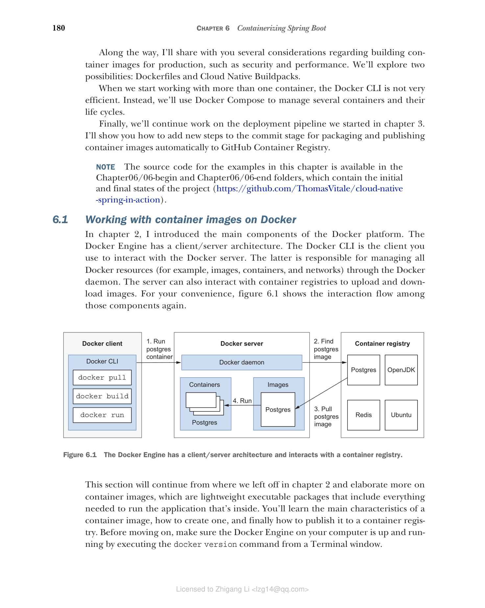

## 6.1 使用 Docker 处理容器镜像

在第 2 章中，我介绍了 Docker 平台的主要组件。Docker Engine 具有客户端/服务器架构。Docker CLI 是您用来与 Docker 服务器交互的客户端。后者负责通过 Docker 守护进程管理所有 Docker 资源（例如镜像、容器和网络）。服务器还可以与容器注册表交互以上传和下载镜像。

**图 6.1 Docker Engine 具有客户端/服务器架构，并与容器注册表交互。**

本节将从第 2 章结束的地方继续，详细讨论容器镜像，它们是轻量级可执行包，包含运行内部应用程序所需的一切。您将学习容器镜像的主要特征、如何创建一个以及如何将其发布到容器注册表。
