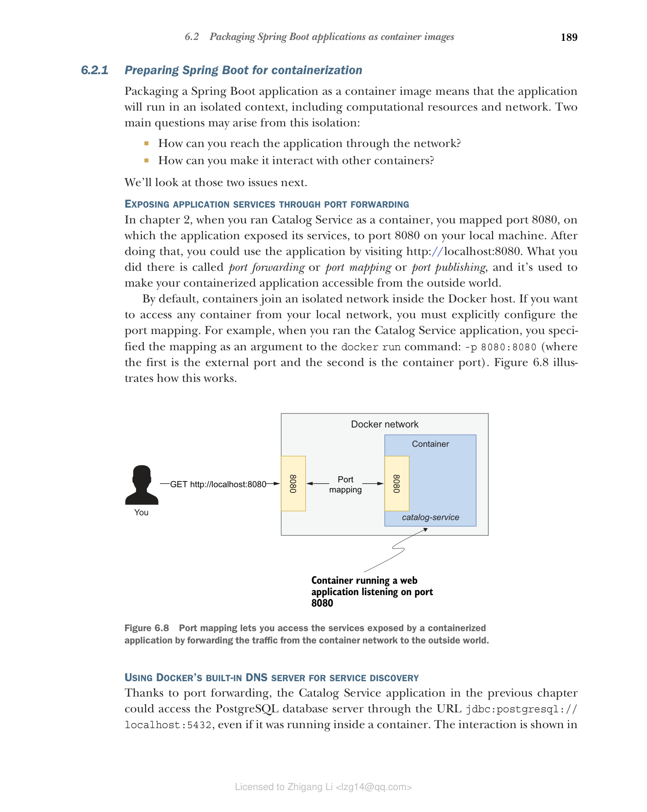
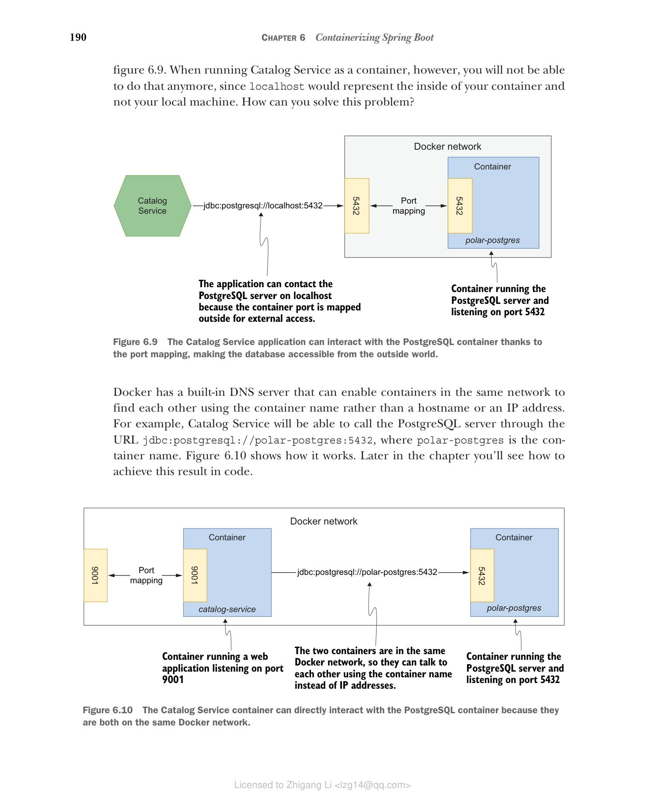

### 6.2.1 为容器化准备 Spring Boot

将 Spring Boot 应用程序打包为容器镜像意味着应用程序将在隔离的上下文中运行，包括计算资源和网络。这种隔离可能产生两个主要问题：

* 如何通过网络访问应用程序？
* 如何让它与其他容器交互？

我们接下来将讨论这两个问题。

#### 通过端口转发暴露应用程序服务

在第 2 章中，当您以容器方式运行 Catalog Service 时，您将应用程序暴露服务的端口 8080 映射到本地机器的端口 8080。完成此操作后，您可以通过访问 [http://localhost:8080](http://localhost:8080) 使用应用程序。您所做的就是端口转发或端口映射或端口发布，用于使容器化应用程序可以从外部访问。

默认情况下，容器加入 Docker 主机内的隔离网络。如果要从本地网络访问任何容器，必须显式配置端口映射。例如，运行 Catalog Service 应用程序时，您指定了映射作为 docker run 命令的参数：-p 8080:8080（第一个是外部端口，第二个是容器端口）。图 6.8 说明了其工作原理。


**图 6.8 端口映射让您可以通过将流量从容器网络转发到外部来访问容器化应用程序暴露的服务。**

#### 使用 Docker 的内置 DNS 服务器进行服务发现

由于端口转发，上一章中的 Catalog Service 应用程序可以通过 URL jdbc:postgresql://localhost:5432 访问 PostgreSQL 数据库服务器，即使它运行在容器中。交互方式如图 6.9 所示。但是，当以容器方式运行 Catalog Service 时，您将无法再这样做，因为 localhost 将代表容器内部而不是本地机器。


**图 6.9 Catalog Service 应用程序可以通过端口映射与 PostgreSQL 容器交互，使数据库可从外部访问。**

Docker 有一个内置 DNS 服务器，可以使同一网络中的容器使用容器名而不是主机名或 IP 地址来找到彼此。例如，Catalog Service 将能够通过 URL jdbc:postgresql://polar-postgres:5432 调用 PostgreSQL 服务器，其中 polar-postgres 是容器名。图 6.10 展示了其工作方式。在本章后面您将看到如何在代码中实现这一结果。


**图 6.10 Catalog Service 容器可以直接与 PostgreSQL 容器交互，因为它们都在同一个 Docker 网络中。**

在继续之前，让我们创建一个网络，使 Catalog Service 和 PostgreSQL 可以使用容器名而不是 IP 地址或主机名进行通信。您可以从任何终端窗口运行此命令：

```bash
$ docker network create catalog-network
```

接下来，验证网络是否成功创建：

```bash
$ docker network ls

NETWORK ID NAME DRIVER SCOPE
178c7a048fa9 catalog-network bridge local
...
```

然后启动一个 PostgreSQL 容器，指定它应该属于您刚创建的 catalog-network。使用 --net 参数确保容器将加入指定的网络并依赖 Docker 内置的 DNS 服务器：

```bash
$ docker run -d \
 --name polar-postgres \
 --net catalog-network \
 -e POSTGRES_USER=user \
 -e POSTGRES_PASSWORD=password \
 -e POSTGRES_DB=polardb_catalog \
 -p 5432:5432 \
 postgres:14.4
```

> 注意：如果命令失败，可能是第 5 章的 PostgreSQL 容器仍在运行。使用 docker rm -fv polar-postgres 移除它，然后重新运行上述命令。
