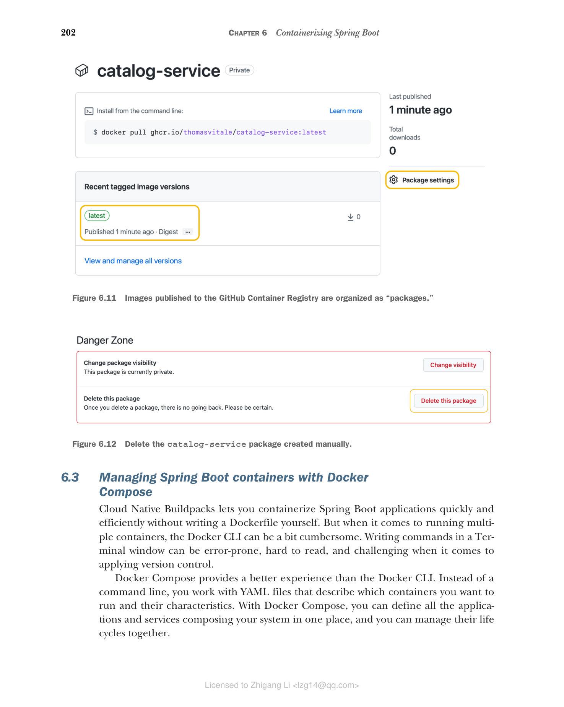

### 6.2.4 使用 Cloud Native Buildpacks 容器化 Spring Boot

Cloud Native Buildpacks（[https://buildpacks.io](https://buildpacks.io)）是 CNCF 托管的一个项目，旨在"将您的应用程序源代码转换为可在任何云上运行的镜像"。在第 1 章介绍容器时，我强调了 Heroku 和 Cloud Foundry 等 PaaS 平台实际上在幕后使用容器，在运行应用程序之前将您的应用程序源代码转换为容器。Buildpacks 就是它们用来完成这一转换的工具。

Cloud Native Buildpacks 基于 Heroku 和 Pivotal 在其 PaaS 平台上以容器方式运行云原生应用程序的多年经验而开发和推进。它是一个成熟的项目，从 Spring Boot 2.3 开始，已经原生集成到 Gradle 和 Maven 的 Spring Boot 插件中，因此您不需要安装专用的 Buildpacks CLI（pack）。

以下是它的一些功能：

* 自动检测应用程序类型并打包，无需 Dockerfile。
* 支持多种语言和平台。
* 通过缓存和分层实现高性能。
* 保证可重复的构建。
* 依赖安全最佳实践。
* 生成生产级镜像。
* 支持使用 GraalVM 构建原生镜像。

> 注意：如果您想了解更多关于 Cloud Native Buildpacks 的信息，我推荐观看"Cloud Native Buildpacks with Emily Casey"（[http://mng.bz/M0xB](http://mng.bz/M0xB)）。Emily Casey 是 Buildpacks 核心团队的成员。

容器生成过程由一个构建器镜像编排，该镜像包含有关如何容器化您的应用程序的完整信息。这些信息以一系列构建包的形式提供，每个构建包专门用于应用程序的某个方面（如操作系统、OpenJDK 和 JVM 配置）。Spring Boot 插件采用 Paketo Buildpacks 构建器，这是 Cloud Native Buildpacks 规范的一种实现，支持多种类型的应用程序，包括 Java 和 Spring Boot 应用程序（[https://paketo.io](https://paketo.io)）。

Paketo 构建器组件依赖于一系列默认构建包来执行实际构建操作。这种结构高度模块化且可定制。您可以向序列中添加新的构建包（例如，为应用程序添加监控代理），替换现有的构建包（例如，将默认的 Bellsoft Liberica OpenJDK 替换为 Microsoft OpenJDK），甚至完全使用不同的构建器镜像。

> 注意：Cloud Native Buildpacks 项目管理着一个注册表，您可以在其中发现和分析可用于容器化应用程序的构建包，包括 Paketo 实现中的所有构建包（[https://registry.buildpacks.io](https://registry.buildpacks.io)）。

Spring Boot 插件提供的 Buildpacks 集成可以在 Catalog Service 项目中的 build.gradle 文件中配置。让我们配置镜像名称并通过环境变量定义要使用的 Java 版本。

**代码清单 6.5 容器化 Catalog Service 的配置**

```groovy
// Spring Boot 插件使用 Buildpacks 构建 OCI 镜像的任务
bootBuildImage {
 // OCI 镜像的名称。名称与项目的 Gradle 配置中定义的相同。
 // 在本地工作时，我们依赖隐式的 "latest" 标签而不是版本号。
 imageName = "${project.name}"

 // 镜像中安装的 JVM 版本。使用最新的 Java 17 版本。
 environment = ["BP_JVM_VERSION" : "17.*"]
}
```

继续运行以下命令构建镜像：

```bash
$ ./gradlew bootBuildImage
```

> 警告：在撰写本文时，Paketo 项目正在努力添加对 ARM64 镜像的支持。您可以在 GitHub 上的 Paketo Buildpacks 项目中跟踪此功能的进展：[https://github.com/paketo-buildpacks/stacks/issues/51](https://github.com/paketo-buildpacks/stacks/issues/51)。在完成之前，您仍然可以使用 Buildpacks 构建容器并通过 Docker Desktop 在 Apple Silicon 计算机上运行它们。但是，构建过程和应用程序启动阶段将比平时更慢。在正式支持添加之前，您也可以使用以下命令，指向 Paketo Buildpacks 的 ARM64 支持实验版本：`./gradlew bootBuildImage --builder ghcr.io/thomasvitale/java-builder-arm64`。请注意这是实验性的，不适合生产使用。有关更多信息，请参阅 GitHub 上的文档：[https://github.com/ThomasVitale/paketo-arm64](https://github.com/ThomasVitale/paketo-arm64)。

第一次运行任务时，需要一分钟时间下载 Buildpacks 用于创建容器镜像的包。第二次只需要几秒钟。如果仔细查看命令输出，您可以看到 Buildpacks 执行的所有步骤来生成镜像。这些步骤包括添加 JRE 和使用 Spring Boot 构建的分层 JAR。该插件接受更多属性来自定义其行为，例如提供您自己的构建器组件而不是 Paketo 的。查看官方文档以获取完整的配置选项列表（[https://spring.io/projects/spring-boot](https://spring.io/projects/spring-boot)）。

让我们再试一次以容器方式运行 Catalog Service，但这次我们使用 Buildpacks 生成的镜像。记得先启动 PostgreSQL 容器，按照 6.2.1 节中的说明：

```bash
$ docker run -d \
 --name catalog-service \
 --net catalog-network \
 -p 9001:9001 \
 -e SPRING_DATASOURCE_URL=jdbc:postgresql://polar-postgres:5432/polardb_catalog \
 -e SPRING_PROFILES_ACTIVE=testdata \
 catalog-service
```

> 警告：如果您在 Apple Silicon 计算机上运行容器，上述命令可能会返回类似以下消息："WARNING: The requested image's platform (linux/amd64) does not match the detected host platform (linux/arm64/v8) and no specific platform was requested." 在这种情况下，在 Paketo Buildpacks 添加 ARM64 支持之前，您需要在上述命令中包含这个额外的参数（在镜像名之前）：`--platform linux/amd64`。

打开浏览器窗口，在 [http://localhost:9001/books](http://localhost:9001/books) 上调用应用程序，验证其是否正常工作。完成后，记得删除 PostgreSQL 和 Catalog Service 两个容器：

```bash
$ docker rm -f catalog-service polar-postgres
```

最后，您可以删除用于使 Catalog Service 与 PostgreSQL 通信的网络。在下一节介绍 Docker Compose 后，您就不再需要它了：

```bash
$ docker network rm catalog-network
```

从 Spring Boot 2.4 开始，您还可以配置 Spring Boot 插件将镜像直接发布到容器注册表。为此，您首先需要在 build.gradle 文件中添加与特定容器注册表进行身份验证的配置。

**代码清单 6.6 容器化 Catalog Service 的配置**

```groovy
bootBuildImage {
 imageName = "${project.name}"
 environment = ["BP_JVM_VERSION" : "17.*"]

 docker {
 // 配置与容器注册表连接的部分
 publishRegistry {
 // 配置到发布容器注册表的身份验证部分。值作为 Gradle 属性传递。
 username = project.findProperty("registryUsername")
 password = project.findProperty("registryToken")
 url = project.findProperty("registryUrl")
 }
 }
}
```

有关如何与容器注册表进行身份验证的详细信息被外部化为 Gradle 属性，这既是为了灵活性（您可以在不更改 Gradle 构建的情况下将镜像发布到不同的注册表），也是为了安全性（特别是令牌，永远不应该包含在版本控制中）。

请记住这条凭证的黄金法则：您永远不应该交出您的密码。永远不要！如果您需要委托某个服务代表您访问资源，您应该依赖访问令牌。Spring Boot 插件允许您使用密码与注册表进行身份验证，但您应该改用令牌。在 6.1.3 节中，您在 GitHub 中生成了一个个人访问令牌，以便从本地环境将镜像推送到 GitHub Container Registry。如果您不知道其值了，请按照本章前面解释的流程随时生成一个新的。

最后，您可以通过运行 bootBuildImage 任务来构建和发布镜像。使用 --imageName 参数，您可以定义容器注册表所需的完全限定镜像名称。使用 --publishImage 参数，您可以指示 Spring Boot 插件直接将镜像推送到容器注册表。另外，请记住通过 Gradle 属性传递容器注册表的值：

```bash
$ ./gradlew bootBuildImage \
 --imageName ghcr.io/<your_github_username>/catalog-service \
 --publishImage \
 -PregistryUrl=ghcr.io \
 -PregistryUsername=<your_github_username> \
 -PregistryToken=<your_github_token>
```

> 提示：如果您在 ARM64 机器（如 Apple Silicon 计算机）上工作，可以在上述命令中添加 `--builder ghcr.io/thomasvitale/java-builder-arm64` 参数，以使用 Paketo Buildpacks 的 ARM64 支持实验版本。请注意这是实验性的，不适合生产使用。有关更多信息，请参阅 GitHub 上的文档：[https://github.com/ThomasVitale/paketo-arm64](https://github.com/ThomasVitale/paketo-arm64)。如果没有此变通方法，在正式支持添加之前（[https://github.com/paketo-buildpacks/stacks/issues/51](https://github.com/paketo-buildpacks/stacks/issues/51)），您仍然可以使用 Buildpacks 构建容器并通过 Docker Desktop 在 Apple Silicon 计算机上运行它们，但构建过程和应用程序启动阶段将比平时更慢。

命令成功完成后，转到您的 GitHub 账户，导航到个人资料页面，进入 Packages 部分。您应该会看到一个新的 catalog-service 条目（默认情况下，托管容器镜像的包是私有的），类似于您在 6.1.3 节中发布的 my-java-image。如果点击 catalog-service 条目，您会找到刚刚发布的 ghcr.io/<your_github_username>/catalog-service:latest 镜像（图 6.11）。


**图 6.11 发布到 GitHub Container Registry 的镜像被组织为"包"。**

然而，catalog-service 包尚未链接到您的 catalog-service 源代码仓库。稍后，我将向您展示如何使用 GitHub Actions 自动化构建和发布镜像，这使得在构建镜像的源代码仓库上下文中发布镜像成为可能。

现在，让我们删除发布镜像时创建的 catalog-service 包，以免在您开始使用 GitHub Actions 发布镜像时造成任何冲突。从 catalog-service 包页面（图 6.11），点击侧边栏菜单中的 Package Settings，滚动到设置页面底部，点击 Delete This Package（图 6.12）。


**图 6.12 删除手动创建的 catalog-service 包。**

> 注意：到目前为止，我们一直在使用隐式的 latest 标签来命名容器镜像。这不推荐用于生产场景。在第 15 章中，您将看到如何在发布应用程序时处理版本。在此之前，我们将依赖隐式的 latest 标签。
