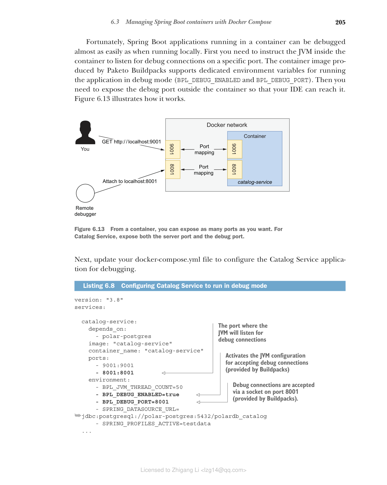
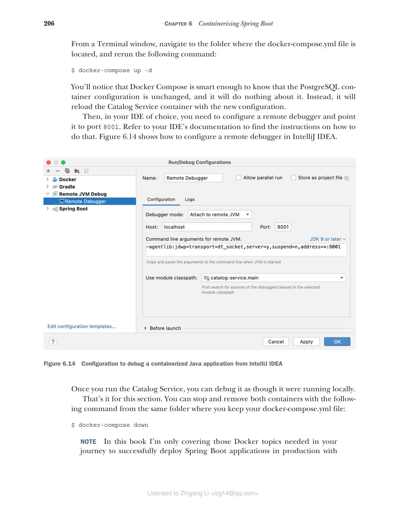

## 6.3 使用 Docker Compose 管理 Spring Boot 容器

Cloud Native Buildpacks 让您无需自己编写 Dockerfile 就能快速高效地容器化 Spring Boot 应用程序。但在运行多个容器时，Docker CLI 可能有点麻烦。在终端窗口中编写命令容易出错、难以阅读，并且在应用版本控制方面也具有挑战性。

Docker Compose 提供了比 Docker CLI 更好的体验。您使用 YAML 文件而不是命令行来描述要运行的容器及其特征。使用 Docker Compose，您可以在一个地方定义组成系统的所有应用程序和服务，并一起管理它们的生命周期。

在本节中，您将使用 Docker Compose 配置 Catalog Service 和 PostgreSQL 容器的执行。然后学习如何调试在容器中运行的 Spring Boot 应用程序。

如果您安装了 Docker Desktop for Mac 或 Docker Desktop for Windows，则已经安装了 Docker Compose。如果您使用 Linux，请访问 Docker Compose 安装页面 [www.docker.com](http://www.docker.com) 并按照您的发行版说明操作。无论哪种情况，您都可以通过运行命令 `docker-compose --version` 来验证 Docker Compose 是否已正确安装。

### 6.3.1 使用 Docker Compose 管理容器生命周期

Docker Compose 的语法非常直观且自解释。通常，它可以与 Docker CLI 参数一一对应。docker-compose.yml 文件的两个根部分是 version（指定要使用的 Docker Compose 语法版本）和 services（包含要运行的所有容器的规范）。其他可添加的可选根级部分包括 volumes 和 networks。

> 注意：如果您不添加任何网络配置，Docker Compose 会自动为您创建一个，并使文件中的所有容器加入它。这意味着它们可以通过容器名称相互交互，依赖 Docker 的内置 DNS 服务器。

将所有与部署相关的脚本收集到一个单独的代码库中，尽可能放在一个单独的仓库中，这是一个好实践。继续在 GitHub 上创建一个新的 polar-deployment 仓库。它将包含运行组成 Polar Bookshop 系统的应用程序所需的所有 Docker 和 Kubernetes 脚本。在仓库中，创建一个 "docker" 文件夹来托管 Polar Bookshop 的 Docker Compose 配置。在本书附带的源代码中，您可以参考 Chapter06/06-end/polar-deployment 查看最终结果。

在 polar-deployment/docker 文件夹中，创建一个 docker-compose.yml 文件，并按如下方式定义要运行的服务。

**代码清单 6.7 描述目录服务的 Docker Compose 文件**

```yaml
# Docker Compose 语法版本
version: "3.8"

# 包含所有要运行容器的部分
services:
 # 描述 catalog-service 容器的部分
 catalog-service:
 # Catalog Service 应在 PostgreSQL 数据库之后启动
 depends_on:
 - polar-postgres
 # 用于运行容器的镜像
 image: "catalog-service"
 # 容器名称
 container_name: "catalog-service"
 # 端口映射列表
 ports:
 - 9001:9001
 # 环境变量列表
 environment:
 # Paketo Buildpacks 环境变量，用于配置内存计算的线程数
 - BPL_JVM_THREAD_COUNT=50
 - SPRING_DATASOURCE_URL=jdbc:postgresql://polar-postgres:5432/polardb_catalog
 # 启用 "testdata" Spring 配置文件
 - SPRING_PROFILES_ACTIVE=testdata

 # 描述 polar-postgres 容器的部分
 polar-postgres:
 image: "postgres:14.4"
 container_name: "polar-postgres"
 ports:
 - 5432:5432
 environment:
 - POSTGRES_USER=user
 - POSTGRES_PASSWORD=password
 - POSTGRES_DB=polardb_catalog
```

您可能注意到了 Catalog Service 容器上有一个额外的环境变量。在第 15 章中，您将了解 Paketo Buildpacks 提供的 Java 内存计算器以及如何为 Spring Boot 应用程序配置 CPU 和内存。目前，只需知道 BPL_JVM_THREAD_COUNT 环境变量用于配置 JVM 栈中应为其分配内存的线程数。基于 Servlet 的应用程序的默认值是 250。在第 3 章中，我们为 Tomcat 线程池使用了一个较低的值，为 JVM 内存配置做同样的操作也是好的，以保持容器在本地较低的内存使用。您将在整本书中部署许多容器（包括应用程序和支撑服务），这种配置有助于在不使计算机过载的情况下实现这一目标。

Docker Compose 默认将两个容器配置在同一网络上，因此您不需要像之前那样显式指定一个。

现在让我们看看如何启动它们。打开终端窗口，导航到包含该文件的文件夹，运行以下命令以分离模式启动容器：

```bash
$ docker-compose up -d
```

命令完成后，尝试在 [http://localhost:9001/books](http://localhost:9001/books) 上调用 Catalog Service 应用程序并验证其是否正常工作。然后保持容器运行并继续下一节，在那里您将调试 Catalog Service 应用程序。

### 6.3.2 调试 Spring Boot 容器

当从 IDE 中以标准 Java 方式运行 Spring Boot 应用程序时，您可以指定是否要以调试模式运行。如果是，IDE 会将调试器附加到运行应用程序的本地 Java 进程。但是，当您从容器内运行它时，IDE 无法再这样做，因为进程不在本地机器上运行。

幸运的是，在容器中运行的 Spring Boot 应用程序几乎可以像本地运行一样轻松地调试。首先，您需要指示容器内的 JVM 在特定端口上监听调试连接。Paketo Buildpacks 生成的容器镜像支持专用环境变量以调试模式运行应用程序（BPL_DEBUG_ENABLED 和 BPL_DEBUG_PORT）。然后，您需要在容器外部暴露调试端口，以便您的 IDE 可以访问它。图 6.13 说明了其工作方式。


**图 6.13 从容器中，您可以暴露任意数量的端口。对于 Catalog Service，同时暴露服务器端口和调试端口。**

接下来，更新您的 docker-compose.yml 文件以配置 Catalog Service 应用程序进行调试。

**代码清单 6.8 配置 Catalog Service 以调试模式运行**

```yaml
version: "3.8"
services:
 catalog-service:
 depends_on:
 - polar-postgres
 image: "catalog-service"
 container_name: "catalog-service"
 ports:
 - 9001:9001
 # JVM 将监听调试连接的端口
 - 8001:8001
 environment:
 - BPL_JVM_THREAD_COUNT=50
 # 激活 JVM 配置以接受调试连接（由 Buildpacks 提供）
 - BPL_DEBUG_ENABLED=true
 # 调试连接通过端口 8001 上的套接字接受（由 Buildpacks 提供）
 - BPL_DEBUG_PORT=8001
 - SPRING_DATASOURCE_URL=jdbc:postgresql://polar-postgres:5432/polardb_catalog
 - SPRING_PROFILES_ACTIVE=testdata

 polar-postgres:
 # ...
```

从终端窗口，导航到 docker-compose.yml 文件所在的文件夹，重新运行以下命令：

```bash
$ docker-compose up -d
```

您会注意到 Docker Compose 足够聪明，知道 PostgreSQL 容器的配置没有更改，不会对它做任何操作。相反，它会用新配置重新加载 Catalog Service 容器。

然后，在您选择的 IDE 中，您需要配置一个远程调试器并将其指向端口 8001。请参阅您的 IDE 文档以查找有关如何操作的说明。图 6.14 展示了如何在 IntelliJ IDEA 中配置远程调试器。


**图 6.14 从 IntelliJ IDEA 调试容器化 Java 应用程序的配置**

运行 Catalog Service 后，您可以像在本地运行一样调试它。本节到此结束。您可以从保持 docker-compose.yml 文件的同一文件夹中使用以下命令停止并移除两个容器：

```bash
$ docker-compose down
```

> 注意：在本书中，我只涵盖成功将 Spring Boot 应用程序部署到 Kubernetes 生产环境所需的 Docker 主题。如果您有兴趣了解有关 Docker 镜像、网络、卷、安全和架构的更多内容，请参阅官方文档：[https://docs.docker.com](https://docs.docker.com)。此外，Manning 目录中有几本关于此主题的书籍，如 Elton Stoneman 的《Learn Docker in a Month of Lunches》（Manning, 2020）和 Ian Miell 与 Aidan Hobson Sayers 的《Docker in Practice》第二版（Manning, 2019）。

当您对应用程序进行更改时，您不想手动构建和发布新镜像。那是 GitHub Actions 等自动化工作流引擎的工作。下一节将向您展示如何完成我们在第 3 章开始的部署流水线的提交阶段。
