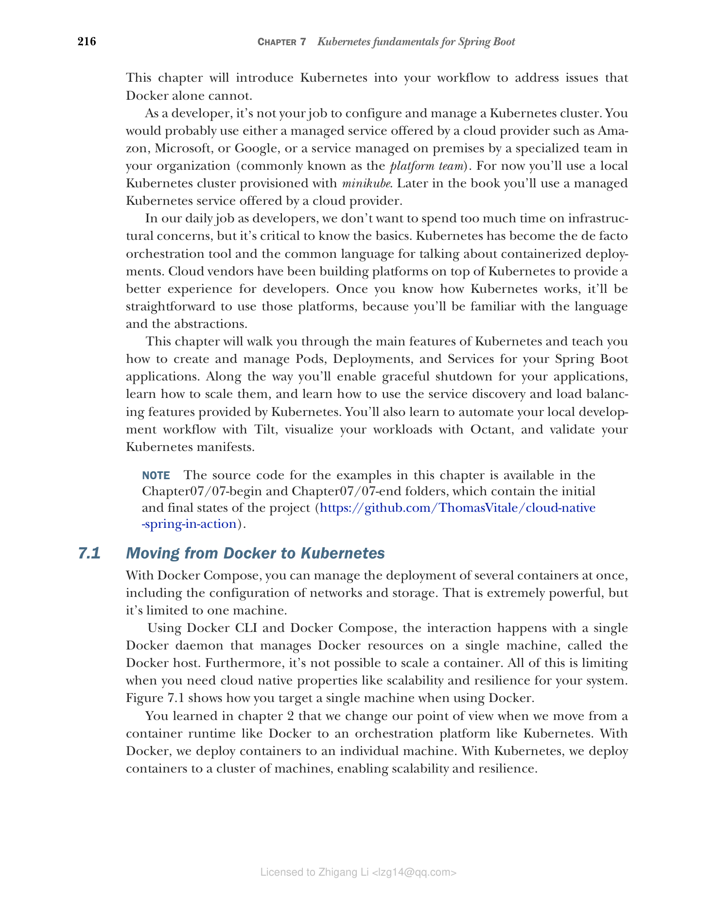
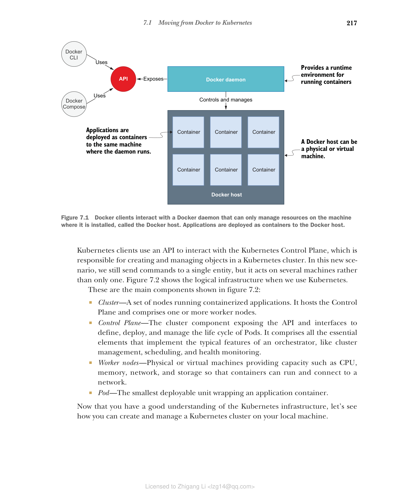

## 7.1 从 Docker 过渡到 Kubernetes

使用 Docker Compose，您可以同时管理多个容器的部署，包括网络和存储的配置。这非常强大，但仅限于单台机器。

使用 Docker CLI 和 Docker Compose，交互发生在与单个 Docker 守护进程之间，该守护进程管理单台机器（称为 Docker 主机）上的 Docker 资源。此外，无法扩展容器。当您的系统需要可扩展性和韧性等云原生属性时，所有这些都成为了限制。图 7.1 展示了使用 Docker 时如何针对单台机器。

**图 7.1 Docker 客户端与 Docker 守护进程交互，后者只能管理其安装所在机器（称为 Docker 主机）上的资源。应用程序以容器形式部署到 Docker 主机。**

您在第 2 章中了解到，当从 Docker 等容器运行时过渡到 Kubernetes 等编排平台时，我们会改变视角。使用 Docker，我们将容器部署到单台机器。使用 Kubernetes，我们将容器部署到机器集群，实现可扩展性和韧性。

Kubernetes 客户端使用 API 与 Kubernetes Control Plane 交互，Control Plane 负责在 Kubernetes 集群中创建和管理对象。在这种新场景中，我们仍然向单个实体发送命令，但它作用于多台机器而非仅一台。图 7.2 展示了使用 Kubernetes 时的逻辑基础设施。

**图 7.2 Kubernetes 客户端与 Control Plane 交互，后者在由一个或多个节点组成的集群中管理容器化应用程序。应用程序以 Pod 形式部署到集群的节点上。**

图 7.2 中显示的主要组件：

* **集群（Cluster）** — 运行容器化应用程序的一组节点。它托管 Control Plane 并包含一个或多个工作节点。
* **Control Plane** — 暴露 API 和接口以定义、部署和管理 Pod 生命周期的集群组件。它包含实现编排器典型功能的所有基本元素，如集群管理、调度和健康监控。
* **工作节点（Worker nodes）** — 提供 CPU、内存、网络和存储等容量的物理或虚拟机，以便容器可以运行并连接到网络。
* **Pod** — 封装应用程序容器的最小可部署单元。

现在您已经对 Kubernetes 基础设施有了很好的了解，让我们看看如何在本地机器上创建和管理 Kubernetes 集群。
