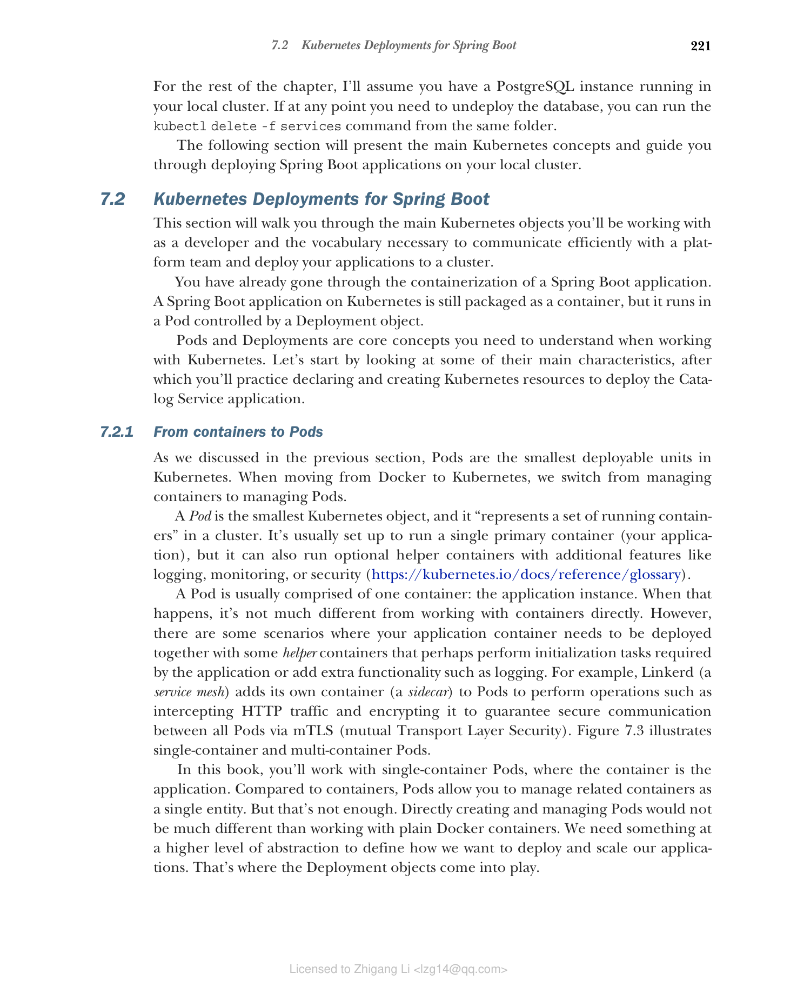

### 7.2.1 从容器到 Pod

正如我们在上一节中讨论的，Pod 是 Kubernetes 中最小的可部署单元。从 Docker 过渡到 Kubernetes 时，我们从管理容器转变为管理 Pod。

Pod 是最小的 Kubernetes 对象，它"代表集群中一组正在运行的容器"（https://kubernetes.io/docs/reference/glossary）。它通常配置为运行单个主容器（您的应用程序），但也可以运行可选的辅助容器，提供日志记录、监控或安全等额外功能。

Pod 通常由一个容器组成：应用程序实例。在这种情况下，它与直接使用容器没有太大区别。然而，在某些场景中，您的应用程序容器需要与一些辅助容器一起部署，这些辅助容器可能执行应用程序所需的初始化任务，或添加额外的功能，如日志记录。例如，Linkerd（一种服务网格）将自己的容器（sidecar）添加到 Pod 中，以执行拦截 HTTP 流量并加密等操作，从而通过 mTLS（双向传输层安全）保证所有 Pod 之间的安全通信。图 7.3 展示了单容器和多容器 Pod。

**图 7.3 Pod 是 Kubernetes 中最小的可部署单元。它们至少运行一个主容器（应用程序），并可能运行可选的辅助容器以提供日志记录、监控或安全等额外功能。**

在本书中，您将使用单容器 Pod，其中容器就是应用程序。与容器相比，Pod 允许您将相关容器作为单个实体进行管理。但这还不够。直接创建和管理 Pod 与使用普通 Docker 容器没有太大区别。我们需要更高层次的抽象来定义如何部署和扩展我们的应用程序。这就是 Deployment 对象发挥作用的地方。
