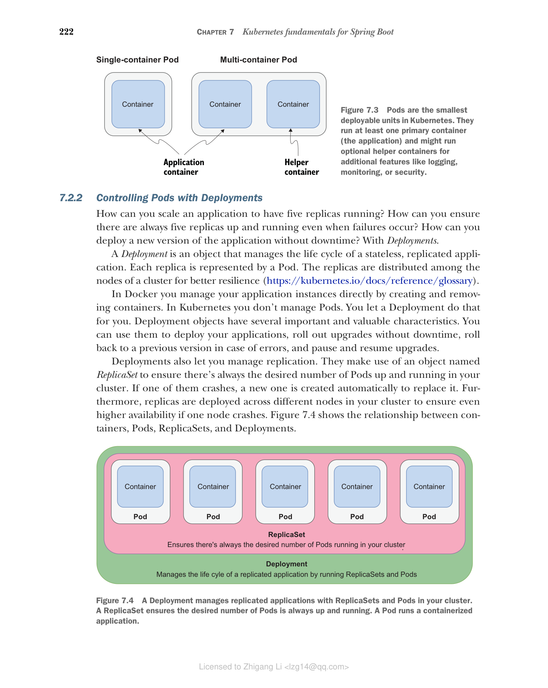

### 7.2.2 使用 Deployment 控制 Pod

如何将应用程序扩展为五个副本同时运行？如何确保即使发生故障也始终有五个副本在运行？如何在不中断服务的情况下部署应用程序的新版本？答案是使用 Deployment。

Deployment 是管理无状态、副本化应用程序生命周期的对象。每个副本由一个 Pod 表示。副本分布在集群的各个节点上，以实现更好的韧性（https://kubernetes.io/docs/reference/glossary）。

在 Docker 中，您通过创建和删除容器直接管理应用程序实例。在 Kubernetes 中，您不直接管理 Pod，而是让 Deployment 来做这件事。Deployment 对象有几个重要且有价值的特性。您可以用它们来部署应用程序、进行无中断的滚动升级、在出错时回滚到之前的版本，以及暂停和恢复升级。

Deployment 还让您管理复制。它们使用名为 ReplicaSet 的对象来确保集群中始终有期望数量的 Pod 在运行。如果其中一个崩溃，会自动创建一个新的来替换它。此外，副本部署在集群中不同的节点上，以确保在一个节点崩溃时具有更高的可用性。图 7.4 展示了容器、Pod、ReplicaSet 和 Deployment 之间的关系。

**图 7.4 Deployment 通过 ReplicaSet 和 Pod 管理集群中的副本化应用程序。ReplicaSet 确保期望数量的 Pod 始终在运行。Pod 运行容器化应用程序。**

Deployment 为我们提供了一个便捷的抽象，让我们可以声明想要达到的目标（期望状态），然后让 Kubernetes 去实现。您不需要担心如何实现特定的结果。与 Ansible 或 Puppet 等命令式工具不同，您只需告诉 Kubernetes 您想要什么，编排器会找出如何实现期望结果并保持一致。这就是我们所说的声明式配置（declarative configuration）。

Kubernetes 使用控制器来监视系统，并将期望状态与实际状态进行比较。当两者之间存在任何差异时，它会采取行动使它们重新匹配。Deployment 和 ReplicaSet 是控制器对象，处理滚动发布、复制和自愈。例如，假设您声明要部署三个 Spring Boot 应用程序副本。如果其中一个崩溃，关联的 ReplicaSet 会注意到这一点，并创建一个新的 Pod 来使实际状态与期望状态对齐。

将 Spring Boot 应用程序打包为 OCI 镜像后，要在 Kubernetes 集群中运行它，您只需要定义一个 Deployment 对象。您将在下一节中学习如何操作。
