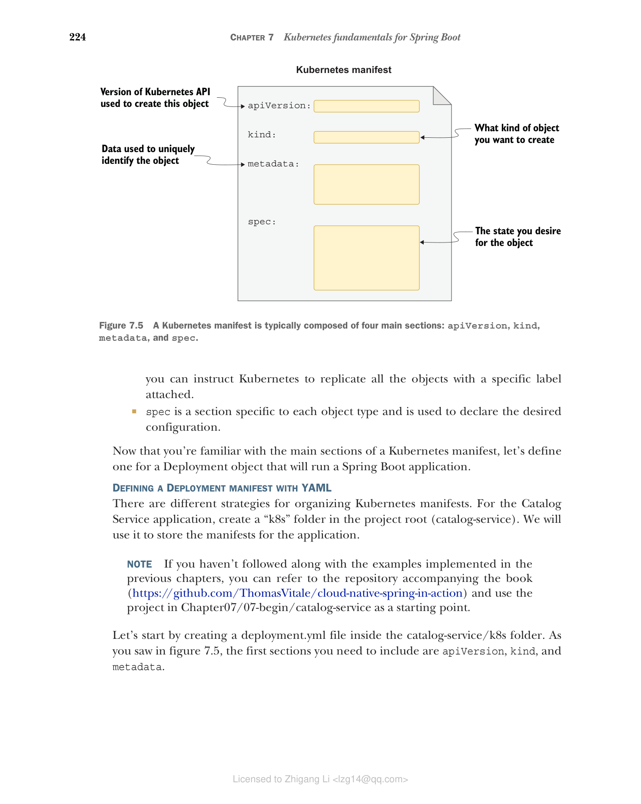

### 7.2.3 为 Spring Boot 应用程序创建 Deployment

在集群中创建和管理 Kubernetes 对象有几种方式。在第 2 章中我们直接使用了 kubectl 客户端，但这种方法缺乏版本控制和可重复性。这与我们偏好 Docker Compose 而非 Docker CLI 的原因相同。

在 Kubernetes 中，推荐的方式是在清单文件（通常以 YAML 格式指定）中描述对象的期望状态。我们使用声明式配置：我们声明想要什么，而不是如何实现它。在第 2 章中我们以命令式方式使用 kubectl 创建和删除对象，但当我们使用清单时，我们将它们应用到集群中。然后 Kubernetes 会自动将集群中的实际状态与清单中的期望状态进行协调。

Kubernetes 清单通常包含四个主要部分，如图 7.5 所示：

* **apiVersion** 定义特定对象表示的版本化模式。Pod 或 Service 等核心资源遵循仅由版本号组成的版本化模式（如 v1）。Deployment 或 ReplicaSet 等其他资源遵循由组名和版本号组成的版本化模式（如 apps/v1）。如果不确定使用哪个版本，可以查阅 Kubernetes 文档（[https://kubernetes.io/docs](https://kubernetes.io/docs)）或使用 `kubectl explain <object_name>` 命令获取有关对象的更多信息，包括要使用的 API 版本。
* **kind** 是您要创建的 Kubernetes 对象类型，如 Pod、ReplicaSet、Deployment 或 Service。您可以使用 `kubectl api-resources` 命令列出集群支持的所有对象。
* **metadata** 提供有关您要创建的对象的详细信息，包括名称和一组用于分类的标签（键/值对）。例如，您可以指示 Kubernetes 复制所有带有特定标签的对象。
* **spec** 是每个对象类型特有的部分，用于声明期望的配置。


**图 7.5 Kubernetes 清单通常由四个主要部分组成：apiVersion、kind、metadata 和 spec。**

现在您已经熟悉了 Kubernetes 清单的主要部分，让我们为一个将运行 Spring Boot 应用程序的 Deployment 对象定义清单。

#### 使用 YAML 定义 Deployment 清单

组织 Kubernetes 清单有不同的策略。对于 Catalog Service 应用程序，在项目根目录（catalog-service）中创建一个"k8s"文件夹。我们将使用它来存储应用程序的清单。

> 注意：如果您没有跟随前面章节实现的示例，可以参考本书附带的仓库（[https://github.com/ThomasVitale/cloud-native-spring-in-action](https://github.com/ThomasVitale/cloud-native-spring-in-action)），使用 Chapter07/07-begin/catalog-service 中的项目作为起点。

首先在 catalog-service/k8s 文件夹中创建一个 deployment.yml 文件。如图 7.5 所示，首先需要包含的部分是 apiVersion、kind 和 metadata。

```yaml
# 代码清单 7.1 初始化 Catalog Service 的 Deployment 清单

apiVersion: apps/v1 # Deployment 对象的 API 版本
kind: Deployment # 要创建的对象类型
metadata:
 name: catalog-service # Deployment 的名称
 labels:
 app: catalog-service # 附加到 Deployment 的一组标签
# 此 Deployment 标记为 "app=catalog-service"
```

> 注意：Kubernetes API 可能会随时间变化。请确保始终使用您运行的 Kubernetes 版本支持的 API。如果您一直跟随操作，应该不会遇到这个问题。但如果发生了，kubectl 会返回一条非常具有描述性的错误消息，准确告诉您出了什么问题以及如何修复。您也可以使用 `kubectl explain <object_name>` 命令检查您的 Kubernetes 安装对给定对象支持的 API 版本。

Deployment 清单的 spec 部分包含一个 selector 部分（用于定义 ReplicaSet 识别应扩展哪些对象的策略）和一个 template 部分（描述创建期望的 Pod 和容器的规范）。

```yaml
# 代码清单 7.2 Catalog Service 部署的期望状态

apiVersion: apps/v1
kind: Deployment
metadata:
 name: catalog-service
 labels:
 app: catalog-service # 定义用于选择要扩展的 Pod 的标签
spec:
 selector:
 matchLabels:
 app: catalog-service
 template: # 创建 Pod 的模板
 metadata:
 labels:
 app: catalog-service # 附加到 Pod 的标签（应与 selector 中使用的一致）
 spec:
 containers: # 容器列表（本例中只有一个）
 - name: catalog-service
 image: catalog-service # 用于运行容器的镜像，未定义标签则隐式使用 "latest"
 imagePullPolicy: IfNotPresent # 指示 Kubernetes 仅在本地不存在时才从容器注册表拉取镜像
 ports:
 - containerPort: 9001 # 容器暴露的端口
 env:
 - name: BPL_JVM_THREAD_COUNT
 value: "50" # Paketo Buildpacks 环境变量，用于配置内存计算的线程数
 - name: SPRING_DATASOURCE_URL
 value: jdbc:postgresql://polar-postgres/polardb_catalog # 指向之前部署的 PostgreSQL Pod 的 spring.datasource.url 属性值
 - name: SPRING_PROFILES_ACTIVE
 value: testdata # 启用 "testdata" Spring 配置文件
```

containers 部分应该看起来很熟悉，因为它类似于您在 Docker Compose 文件的 services 部分中定义容器的方式。与 Docker 中一样，您可以使用环境变量来定义应用程序应使用的 PostgreSQL 实例的 URL。URL 的主机名部分（polar-postgres）是之前从 kubernetes/platform/development 文件夹创建的用于暴露数据库的 Service 对象的名称。您将在本章后面了解更多关于 Service 的信息。目前，只需知道 polar-postgres 是集群中其他对象可以与之通信以访问 PostgreSQL 实例的名称。

在生产场景中，镜像将从容器注册表获取。在开发过程中，使用本地镜像更方便。让我们按照上一章学到的方法为 Catalog Service 构建一个镜像。

打开终端窗口，导航到 Catalog Service 根文件夹（catalog-service），按如下方式构建新的容器镜像：

```bash
$ ./gradlew bootBuildImage
```

> 提示：如果您在 ARM64 机器（如 Apple Silicon 计算机）上工作，可以在前面的命令中添加 `--builder ghcr.io/thomasvitale/java-builder-arm64` 参数，以使用支持 ARM64 的 Paketo Buildpacks 实验版本。请注意这是实验性的，尚未准备好用于生产环境。更多信息请参阅 GitHub 上的文档：[https://github.com/ThomasVitale/paketo-arm64](https://github.com/ThomasVitale/paketo-arm64)。在此变通方案之外，在获得官方支持之前（[https://github.com/paketo-buildpacks/stacks/issues/51](https://github.com/paketo-buildpacks/stacks/issues/51)），您仍然可以使用 Buildpacks 构建容器并通过 Docker Desktop 在 Apple Silicon 计算机上运行它们，但构建过程和应用程序启动阶段会比平时更慢。

默认情况下，minikube 无法访问您的本地容器镜像，因此它找不到您刚刚为 Catalog Service 构建的镜像。但不用担心：您可以手动将其导入到本地集群中：

```bash
$ minikube image load catalog-service --profile polar
```

> 注意：YAML 是一种表达性强的语言，但由于其对空格的约束以及可能缺乏编辑器支持，它可能让您的编码体验变得很糟糕。当涉及 YAML 文件的 kubectl 命令失败时，请验证空格和缩进是否正确使用。对于 Kubernetes，您可以在编辑器中安装插件来支持编写 YAML 清单，确保始终使用正确的语法、空格和缩进。您可以在本书附带的仓库中的 README.md 文件中找到一些插件选项：[https://github.com/ThomasVitale/cloud-native-spring-in-action](https://github.com/ThomasVitale/cloud-native-spring-in-action)。

现在您有了 Deployment 清单，让我们继续看看如何将其应用到本地 Kubernetes 集群。

#### 从清单创建 Deployment 对象

您可以使用 kubectl 客户端将 Kubernetes 清单应用到集群。打开终端窗口，导航到 Catalog Service 根文件夹（catalog-service），运行以下命令：

```bash
$ kubectl apply -f k8s/deployment.yml
```

该命令由 Kubernetes Control Plane 处理，它将在集群中创建并维护所有相关对象。您可以使用以下命令验证创建了哪些对象：

```bash
$ kubectl get all -l app=catalog-service

NAME READY STATUS RESTARTS AGE
pod/catalog-service-68bc5659b8-k6dpb 1/1 Running 0 42s

NAME READY UP-TO-DATE AVAILABLE AGE
deployment.apps/catalog-service 1/1 1 1 42s

NAME DESIRED CURRENT READY AGE
replicaset.apps/catalog-service-68bc5659b8 1 1 1 42s
```

由于您在 Deployment 清单中一致地使用了标签，可以使用标签 `app=catalog-service` 来获取与 Catalog Service 部署相关的所有 Kubernetes 对象。如您所见，deployment.yml 中的声明导致了 Deployment、ReplicaSet 和 Pod 的创建。

要验证 Catalog Service 是否正确启动，可以按如下方式检查其 Deployment 的日志：

```bash
$ kubectl logs deployment/catalog-service
```

> 注意：您可以通过运行 `kubectl get pods` 时检查 STATUS 列来监视 Pod 是否已成功创建。如果 Pod 部署失败，请检查该列。常见的错误状态是 ErrImagePull 或 ImagePullBackOff。当 Kubernetes 无法从配置的容器注册表拉取 Pod 使用的镜像时会发生这些情况。我们目前使用的是本地镜像，因此请确保您已构建并将 Catalog Service 容器镜像加载到 minikube 中。您可以使用 `kubectl describe pod <pod_name>` 命令获取有关错误的更多信息，使用 `kubectl logs <pod_name>` 获取特定 Pod 实例的应用程序日志。

在 Kubernetes 集群等云环境中部署容器时，您需要确保它有足够的资源运行。在第 15 章中，您将学习如何为 Kubernetes 中运行的容器分配 CPU 和内存资源，以及如何通过应用 Cloud Native Buildpacks 提供的 Java 内存计算器来配置 JVM 内存。目前，我们将依赖默认资源配置。

到目前为止，您已经为 Spring Boot 应用程序创建了 Deployment 并在本地 Kubernetes 集群中运行了它。但目前还无法使用它，因为它在集群内部是隔离的。在下一节中，您将学习如何将应用程序暴露给外部世界，以及如何使用 Kubernetes 提供的服务发现和负载均衡功能。
