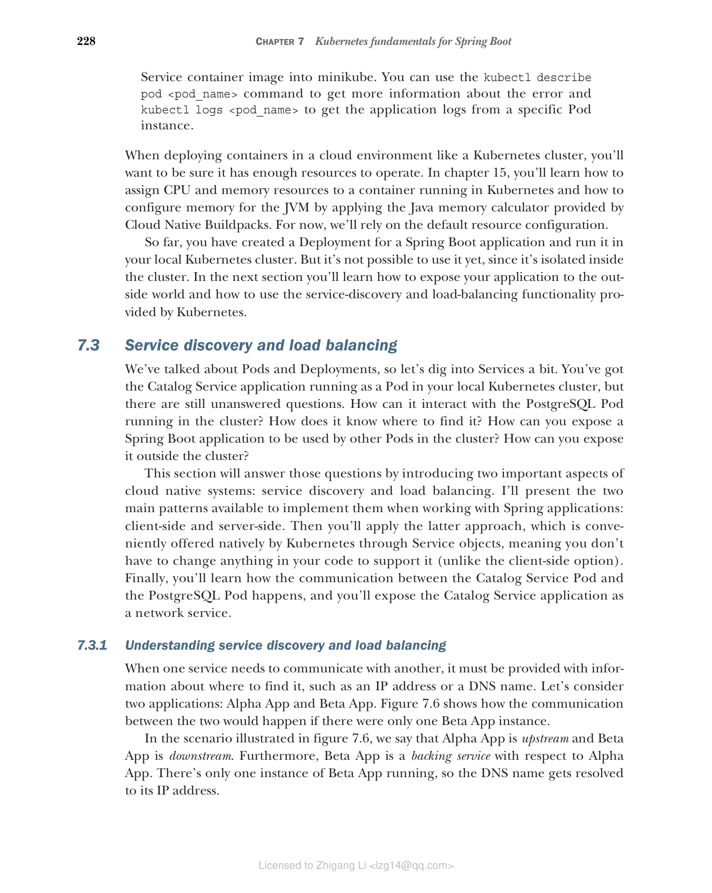

### 7.3.1 理解服务发现和负载均衡

当一个服务需要与另一个服务通信时，必须提供关于在哪里找到它的信息，如 IP 地址或 DNS 名称。让我们考虑两个应用程序：Alpha App 和 Beta App。图 7.6 展示了如果只有一个 Beta App 实例时，两者之间的通信会如何进行。

在图 7.6 所示的场景中，我们说 Alpha App 是上游（upstream），Beta App 是下游（downstream）。此外，Beta App 相对于 Alpha App 是一个后端服务（backing service）。只有一个 Beta App 实例在运行，因此 DNS 名称被解析为其 IP 地址。

**图 7.6 如果只有一个 Beta App 实例，Alpha App 和 Beta App 之间的进程间通信将基于解析为 Beta App IP 地址的 DNS 名称。**

在云中，您可能希望有多个服务实例在运行，每个服务实例都有自己的 IP 地址。与物理机器或长期运行的虚拟机不同，服务实例在云中的寿命不会很长。应用程序实例是可弃置的——它们可能因不同原因被移除或替换，例如当它们不再响应时。您甚至可以启用自动扩展功能，根据工作负载自动扩展和缩减应用程序。在云中使用 IP 地址进行进程间通信不是一个可行的选择。

为了克服这个问题，您可能会考虑使用 DNS 记录，依赖指向分配给副本的某个 IP 地址的轮询名称解析。知道主机名后，即使某个 IP 地址发生变化，您也可以到达后端服务，因为 DNS 服务器会使用新地址进行更新。然而，这种方法并不太适合云环境，因为拓扑变化太频繁。一些 DNS 实现即使在名称查找结果应该过期后仍会缓存它们。同样，一些应用程序缓存 DNS 查找响应的时间过长。无论哪种方式，都有很高的概率使用不再有效的主机名/IP 地址解析。

云环境中的服务发现需要一个不同的解决方案。首先，我们需要跟踪所有正在运行的服务实例并将该信息存储在服务注册表（service registry）中。每当创建一个新实例时，应在注册表中添加一条记录。当它被关闭时，应相应地将其移除。注册表认识到同一应用程序的多个实例可以同时运行。当应用程序需要调用后端服务时，它在注册表中执行查找以确定要联系哪个 IP 地址。如果有多个实例可用，则应用负载均衡策略在工作负载之间分配。

根据问题在哪里解决，我们区分为客户端服务发现和服务器端服务发现。让我们看看这两种选项。
