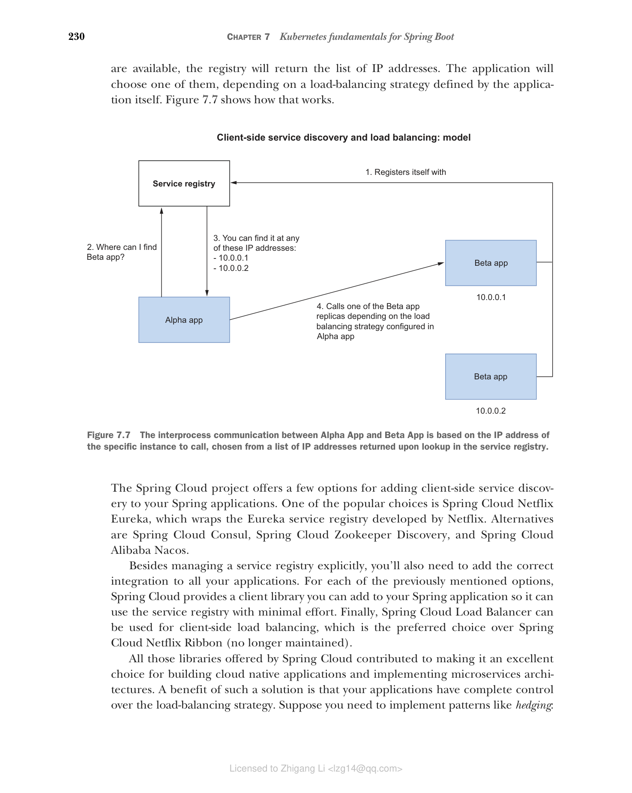

### 7.3.2 客户端服务发现和负载均衡

客户端服务发现要求应用程序在启动时向服务注册表注册自己，并在关闭时注销。每当它们需要调用后端服务时，它们向服务注册表请求一个 IP 地址。如果有多个实例可用，注册表将返回 IP 地址列表。应用程序将根据自身定义的负载均衡策略选择其中一个。图 7.7 展示了其工作方式。

**图 7.7 Alpha App 和 Beta App 之间的进程间通信基于要调用的特定实例的 IP 地址，该地址从服务注册表查找返回的 IP 地址列表中选择。**

Spring Cloud 项目为向 Spring 应用程序添加客户端服务发现提供了几种选项。其中一种流行的选择是 Spring Cloud Netflix Eureka，它封装了 Netflix 开发的 Eureka 服务注册表。其他选择有 Spring Cloud Consul、Spring Cloud Zookeeper Discovery 和 Spring Cloud Alibaba Nacos。

除了显式管理服务注册表外，您还需要向所有应用程序添加正确的集成。对于前面提到的每种选项，Spring Cloud 都提供了一个客户端库，您可以将其添加到 Spring 应用程序中，使其能够以最小的努力使用服务注册表。最后，Spring Cloud Load Balancer 可用于客户端负载均衡，它是优先于 Spring Cloud Netflix Ribbon（已不再维护）的选择。

Spring Cloud 提供的所有这些库使其成为构建云原生应用程序和实现微服务架构的绝佳选择。这种解决方案的一个好处是您的应用程序对负载均衡策略有完全的控制权。假设您需要实现如对冲（hedging）等模式：将相同的请求发送到多个实例以增加其中一个在特定时间限制内正确响应的机会。客户端服务发现可以帮助您实现这一点。

一个缺点是客户端服务发现给开发者分配了更多责任。如果您的系统包含使用不同语言和框架构建的应用程序，您需要以不同的方式处理每个应用程序的客户端部分。此外，它还导致需要部署和维护的额外服务（服务注册表），除非您使用 Azure Spring Apps 或 VMware Tanzu Application Service 等 PaaS 解决方案（它们为您提供了该服务）。服务器端发现解决方案以牺牲应用程序中的细粒度控制为代价来解决这些问题。让我们看看如何实现。
