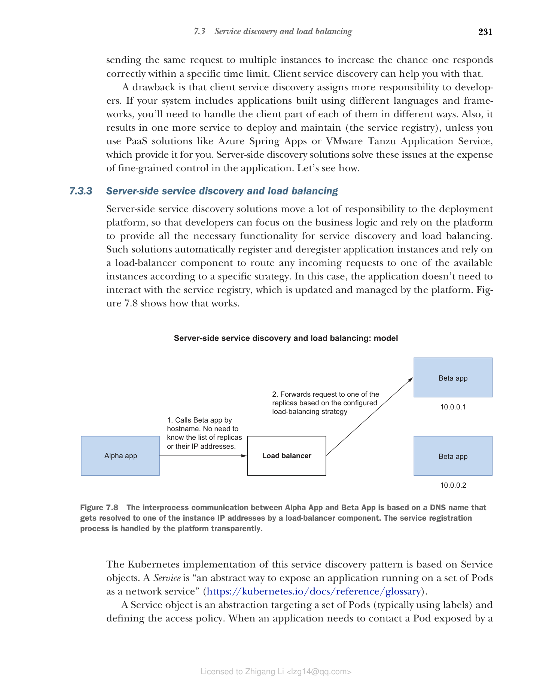
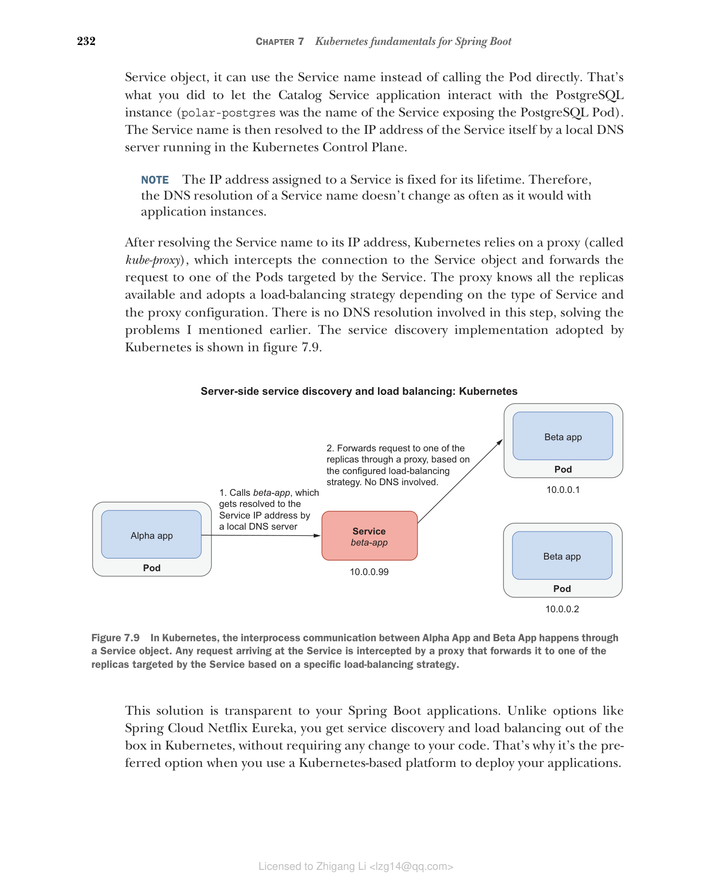

### 7.3.3 服务器端服务发现和负载均衡

服务器端服务发现解决方案将大量责任转移到部署平台，使开发者可以专注于业务逻辑，并依赖平台提供服务发现和负载均衡所需的所有功能。这类解决方案会自动注册和注销应用程序实例，并依赖负载均衡器组件根据特定策略将任何传入请求路由到可用实例之一。在这种情况下，应用程序不需要与服务注册表交互，注册表由平台更新和管理。图 7.8 展示了其工作方式。

**图 7.8 Alpha App 和 Beta App 之间的进程间通信基于一个 DNS 名称，该名称由负载均衡器组件解析为某个实例的 IP 地址。服务注册过程由平台透明地处理。**

Kubernetes 对这种服务发现模式的实现基于 Service 对象。Service 是"一种将运行在一组 Pod 上的应用程序暴露为网络服务的抽象方式"（[https://kubernetes.io/docs/reference/glossary](https://kubernetes.io/docs/reference/glossary)）。

Service 对象是一种针对一组 Pod（通常使用标签）并定义访问策略的抽象。当一个应用程序需要联系由 Service 对象暴露的 Pod 时，它可以使用 Service 名称而不是直接调用 Pod。这正是您让 Catalog Service 应用程序与 PostgreSQL 实例交互的方式（polar-postgres 是暴露 PostgreSQL Pod 的 Service 的名称）。Service 名称随后由 Kubernetes Control Plane 中运行的本地 DNS 服务器解析为 Service 自身的 IP 地址。

> 注意：分配给 Service 的 IP 地址在其生命周期内是固定的。因此，Service 名称的 DNS 解析不会像应用程序实例那样频繁变化。

将 Service 名称解析为其 IP 地址后，Kubernetes 依赖一个代理（称为 kube-proxy），它拦截到 Service 对象的连接，并将请求转发到 Service 所针对的某个 Pod。代理知道所有可用的副本，并根据 Service 类型和代理配置采用负载均衡策略。此步骤不涉及 DNS 解析，解决了前面提到的问题。Kubernetes 采用的服务发现实现如图 7.9 所示。

**图 7.9 在 Kubernetes 中，Alpha App 和 Beta App 之间的进程间通信通过 Service 对象进行。到达 Service 的任何请求都会被代理拦截，代理根据特定的负载均衡策略将请求转发到 Service 所针对的某个副本。**

这种解决方案对您的 Spring Boot 应用程序是透明的。与 Spring Cloud Netflix Eureka 等选项不同，您在 Kubernetes 中开箱即用地获得了服务发现和负载均衡功能，无需对代码进行任何更改。这就是当您使用基于 Kubernetes 的平台部署应用程序时的首选方案。

#### 服务发现和 Spring Cloud Kubernetes

如果您需要迁移使用上一节中提到的某种客户端服务发现选项的现有应用程序，可以使用 Spring Cloud Kubernetes 使过渡更加平滑。您可以在应用程序中保留现有的服务发现和负载均衡逻辑。但是，不再使用 Spring Cloud Netflix Eureka 等解决方案，您可以使用 Spring Cloud Kubernetes Discovery Server 作为服务注册表。这可以是一种方便的方式，在不更改太多应用程序代码的情况下将应用程序迁移到 Kubernetes。更多信息请参阅项目文档：[https://spring.io/projects/spring-cloud-kubernetes](https://spring.io/projects/spring-cloud-kubernetes)。

除非您正在做的事情需要在应用程序中特定处理服务实例和负载均衡，否则我的建议是随着时间的推移迁移到使用 Kubernetes 提供的原生服务发现功能，旨在从应用程序中移除基础设施关注。

有了关于 Kubernetes 中服务发现和负载均衡如何实现的总体了解，让我们看看如何定义 Service 来暴露 Spring Boot 应用程序。
