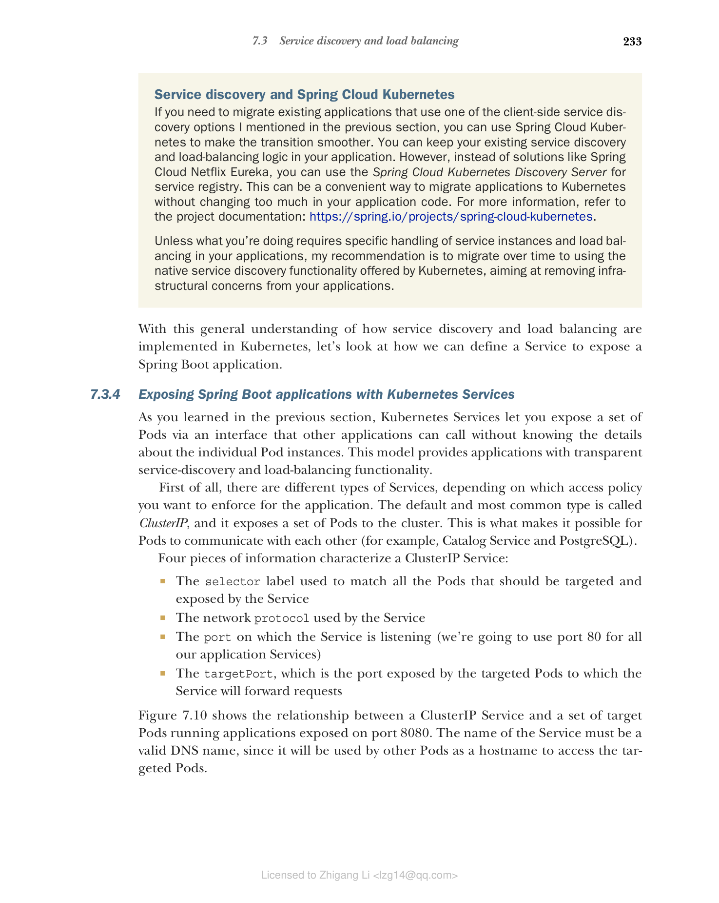
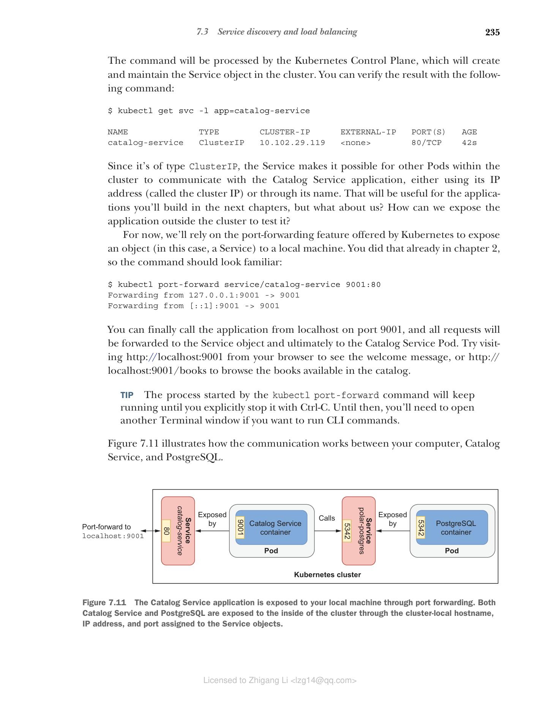

### 7.3.4 使用 Kubernetes Service 暴露 Spring Boot 应用程序

正如您在上一节中所学到的，Kubernetes Service 允许您通过一个接口暴露一组 Pod，其他应用程序可以调用该接口而无需了解各个 Pod 实例的细节。此模型为应用程序提供了透明的服务发现和负载均衡功能。

首先，根据您要为应用程序实施的访问策略，有不同类型的 Service。默认和最常见的类型称为 ClusterIP，它将一组 Pod 暴露给集群。这就是使 Pod 之间能够相互通信的方式（例如 Catalog Service 和 PostgreSQL）。

ClusterIP Service 由四个信息特征描述：

* 用于匹配所有应被 Service 针对和暴露的 Pod 的选择器标签
* Service 使用的网络协议
* Service 监听的端口（我们将为所有应用程序 Service 使用端口 80）
* targetPort，即被针对的 Pod 暴露的端口，Service 将把请求转发到该端口

图 7.10 展示了 ClusterIP Service 与一组运行在端口 8080 上的应用程序的目标 Pod 之间的关系。Service 的名称必须是有效的 DNS 名称，因为它将被其他 Pod 用作主机名来访问被针对的 Pod。


**图 7.10 ClusterIP Service 将一组 Pod 暴露给集群内部网络。**

#### 使用 YAML 定义 Service 清单

让我们看看如何为 Service 对象定义清单，以通过 DNS 名称 catalog-service 和端口 80 暴露 Catalog Service 应用程序。打开您之前创建的 catalog-service/k8s 文件夹，添加一个新的 service.yml 文件。

```yaml
# 代码清单 7.3 Catalog Service 应用程序的 Service 清单

apiVersion: v1 # Service 对象的 API 版本
kind: Service # 要创建的对象类型
metadata:
 name: catalog-service # Service 的名称；必须是有效的 DNS 名称
 labels:
 app: catalog-service # 附加到 Service 的标签
spec:
 type: ClusterIP # Service 的类型
 selector:
 app: catalog-service # 用于匹配要针对和暴露的 Pod 的标签
 ports:
 - protocol: TCP # Service 使用的网络协议
 port: 80 # Service 暴露的端口
 targetPort: 9001 # Service 针对的 Pod 暴露的端口
```

#### 从清单创建 Service 对象

您可以像对 Deployment 那样应用 Service 清单。打开终端窗口，导航到 Catalog Service 根文件夹（catalog-service），运行以下命令：

```bash
$ kubectl apply -f k8s/service.yml
```

该命令由 Kubernetes Control Plane 处理，它将在集群中创建并维护 Service 对象。您可以使用以下命令验证结果：

```bash
$ kubectl get svc -l app=catalog-service

NAME TYPE CLUSTER-IP EXTERNAL-IP PORT(S) AGE
catalog-service ClusterIP 10.102.29.119 <none> 80/TCP 42s
```

由于类型为 ClusterIP，Service 使集群内的其他 Pod 能够使用其 IP 地址（称为集群 IP）或通过其名称与 Catalog Service 应用程序通信。这对您在后续章节中将构建的应用程序很有用，但我们呢？如何将应用程序暴露到集群外部进行测试？

目前，我们将依赖 Kubernetes 提供的端口转发功能，将一个对象（本例中是 Service）暴露到本地机器。您在第 2 章中已经这样做了，所以该命令应该看起来很熟悉：

```bash
$ kubectl port-forward service/catalog-service 9001:80
Forwarding from 127.0.0.1:9001 -> 9001
Forwarding from [::1]:9001 -> 9001
```

您终于可以从 localhost 的 9001 端口调用应用程序了，所有请求将被转发到 Service 对象，最终转发到 Catalog Service Pod。尝试从浏览器访问 [http://localhost:9001](http://localhost:9001) 查看欢迎消息，或访问 [http://localhost:9001/books](http://localhost:9001/books) 浏览目录中可用的图书。

> 提示：`kubectl port-forward` 命令启动的进程将一直运行，直到您使用 Ctrl-C 显式停止它。在此之前，如果您想运行 CLI 命令，需要打开另一个终端窗口。

图 7.11 展示了您的计算机、Catalog Service 和 PostgreSQL 之间的通信方式。


**图 7.11 Catalog Service 应用程序通过端口转发暴露到您的本地机器。Catalog Service 和 PostgreSQL 都通过分配给 Service 对象的集群本地主机名、IP 地址和端口暴露到集群内部。**

到目前为止，我们一直在使用只有一个 Catalog Service 实例的情况，但我们可以利用 Kubernetes 将其扩展。下一节将介绍如何扩展 Spring Boot 应用程序，并解决快速启动和优雅关闭等方面的问题，这些对于云原生应用程序至关重要。

> 注意：想象一下每次在应用程序中更改某些内容时都要运行所有这些命令并在本地测试它。看起来不太吸引人，是吧？别担心！在 7.5 节中，我将向您展示如何设置本地 Kubernetes 开发工作流来自动化所有这些操作。
