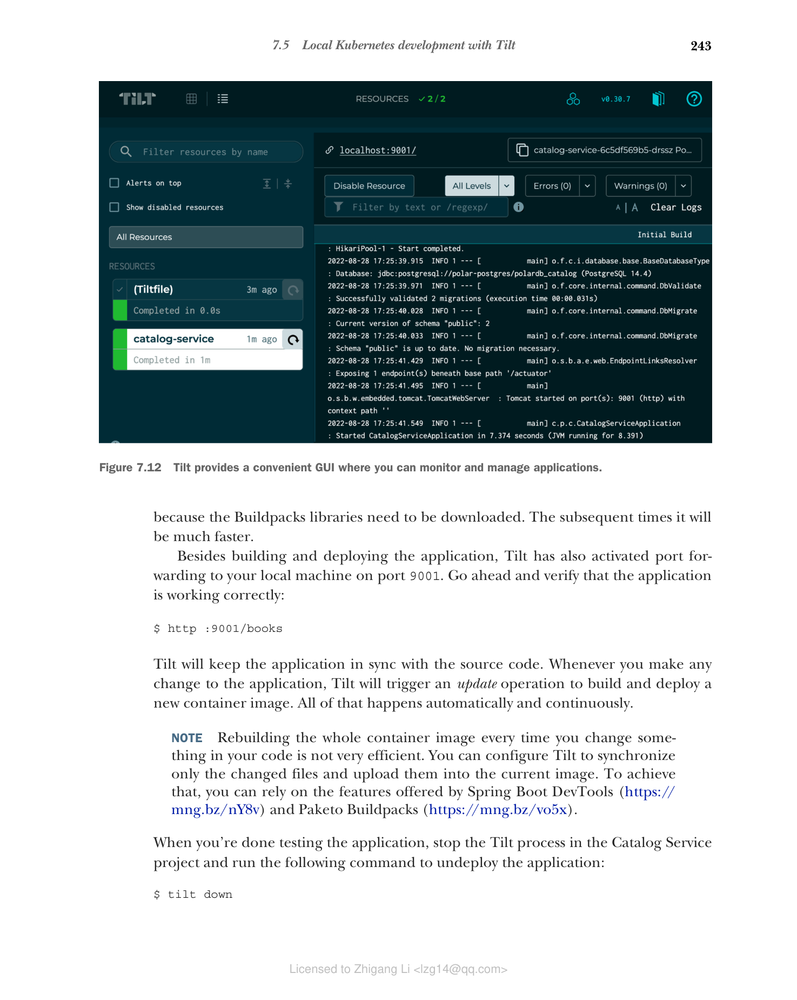

### 7.5.1 使用 Tilt 的内部开发循环

Tilt（https://tilt.dev）旨在为在 Kubernetes 上工作提供良好的开发者体验。它是一个开源工具，提供了在本地环境中构建、部署和管理容器化工作负载的功能。我们将使用它的一些基本功能来自动化特定应用程序的开发工作流，但 Tilt 还可以帮助您以集中方式编排多个应用程序和服务的部署。您可以在附录 A 的 A.4 节中找到安装说明。

我们的目标是设计一个工作流来自动化以下步骤：

* 使用 Cloud Native Buildpacks 将 Spring Boot 应用程序打包为容器镜像
* 将镜像上传到 Kubernetes 集群（在我们的例子中，是使用 minikube 创建的集群）
* 应用 YAML 清单中声明的所有 Kubernetes 对象
* 启用端口转发功能，以便从本地计算机访问应用程序
* 让您轻松访问集群上运行的应用程序的日志

在配置 Tilt 之前，请确保您的本地 Kubernetes 集群中运行着 PostgreSQL 实例。打开终端窗口，导航到 polar-deployment 仓库中的 kubernetes/platform/development 文件夹，运行以下命令部署 PostgreSQL：

```bash
$ kubectl apply -f services
```

现在让我们看看如何配置 Tilt 来建立这个自动化的开发工作流。Tilt 可以通过 Tiltfile 进行配置，这是一个用 Starlark（一种简化的 Python 方言）编写的可扩展配置文件。转到您的 Catalog Service 项目（catalog-service），在根文件夹中创建一个名为"Tiltfile"（无扩展名）的文件。该文件将包含三个主要配置：

* 如何构建容器镜像（Cloud Native Buildpacks）
* 如何部署应用程序（Kubernetes YAML 清单）
* 如何访问应用程序（端口转发）

```python
# 代码清单 7.6 Catalog Service 的 Tilt 配置（Tiltfile）

# 构建
custom_build(
 # 容器镜像名称
 ref = 'catalog-service',
 # 构建容器镜像的命令
 command = './gradlew bootBuildImage --imageName $EXPECTED_REF',
 # 监视触发新构建的文件
 deps = ['build.gradle', 'src']
)

# 部署
k8s_yaml(['k8s/deployment.yml', 'k8s/service.yml'])

# 管理
k8s_resource('catalog-service', port_forwards=['9001'])
```

> 提示：如果您在 ARM64 机器（如 Apple Silicon 计算机）上工作，可以在 `./gradlew bootBuildImage --imageName $EXPECTED_REF` 命令中添加 `--builder ghcr.io/thomasvitale/java-builder-arm64` 参数，以使用支持 ARM64 的 Paketo Buildpacks 实验版本。请注意这是实验性的，尚未准备好用于生产环境。更多信息请参阅 GitHub 上的文档：https://github.com/ThomasVitale/paketo-arm64。

Tiltfile 配置 Tilt 使用我们整章中使用的相同方法在本地 Kubernetes 集群上构建、加载、部署和发布应用程序。主要区别是什么？现在一切都是自动化的！让我们试一试。

打开终端窗口，导航到 Catalog Service 项目的根文件夹，运行以下命令启动 Tilt：

```bash
$ tilt up
Tilt started on http://localhost:10350/
```

`tilt up` 命令启动的进程将一直运行，直到您使用 Ctrl-C 显式停止它。Tilt 提供的有用功能之一是便捷的 GUI，您可以在其中跟踪 Tilt 管理的服务、检查应用程序日志以及手动触发更新。转到 Tilt 启动其服务的 URL（默认应为 http://localhost:10350），并监视 Tilt 构建和部署 Catalog Service 的过程（图 7.12）。第一次可能需要一到两分钟，因为需要下载 Buildpacks 库。后续会快得多。


**图 7.12 Tilt 提供了便捷的 GUI，您可以在其中监视和管理应用程序。**

除了构建和部署应用程序外，Tilt 还激活了到本地计算机 9001 端口的端口转发。继续验证应用程序是否正常工作：

```bash
$ http :9001/books
```

Tilt 将使应用程序与源代码保持同步。每当您对应用程序进行任何更改时，Tilt 都会触发更新操作来构建和部署新的容器镜像。所有这些都是自动且持续发生的。

> 注意：每次更改代码中的某些内容时都重建整个容器镜像不是很高效。您可以配置 Tilt 仅同步更改的文件并将它们上传到当前镜像中。为此，您可以利用 Spring Boot DevTools（https://mng.bz/nY8v）和 Paketo Buildpacks（https://mng.bz/vo5x）提供的功能。

完成应用程序测试后，在 Catalog Service 项目中停止 Tilt 进程并运行以下命令取消部署应用程序：

```bash
$ tilt down
```
