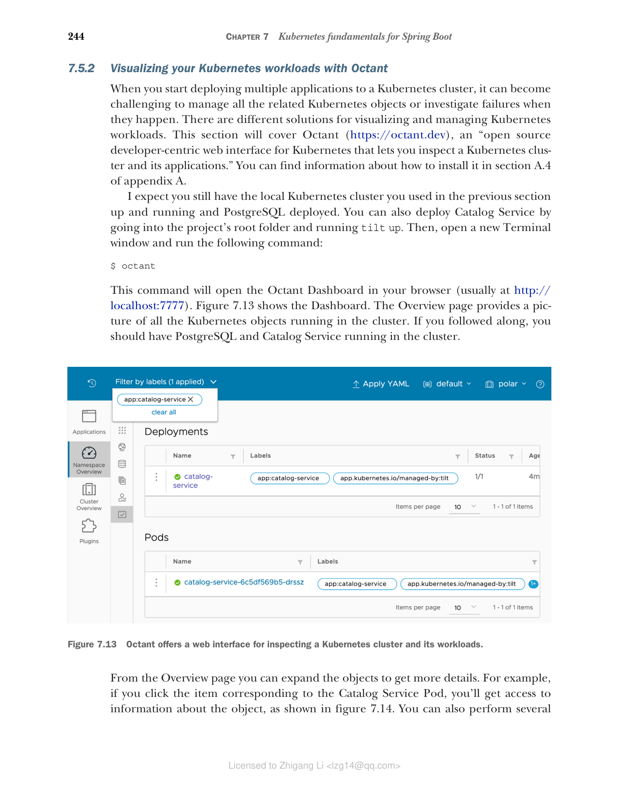
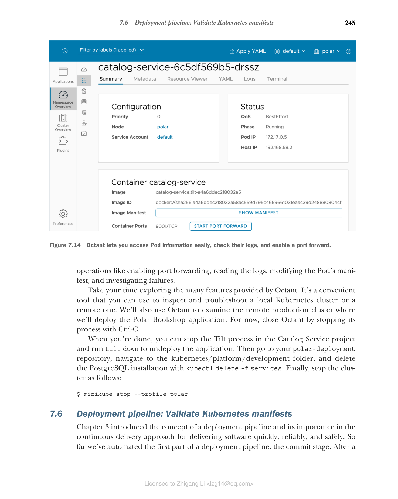

### 7.5.2 使用 Octant 可视化 Kubernetes 工作负载

当您开始向 Kubernetes 集群部署多个应用程序时，管理所有相关的 Kubernetes 对象或在故障发生时进行调查可能会变得具有挑战性。有不同解决方案可以用于可视化和管理 Kubernetes 工作负载。本节将介绍 Octant（https://octant.dev），一个"开源的、以开发者为中心的 Kubernetes Web 界面，让您可以检查 Kubernetes 集群及其应用程序"。您可以在附录 A 的 A.4 节中找到安装说明。

我期望您仍然拥有在上一节中使用的本地 Kubernetes 集群且正在运行，以及已部署的 PostgreSQL。您也可以通过进入项目根文件夹并运行 `tilt up` 来部署 Catalog Service。然后，打开一个新的终端窗口并运行以下命令：

```bash
$ octant
```

此命令将在浏览器中打开 Octant Dashboard（通常在 http://localhost:7777）。图 7.13 展示了 Dashboard。Overview 页面提供了集群中所有正在运行的 Kubernetes 对象的概览。如果您跟随操作，集群中应该运行着 PostgreSQL 和 Catalog Service。


**图 7.13 Octant 提供了用于检查 Kubernetes 集群及其工作负载的 Web 界面。**

从 Overview 页面，您可以展开对象以获取更多详细信息。例如，如果您点击 Catalog Service Pod 对应的条目，您将获得有关该对象的信息，如图 7.14 所示。您还可以执行多项操作，如启用端口转发、读取日志、修改 Pod 的清单以及调查故障。


**图 7.14 Octant 让您轻松访问 Pod 信息、检查其日志以及启用端口转发。**

请花些时间探索 Octant 提供的许多功能。它是一个便捷的工具，您可以用它来检查和排除本地 Kubernetes 集群或远程集群的故障。我们还将使用 Octant 来检查我们将在其中部署 Polar Bookshop 应用程序的远程生产集群。目前，通过使用 Ctrl-C 停止其进程来关闭 Octant。

完成后，您可以在 Catalog Service 项目中停止 Tilt 进程并运行 `tilt down` 取消部署应用程序。然后转到您的 polar-deployment 仓库，导航到 kubernetes/platform/development 文件夹，使用 `kubectl delete -f services` 删除 PostgreSQL 安装。最后，按如下方式停止集群：

```bash
$ minikube stop --profile polar
```
