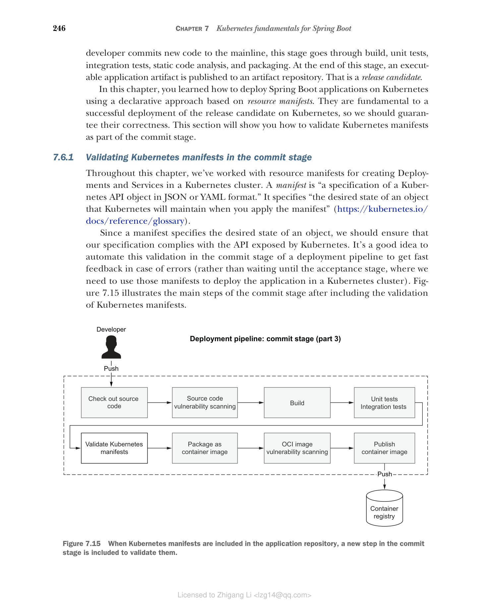

### 7.6.1 在提交阶段验证 Kubernetes 清单

在本章中，我们使用了资源清单来在 Kubernetes 集群中创建 Deployment 和 Service。清单是"JSON 或 YAML 格式的 Kubernetes API 对象规范"。它指定了"Kubernetes 在应用清单时将维护的对象期望状态"（https://kubernetes.io/docs/reference/glossary）。

由于清单指定了对象的期望状态，我们应该确保我们的规范符合 Kubernetes 暴露的 API。在部署流水线的提交阶段中自动化此验证是一个好主意，可以在出现错误时获得快速反馈（而不是等到验收阶段，在验收阶段我们需要使用这些清单在 Kubernetes 集群中部署应用程序）。图 7.15 展示了包含 Kubernetes 清单验证后提交阶段的主要步骤。


**图 7.15 当 Kubernetes 清单包含在应用程序仓库中时，提交阶段中会包含一个新步骤来验证它们。**

有几种方法可以针对 Kubernetes API 验证 Kubernetes 清单。我们将使用 Kubeval（www.kubeval.com），一个开源工具。您可以在附录 A 的 A.4 节中找到安装说明。

让我们看看它是如何工作的。打开终端窗口并导航到 Catalog Service 项目的根文件夹（catalog-service）。然后使用 kubeval 命令验证 k8s 目录中的 Kubernetes 清单（`-d k8s`）。`--strict` 标志禁止添加对象模式中未定义的额外属性：

```bash
$ kubeval --strict -d k8s

PASS - k8s/deployment.yml contains a valid Deployment (catalog-service)
PASS - k8s/service.yml contains a valid Service (catalog-service)
```

在下一节中，您将看到如何在用 GitHub Actions 实现的提交阶段工作流中使用 Kubeval。
