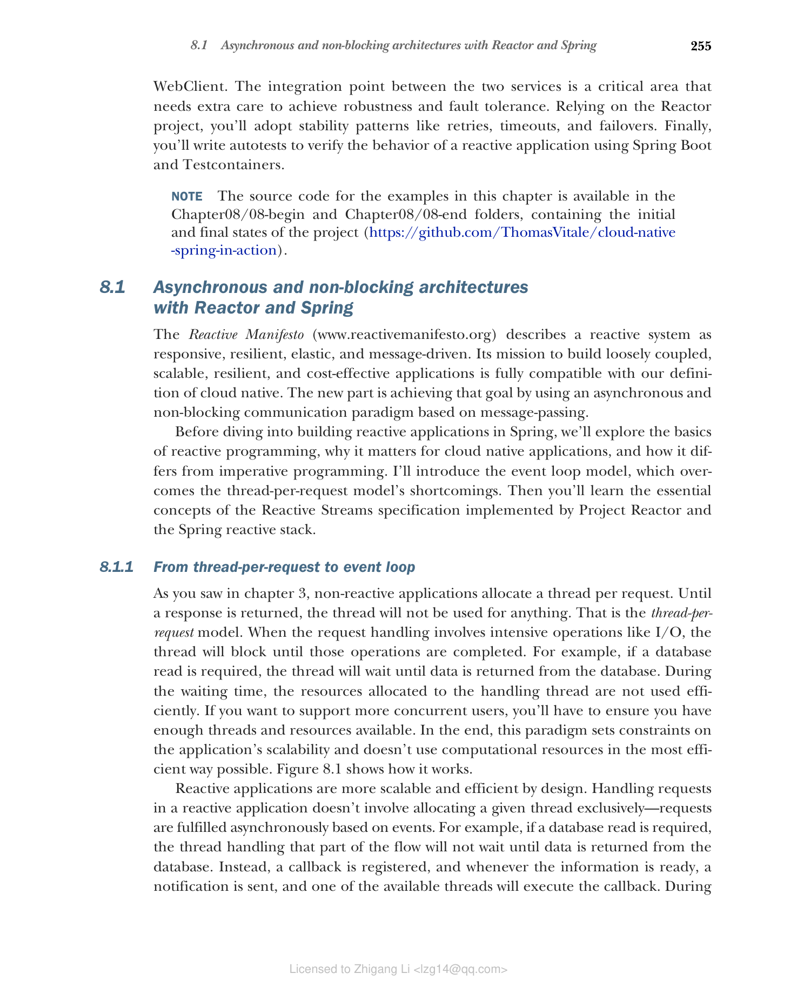
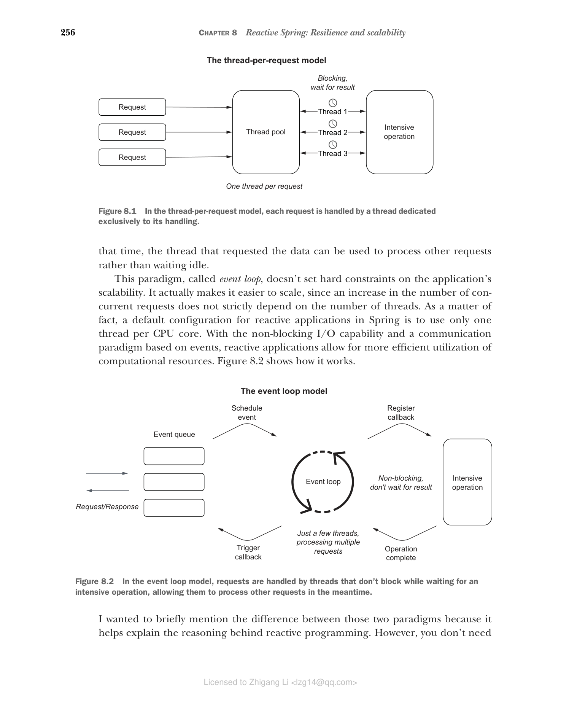

### 8.1.1 从每请求线程到事件循环

正如你在第 3 章中看到的，非响应式应用程序为每个请求分配一个线程。在返回响应之前，线程不会用于其他任何事情。这就是每请求线程模型。当请求处理涉及密集操作（如 I/O）时，线程将阻塞，直到这些操作完成。例如，如果需要数据库读取，线程将等待直到数据从数据库返回。在等待时间期间，分配给处理线程的资源没有被有效使用。如果你想支持更多并发用户，你将必须确保有足够的线程和资源可用。最终，这种范式对应用程序的可扩展性设置了约束，并且没有以最有效的方式使用计算资源。图 8.1 展示了它的工作方式。

**图 8.1 在每请求线程模型中，每个请求由专门用于其处理的线程处理**

响应式应用程序在设计上更具可扩展性和效率。在响应式应用程序中处理请求不涉及专门分配给定线程——请求基于事件异步完成。例如，如果需要数据库读取，处理该流程部分的线程不会等待直到数据从数据库返回。相反，注册一个回调，每当信息准备好时，发送通知，其中一个可用线程将执行回调。在此期间，请求数据的线程可以用于处理其他请求，而不是空闲等待。

这种称为事件循环的范式不会对应用程序的可扩展性设置硬约束。它实际上使扩展变得更容易，因为并发请求数量的增加并不严格依赖于线程数量。事实上，Spring 中响应式应用程序的默认配置是每个 CPU 核心只使用一个线程。凭借非阻塞 I/O 能力和基于事件的通信范式，响应式应用程序允许更有效地利用计算资源。图 8.2 展示了它的工作方式。

**图 8.2 在事件循环模型中，请求由在等待密集操作时不阻塞的线程处理，允许它们同时处理其他请求**

我想简要提到这两种范式之间的区别，因为它有助于解释响应式编程背后的推理。然而，你不需要知道这些范式内部机制的细节，因为我们不必在如此低的级别工作或实现事件循环。相反，我们将依赖方便的更高级别抽象，让我们专注于应用程序的业务逻辑，而不是花时间在处理线程级别的处理。

可扩展性和成本优化是迁移到云的两个关键原因，因此响应式范式非常适合云原生应用程序。扩展应用程序以支持工作负载增加变得不那么苛刻。通过更有效地使用资源，你可以节省云提供商提供的计算资源费用。迁移到云的另一个原因是弹性，响应式应用程序也有助于实现这一点。

响应式应用程序的一个重要特性是它们提供非阻塞背压（也称为控制流）。这意味着消费者可以控制他们接收的数据量，这降低了生产者发送超过消费者处理能力的数据的风险，这可能导致 DoS 攻击、减慢应用程序速度、级联故障，甚至导致完全崩溃。

响应式范式是解决阻塞 I/O 操作问题的方案，这些问题需要更多线程来处理高并发，并可能导致应用程序缓慢或完全无响应。有时该范式被误解为提高应用程序速度的方式。响应式是关于提高可扩展性和弹性，而不是速度。

然而，能力越大，麻烦越多。当你期望高流量和并发以及更少的计算资源或在流场景中时，响应式是一个很好的选择。然而，你还应该意识到这种范式引入的额外复杂性。除了需要改变思维方式以事件驱动的方式思考外，由于异步 I/O，响应式应用程序更难以调试和故障排除。在匆忙重写所有应用程序以使其响应式之前，请仔细考虑这是否必要，并权衡利弊。

响应式编程不是新概念。它已经使用多年。该范式最近在 Java 生态系统中成功的原因是 Reactive Streams 规范及其实现，如 Project Reactor、RxJava 和 Vert.x，它们为开发人员提供了方便的高级接口，用于构建异步和非阻塞应用程序，而无需处理设计消息驱动流的底层细节。下一节将介绍 Project Reactor，Spring 使用的响应式框架。
