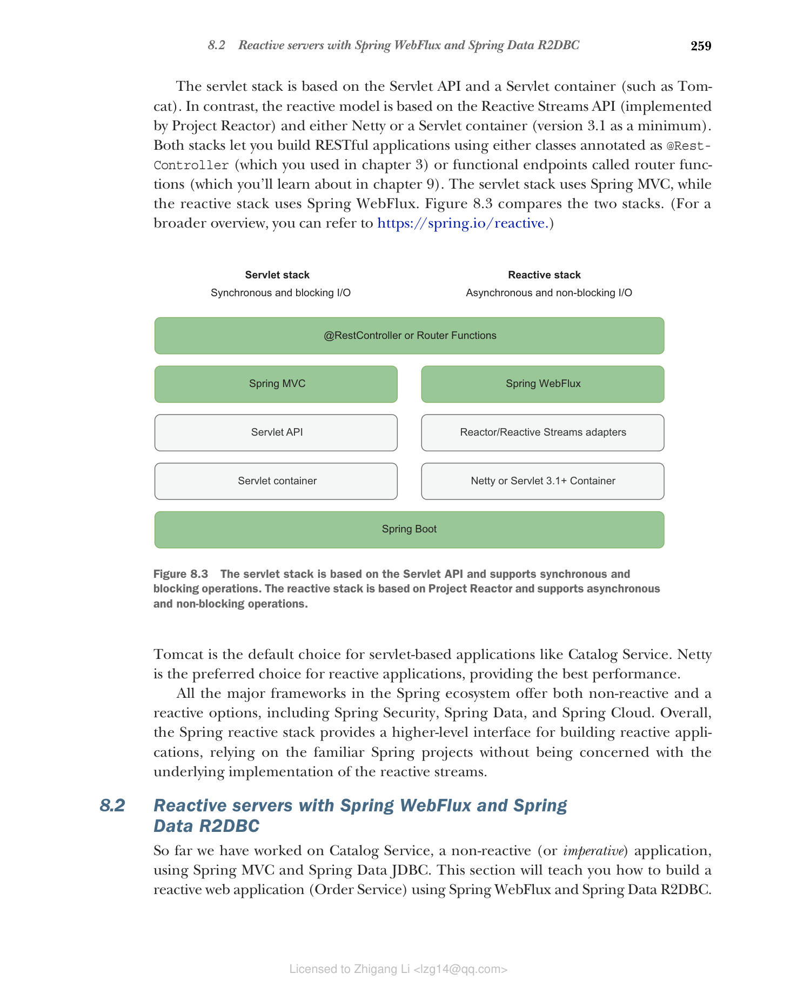

### 8.1.3 理解 Spring 响应式技术栈

当你使用 Spring 构建应用程序时，你可以选择 servlet 技术栈或响应式技术栈。servlet 技术栈依赖于同步、阻塞 I/O，并使用每请求线程模型来处理请求。另一方面，响应式技术栈依赖于异步、非阻塞 I/O，并使用事件循环模型来处理请求。

servlet 技术栈基于 Servlet API 和 Servlet 容器（如 Tomcat）。相比之下，响应式模型基于 Reactive Streams API（由 Project Reactor 实现）和 Netty 或 Servlet 容器（最低版本 3.1）。两种技术栈都允许你使用标注为 @RestController 的类（你在第 3 章中使用过）或称为路由函数的函数式端点（你将在第 9 章中学习）来构建 RESTful 应用程序。servlet 技术栈使用 Spring MVC，而响应式技术栈使用 Spring WebFlux。图 8.3 比较了这两种技术栈。（有关更广泛的概述，请参阅 [https://spring.io/reactive](https://spring.io/reactive)。）

**图 8.3 servlet 技术栈基于 Servlet API，支持同步和阻塞操作。响应式技术栈基于 Project Reactor，支持异步和非阻塞操作**

Tomcat 是基于 servlet 的应用程序（如 Catalog Service）的默认选择。Netty 是响应式应用程序的首选，提供最佳性能。

Spring 生态系统中的所有主要框架都提供非响应式和响应式选项，包括 Spring Security、Spring Data 和 Spring Cloud。总体而言，Spring 响应式技术栈提供了构建响应式应用程序的更高级别接口，依赖于熟悉的 Spring 项目，而无需关心响应式流的底层实现。
