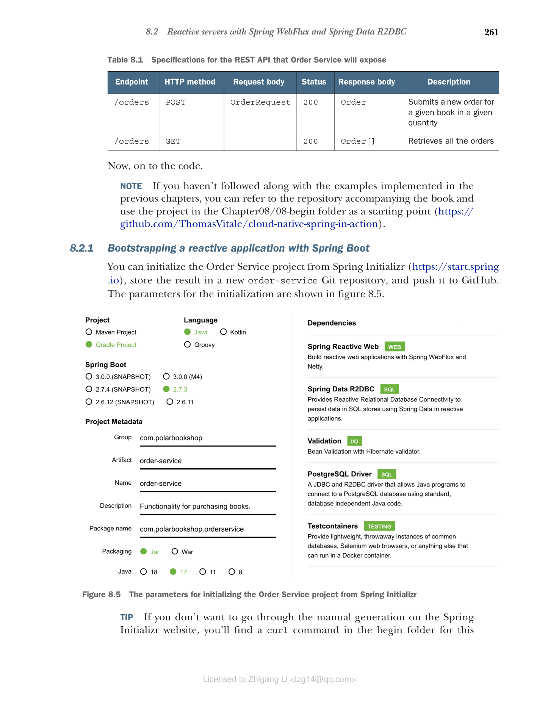

### 8.2.1 使用 Spring Boot 引导响应式应用程序

你可以从 Spring Initializr（https://start.spring.io）初始化 Order Service 项目，将结果存储到新的 order-service Git 仓库中，并推送到 GitHub。初始化参数如图 8.5 所示。



**图 8.5 从 Spring Initializr 初始化 Order Service 项目的参数**

> **提示：** 如果你不想在 Spring Initializr 网站上手动生成，可以在本章的 begin 文件夹中找到一个 curl 命令，可以在终端窗口中运行以下载 zip 文件。它包含你需要的所有代码。

自动生成的 build.gradle 文件的依赖部分如下：

```groovy
dependencies {
    implementation 'org.springframework.boot:spring-boot-starter-data-r2dbc'
    implementation 'org.springframework.boot:spring-boot-starter-validation'
    implementation 'org.springframework.boot:spring-boot-starter-webflux'
    runtimeOnly 'org.postgresql:r2dbc-postgresql'
    testImplementation 'org.springframework.boot:spring-boot-starter-test'
    testImplementation 'io.projectreactor:reactor-test'
    testImplementation 'org.testcontainers:junit-jupiter'
    testImplementation 'org.testcontainers:postgresql'
    testImplementation 'org.testcontainers:r2dbc'
}
```

这些是主要依赖：

* **Spring Reactive Web**（org.springframework.boot:spring-boot-starter-webflux）——提供使用 Spring WebFlux 构建响应式 Web 应用程序所需的库，并包含 Netty 作为默认嵌入式服务器。
* **Spring Data R2DBC**（org.springframework.boot:spring-boot-starter-data-r2dbc）——提供在响应式应用程序中使用 R2DBC 通过 Spring Data 将数据持久化到关系数据库所需的库。
* **Validation**（org.springframework.boot:spring-boot-starter-validation）——提供使用 Java Bean Validation API 进行对象验证所需的库。
* **PostgreSQL**（org.postgresql:r2dbc-postgresql）——提供允许应用程序响应式连接到 PostgreSQL 数据库的 R2DBC 驱动程序。
* **Spring Boot Test**（org.springframework.boot:spring-boot-starter-test）——提供多个用于测试应用程序的库和工具，包括 Spring Test、JUnit、AssertJ 和 Mockito。它会自动包含在每个 Spring Boot 项目中。
* **Reactor Test**（io.projectreactor:reactor-test）——提供用于测试基于 Project Reactor 的响应式应用程序的工具。它会自动包含在每个响应式 Spring Boot 项目中。
* **Testcontainers**（org.testcontainers:junit-jupiter、org.testcontainers:postgresql、org.testcontainers:r2dbc）——提供使用轻量级 Docker 容器测试应用程序所需的库。特别是，它提供了支持 R2DBC 驱动程序的 PostgreSQL 测试容器。

Spring Boot 中响应式应用程序的默认和推荐嵌入式服务器是 Reactor Netty，它构建在 Netty 之上，以在 Project Reactor 中提供响应式能力。你可以通过属性或定义 WebServerFactoryCustomizer<NettyReactiveWebServerFactory> 组件来配置它。让我们使用第一种方法。

首先，将 Spring Initializr 生成的 application.properties 文件重命名为 application.yml，并使用 spring.application.name 属性定义应用程序名称。就像你为 Tomcat 所做的那样，你可以通过 server.port 属性定义服务器端口，通过 server.shutdown 配置优雅关闭，并使用 spring.lifecycle.timeout-per-shutdown-phase 设置宽限期。使用特定的 Netty 属性，你可以进一步自定义服务器的行为。例如，你可以使用 server.netty.connection-timeout 和 server.netty.idle-timeout 属性为 Netty 定义连接和空闲超时。

**代码清单 8.1 配置 Netty 服务器和优雅关闭**

```yaml
server:
  port: 9002  # 服务器接受连接的端口
  shutdown: graceful  # 启用优雅关闭
  netty:
    connection-timeout: 2s  # 与服务器建立 TCP 连接的等待时间
    idle-timeout: 15s  # 如果没有数据传输，关闭 TCP 连接前的等待时间

spring:
  application:
    name: order-service
  lifecycle:
    timeout-per-shutdown-phase: 15s  # 定义 15 秒的宽限期
```

有了这个基本设置，我们现在可以定义域实体及其持久化。
