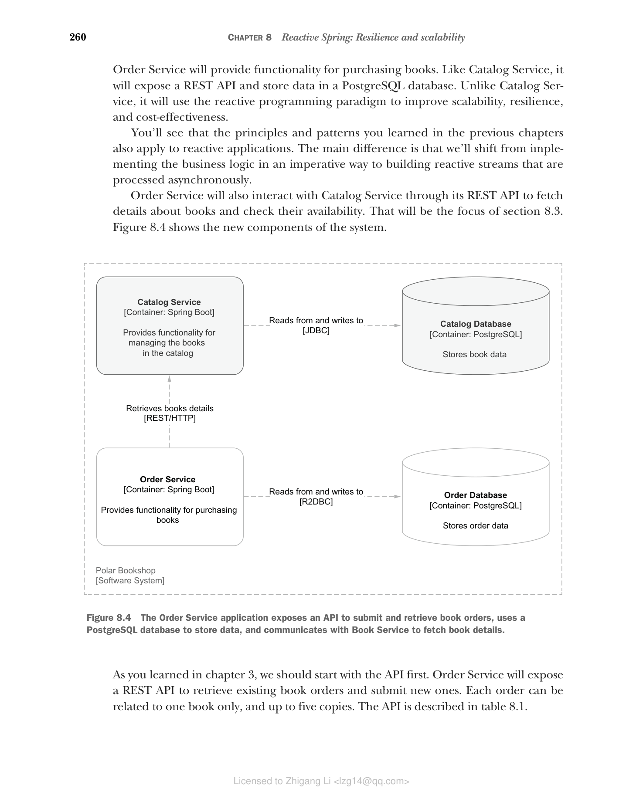

## 8.2 使用 Spring WebFlux 和 Spring Data R2DBC 构建响应式服务器

到目前为止，我们一直使用 Spring MVC 和 Spring Data JDBC 处理 Catalog Service，这是一个非响应式（或命令式）应用程序。本节将教你如何使用 Spring WebFlux 和 Spring Data R2DBC 构建响应式 Web 应用程序（Order Service）。

Order Service 将提供购买书籍的功能。与 Catalog Service 一样，它将暴露 REST API 并将数据存储在 PostgreSQL 数据库中。与 Catalog Service 不同的是，它将使用响应式编程范式来提高可扩展性、弹性和成本效益。

你将看到你在前面章节中学到的原则和模式也适用于响应式应用程序。主要区别在于，我们将从以命令式方式实现业务逻辑转变为构建异步处理的响应式流。

Order Service 还将通过其 REST API 与 Catalog Service 交互，以获取有关书籍的详细信息并检查其可用性。这将是第 8.3 节的重点。图 8.4 展示了系统的新组件。

**图 8.4 Order Service 应用程序暴露 API 以提交和检索书籍订单，使用 PostgreSQL 数据库存储数据，并与 Book Service 通信以获取书籍详情**

正如你在第 3 章中学到的，我们应该首先从 API 开始。Order Service 将暴露 REST API 来检索现有的书籍订单并提交新订单。每个订单只能与一本书相关，最多五本。API 在表 8.1 中描述。

**表 8.1 Order Service 将暴露的 REST API 规格**

| 端点 | HTTP 方法 | 请求体 | 状态 | 响应体 | 描述 |
|------|----------|--------|------|--------|------|
| /orders | POST | OrderRequest | 200 | Order | 提交给定书籍和数量的新订单 |
| /orders | GET | - | 200 | Order[] | 检索所有订单 |

现在开始写代码。

> **注意：** 如果你没有跟随前面章节的示例，可以参考本书附带的仓库，使用 Chapter08/08-begin 文件夹中的项目作为起点（[https://github.com/ThomasVitale/cloud-native-spring-in-action](https://github.com/ThomasVitale/cloud-native-spring-in-action)）。
