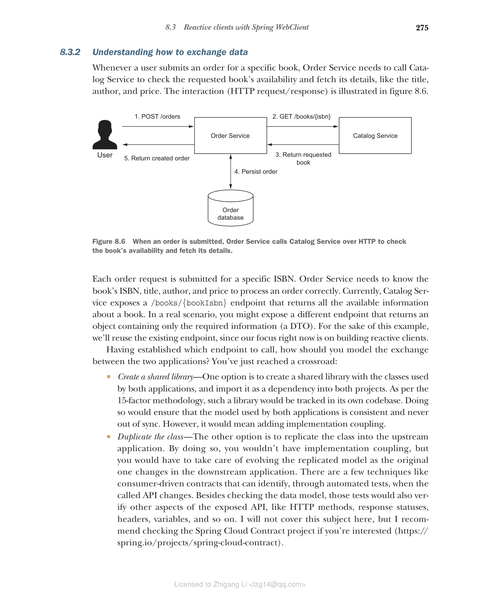

### 8.3.2 理解如何交换数据

每当用户提交特定书籍的订单时，Order Service 需要调用 Catalog Service 来检查请求书籍的可用性并获取其详细信息，如标题、作者和价格。交互（HTTP 请求/响应）如图 8.6 所示。



**图 8.6 当提交订单时，Order Service 通过 HTTP 调用 Catalog Service 来检查书籍的可用性并获取其详细信息**

每个订单请求都是针对特定 ISBN 提交的。Order Service 需要知道书籍的 ISBN、标题、作者和价格才能正确处理订单。目前，Catalog Service 暴露了一个 /books/{bookIsbn} 端点，返回有关书籍的所有可用信息。在真实场景中，你可以暴露一个不同的端点，返回仅包含所需信息的对象（DTO）。为了这个示例，我们将重用现有端点，因为我们的重点现在是构建响应式客户端。

确定要调用哪个端点后，你应该如何建模两个应用程序之间的交换？你刚刚到达一个十字路口：

* **创建共享库**——一个选择是创建一个包含两个应用程序使用的类的共享库，并将其作为依赖项导入到两个项目中。根据十五要素方法论，这样的库将在自己的代码库中进行跟踪。这样做将确保两个应用程序使用的模型是一致的，并且永远不会不同步。然而，这意味着添加实现耦合。

* **复制类**——另一个选择是将类复制到上游应用程序中。通过这样做，你不会有实现耦合，但你必须处理当下游应用程序中的原始模型发生变化时复制模型的演进。有一些技术（如消费者驱动的契约）可以通过自动测试识别被调用 API 何时发生变化。除了检查数据模型外，这些测试还会验证暴露 API 的其他方面，如 HTTP 方法、响应状态、头、变量等。我不会在这里介绍这个主题，但如果你感兴趣，我建议查看 Spring Cloud Contract 项目（[https://spring.io/projects/spring-cloud-contract](https://spring.io/projects/spring-cloud-contract)）。

两种选择都是可行的。你采用哪种策略取决于你的项目需求和组织结构。对于 Polar Bookshop 项目，我们将使用第二个选项。

在新的 com.polarbookshop.orderservice.book 包中，创建一个 Book 记录用作 DTO，仅包含订单处理逻辑使用的字段。正如我前面指出的，在真实场景中，我会在 Catalog Service 中暴露一个新的端点，返回建模为该 DTO 的书籍对象。为简单起见，我们将使用现有的 /books/{bookIsbn} 端点，因此在将接收到的 JSON 反序列化为 Java 对象时，任何不映射到此类中任何字段的信息都将被丢弃。确保你定义的字段与 Catalog Service 中定义的 Book 对象中的字段具有相同的名称，否则解析将失败。这是消费者驱动的契约测试可以自动为你验证的内容。

**代码清单 8.19 Book 记录是用于存储书籍信息的 DTO**

```java
package com.polarbookshop.orderservice.book;

public record Book(
 String isbn,
 String title,
 String author,
 Double price
) {}
```

现在你在 Order Service 中有了一个 DTO 来保存书籍信息，让我们看看如何从 Catalog Service 检索它。
