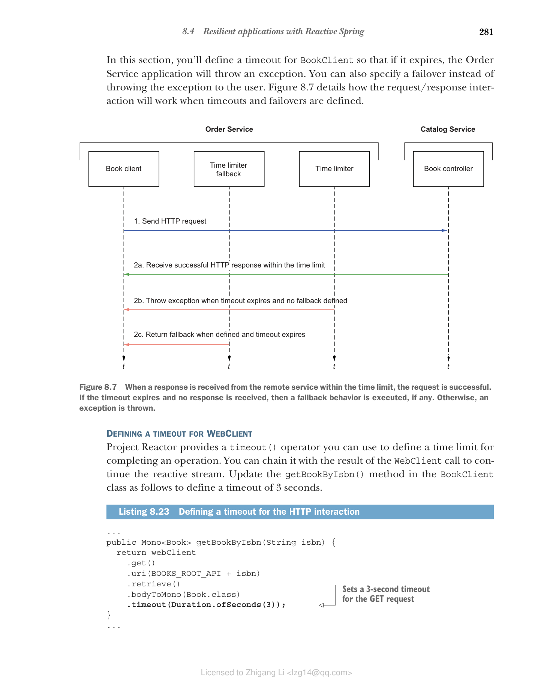

### 8.4.1 超时

每当你的应用程序调用远程服务时，你都不知道是否会收到响应以及何时收到。超时（也称为时间限制器）是一种简单但有效的工具，用于在合理时间内未收到响应时保持应用程序的响应性。

设置超时有两个主要原因：

* 如果你不限制客户端等待的时间，你的计算资源可能会被阻塞太长时间（对于命令式应用程序）。在最坏的情况下，你的应用程序将完全无响应，因为所有可用线程都被阻塞，等待来自远程服务的响应，并且没有可用的线程来处理新请求。

* 如果你无法满足服务级别协议（SLA），就没有理由继续等待答案。最好让请求失败。

以下是一些超时示例：

* **连接超时**——这是与远程资源建立通信通道的时间限制。之前你配置了 server.netty.connection-timeout 属性来限制 Netty 等待建立 TCP 连接的时间。

* **连接池超时**——这是客户端从池中获取连接的时间限制。在第 5 章中，你通过 spring.datasource.hikari.connection-timeout 属性为 Hikari 连接池配置了超时。

* **读取超时**——这是在建立初始连接后从远程资源读取的时间限制。在接下来的几节中，你将为 BookClient 类执行的对 Catalog Service 的调用定义读取超时。

在本节中，你将为 BookClient 定义超时，以便如果超时，Order Service 应用程序将抛出异常。你也可以指定故障转移而不是向用户抛出异常。图 8.7 详细说明了定义超时和故障转移时请求/响应交互的工作方式。



**图 8.7 当在时间限制内从远程服务收到响应时，请求成功。如果超时到期且未收到响应，则执行故障转移行为（如果有）。否则，抛出异常。**

**为 WebClient 定义超时**

Project Reactor 提供了一个 timeout() 运算符，你可以使用它来定义完成操作的时间限制。你可以将其与 WebClient 调用的结果链接以继续响应式流。更新 BookClient 类中的 getBookByIsbn() 方法，定义 3 秒的超时。

**代码清单 8.23 为 HTTP 交互定义超时**

```java
// ... 其他代码

public Mono<Book> getBookByIsbn(String isbn) {
    return webClient
        .get()
        .uri(BOOKS_ROOT_API + isbn)
        .retrieve()
        .bodyToMono(Book.class)
        .timeout(Duration.ofSeconds(3));  // 为 GET 请求设置 3 秒超时
}

// ... 其他代码
```

你可以在超时到期时提供故障转移行为，而不是抛出异常。考虑到如果未验证书籍的可用性，Order Service 无法接受订单，你可能考虑返回空结果，以便订单将被拒绝。你可以使用 Mono.empty() 定义响应式空结果。更新 BookClient 类中的 getBookByIsbn() 方法。

**代码清单 8.24 为 HTTP 交互定义超时和故障转移**

```java
// ... 其他代码

public Mono<Book> getBookByIsbn(String isbn) {
    return webClient
        .get()
        .uri(BOOKS_ROOT_API + isbn)
        .retrieve()
        .bodyToMono(Book.class)
        .timeout(Duration.ofSeconds(3), Mono.empty());  // 故障转移返回空的 Mono 对象
}

// ... 其他代码
```

> **注意：** 在真实的生产场景中，你可能希望通过向 ClientProperties 添加新字段来外部化超时配置。这样，你可以根据环境更改其值，而无需重新构建应用程序。监控任何超时并在必要时调整其值也很重要。

**理解如何有效使用超时**

超时提高应用程序弹性，并遵循快速失败的原则。但为超时设置一个好的值可能很棘手。你应该从整体上考虑系统架构。在前面的示例中，你定义了 3 秒的超时。这意味着响应应在该时间限制内从 Catalog Service 到达 Order Service。否则，将发生故障或故障转移。Catalog Service 反过来向 PostgreSQL 数据库发送请求以获取有关特定书籍的数据，并等待响应。连接超时保护该交互。你应该仔细设计系统中所有集成点的时间限制策略，以满足软件的 SLA 并保证良好的用户体验。

如果 Catalog Service 可用，但响应无法在时间限制内到达 Order Service，请求可能仍会被 Catalog Service 处理。这是配置超时时需要考虑的关键点。对于读取或查询操作来说这并不重要，因为它们是幂等的。对于写入或命令操作，你需要确保在超时到期时正确处理，包括向用户提供有关操作结果的正确状态。

当 Catalog Service 过载时，可能需要几秒钟才能从池中获取 JDBC 连接、从数据库获取数据并将响应发送回 Order Service。在这种情况下，你可以考虑重试请求，而不是回退到默认行为或抛出异常。
