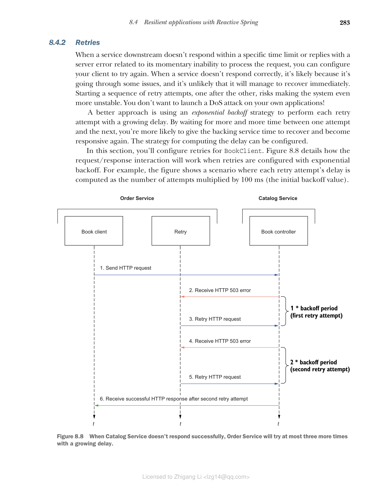

### 8.4.2 重试

当下游服务未在特定时间限制内响应或回复与其暂时无法处理请求相关的服务器错误时，你可以配置客户端重试。当服务未正确响应时，可能是因为它正在经历一些问题，并且不太可能立即恢复。开始一系列重试尝试，一个接一个，可能会使系统更加不稳定。你不希望对自己的应用程序发起 DoS 攻击！

更好的方法是使用指数退避策略，每次重试尝试都使用递增的延迟。通过在一次尝试和下一次尝试之间等待越来越长的时间，你更有可能给后端服务时间来恢复并再次响应。计算延迟的策略可以配置。

在本节中，你将为 BookClient 配置重试。图 8.8 详细说明了使用指数退避配置重试时请求/响应交互的工作方式。例如，该图显示了一个场景，其中每次重试尝试的延迟计算为尝试次数乘以 100 毫秒（初始退避值）。



**图 8.8 当 Catalog Service 未成功响应时，Order Service 将最多再试三次，延迟递增**

**为 WebClient 定义重试**

Project Reactor 提供了一个 retryWhen() 运算符，你可以使用它来配置重试策略。你可以定义最大重试次数和退避策略。更新 BookClient 类中的 getBookByIsbn() 方法，定义最多 3 次重试，初始退避为 100 毫秒。

**代码清单 8.25 为 HTTP 交互定义重试**

```java
// ... 其他代码

public Mono<Book> getBookByIsbn(String isbn) {
 return webClient
 .get()
 .uri(BOOKS_ROOT_API + isbn)
 .retrieve()
 .bodyToMono(Book.class)
 .timeout(Duration.ofSeconds(3), Mono.empty())
 .retryWhen(Retry.backoff(3, Duration.ofMillis(100))); // 最多重试 3 次，初始退避 100 毫秒
}

// ... 其他代码
```

这个配置意味着：

* 最多重试 3 次
* 初始退避为 100 毫秒
* 每次重试后延迟加倍（指数退避）
* 总共最多等待约 700 毫秒（100 + 200 + 400）

> **注意：** 你应该仔细考虑重试策略。对于读取操作，重试通常是安全的。对于写入操作，你可能需要更小心，以避免重复操作。在某些情况下，你可能需要实现幂等性来安全地重试写入操作。

**结合超时和重试**

你可以将超时和重试结合起来使用。这样，如果第一次尝试超时，系统会自动重试。更新 getBookByIsbn() 方法：

```java
public Mono<Book> getBookByIsbn(String isbn) {
 return webClient
 .get()
 .uri(BOOKS_ROOT_API + isbn)
 .retrieve()
 .bodyToMono(Book.class)
 .timeout(Duration.ofSeconds(3), Mono.empty())
 .retryWhen(Retry.backoff(3, Duration.ofMillis(100))
 .filter(throwable -> throwable instanceof TimeoutException ||
 throwable instanceof WebClientResponseException));
}
```

这个配置添加了一个过滤器，只在特定异常（超时或 Web 客户端响应异常）时重试，而不是在所有异常时都重试。
