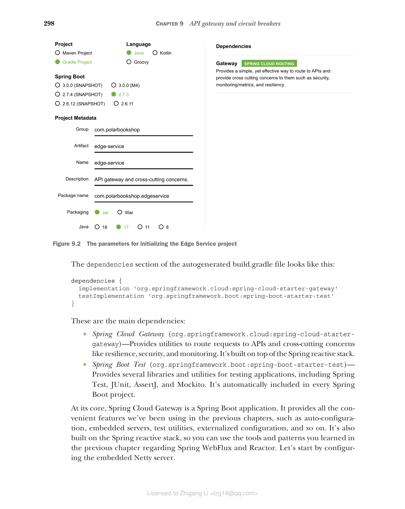

### 9.1.1 使用 Spring Cloud Gateway 引导边缘服务器

Polar Bookshop 系统需要一个边缘服务器来将流量路由到内部 API 并处理多个跨切面关注点。你可以从 Spring Initializr（https://start.spring.io）初始化新的 Edge Service 项目，将结果存储到新的 edgeservice Git 仓库中，并推送到 GitHub。初始化参数如图 9.2 所示。

> **提示：** 在本章的 begin 文件夹中，你会找到一个 curl 命令，可以在终端窗口中运行。它会下载一个包含所有所需代码的 zip 文件，无需在 Spring Initializr 网站上手动生成。



**图 9.2 初始化 Edge Service 项目的参数**

自动生成的 build.gradle 文件的依赖部分如下：

```groovy
dependencies {
    implementation 'org.springframework.cloud:spring-cloud-starter-gateway'
    testImplementation 'org.springframework.boot:spring-boot-starter-test'
}
```

这些是主要依赖：

* **Spring Cloud Gateway**（org.springframework.cloud:spring-cloud-starter-gateway）——提供将请求路由到 API 和跨切面关注点（如容错、安全和监控）的工具。它构建在 Spring 响应式技术栈之上。
* **Spring Boot Test**（org.springframework.boot:spring-boot-starter-test）——提供多个用于测试应用程序的库和工具，包括 Spring Test、JUnit、AssertJ 和 Mockito。它会自动包含在每个 Spring Boot 项目中。

Spring Cloud Gateway 的核心是一个 Spring Boot 应用程序。它提供了我们在前面章节中使用的所有便利功能，如自动配置、嵌入式服务器、测试工具、外部化配置等。它还构建在 Spring 响应式技术栈之上，因此你可以使用前一章学到的关于 Spring WebFlux 和 Reactor 的工具和模式。让我们从配置嵌入式 Netty 服务器开始。

首先，将 Spring Initializr 生成的 application.properties 文件（edgeservice/src/main/resources）重命名为 application.yml。然后打开文件，按照前一章学到的方式配置 Netty 服务器。

**代码清单 9.1 配置 Netty 服务器和优雅关闭**

```yaml
# 服务器接受连接的端口
server:
  port: 9000

  netty:
    # 与服务器建立 TCP 连接的超时时间
    connection-timeout: 2s
    # 如果没有数据传输，关闭 TCP 连接前的等待时间
    idle-timeout: 15s

  # 启用优雅关闭
  shutdown: graceful

spring:
  application:
    name: edge-service
  lifecycle:
    # 定义 15 秒的宽限期
    timeout-per-shutdown-phase: 15s
```

应用程序已设置完成，你可以继续探索 Spring Cloud Gateway 的功能。
