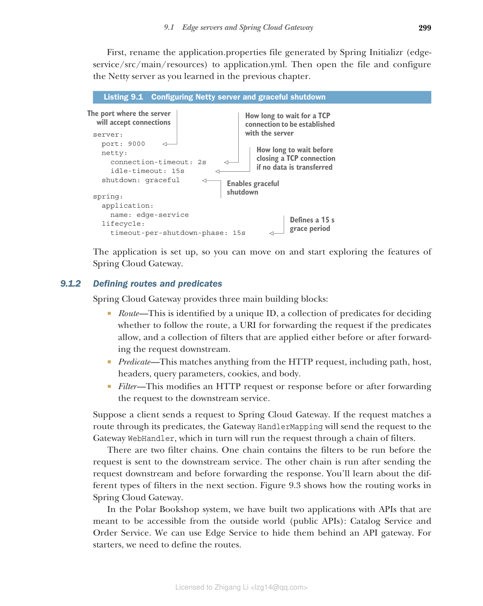

### 9.1.2 定义路由和断言

Spring Cloud Gateway 提供了三个主要构建块：

* **路由（Route）**——通过唯一 ID 标识，包含一组用于决定是否跟随路由的断言、一个用于在断言允许时转发请求的 URI，以及一组在转发请求到下游之前或之后应用的过滤器。
* **断言（Predicate）**——匹配 HTTP 请求的任何内容，包括路径、主机、头、查询参数、Cookie 和请求体。
* **过滤器（Filter）**——在将请求转发到下游服务之前或之后修改 HTTP 请求或响应。

假设客户端向 Spring Cloud Gateway 发送请求。如果请求通过其断言匹配到路由，Gateway HandlerMapping 将请求发送到 Gateway WebHandler，后者将通过过滤器链运行请求。

有两个过滤器链。一个链包含在请求发送到下游服务之前运行的过滤器。另一个链在发送请求到下游之后、转发响应之前运行。你将在下一节了解不同类型的过滤器。图 9.3 展示了 Spring Cloud Gateway 中路由的工作方式。



**图 9.3 请求与断言匹配，经过过滤，最后转发到下游服务，下游服务回复的响应经过另一组过滤器后返回给客户端**

在 Polar Bookshop 系统中，我们构建了两个具有公共 API 的应用程序：Catalog Service 和 Order Service。我们可以使用 Edge Service 将它们隐藏在 API 网关后面。首先，我们需要定义路由。

**代码清单 9.2 配置到下游服务的路由**

```yaml
spring:
  cloud:
    gateway:
      routes:  # 路由定义列表
        - id: catalog-route  # 路由 ID
          uri: ${CATALOG_SERVICE_URL:http://localhost:9001}/books
          predicates:
            - Path=/books/**  # 断言是要匹配的路径
        - id: order-route
          uri: ${ORDER_SERVICE_URL:http://localhost:9002}/orders
          predicates:
            - Path=/orders/**
```

Catalog Service 和 Order Service 的路由都是基于 Path 断言匹配的。所有路径以 /books 开头的传入请求将被转发到 Catalog Service。如果路径以 /orders 开头，则 Order Service 将接收请求。URI 使用环境变量（CATALOG_SERVICE_URL 和 ORDER_SERVICE_URL）的值计算。如果未定义，则使用第一个冒号（:）符号后写的默认值。这与我们在前一章中基于自定义属性定义 URL 的方式不同；我想向你展示这两种选项。

该项目内置了许多不同的断言，你可以在路由配置中使用它们来匹配 HTTP 请求的任何方面，包括 Cookie、Header、Host、Method、Path、Query 和 RemoteAddr。你还可以将它们组合起来形成 AND 条件。在前面的示例中，我们使用了 Path 断言。有关 Spring Cloud Gateway 中可用断言的完整列表，请参阅官方文档：https://spring.io/projects/spring-cloud-gateway。

**使用 Java/Kotlin DSL 定义路由**

Spring Cloud Gateway 是一个非常灵活的项目，允许你以最适合需求的方式配置路由。这里你在属性文件（application.yml 或application.properties）中配置了路由，但也可以使用 DSL 在 Java 或 Kotlin 中以编程方式配置路由。该项目的未来版本还将实现从数据源获取路由配置的功能，使用 Spring Data。

如何使用取决于你。将路由放在配置属性中可以让你根据环境轻松自定义它们，并在运行时更新它们，而无需重新构建和重新部署应用程序。例如，使用 Spring Cloud Config Server 时你会获得这些好处。另一方面，Java 和 Kotlin 的 DSL 允许你定义更复杂的路由。配置属性只允许你使用 AND 逻辑运算符组合不同的断言。DSL 还允许你使用其他逻辑运算符，如 OR 和 NOT。

让我们验证它是否按预期工作。我们将使用 Docker 运行下游服务和 PostgreSQL，而 Edge Service 将在 JVM 上本地运行，以便更高效地进行开发，因为我们正在积极实现该应用程序。

首先，我们需要 Catalog Service 和 Order Service 启动并运行。从每个项目的根文件夹运行 `./gradlew bootBuildImage` 将它们打包为容器镜像。然后通过 Docker Compose 启动它们。打开终端窗口，导航到 docker-compose.yml 文件所在的文件夹（polar-deployment/docker），运行以下命令：

```bash
$ docker-compose up -d catalog-service order-service
```

由于两个应用程序都依赖 PostgreSQL，Docker Compose 也会运行 PostgreSQL 容器。

当下游服务全部启动并运行时，是时候启动 Edge Service 了。打开终端窗口，导航到项目的根文件夹（edge-service），运行以下命令：

```bash
$ ./gradlew bootRun
```

Edge Service 应用程序将在端口 9000 上开始接受请求。进行最终测试，尝试对书籍和订单执行操作，但这次通过 API 网关（即使用端口 9000 而不是 Catalog Service 和 Order Service 监听的各个端口）。它们应该返回 200 OK 响应：

```bash
$ http :9000/books
$ http :9000/orders
```

结果与直接调用 Catalog Service 和 Order Service 相同，但这次你只需要知道一个主机名和端口。测试完应用程序后，使用 Ctrl-C 停止执行。然后使用 Docker Compose 终止所有容器：

```bash
$ docker-compose down
```
