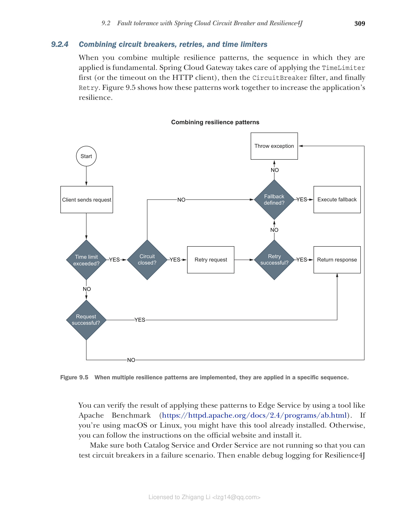

### 9.2.4 组合断路器、重试和时间限制器

当你组合多种弹性模式时，它们应用的顺序至关重要。Spring Cloud Gateway 会先应用 TimeLimiter（或 HTTP 客户端的超时），然后是 CircuitBreaker 过滤器，最后是 Retry。图 9.5 展示了这些模式如何协同工作以提高应用程序的弹性。



**图 9.5 当实现多种弹性模式时，它们按特定顺序应用**

你可以使用 Apache Benchmark（https://httpd.apache.org/docs/2.4/programs/ab.html）等工具来验证将这些模式应用于 Edge Service 的结果。如果你使用 macOS 或 Linux，可能已经安装了此工具。否则，你可以按照官方网站的说明进行安装。

确保 Catalog Service 和 Order Service 都没有运行，以便你可以在故障场景中测试断路器。然后为 Resilience4J 启用调试日志，以便你可以跟踪断路器的状态转换。在 Edge Service 项目的 application.yml 文件末尾，添加以下配置。

**代码清单 9.10 为 Resilience4J 启用调试日志**

```yaml
logging:
  level:
    io.github.resilience4j: DEBUG
```

接下来，构建并运行 Edge Service（`./gradlew bootRun`）。由于没有下游服务运行（如果它们在运行，你应该停止它们），从 Edge Service 发送到它们的所有请求都会导致错误。让我们看看如果我们向 /orders 端点运行 21 个连续的 POST 请求（`-n 21 -c 1 -m POST`）会发生什么。记住 POST 请求没有重试配置，order-route 没有回退，因此结果只会受超时和断路器影响：

```bash
$ ab -n 21 -c 1 -m POST http://localhost:9000/orders
```

从 ab 输出中，你可以看到所有请求都返回了错误：

```
Complete requests: 21
Non-2xx responses: 21
```

断路器配置为当 20 大小的时间窗口中至少 50% 的调用失败时跳闸到打开状态。由于你刚刚启动应用程序，电路将在 20 个请求后转换到打开状态。在应用程序日志中，你可以分析请求是如何处理的。所有请求都失败了，因此断路器为每个请求注册了一个 ERROR 事件：

```
Event ERROR published: CircuitBreaker 'orderCircuitBreaker' recorded an error.
```

在第 20 个请求时，记录了 FAILURE_RATE_EXCEEDED 事件，因为它超过了失败阈值。这将导致 STATE_TRANSITION 事件打开电路：

```
Event FAILURE_RATE_EXCEEDED published: CircuitBreaker 'orderCircuitBreaker' exceeded failure rate threshold.
Event STATE_TRANSITION published: CircuitBreaker 'orderCircuitBreaker' changed state from CLOSED to OPEN
```

第 21 个请求甚至不会尝试联系 Order Service：电路是打开的，所以它无法通过。注册了 NOT_PERMITTED 事件来指示请求失败的原因：

```
Event NOT_PERMITTED published: CircuitBreaker 'orderCircuitBreaker' recorded a call which was not permitted.
```

> **注意：** 在生产环境中监控断路器的状态是一项关键任务。在第 13 章中，我将向你展示如何将该信息导出为 Prometheus 指标，你可以在 Grafana 仪表板中可视化，而不是检查日志。

现在让我们看看当我们调用配置了重试和回退的 GET 端点时会发生什么。在继续之前，重新运行应用程序，以便你可以从清晰的断路器状态开始（`./gradlew bootRun`）。然后运行以下命令：

```bash
$ ab -n 21 -c 1 -m GET http://localhost:9000/books
```

如果你检查应用程序日志，你会看到断路器的行为与之前完全一样：20 个允许的请求（闭合电路），然后是一个不允许的请求（打开电路）。然而，前面命令的结果显示 21 个请求完成且没有错误：

```
Complete requests: 21
Failed requests: 0
```

这一次，所有请求都已转发到回退端点，因此客户端没有遇到任何错误。

我们配置了 Retry 过滤器在发生 IOException 或 TimeoutException 时触发。在这种情况下，由于下游服务未运行，抛出的异常是 ConnectException 类型，因此请求没有被重试，这使我能够向你展示断路器和回退的组合行为（不带重试）。

到目前为止，我们已经研究了使 Edge Service 和下游应用程序之间的交互更具弹性的模式。系统的入口点呢？下一节将介绍限流器，它将控制通过 Edge Service 应用程序进入系统的请求流。在继续之前，使用 Ctrl-C 停止应用程序的执行。
