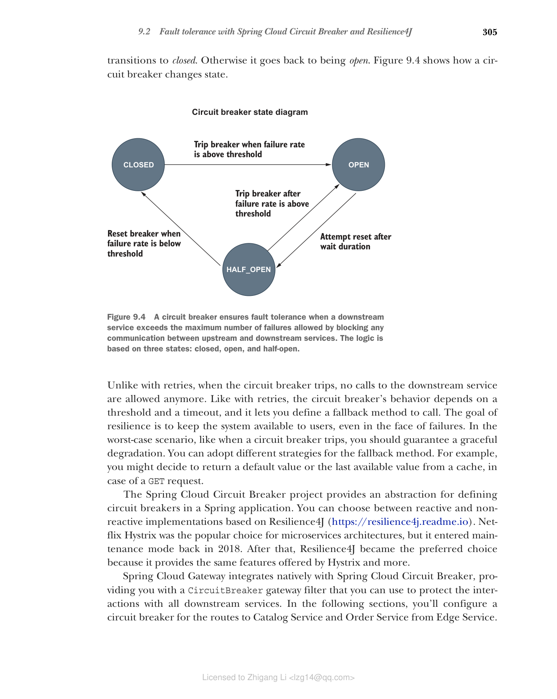

## 9.2 使用 Spring Cloud Circuit Breaker 和 Resilience4J 实现容错

如你所知，弹性是云原生应用程序的关键特性之一。实现弹性的原则之一是阻止故障级联并影响其他组件。考虑一个分布式系统，其中应用程序 X 依赖于应用程序 Y。如果应用程序 Y 故障，应用程序 X 也会故障吗？断路器可以阻止一个组件中的故障传播到依赖它的其他组件，从而保护系统的其余部分。这是通过临时停止与故障组件的通信直到其恢复来实现的。这种模式来自电气系统，其中电路被物理断开以断开电气连接，避免在系统的一部分因电流过载而故障时损坏整个房屋。

在分布式系统中，你可以在组件之间的集成点建立断路器。考虑 Edge Service 和 Catalog Service。在典型场景中，电路是闭合的，这意味着两个服务可以通过网络交互。对于 Catalog Service 返回的每个服务器错误响应，Edge Service 中的断路器会记录故障。当故障次数超过某个阈值时，断路器会跳闸，电路会转换到打开状态。

当电路打开时，Edge Service 和 Catalog Service 之间的通信是不允许的。任何应该转发到 Catalog Service 的请求都会立即失败。在这种状态下，要么向客户端返回错误，要么执行回退逻辑。在适当的时间后允许系统恢复，断路器会转换到半开状态，允许下一次对 Catalog Service 的调用通过。这是一个探索性阶段，用于检查联系下游服务时是否仍然存在问题。如果调用成功，断路器会重置并转换到闭合状态。否则它会回到打开状态。图 9.4 展示了断路器如何改变状态。

**图 9.4 断路器通过阻止上游和下游服务之间的任何通信，确保当下游服务超过允许的最大故障次数时的容错性。逻辑基于三个状态：闭合、打开和半开。**

与重试不同，当断路器跳闸时，不再允许对下游服务的调用。与重试类似，断路器的行为取决于阈值和超时，它允许你定义要调用的回退方法。弹性的目标是使系统对用户可用，即使面对故障。在最坏的情况下，比如断路器跳闸时，你应该保证优雅降级。你可以为回退方法采用不同的策略。例如，你可能决定返回默认值或缓存中的最后一个可用值，以防 GET 请求。

Spring Cloud Circuit Breaker 项目提供了在 Spring 应用中定义断路器的抽象。你可以选择基于 Resilience4J（[https://resilience4j.readme.io](https://resilience4j.readme.io)）的响应式和非响应式实现。Netflix Hystrix 曾是微服务架构的流行选择，但它在 2018 年进入了维护模式。之后，Resilience4J 成为首选，因为它提供了 Hystrix 提供的所有功能以及更多功能。

Spring Cloud Gateway 与 Spring Cloud Circuit Breaker 原生集成，为你提供了一个 CircuitBreaker 网关过滤器，可用于保护与所有下游服务的交互。在以下几节中，你将为从 Edge Service 到 Catalog Service 和 Order Service 的路由配置断路器。
