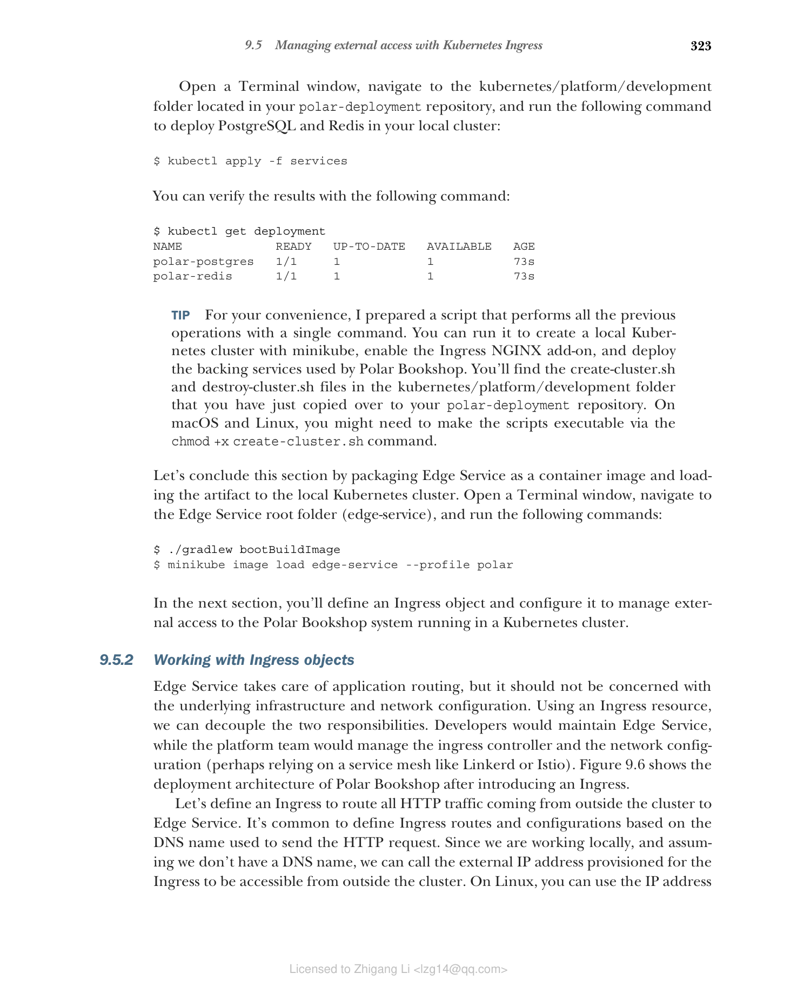

### 9.5.2 使用 Ingress 对象

Edge Service 负责应用程序路由，但它不应该关心底层基础设施和网络配置。使用 Ingress 资源，我们可以将这两个职责解耦。开发人员将维护 Edge Service，而平台团队将管理 Ingress Controller 和网络配置（可能依赖 Linkerd 或 Istio 等服务网格）。图 9.6 展示了引入 Ingress 后 Polar Bookshop 的部署架构。



**图 9.6 引入 Ingress 管理对集群的外部访问后 Polar Bookshop 系统的部署架构**

让我们定义一个 Ingress 来将来自集群外部的所有 HTTP 流量路由到 Edge Service。通常根据用于发送 HTTP 请求的 DNS 名称来定义 Ingress 路由和配置。由于我们正在本地工作，并且假设我们没有 DNS 名称，我们可以调用为 Ingress 分配的公共 IP 地址，以便从集群外部访问。在 Linux 上，你可以使用分配给 minikube 集群的 IP 地址。你可以通过运行以下命令获取该值：

```bash
$ minikube ip --profile polar
192.168.49.2
```

在 macOS 和 Windows 上，Ingress 插件在 Docker 上运行时尚不支持使用 minikube 集群的 IP 地址。相反，我们需要使用 `minikube tunnel --profile polar` 命令将集群暴露到本地环境，然后使用 127.0.0.1 IP 地址来调用集群。这类似于 `kubectl port-forward` 命令，但它适用于整个集群而不是特定服务。

现在让我们定义 Ingress 资源。在你的 polar-deployment 仓库中，在 kubernetes/applications/development 文件夹中创建一个 ingress.yml 文件：

**代码清单 9.20 定义 Ingress 资源**

```yaml
apiVersion: networking.k8s.io/v1
kind: Ingress
metadata:
 name: polar-ingress
 annotations:
 nginx.ingress.kubernetes.io/ssl-redirect: "false"
spec:
 rules:
 - http:
 paths:
 - path: /
 pathType: Prefix
 backend:
 service:
 name: edge-service
 port:
 number: 80
```

这个 Ingress 资源定义了以下内容：

* 所有定向到根路径（/）的 HTTP 流量将被路由到 Edge Service 的 80 端口
* `pathType: Prefix` 表示匹配以 / 开头的所有路径
* `ssl-redirect: false` 禁用 SSL 重定向（因为我们没有配置 TLS）

接下来，将 Ingress 资源应用到集群：

```bash
$ kubectl apply -f kubernetes/applications/development/ingress.yml
```

你可以使用以下命令验证 Ingress 是否创建成功：

```bash
$ kubectl get ingress
NAME CLASS HOSTS ADDRESS PORTS AGE
polar-ingress nginx * 192.168.49.2 80 30s
```

现在，你可以通过 Ingress 访问 Polar Bookshop 系统：

```bash
# 在 Linux 上
$ http 192.168.49.2/books

# 在 macOS/Windows 上
$ http 127.0.0.1/books
```

请求将通过以下路径流动：

```
客户端 -> Ingress Controller (NGINX) -> Edge Service -> Catalog Service
```

这就是使用 Kubernetes Ingress 管理外部访问的方式。在生产环境中，你可能还需要配置：

* **TLS/HTTPS** — 使用 cert-manager 自动管理证书
* **域名** — 配置 DNS 名称而不是 IP 地址
* **限流** — 在 Ingress 级别配置限流规则
* **跨域资源共享（CORS）** — 配置允许的来源和方法

**清理资源**

测试完成后，你可以使用以下命令清理资源：

```bash
# 删除 Ingress
$ kubectl delete -f kubernetes/applications/development/ingress.yml

# 停止 minikube
$ minikube stop --profile polar

# 删除集群
$ minikube delete --profile polar
```

## 本章小结

在本章中，你学习了：

* **Spring Cloud Gateway** — 如何使用它构建边缘服务，作为系统的统一入口点
* **路由和断言** — 如何定义路由规则来将请求转发到下游服务
* **过滤器** — 如何使用前置和后置过滤器处理请求和响应
* **断路器** — 如何使用 Spring Cloud Circuit Breaker 和 Resilience4J 实现容错
* **重试和超时** — 如何配置重试策略和超时时间
* **限流** — 如何使用 Redis 实现服务器端限流
* **分布式会话** — 如何使用 Spring Session Data Redis 管理会话
* **Kubernetes Ingress** — 如何管理对 Kubernetes 集群中应用程序的外部访问

这些模式和技术使你的系统更加健壮、安全和可扩展。在下一章中，我们将探讨事件驱动应用程序和函数。
