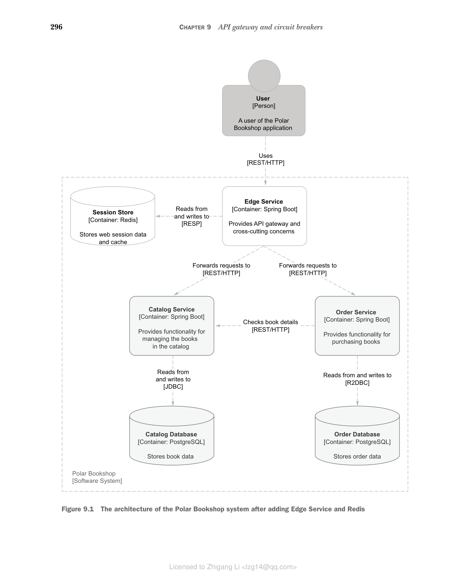

# 第 9 章 API 网关和断路器

本章内容：

* 使用 Spring Cloud Gateway 构建边缘服务
* 使用 Spring Cloud Circuit Breaker 和 Resilience4J 实现容错
* 使用 Spring Cloud Gateway 和 Redis 实现请求限流
* 使用 Redis 进行分布式会话管理
* 使用 Kubernetes Ingress 管理外部访问

在前面的章节中，我们构建了 Catalog Service 和 Order Service，它们是 Polar Bookshop 系统的核心服务。这些服务提供了 RESTful API，可以被客户端直接调用。然而，在生产环境中，直接暴露内部服务给外部客户端是不安全的，也是不推荐的。

本章将介绍如何使用 Spring Cloud Gateway 构建一个边缘服务（Edge Service），作为系统的统一入口点。边缘服务可以处理跨切面关注点，如安全、监控、容错和限流，同时将请求路由到内部服务。

**图 9.1 添加 Edge Service 和 Redis 后的 Polar Bookshop 系统架构**
