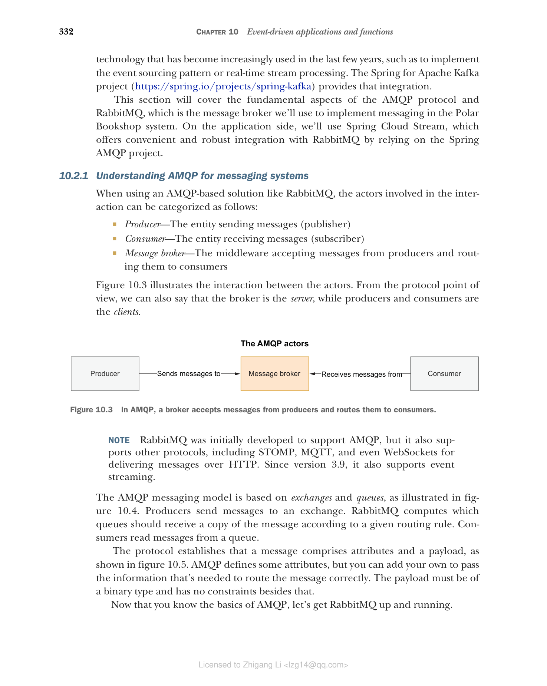
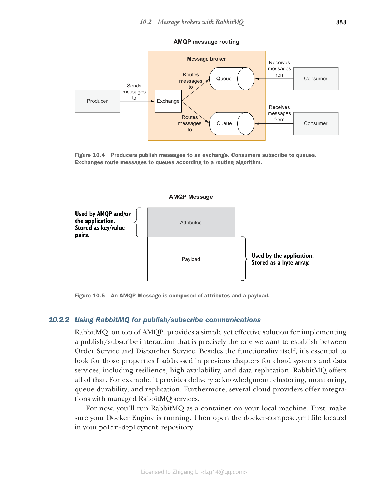

## 10.2 使用 RabbitMQ 的消息代理

消息系统需要两个主要组件：消息代理和协议。高级消息队列协议（AMQP）确保跨平台的互操作性和可靠的消息传递。它在现代架构中得到了广泛使用，并且非常适合云环境，因为我们需要弹性、松散耦合和可扩展性。RabbitMQ 是一个流行的开源消息代理，它依赖于 AMQP 并提供灵活的异步消息传递、分布式部署和监控。最新版本的 RabbitMQ 还引入了事件流功能。

Spring 为最常用的消息传递解决方案提供了广泛的支持。Spring Framework 本身内置了对 Java 消息服务（JMS）API 的支持。Spring AMQP 项目（[https://spring.io/projects/spring-amqp](https://spring.io/projects/spring-amqp)）增加了对此消息传递协议的支持，并提供了与 RabbitMQ 的集成。Apache Kafka 是另一个在过去几年中越来越流行的技术，用于实现事件溯源模式或实时流处理。Spring for Apache Kafka 项目（[https://spring.io/projects/spring-kafka](https://spring.io/projects/spring-kafka)）提供了该集成。

本节将介绍 AMQP 协议和 RabbitMQ 的基本方面，RabbitMQ 是我们将用于在 Polar Bookshop 系统中实现消息传递的消息代理。在应用端，我们将使用 Spring Cloud Stream，它通过依赖 Spring AMQP 项目提供了与 RabbitMQ 的便捷且强大的集成。

### 10.2.1 理解消息系统的 AMQP

当使用基于 AMQP 的解决方案（如 RabbitMQ）时，交互中涉及的参与者可以分类如下：

* **生产者（Producer）** — 发送消息的实体（发布者）
* **消费者（Consumer）** — 接收消息的实体（订阅者）
* **消息代理（Message broker）** — 接受来自生产者的消息并将其路由到消费者的中间件

图 10.3 说明了参与者之间的交互。从协议的角度来看，我们也可以说代理是服务器，而生产者和消费者是客户端。


**图 10.3 在 AMQP 中，代理接受来自生产者的消息并将其路由到消费者**

> **注意** RabbitMQ 最初是为了支持 AMQP 而开发的，但它也支持其他协议，包括 STOMP、MQTT，甚至支持通过 HTTP 传递消息的 WebSockets。从版本 3.9 开始，它还支持事件流。

AMQP 消息模型基于交换机（exchanges）和队列（queues），如图 10.4 所示。生产者将消息发送到交换机。RabbitMQ 根据给定的路由规则计算哪些队列应接收消息的副本。消费者从队列中读取消息。

协议规定消息由属性（attributes）和有效负载（payload）组成，如图 10.5 所示。AMQP 定义了一些属性，但您可以添加自己的属性以传递正确路由消息所需的信息。有效负载必须是二进制类型，除了这一点之外没有其他约束。

现在您已经了解了 AMQP 的基础知识，让我们启动并运行 RabbitMQ。


**图 10.4 生产者将消息发布到交换机。消费者订阅队列。交换机根据路由算法将消息路由到队列**


**图 10.5 AMQP 消息由属性和有效负载组成**

### 10.2.2 使用 RabbitMQ 进行发布/订阅通信

RabbitMQ 在 AMQP 之上提供了一个简单而有效的解决方案，用于实现发布/订阅交互，这正是我们想要在 Order Service 和 Dispatcher Service 之间建立的交互。除了功能本身之外，查看我在前面章节中讨论的云系统和数据服务的属性也很重要，包括弹性、高可用性和数据复制。RabbitMQ 提供了所有这些功能。例如，它提供投递确认、集群、监控、队列持久性和复制。此外， several 云提供商提供与托管 RabbitMQ 服务的集成。

目前，您将在本地计算机上以容器形式运行 RabbitMQ。首先，确保您的 Docker 引擎正在运行。然后打开位于 polar-deployment 仓库中的 docker-compose.yml 文件。

> **注意** 如果您没有跟随示例，可以使用本书附带源代码中的 Chapter10/10-begin/polar-deployment/docker/docker-compose.yml 作为起点。

在 docker-compose.yml 文件中，添加一个新的服务定义，使用 RabbitMQ 官方镜像（包括管理插件），并通过端口 5672（用于 AMQP）和 15672（用于管理控制台）暴露它。RabbitMQ 管理插件便于从基于浏览器的 UI 检查交换机和队列。

**清单 10.1 定义 RabbitMQ 容器**

```yaml
version: "3.8"

services:
 ... 
 polar-rabbitmq:
 image: rabbitmq:3.10-management
 # 启用了管理插件的官方 RabbitMQ 镜像
 container_name: polar-rabbitmq
 ports:
 - 5672:5672
 # RabbitMQ 监听 AMQP 请求的端口
 - 15672:15672
 # 暴露管理 GUI 的端口
 volumes:
 - ./rabbitmq/rabbitmq.conf:/etc/rabbitmq/rabbitmq.conf
 # 配置文件作为卷挂载
```

配置基于作为卷挂载的文件，类似于我们配置 PostgreSQL 的方式。在 polar-deployment 仓库中创建一个 docker/rabbitmq 文件夹，并添加一个新的 rabbitmq.conf 文件来配置默认帐户。

**清单 10.2 配置 RabbitMQ 默认帐户**

```
default_user = user
default_pass = password
```

接下来，打开终端窗口，导航到 docker-compose.yml 文件所在的文件夹，然后运行以下命令启动 RabbitMQ：

```bash
$ docker-compose up -d polar-rabbitmq
```

最后，打开浏览器窗口并导航到 [http://localhost:15672](http://localhost:15672) 以访问 RabbitMQ 管理控制台。使用我们在配置文件中定义的凭据（user/password）登录并四处查看。在接下来的部分中，您将能够在管理控制台的 Exchanges 和 Queues 区域中跟踪 Order Service 和 Dispatcher Service 之间的消息流。

探索完 RabbitMQ 管理控制台后，您可以按以下方式关闭它：

```bash
$ docker-compose down
```

Spring Cloud Stream 帮助将应用程序与 RabbitMQ 等事件代理无缝集成。但在我们开始之前，我们需要定义处理消息的逻辑。在下一节中，您将了解 Spring Cloud Function 以及如何以供应商、函数和消费者的形式实现新订单流程的业务逻辑。
