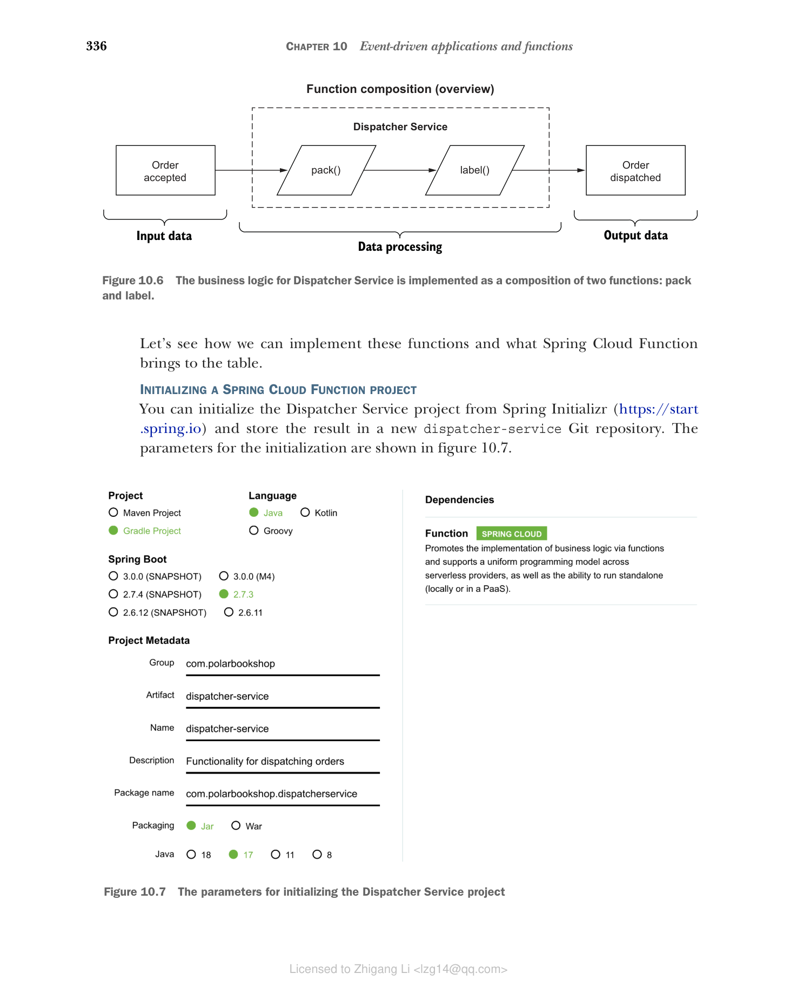
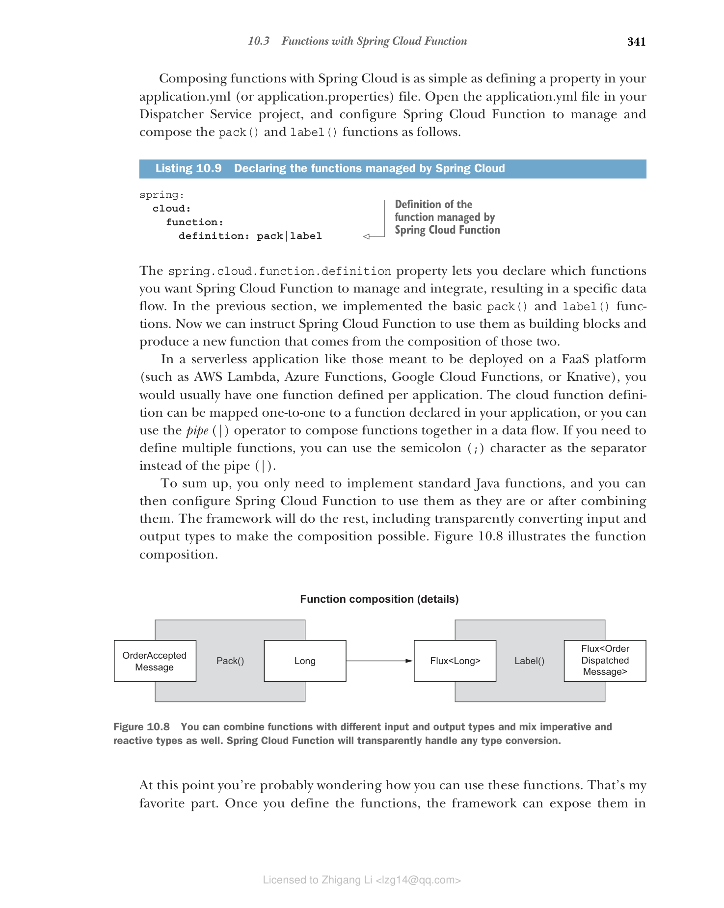

## 10.3 使用 Spring Cloud Function 实现函数

Spring Cloud Function 和 Spring Cloud Stream 的项目负责人 Oleg Zhurakousky 经常在会议上问观众这个问题：是否有任何业务功能您无法以供应商、函数和消费者的形式定义？这是一个有趣且具有挑战性的问题。您能想到什么吗？大多数软件需求都可以用函数来表达。

为什么首先使用函数？它们是一种简单、统一且可移植的编程模型，非常适合事件驱动架构，这些架构本质上基于这些概念。

Spring Cloud Function 通过基于 Java 8 引入的标准接口（Supplier、Function 和 Consumer）促进通过函数实现业务逻辑。

* **Supplier（供应商）** — 供应商是只有输出没有输入的函数。它也被称为生产者、发布者或源。
* **Function（函数）** — 函数既有输入又有输出。它也被称为处理器。
* **Consumer（消费者）** — 消费者是有输入但没有输出的函数。它也被称为接收器或接收器。

在本节中，您将了解 Spring Cloud Function 的工作原理以及如何通过函数实现业务逻辑。

### 10.3.1 在 Spring Cloud Function 中使用函数式范式

让我们从函数开始，考虑我之前为 Dispatcher Service 应用程序列出的业务需求。每当订单被接受时，Dispatcher Service 应负责打包和标记订单，并在订单被调度后通知相关方（在本例中为 Order Service）。为简单起见，让我们假设打包和标记操作都由应用程序本身执行，我们将在考虑框架之前考虑如何通过函数实现业务逻辑。

调度订单时要执行的两个操作可以用函数表示：

* `pack` 函数接受已接受订单的标识符作为输入，打包订单（在示例中，处理由日志消息表示），并返回订单标识符作为输出，准备进行标记。
* `label` 函数接受已打包订单的标识符作为输入，标记订单（在示例中，处理由日志消息表示），并返回订单标识符作为输出，完成调度。

这两个函数的顺序组合给出了 Dispatcher Service 业务逻辑的完整实现，如图 10.6 所示。


**图 10.6 Dispatcher Service 的业务逻辑作为两个函数的组合实现：pack 和 label**

让我们看看如何实现这些函数以及 Spring Cloud Function 带来了什么。

#### 初始化 Spring Cloud Function 项目

您可以从 Spring Initializr（https://start.spring.io）初始化 Dispatcher Service 项目，并将结果存储在新的 dispatcher-service Git 仓库中。初始化参数如图 10.7 所示。


**图 10.7 初始化 Dispatcher Service 项目的参数**

> **提示** 在本章的 begin 文件夹中，您可以找到一个 curl 命令，可以在终端窗口中运行。它下载一个 zip 文件，其中包含您开始所需的所有代码，无需在 Spring Initializr 网站上进行手动生成。

生成的 build.gradle 文件的依赖部分如下所示：

```groovy
dependencies {
 implementation 'org.springframework.boot:spring-boot-starter'
 implementation 'org.springframework.cloud:spring-cloud-function-context'
 testImplementation 'org.springframework.boot:spring-boot-starter-test'
}
```

主要依赖是：

* **Spring Boot** (`org.springframework.boot:spring-boot-starter`) — 提供基本的 Spring Boot 库和自动配置。
* **Spring Cloud Function** (`org.springframework.cloud:spring-cloud-function-context`) — 提供促进和支持通过函数实现业务逻辑的 Spring Cloud Function 库。
* **Spring Boot Test** (`org.springframework.boot:spring-boot-starter-test`) — 提供多个用于测试应用程序的库和工具，包括 Spring Test、JUnit、AssertJ 和 Mockito。它会自动包含在每个 Spring Boot 项目中。

接下来，将自动生成的 application.properties 文件重命名为 application.yml，并配置服务器端口和应用程序名称。目前，该应用程序不包含 Web 服务器。但是，我们仍将配置服务器端口号，因为当我们在第 13 章中向应用程序添加监控功能时将使用它。

**清单 10.3 配置服务器和应用程序名称**

```yaml
server:
 port: 9003
 # 嵌入式 Web 服务器将使用的端口
spring:
 application:
 name: dispatcher-service
 # 应用程序的名称
```

接下来，让我们看看如何使用函数实现业务逻辑。

#### 通过函数实现业务逻辑

业务逻辑可以使用 Java Function 接口以标准方式实现。不需要 Spring。

让我们首先考虑 `pack` 函数。函数的输入应提供先前已接受的订单的标识符。我们可以通过一个简单的 DTO 来建模此数据。

在 `com.polarbookshop.dispatcherservice` 包中，创建一个 `OrderAcceptedMessage` record 来保存订单标识符。

**清单 10.4 表示订单被接受事件的 DTO**

```java
package com.polarbookshop.dispatcherservice;

public record OrderAcceptedMessage (
 Long orderId
){}
// 包含订单标识符（作为 Long 字段）的 DTO
```

> **注意** 对事件建模是一个超越 Spring 的迷人主题，需要几章才能正确涵盖。如果您想了解更多关于此主题的信息，我建议阅读 Martin Fowler 的这些文章："Focusing on Events"（https://martinfowler.com/eaaDev/EventNarrative.html）；"Domain Event"（https://martinfowler.com/eaaDev/DomainEvent.html）；以及 "What do you mean by `Event-Driven'?"（https://martinfowler.com/articles/201701-event-driven.html），均位于他的 MartinFowler.com 博客上。

函数的输出可以是打包订单的简单标识符，表示为 Long 对象。

现在输入和输出都很清楚了，是时候定义函数了。创建一个新的 `DispatchingFunctions` 类，并添加一个 `pack()` 方法来将订单打包实现为函数。

**清单 10.5 将 "pack" 操作实现为函数**

```java
package com.polarbookshop.dispatcherservice;

import java.util.function.Function;
import org.slf4j.Logger;
import org.slf4j.LoggerFactory;

public class DispatchingFunctions {
 private static final Logger log = LoggerFactory.getLogger(DispatchingFunctions.class);

 public Function<OrderAcceptedMessage, Long> pack() {
 // 实现订单打包业务逻辑的函数
 return orderAcceptedMessage -> {
 log.info("The order with id {} is packed.", orderAcceptedMessage.orderId());
 // 它接受 OrderAcceptedMessage 对象作为输入
 return orderAcceptedMessage.orderId();
 // 返回订单标识符（Long）作为输出
 };
 }
}
```

您可以看到这个清单中只有标准的 Java 代码。我努力在本书中提供现实世界的示例，所以您可能想知道这里发生了什么。在这种情况下，我决定专注于在事件驱动应用程序上下文中使用函数式编程范式的基本方面。在函数内部，您可以添加任何您喜欢的处理逻辑。这里重要的是函数提供的契约，它的签名：输入和输出。定义该契约后，您可以根据需要自由实现函数。我可以提供更现实的实现，但考虑到本章的目标，它不会增加任何有价值的内容。它甚至不需要是基于 Spring 的代码。在这个示例中，它不是：它是纯 Java 代码。

Spring Cloud Function 能够管理以不同方式定义的函数，只要它们遵循标准 Java 接口 `Function`、`Supplier` 和 `Consumer`。您可以通过将函数注册为 Bean 来使 Spring Cloud Function 知道您的函数。通过将 `DispatchingFunctions` 类注解为 `@Configuration` 并将方法注解为 `@Bean`，为 `pack()` 函数执行此操作。

**清单 10.6 将函数配置为 Bean**

```java
@Configuration
public class DispatchingFunctions {
 // 函数在配置类中定义
 private static final Logger log = LoggerFactory.getLogger(DispatchingFunctions.class);

 @Bean
 public Function<OrderAcceptedMessage, Long> pack() {
 // 定义为 Bean 的函数可以被 Spring Cloud Function 发现和管理
 return orderAcceptedMessage -> {
 log.info("The order with id {} is packed.", orderAcceptedMessage.orderId());
 return orderAcceptedMessage.orderId();
 };
 }
}
```

正如您稍后将看到的，注册为 Bean 的函数会被 Spring Cloud Function 框架增强，具有额外的功能。这样做的好处是业务逻辑本身不知道周围的框架。您可以独立地演进和测试它，而无需担心与框架相关的问题。

#### 使用命令式和响应式函数

Spring Cloud Function 支持命令式和响应式代码，因此您可以自由地使用响应式 API（如 `Mono` 和 `Flux`）来实现函数。您也可以混合使用。为了示例的目的，让我们使用 Project Reactor 实现 `label` 函数。函数的输入将是已打包订单的标识符，表示为 Long 对象。函数的输出将是已标记订单的标识符，导致调度过程完成。我们可以通过一个简单的 DTO 来建模此类数据，就像我们对 OrderAcceptedMessage 所做的那样。

在 `com.polarbookshop.dispatcherservice` 包中，创建一个 `OrderDispatchedMessage` record 来保存已调度订单的标识符。

**清单 10.7 表示订单被调度事件的 DTO**

```java
package com.polarbookshop.dispatcherservice;
public record OrderDispatchedMessage (
 Long orderId
){}
// 包含订单标识符（作为 Long 字段）的 DTO
```

现在输入和输出都很清楚了，是时候定义函数了。打开 `DispatchingFunctions` 类并添加一个 `label()` 方法来将订单标记实现为函数。由于我们希望它是响应式的，输入和输出都包装在 `Flux` 发布者中。

**清单 10.8 将 "label" 操作实现为函数**

```java
package com.polarbookshop.dispatcherservice;

import java.util.function.Function;
import org.slf4j.Logger;
import org.slf4j.LoggerFactory;
import reactor.core.publisher.Flux;
import org.springframework.context.annotation.Bean;
import org.springframework.context.annotation.Configuration;

@Configuration
public class DispatchingFunctions {
 private static final Logger log = LoggerFactory.getLogger(DispatchingFunctions.class);

 // ...

 @Bean
 public Function<Flux<Long>, Flux<OrderDispatchedMessage>> label() {
 // 实现订单标记业务逻辑的函数
 return orderFlux -> orderFlux.map(orderId -> {
 log.info("The order with id {} is labeled.", orderId);
 // 它接受订单标识符（Long）作为输入
 return new OrderDispatchedMessage(orderId);
 // 返回 OrderDispatchedMessage 作为输出
 });
 }
}
```

我们刚刚实现了这两个函数，所以让我们看看如何组合和使用它们。

### 10.3.2 组合和集成函数：REST、无服务器、数据流

Dispatcher Service 业务逻辑的实现几乎完成了。我们仍然需要一种方法来组合这两个函数。根据我们的需求，调度订单包括两个按顺序执行的步骤：首先是 `pack()`，然后是 `label()`。

Java 提供了使用 `andThen()` 或 `compose()` 运算符按顺序组合 `Function` 对象的功能。问题是您只能在第一个函数的输出类型与第二个函数的输入类型相同时使用它们。Spring Cloud Function 提供了该问题的解决方案，并允许您通过透明的类型转换无缝地组合函数，甚至可以在命令式和响应式函数之间进行组合，就像我们之前定义的那样。

使用 Spring Cloud 组合函数就像在 application.yml（或 application.properties）文件中定义属性一样简单。在 Dispatcher Service 项目中打开 application.yml 文件，并按如下所示配置 Spring Cloud Function 来管理和组合 `pack()` 和 `label()` 函数。

**清单 10.9 声明 Spring Cloud 管理的函数**

```yaml
spring:
 cloud:
 function:
 definition: pack|label
 # Spring Cloud Function 管理的函数定义
```

`spring.cloud.function.definition` 属性允许您声明要让 Spring Cloud Function 管理和集成的函数，从而产生特定的数据流。在上一节中，我们实现了基本的 `pack()` 和 `label()` 函数。现在我们可以指示 Spring Cloud Function 将它们用作构建块，并生成一个由这两个函数组合而成的新函数。

在无服务器应用程序中，如那些旨在部署在 FaaS 平台（如 AWS Lambda、Azure Functions、Google Cloud Functions 或 Knative）上的应用程序，您通常每个应用程序定义一个函数。云函数定义可以一对一地映射到应用程序中声明的函数，或者您可以使用管道（`|`）运算符将函数组合成数据流。如果需要定义多个函数，可以使用分号（`;`）字符作为分隔符，而不是管道（`|`）。

总而言之，您只需要实现标准 Java 函数，然后您可以配置 Spring Cloud Function 来使用它们，或者在组合后使用它们。框架将完成其余工作，包括透明地转换输入和输出类型以使组合成为可能。图 10.8 说明了函数组合。


**图 10.8 您可以组合具有不同输入和输出类型的函数，也可以混合命令式和响应式类型。Spring Cloud Function 将透明地处理任何类型转换**

此时您可能想知道如何使用这些函数。这是我最喜欢的部分。一旦您定义了函数，框架就可以根据您的需要以不同的方式公开它们。例如，Spring Cloud Function 可以自动将 `spring.cloud.function.definition` 中定义的函数公开为 REST 端点。然后您可以直接打包应用程序，将其部署到 Knative 等 FaaS 平台，瞧：您已经拥有了第一个无服务器 Spring Boot 应用程序。我们将在第 16 章构建无服务器应用程序时这样做。或者您可以使用框架提供的适配器之一来打包应用程序并将其部署到 AWS Lambda、Azure Functions 或 Google Cloud Functions。或者您可以将其与 Spring Cloud Stream 结合使用，并将函数绑定到 RabbitMQ 或 Kafka 等事件代理中的消息通道。

在我们探索使用 Spring Cloud Stream 与 RabbitMQ 的集成之前，我想向您展示如何独立测试函数及其组合。一旦业务逻辑被实现为函数并经过测试，我们可以确信无论它是由 REST 端点还是事件通知触发的，它都会以相同的方式工作。

### 10.3.3 使用 @FunctionalSpringBootTest 编写集成测试

使用函数式编程范式，我们可以在标准 Java 中实现业务逻辑，并使用 JUnit 编写单元测试，而不受框架的影响。在该级别没有 Spring 代码，只有纯 Java。一旦您确保每个函数都能正常工作，您将希望编写一些集成测试，以验证当函数由 Spring Cloud Function 处理并按您配置的方式公开时，应用程序的整体行为。

Spring Cloud Function 提供了 `@FunctionalSpringBootTest` 注解，您可以使用它来设置集成测试的上下文。与单元测试不同，您不想直接调用函数，而是要求框架为您提供该函数。框架管理的所有函数都可以通过 `FunctionCatalog` 获得，这是一个充当函数注册表的对象。当框架提供函数时，它不仅包含您编写的实现；它被 Spring Cloud Function 提供的额外功能增强，如透明的类型转换和函数组合。让我们看看这是如何工作的。

首先，您需要在 build.gradle 文件中添加对 Reactor Test 的测试依赖，因为部分业务逻辑是使用 Reactor 实现的。添加新依赖后，请记住刷新或重新导入 Gradle 依赖。

**清单 10.10 在 Dispatcher Service 中添加 Reactor Test 依赖**

```groovy
dependencies {
 ...
 testImplementation 'io.projectreactor:reactor-test'
}
```

然后，在 Dispatcher Service 项目的 src/test/java 文件夹中，创建一个新的 `DispatchingFunctionsIntegrationTests` 类。您可以为这两个函数分别编写集成测试，但更有趣的是验证组合函数（`pack()` + `label()`）的行为，如 Spring Cloud Function 所提供的。

**清单 10.11 函数组合的集成测试**

```java
package com.polarbookshop.dispatcherservice;

import java.util.function.Function;
import org.junit.jupiter.api.Test;
import reactor.core.publisher.Flux;
import reactor.test.StepVerifier;
import org.springframework.beans.factory.annotation.Autowired;
import org.springframework.cloud.function.context.FunctionCatalog;
import org.springframework.cloud.function.context.test.FunctionalSpringBootTest;

@FunctionalSpringBootTest
class DispatchingFunctionsIntegrationTests {

 @Autowired
 private FunctionCatalog catalog;

 @Test
 void packAndLabelOrder() {
 Function<OrderAcceptedMessage, Flux<OrderDispatchedMessage>> packAndLabel = 
 catalog.lookup(Function.class, "pack|label");
 // 从 FunctionCatalog 获取组合函数
 
 long orderId = 121;
 // 定义 OrderAcceptedMessage，这是函数的输入

 StepVerifier.create(packAndLabel.apply(new OrderAcceptedMessage(orderId)))
 .expectNextMatches(dispatchedOrder -> 
 // 断言函数的输出是预期的 OrderDispatchedMessage 对象
 dispatchedOrder.equals(new OrderDispatchedMessage(orderId)))
 .verifyComplete();
 }
}
```

最后，打开终端窗口，导航到 Dispatcher Service 项目根文件夹，然后运行测试：

```bash
$ ./gradlew test --tests DispatchingFunctionsIntegrationTests
```

这种类型的集成测试确保定义的云函数的正确行为，独立于它将如何公开。在本书附带的源代码中，您将找到更广泛的自动测试（Chapter10/10-intermediate/dispatcherservice）。

函数是一种简单而有效的方式来实现业务逻辑，并将基础设施关注点委托给框架。在下一节中，您将学习如何使用 Spring Cloud Stream 将函数绑定到 RabbitMQ 上的消息通道。
