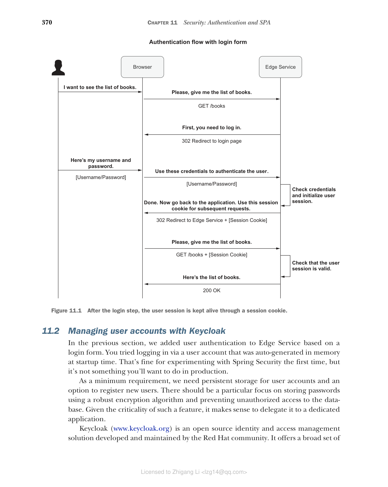

## 11.1 理解 Spring Security 基础知识

Spring Security（https://spring.io/projects/spring-security）是保护 Spring 应用程序安全的事实标准，支持命令式和响应式技术栈。它提供身份验证和授权功能，以及针对最常见的攻击的保护。

该框架通过依赖过滤器来提供其主要功能。让我们考虑一个向 Spring Boot 应用程序添加身份验证的可能需求。用户应该能够通过登录表单使用用户名和密码进行身份验证。当我们配置 Spring Security 启用此功能时，框架会添加一个过滤器来拦截任何传入的 HTTP 请求。如果用户已经过身份验证，它会将请求发送到给定的 Web 处理程序（如 `@RestController` 类）进行处理。如果用户未通过身份验证，它会将用户转发到登录页面并提示输入用户名和密码。

> **注意** 在命令式 Spring 应用程序中，过滤器实现为 `Servlet Filter` 类。在响应式应用程序中，使用 `WebFilter` 类。

大多数 Spring Security 功能在启用时都通过过滤器处理。框架建立了一个过滤器链，按照明确定义且合理的顺序执行。例如，处理身份验证的过滤器在检查授权的过滤器之前运行，因为我们无法在知道用户身份之前验证其权限。

让我们从一个基本示例开始，以更好地理解 Spring Security 的工作原理。我们要向 Polar Bookshop 系统添加身份验证。由于 Edge Service 是入口点，因此在那里处理安全性等横切关注点是有意义的。用户应该能够通过登录表单使用用户名和密码进行身份验证。

首先，在 Edge Service 项目的 build.gradle 文件中添加对 Spring Security 的新依赖。添加新依赖后，请记住刷新或重新导入 Gradle 依赖。

**清单 11.1 在 Edge Service 中添加 Spring Security 依赖**

```groovy
dependencies {
 ...
 implementation 'org.springframework.boot:spring-boot-starter-security'
}
```

在 Spring Security 中定义和配置安全策略的中心位置是 `SecurityWebFilterChain` Bean。该对象告诉框架应该启用哪些过滤器。您可以通过 `ServerHttpSecurity` 提供的 DSL 来构建 `SecurityWebFilterChain` Bean。

目前，我们希望满足以下要求：

* Edge Service 暴露的所有端点都必须要求用户身份验证。
* 身份验证必须通过登录表单页面进行。

为了收集与安全性相关的所有配置，请在新的 `SecurityConfig` 类（`com.polarbookshop.edgeservice.config` 包）中创建一个 `SecurityWebFilterChain` Bean：

```java
@Bean
// SecurityWebFilterChain Bean 用于定义和配置应用程序的安全策略
SecurityWebFilterChain springSecurityFilterChain(
 ServerHttpSecurity http
) {}
```

由 Spring 自动装配的 `ServerHttpSecurity` 对象提供了用于配置 Spring Security 和构建 `SecurityWebFilterChain` Bean 的便捷 DSL。通过 `authorizeExchange()`，您可以为任何请求（在响应式 Spring 中称为 exchange）定义访问策略。在本例中，我们希望所有请求都要求身份验证（`authenticated()`）：

```java
@Bean
SecurityWebFilterChain springSecurityFilterChain(ServerHttpSecurity http) {
 return http
 .authorizeExchange(exchange ->
 exchange.anyExchange().authenticated())
 .build();
}
// 所有请求都需要身份验证
```

Spring Security 提供了几种身份验证策略，包括 HTTP Basic、登录表单、SAML 和 OpenID Connect。在本例中，我们要使用登录表单策略，可以通过 `ServerHttpSecurity` 对象公开的 `formLogin()` 方法启用。我们将使用默认配置（通过 Spring Security Customizer 接口提供），其中包括框架开箱即用的登录页面，以及在请求未通过身份验证时自动重定向到该页面：

```java
@Bean
SecurityWebFilterChain springSecurityFilterChain(ServerHttpSecurity http) {
 return http
 .authorizeExchange(exchange -> exchange.anyExchange().authenticated())
 .formLogin(Customizer.withDefaults())
 .build();
}
// 启用通过登录表单进行用户身份验证
```

接下来，使用 `@EnableWebFluxSecurity` 注解 `SecurityConfig` 类以启用 Spring Security WebFlux 支持。最终的安全配置如下所示。

**清单 11.2 要求所有端点通过登录表单进行身份验证**

```java
package com.polarbookshop.edgeservice.config;

import org.springframework.context.annotation.Bean;
import org.springframework.security.config.Customizer;
import org.springframework.security.config.annotation.web.reactive.EnableWebFluxSecurity;
import org.springframework.security.config.web.server.ServerHttpSecurity;
import org.springframework.security.web.server.SecurityWebFilterChain;

@EnableWebFluxSecurity
public class SecurityConfig {

 @Bean
 SecurityWebFilterChain springSecurityFilterChain(
 ServerHttpSecurity http) {
 return http
 .authorizeExchange(exchange ->
 exchange.anyExchange().authenticated())
 .formLogin(Customizer.withDefaults())
 .build();
 }
}
// 所有请求都需要身份验证
// 启用通过登录表单进行用户身份验证
```

让我们验证它是否正常工作。首先，启动 Edge Service 所需的 Redis 容器。打开终端窗口，导航到保存 Docker Compose 文件的文件夹（polar-deployment/docker/docker-compose.yml），然后运行以下命令：

```bash
$ docker-compose up -d polar-redis
```

然后运行 Edge Service 应用程序（`./gradlew bootRun`），打开浏览器窗口并访问 http://localhost:9000/books。您应该会被重定向到 Spring Security 提供的登录页面，您可以在其中进行身份验证。

等等！我们如何在系统中没有定义用户的情况下进行身份验证？默认情况下，Spring Security 在内存中定义了一个用户帐户，用户名为 `user`，密码是随机生成的，并打印在应用程序日志中。您应该查找如下所示的日志条目：

```
Using generated security password: ee60bdf6-fb82-439a-8ed0-8eb9d47bae08
```

您可以使用 Spring Security 创建的预定义用户帐户进行身份验证。成功身份验证后，您将被重定向到 `/books` 端点。由于 Catalog Service 已关闭，并且 Edge Service 有一个回退方法在查询书籍时返回空列表（在第 9 章中实现），您将看到一个空白页面。这是预期的。

> **注意** 我建议您从现在开始每次测试应用程序时都打开一个新的隐身浏览器窗口。由于您将尝试不同的安全场景，隐身模式将防止您遇到与先前会话的浏览器缓存和 cookie 相关的问题。

此测试的关键点是用户尝试访问 Edge Service 暴露的受保护端点。应用程序将用户重定向到登录页面，显示登录表单，并要求用户提供用户名和密码。然后 Edge Service 根据其内部用户数据库（在内存中自动生成）验证凭据，并在发现凭据有效后，与浏览器启动经过身份验证的会话。由于 HTTP 是无状态协议，因此用户会话通过 cookie 保持活动状态，其值由浏览器随每个 HTTP 请求提供（会话 cookie）。在内部，Edge Service 维护会话标识符和用户标识符之间的映射，如图 11.1 所示。


**图 11.1 登录步骤后，用户会话通过会话 cookie 保持活动状态**

测试完应用程序后，使用 Ctrl-C 终止进程。然后导航到保存 Docker Compose 文件的文件夹（polar-deployment/docker/docker-compose.yml），并运行以下命令停止 Redis 容器：

```bash
$ docker-compose down
```

当应用于云原生系统时，前面的方法存在一些问题。在本章的其余部分，我们将分析这些问题，为云原生应用程序识别可行的解决方案，并在我们刚刚实现的基础上使用它们。
