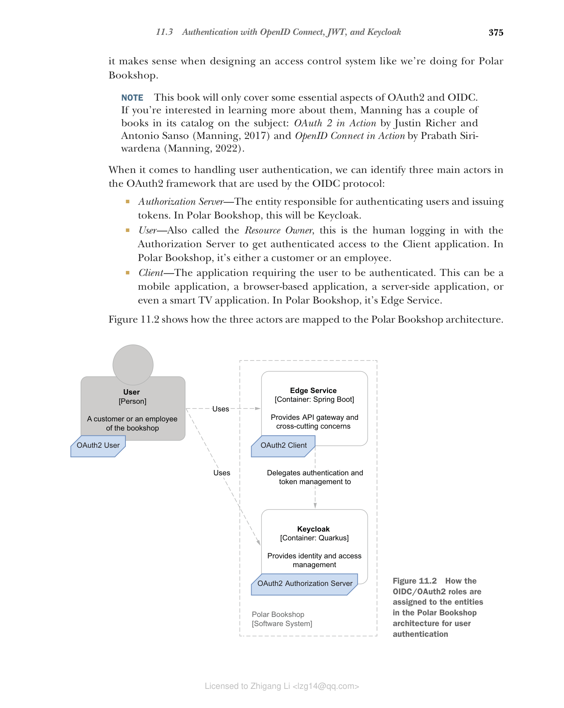
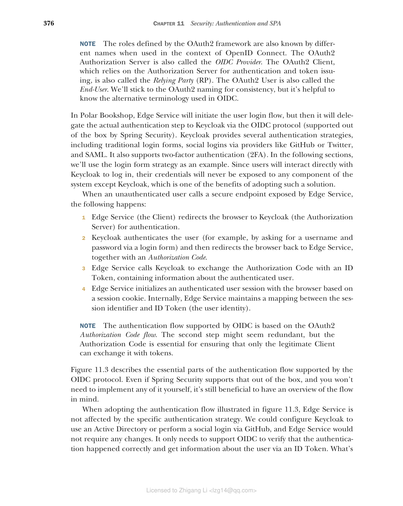

## 11.3 使用 OpenID Connect、JWT 和 Keycloak 进行身份验证

目前，用户必须通过浏览器使用用户名和密码登录。由于 Keycloak 现在管理用户帐户，我们可以继续更新 Edge Service 以使用 Keycloak 本身检查用户凭据，而不是使用其内部存储。但是，如果我们向 Polar Bookshop 系统引入不同的客户端（如移动应用程序和 IoT 设备）会怎样？用户应该如何进行身份验证？如果书店员工已经在公司的 Active Directory（AD）中注册，并希望通过 SAML 登录怎么办？我们能否提供跨不同应用程序的单点登录（SSO）体验？用户能否通过其 GitHub 或 Twitter 帐户登录（社交登录）？

我们可以考虑在 Edge Service 中支持所有这些身份验证策略，因为我们获得了新的需求。然而，这不是一种可扩展的方法。更好的解决方案是委托专用的身份提供者按照任何支持的策略对用户进行身份验证。然后 Edge Service 将使用该服务来验证用户的身份，而无需担心执行实际的身份验证步骤。专用服务可以让用户以多种方式进行身份验证，例如使用系统中注册的凭据、通过社交登录或通过 SAML 依赖于公司 AD 中定义的身份。

使用专用服务对用户进行身份验证导致我们需要解决两个方面的问题，系统才能正常工作。首先，我们需要建立一个协议，让 Edge Service 将用户身份验证委托给身份提供者，后者提供有关身份验证结果的信息。其次，我们需要定义一种数据格式，身份提供者可以使用该格式在用户成功通过身份验证后安全地通知 Edge Service 用户的身份。本节将使用 OpenID Connect 和 JSON Web Token 解决这两个问题。

### 11.3.1 使用 OpenID Connect 对用户进行身份验证

OpenID Connect（OIDC）是一种协议，允许应用程序（称为客户端）基于可信方（称为授权服务器）执行的身份验证来验证用户的身份，并检索用户配置文件信息。授权服务器通过 ID Token 告知客户端应用程序身份验证步骤的结果。

OIDC 是建立在 OAuth2 之上的身份层，OAuth2 是一种授权框架，解决了使用令牌委托访问进行授权的问题，但不处理身份验证。如您所知，授权只能在身份验证之后发生。这就是我决定首先介绍 OIDC 的原因；OAuth2 将在下一章中进一步探讨。这不是涵盖这些主题的典型方式，但我认为在设计像我们为 Polar Bookshop 这样的访问控制系统时是有意义的。

> **注意** 本书仅涵盖 OAuth2 和 OIDC 的一些基本方面。如果您有兴趣了解更多相关信息，Manning 的目录中有几本关于该主题的书籍：Justin Richer 和 Antonio Sanso 的《OAuth 2 in Action》（Manning，2017）以及 Prabath Siriwardena 的《OpenID Connect in Action》（Manning，2022）。

在处理用户身份验证时，我们可以在 OAuth2 框架中识别三个主要参与者，OIDC 协议使用这些参与者：

* **授权服务器（Authorization Server）** — 负责对用户进行身份验证和颁发令牌的实体。在 Polar Bookshop 中，这将是 Keycloak。
* **用户（User）** — 也称为资源所有者，这是与授权服务器登录以获得对客户端应用程序的经过身份验证的访问权限的人。在 Polar Bookshop 中，它是客户或员工。
* **客户端（Client）** — 要求用户进行身份验证并请求用户授权代表其访问受保护资源的应用程序。它可以是移动应用程序、基于浏览器的应用程序、服务器端应用程序，甚至是智能电视应用程序。在 Polar Bookshop 中，它是 Edge Service。

图 11.2 显示了这三个参与者如何映射到 Polar Bookshop 架构。


**图 11.2 OIDC/OAuth2 角色如何分配给 Polar Bookshop 架构中的实体以进行用户身份验证**

> **注意** OAuth2 框架定义的角色在 OpenID Connect 上下文中也以不同的名称闻名。OAuth2 授权服务器也称为 OIDC 提供者。依赖授权服务器进行身份验证和令牌颁发的 OAuth2 客户端也称为依赖方（RP）。OAuth2 用户也称为最终用户。为了保持一致性，我们将坚持使用 OAuth2 命名，但了解 OIDC 中使用的替代术语很有帮助。

在 Polar Bookshop 中，Edge Service 将启动用户登录流程，但随后它将通过 OIDC 协议（Spring Security 开箱即用支持）将实际的身份验证步骤委托给 Keycloak。Keycloak 提供了几种身份验证策略，包括传统的登录表单、通过 GitHub 或 Twitter 等提供商的社交登录以及 SAML。它还支持双因素身份验证（2FA）。在以下部分中，我们将使用登录表单策略作为示例。由于用户将直接与 Keycloak 交互以登录，因此他们的凭据永远不会暴露给系统的任何组件，除了 Keycloak，这是采用此解决方案的好处之一。

当未经身份验证的用户调用 Edge Service 暴露的安全端点时，会发生以下情况：

1. Edge Service（客户端）将浏览器重定向到 Keycloak（授权服务器）进行身份验证。
2. Keycloak 对用户进行身份验证（例如，通过登录表单要求输入用户名和密码），然后将浏览器重定向回 Edge Service，同时提供授权码。
3. Edge Service 调用 Keycloak 将授权码交换为 ID Token，其中包含有关经过身份验证的用户的信息。
4. Edge Service 基于会话 cookie 与浏览器建立经过身份验证的用户会话。在内部，Edge Service 维护会话标识符和 ID Token（用户身份）之间的映射。

> **注意** OIDC 支持的身份验证流程基于 OAuth2 授权码流程。第二步可能看起来多余，但授权码对于确保只有合法的客户端才能将其交换为令牌至关重要。

图 11.3 描述了 OIDC 协议支持的身份验证流程的基本部分。即使 Spring Security 开箱即用地支持它，并且您不需要自己实现任何内容，但了解流程概述仍然很有好处。


**图 11.3 OIDC 协议支持的身份验证流程**

采用图 11.3 所示的身份验证流程时，Edge Service 不受特定身份验证策略的影响。我们可以配置 Keycloak 使用 Active Directory 或通过 GitHub 进行社交登录，而 Edge Service 不需要任何更改。它只需要支持 OIDC 来验证身份验证是否正确，并通过 ID Token 获取有关用户的信息。什么是 ID Token？它是一个 JSON Web Token（JWT），包含有关用户身份验证事件的信息。我们将在下一节中更详细地了解 JWT。

> **注意** 每当我提到 OIDC 时，我指的是 OpenID Connect Core 1.0 规范（https://openid.net/specs/openid-connect-core-1_0.html）。每当我提到 OAuth2 时，除非另有说明，我指的是目前正在标准化的 OAuth 2.1 规范（https://oauth.net/2/1），旨在取代 RFC 6749（https://tools.ietf.org/html/rfc6749）中描述的 OAuth 2.0 标准。

### 11.3.2 使用 JWT 交换用户信息

在分布式系统（包括微服务和云原生应用程序）中，最常用的交换有关经过身份验证的用户及其授权信息的策略是通过令牌。

JSON Web Token（JWT）是用于表示要在双方之间传输的声明的行业标准。它是一种广泛使用的格式，用于在分布式系统的不同方之间安全地传播有关经过身份验证的用户及其权限的信息。JWT 本身不被使用，而是包含在更大的结构 JSON Web Signature（JWS）中，后者通过对 JWT 对象进行数字签名来确保声明的完整性。

数字签名的 JWT（JWS）是由三部分组成的字符串，以 Base64 编码并用点（.）字符分隔：

```
<header>.<payload>.<signature>
```

> **注意** 出于调试目的，您可以使用 https://jwt.io 上的工具来编码和解码令牌。

正如您所看到的，数字签名的 JWT 有三个部分：

* **头部（Header）** — 一个 JSON 对象（称为 JOSE 头部），包含有关对有效负载执行的加密操作的信息。操作遵循 Javascript Object Signing and Encryption（JOSE）框架的标准。解码后的头部如下所示：

```json
{
  "alg": "HS256",
  // 用于对令牌进行数字签名的算法
  "typ": "JWT"
  // 令牌的类型
}
```

* **有效负载（Payload）** — 一个 JSON 对象（称为声明集），包含令牌传达的声明。JWT 规范定义了一些标准声明名称，但您也可以定义自己的声明。解码后的有效负载如下所示：

```json
{
  "iss": "https://sso.polarbookshop.com",
  // 颁发 JWT 的实体（颁发者）
  "sub": "isabelle",
  // 作为 JWT 主题的实体（最终用户）
  "exp": 1626439022
  // JWT 过期的时间戳
}
```

* **签名（Signature）** — JWT 的签名，确保声明未被篡改。使用 JWS 结构的先决条件是我们信任颁发令牌的实体（颁发者），并且我们有一种方法来检查其有效性。

当 JWT 需要完整性和机密性时，它首先被签名作为 JWS，然后使用 JSON Web Encryption（JWE）加密。在本书中，我们将仅使用 JWS。

> **注意** 如果您有兴趣了解更多关于 JWT 及其相关方面的信息，可以参考 IETF 标准规范。JSON Web Token（JWT）记录在 RFC 7519（https://tools.ietf.org/html/rfc7519）中，JSON Web Signature（JWS）在 RFC 7515（https://tools.ietf.org/html/rfc7515）中描述，JSON Web Encryption（JWE）在 RFC 7516（https://tools.ietf.org/html/rfc7516）中介绍。您可能还对 JSON Web Algorithms（JWA）感兴趣，它定义了 JWT 的可用加密操作，并在 RFC 7518（https://tools.ietf.org/html/rfc7518）中详细说明。

在 Polar Bookshop 的情况下，Edge Service 可以将身份验证步骤委托给 Keycloak。成功对用户进行身份验证后，Keycloak 将向 Edge Service 发送一个 JWT，其中包含有关新经过身份验证的用户的信息（ID Token）。Edge Service 将通过其签名验证 JWT 并检查它以检索有关用户的数据（声明）。最后，它将基于会话 cookie 与用户的浏览器建立经过身份验证的会话，其标识符映射到 JWT。

为了安全地委托身份验证和检索令牌，Edge Service 必须在 Keycloak 中注册为 OAuth2 客户端。让我们看看怎么做。

### 11.3.3 在 Keycloak 中注册应用程序

正如您在前面的部分中所学到的，OAuth2 客户端是可以请求用户身份验证并最终从授权服务器接收令牌的应用程序。在 Polar Bookshop 架构中，此角色由 Edge Service 扮演。使用 OIDC/OAuth2 时，您需要在使用它对用户进行身份验证之前在授权服务器中注册每个 OAuth2 客户端。

客户端可以是公共的或机密的。如果应用程序无法保密，我们将其注册为公共客户端。例如，移动应用程序将被注册为公共客户端。另一方面，机密客户端是可以保密的那些，它们通常是后端应用程序，如 Edge Service。注册过程类似。主要区别在于机密客户端需要向授权服务器进行身份验证，例如依赖共享密钥。这是我们无法用于公共客户端的额外保护层，因为它们无法安全地存储共享密钥。

由于 Edge Service 将是 Polar Bookshop 系统中的 OAuth2 客户端，让我们在 Keycloak 中注册它。我们可以再次依赖 Keycloak Admin CLI。

确保您之前启动的 Keycloak 容器仍在运行。然后打开终端窗口，在 Keycloak 容器内进入 bash 控制台：

```bash
$ docker exec -it polar-keycloak bash
```

接下来，导航到 Keycloak Admin CLI 脚本所在的文件夹：

```bash
$ cd /opt/keycloak/bin
```

正如您之前学到的，Admin CLI 受我们在 Docker Compose 中为 Keycloak 容器定义的用户名和密码保护，因此在运行任何其他命令之前，我们需要启动一个经过身份验证的会话：

```bash
$ ./kcadm.sh config credentials --server http://localhost:8080 \
  --realm master --user user --password password
```

最后，在 PolarBookshop 领域中将 Edge Service 注册为 OAuth2 客户端：

```bash
# 它必须被启用
# Edge Service 是机密客户端，不是公共的
$ ./kcadm.sh create clients -r PolarBookshop \
  -s clientId=edge-service \
  # OAuth2 客户端标识符
  -s enabled=true \
  -s publicClient=false \
  # 由于它是机密客户端，它需要一个密钥来向 Keycloak 进行身份验证
  -s secret=polar-keycloak-secret \
  -s 'redirectUris=["http://localhost:9000", \
    "http://localhost:9000/login/oauth2/code/*"]'
  # Keycloak 被授权在用户登录或注销后重定向请求的应用程序 URL
```

有效的重定向 URL 是 OAuth2 客户端应用程序（Edge Service）暴露的端点，Keycloak 将把身份验证请求重定向到这些端点。由于 Keycloak 可以在重定向请求中包含敏感信息，因此我们希望限制哪些应用程序和端点有权接收此类信息。正如您稍后将了解到的，身份验证请求的重定向 URL 将是 `http://localhost:9000/login/oauth2/code/*`，遵循 Spring Security 提供的默认格式。为了支持注销操作后的重定向，我们还需要将 `http://localhost:9000` 添加为有效的重定向 URL。

本节到此为止。在本书附带的源代码仓库中，我包含了一个 JSON 文件，您可以在将来启动 Keycloak 容器时使用它来加载整个配置（Chapter11/11-end/polar-deployment/docker/keycloak/realm-config.json）。现在您已经熟悉了 Keycloak，您可以更新容器定义以确保在启动时始终具有所需的配置。将 JSON 文件复制到您自己项目的相同路径，并按如下所示更新 docker-compose.yml 文件中的 `polar-keycloak` 服务。

**清单 11.4 在 Keycloak 容器中导入领域配置**

```yaml
version: "3.8"
services:
  ...
  polar-keycloak:
    image: quay.io/keycloak/keycloak:19.0
    container_name: "polar-keycloak"
    command: start-dev --import-realm
    # 启动时导入提供的配置
    volumes:
      - ./keycloak:/opt/keycloak/data/import
      # 配置卷以将配置文件加载到容器中
    environment:
      - KEYCLOAK_ADMIN=user
      - KEYCLOAK_ADMIN_PASSWORD=password
    ports:
      - 8080:8080
```

在继续之前，让我们停止任何正在运行的容器。打开终端窗口，导航到保存 Docker Compose 文件的文件夹（polar-deployment/docker/docker-compose.yml），然后运行以下命令：

```bash
$ docker-compose down
```

我们现在拥有重构 Edge Service 所需的所有部分，使其可以使用依赖于 OIDC/OAuth2、JWT 和 Keycloak 的身份验证策略。最好的部分是它基于标准，并受到所有主要语言和框架（前端、后端、移动、IoT）的支持，包括 Spring Security。
