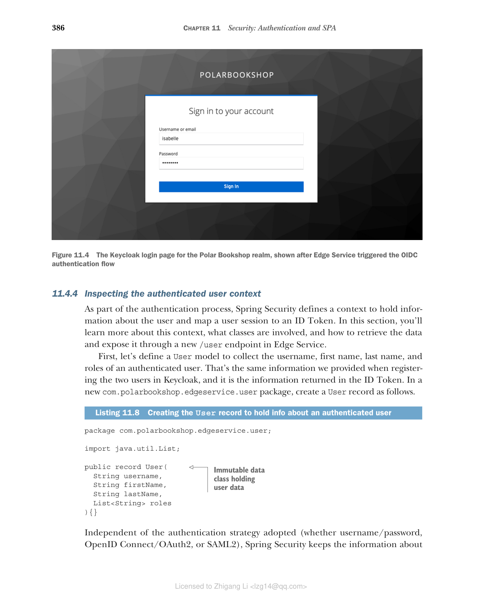
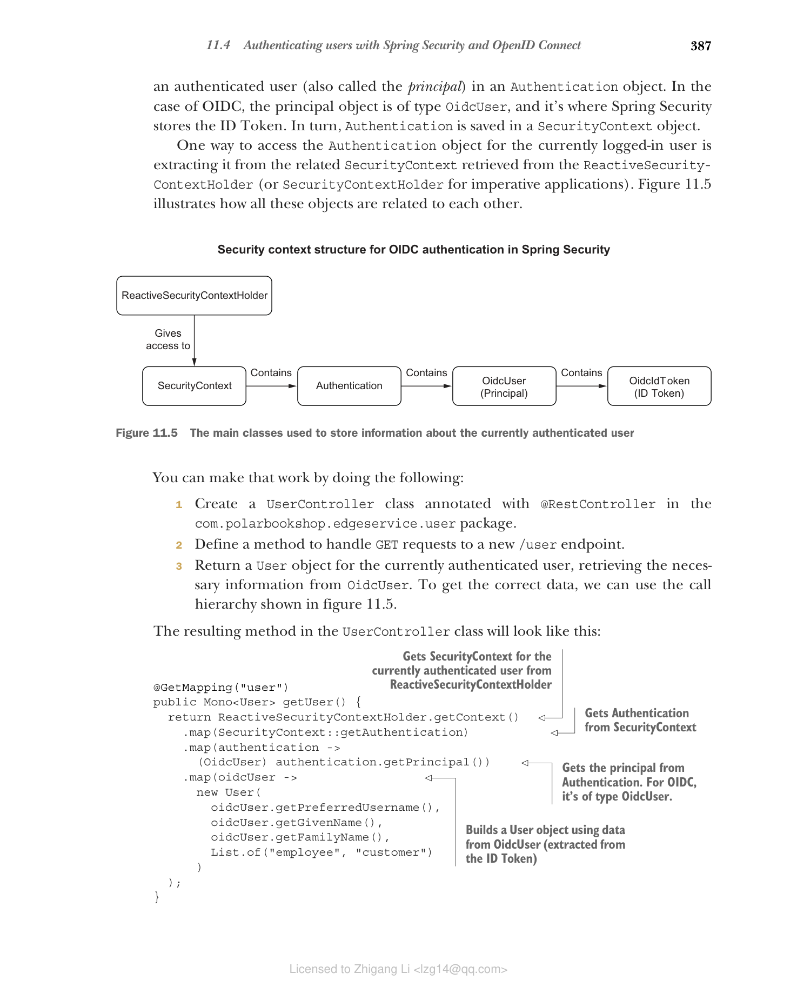
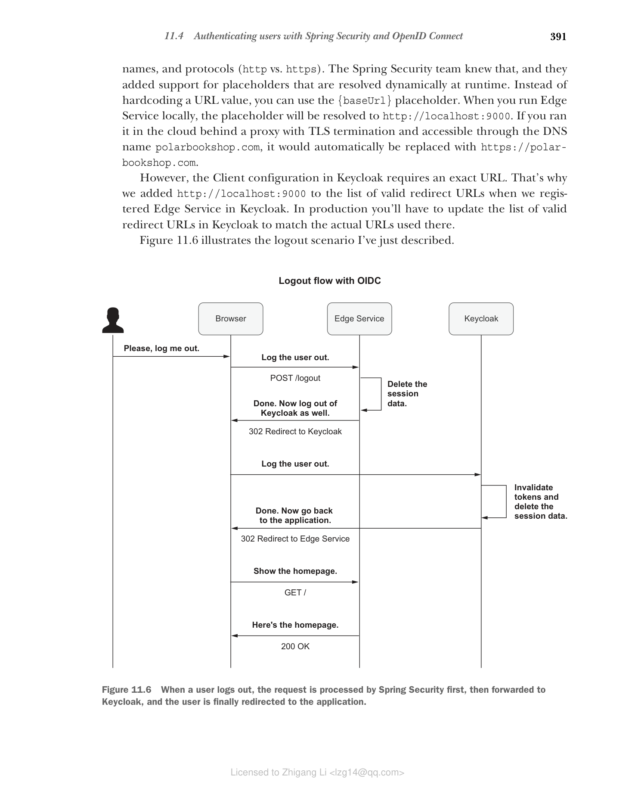

## 11.4 使用 Spring Security 和 OpenID Connect 对用户进行身份验证

如前所述，Spring Security 支持多种身份验证策略。Edge Service 的当前安全设置通过应用程序本身提供的登录表单处理用户帐户和身份验证。既然您已经了解了 OpenID Connect，我们可以重构应用程序以通过 OIDC 协议将用户身份验证委托给 Keycloak。

对 OAuth2 的支持以前位于一个单独的项目中，称为 Spring Security OAuth，您将使用它作为 Spring Cloud Security 的一部分在云原生应用程序中采用 OAuth2。这两个项目现在已被弃用，取而代之的是从版本 5 开始在主 Spring Security 项目中引入的对 OAuth2 和 OpenID Connect 的更全面的原生支持。本章重点介绍如何使用 Spring Security 5 中新的 OIDC/OAuth2 支持来对 Polar Bookshop 的用户进行身份验证。

> **注意** 如果您发现自己正在处理使用已弃用的 Spring Security OAuth 和 Spring Cloud Security 项目的项目，您可能需要查看 Laurentiu Spilca 的《Spring Security in Action》（Manning，2020）的第 12 至 15 章，其中对此进行了详细说明。

使用 Spring Security 及其 OAuth2/OIDC 支持，本节将向您展示如何为 Edge Service 执行以下操作：

* 使用 OpenID Connect 对用户进行身份验证
* 配置用户注销
* 提取有关经过身份验证的用户的信息

让我们开始吧！

### 11.4.1 添加新依赖

首先，我们需要更新 Edge Service 的依赖。我们可以用更具体的 OAuth2 Client 依赖替换现有的 Spring Security starter 依赖，该依赖添加了对 OIDC/OAuth2 客户端功能的支持。此外，我们可以添加 Spring Security Test 依赖，它为在 Spring 中测试安全场景提供了额外的支持。

打开 Edge Service 项目的 build.gradle 文件（edge-service）并添加新依赖。添加新依赖后，请记住刷新或重新导入 Gradle 依赖。

**清单 11.5 添加 Spring Security OAuth2 Client 依赖**

```groovy
dependencies {
 ...
 implementation 'org.springframework.boot:spring-boot-starter-oauth2-client'
 testImplementation 'org.springframework.security:spring-security-test'
}
```

#### Spring 与 Keycloak 的集成

选择 Keycloak 作为授权服务器时，Spring Security 提供的原生 OpenID Connect/OAuth2 支持的替代方案是 Keycloak Spring Adapter。它是 Keycloak 项目本身提供的一个库，用于与 Spring Boot 和 Spring Security 集成，但在 Keycloak 17 发布后已退役。

如果您发现自己正在处理使用 Keycloak Spring Adapter 的项目，您可能需要查看我关于该主题的文章（www.thomasvitale.com/tag/keycloak）或 John Carnell 和 Illary Huaylupo Sánchez 的《Spring Microservices in Action》第二版（Manning，2021）的第 9 章。

### 11.4.2 配置 Spring Security 和 Keycloak 之间的集成

添加对 Spring Security 的相关依赖后，我们需要配置与 Keycloak 的集成。在上一节中，我们在 Keycloak 中将 Edge Service 注册为 OAuth2 客户端，定义了客户端标识符（`edge-service`）和共享密钥（`polar-keycloak-secret`）。现在我们将使用该信息来告诉 Spring Security 如何与 Keycloak 交互。

在 Edge Service 项目中打开 application.yml 文件，并添加以下配置。

**清单 11.6 将 Edge Service 配置为 OAuth2 客户端**

```yaml
spring:
 security:
 oauth2:
 client:
 registration:
 keycloak:
 # Spring Security 中标识客户端注册的名称（称为 "registrationId"）。它可以是任何字符串
 client-id: edge-service
 # 在 Keycloak 中定义的 OAuth2 客户端标识符
 client-secret: polar-keycloak-secret
 # 客户端用于向 Keycloak 进行身份验证的共享密钥
 scope: openid
 # 客户端希望访问的范围列表。openid 范围在 OAuth2 之上触发 OIDC 身份验证
 provider:
 keycloak:
 issuer-uri: http://localhost:8080/realms/PolarBookshop
 # 提供有关特定领域的所有相关 OAuth2 和 OIDC 端点信息的 Keycloak URL
```

Spring Security 中的每个客户端注册都必须有一个标识符（`registrationId`）。在本例中，它是 `keycloak`。注册标识符用于构建 Spring Security 从 Keycloak 接收授权码的 URL。默认 URL 模板为 `/login/oauth2/code/{registrationId}`。对于 Edge Service，完整 URL 为 `http://localhost:9000/login/oauth2/code/keycloak`，我们已经在 Keycloak 中将其配置为有效的重定向 URL。

范围（Scopes）是 OAuth2 的一个概念，用于限制应用程序对用户资源的访问。您可以将它们视为分配给应用程序而非用户的角色。当我们使用 OAuth2 之上的 OpenID Connect 扩展来验证用户身份时，我们需要包含 `openid` 范围来通知授权服务器并接收包含有关用户身份验证数据的 ID Token。下一章将更详细地解释授权上下文中的范围。

现在我们已经定义了与 Keycloak 的集成，让我们配置 Spring Security 以应用所需的安全策略。

### 11.4.3 基本 Spring Security 配置

在 Spring Security 中定义和配置安全策略的中心位置是 `SecurityWebFilterChain` 类。Edge Service 当前配置为要求所有端点都进行用户身份验证，并且它使用基于登录表单的身份验证策略。让我们将其更改为使用 OIDC 身份验证。

`ServerHttpSecurity` 对象提供了两种在 Spring Security 中配置 OAuth2 客户端的方法。通过 `oauth2Login()`，您可以配置应用程序作为 OAuth2 客户端，还可以通过 OpenID Connect 对用户进行身份验证。通过 `oauth2Client()`，应用程序不会对用户进行身份验证，因此由您定义其他身份验证机制。我们要使用 OIDC 身份验证，因此我们将使用 `oauth2Login()` 和默认配置。按如下所示更新 `SecurityConfig` 类。

**清单 11.7 要求所有端点通过 OIDC 进行身份验证**

```java
@EnableWebFluxSecurity
public class SecurityConfig {

 @Bean
 SecurityWebFilterChain springSecurityFilterChain(
 ServerHttpSecurity http) {
 return http
 .authorizeExchange(exchange ->
 exchange.anyExchange().authenticated())
 .oauth2Login(Customizer.withDefaults())
 // 启用使用 OAuth2/OpenID Connect 进行用户身份验证
 .build();
 }
}
```

让我们验证这是否正常工作。首先，启动 Redis 和 Keycloak 容器。打开终端窗口，导航到保存 Docker Compose 文件的文件夹（polar-deployment/docker/docker-compose.yml），然后运行以下命令：

```bash
$ docker-compose up -d polar-redis polar-keycloak
```

然后运行 Edge Service 应用程序（`./gradlew bootRun`），打开浏览器窗口并访问 http://localhost:9000。您应该会被重定向到 Keycloak 提供的登录页面，您可以在其中以前面创建的用户之一进行身份验证（图 11.4）。

例如，以 Isabelle（isabelle/password）身份登录，并注意 Keycloak 在验证提供的凭据后如何将您重定向回 Edge Service。由于 Edge Service 不通过根端点暴露任何内容，您将看到一条错误消息（"Whitelabel Error Page"）。但别担心！这就是我们稍后将集成 Angular 前端的地方。此测试的关键点是 Edge Service 要求您在访问其任何端点之前进行身份验证，并且它触发了 OIDC 身份验证流程。


**图 11.4 Edge Service 触发 OIDC 身份验证流程后显示的 Polar Bookshop 领域的 Keycloak 登录页面**

测试完 OIDC 身份验证流程后，使用 Ctrl-C 停止应用程序。

如果身份验证成功，Spring Security 将与浏览器建立经过身份验证的会话，并保存有关用户的信息。在下一节中，您将看到我们如何检索和使用该信息。

### 11.4.4 检查经过身份验证的用户上下文

作为身份验证过程的一部分，Spring Security 定义了一个上下文来保存有关用户的信息，并将用户会话映射到 ID Token。在本节中，您将了解更多关于此上下文的信息，涉及哪些类，以及如何检索数据并通过 Edge Service 中新的 `/user` 端点公开它。

首先，让我们定义一个 `User` 模型来收集经过身份验证的用户的用户名、名字、姓氏和角色。这与我们在 Keycloak 中注册两个用户时提供的信息相同，并且是 ID Token 中返回的信息。在新的 `com.polarbookshop.edgeservice.user` 包中，按如下所示创建一个 `User` record。

**清单 11.8 创建 User record 以保存有关经过身份验证的用户的信息**

```java
package com.polarbookshop.edgeservice.user;

import java.util.List;

public record User(
 String username,
 String firstName,
 String lastName,
 List<String> roles
){}
// 保存用户数据的不可变数据类
```

无论采用何种身份验证策略（用户名/密码、OpenID Connect/OAuth2 或 SAML2），Spring Security 都会将有关经过身份验证的用户（也称为委托人）的信息保存在 `Authentication` 对象中。对于 OIDC，委托人对象的类型为 `OidcUser`，这是 Spring Security 存储 ID Token 的地方。反过来，`Authentication` 保存在 `SecurityContext` 对象中。

访问当前登录用户的 `Authentication` 对象的一种方法是从 `ReactiveSecurityContextHolder`（或命令式应用程序的 `SecurityContextHolder`）检索的相关 `SecurityContext` 中提取它。图 11.5 说明了所有这些对象如何相互关联。


**图 11.5 用于存储有关当前经过身份验证的用户信息的主要类**

您可以通过执行以下操作来实现：

1. 在 `com.polarbookshop.edgeservice.user` 包中创建一个用 `@RestController` 注解的 `UserController` 类。
2. 定义一个方法来处理对新 `/user` 端点的 GET 请求。
3. 为当前经过身份验证的用户返回一个 `User` 对象，从 `OidcUser` 检索必要的信息。要获取正确的数据，我们可以使用图 11.5 中所示的调用层次结构。

`UserController` 类中的结果方法将如下所示：

```java
@GetMapping("user")
// 从 ReactiveSecurityContextHolder 获取当前经过身份验证用户的 SecurityContext
public Mono<User> getUser() {
 return ReactiveSecurityContextHolder.getContext()
 .map(SecurityContext::getAuthentication)
 // 从 SecurityContext 获取 Authentication
 .map(authentication -> (OidcUser) authentication.getPrincipal())
 // 从 Authentication 获取委托人。对于 OIDC，它的类型为 OidcUser
 .map(oidcUser -> new User(
 oidcUser.getPreferredUsername(),
 oidcUser.getGivenName(),
 oidcUser.getFamilyName(),
 List.of("employee", "customer")
 // 使用 OidcUser 中的数据构建 User 对象（从 ID Token 中提取）
 ));
}
```

在下一章中，我们将配置 Keycloak 在 ID Token 中包含自定义角色声明，并使用该值在 `UserController` 类中构建 `User` 对象。在那之前，我们将使用固定的值列表。

对于 Spring Web MVC 和 WebFlux 控制器，除了直接使用 `ReactiveSecurityContextHolder` 之外，我们还可以使用 `@CurrentSecurityContext` 和 `@AuthenticationPrincipal` 注解分别注入 `SecurityContext` 和委托人（在本例中为 `OidcUser`）。

让我们通过直接注入 `OidcUser` 对象作为参数来简化 `getUser()` 方法的实现。`UserController` 类的最终结果如下所示。

**清单 11.9 返回有关当前经过身份验证的用户的信息**

```java
package com.polarbookshop.edgeservice.user;

import java.util.List;
import reactor.core.publisher.Mono;
import org.springframework.security.core.annotation.AuthenticationPrincipal;
import org.springframework.security.oauth2.core.oidc.user.OidcUser;
import org.springframework.web.bind.annotation.GetMapping;
import org.springframework.web.bind.annotation.RestController;

@RestController
public class UserController {

 @GetMapping("user")
 public Mono<User> getUser(
 @AuthenticationPrincipal OidcUser oidcUser
 // 注入包含有关当前经过身份验证的用户信息的 OidcUser 对象
 ) {
 var user = new User(
 oidcUser.getPreferredUsername(),
 oidcUser.getGivenName(),
 oidcUser.getFamilyName(),
 // 从 OidcUser 中包含的相关 claims 构建 User 对象
 List.of("employee", "customer")
 );

 return Mono.just(user);
 // 将 User 对象包装在响应式发布者中，因为 Edge Service 是响应式应用程序
 }
}
```

确保 Keycloak 和 Redis 从前一节继续运行，运行 Edge Service 应用程序（`./gradlew bootRun`），打开一个隐身浏览器窗口并导航到 http://localhost:9000/user。Spring Security 将您重定向到 Keycloak，Keycloak 会提示您输入用户名和密码。例如，以 Bjorn（bjorn/password）身份进行身份验证。成功身份验证后，您将被重定向回 `/user` 端点。结果如下：

```json
{
 "username": "bjorn",
 "firstName": "Bjorn",
 "lastName": "Vinterberg",
 "roles": [
 "employee",
 "customer"
 ]
}
```

> **注意** 角色列表包含硬编码的值。在下一章中，我们将更改它以返回在 Keycloak 中分配给每个用户的实际角色。

测试完新端点后，使用 Ctrl-C 停止应用程序，并使用 `docker-compose down` 停止容器。

考虑一下当您尝试访问 `/user` 端点并被重定向到 Keycloak 时发生的情况。成功验证用户凭据后，Keycloak 回调 Edge Service 并发送新经过身份验证的用户的 ID Token。然后 Edge Service 存储令牌，并将浏览器重定向到所需的端点，同时提供会话 cookie。从那时起，浏览器和 Edge Service 之间的任何通信都将使用该会话 cookie 来标识该用户的经过身份验证的上下文。没有令牌暴露给浏览器。

ID Token 存储在 `OidcUser` 中，`OidcUser` 是 `Authentication` 的一部分，最终包含在 `SecurityContext` 中。在第 9 章中，我们使用了 Spring Session 项目让 Edge Service 将会话数据存储在外部数据服务（Redis）中，因此它可以保持无状态并能够横向扩展。`SecurityContext` 对象包含在会话数据中，因此自动存储在 Redis 中，使 Edge Service 能够毫无问题地横向扩展。

检索当前经过身份验证的用户（委托人）的另一个选项是从与特定 HTTP 请求（称为 exchange）关联的上下文中获取。我们将使用该选项来更新速率限制器配置。在第 9 章中，我们使用 Spring Cloud Gateway 和 Redis 实现了速率限制。当前的速率限制是基于每秒收到的请求总数计算的。我们应该更新它以独立地对每个用户应用速率限制。

打开 `RateLimiterConfig` 类并配置如何从请求中提取当前经过身份验证的委托人的用户名。如果未定义用户（即请求未经身份验证、匿名），我们使用默认键对所有未经身份验证的请求整体应用速率限制。

**清单 11.10 为每个用户配置速率限制**

```java
@Configuration
public class RateLimiterConfig {
 @Bean
 // 从当前请求（exchange）获取当前经过身份验证的用户（委托人）
 KeyResolver keyResolver() {
 return exchange -> exchange.getPrincipal()
 .map(Principal::getName)
 // 从委托人中提取用户名
 .defaultIfEmpty("anonymous");
 // 如果请求未经身份验证，它使用 "anonymous" 作为默认键来应用速率限制
 }
}
```

这就完成了使用 OpenID Connect 对 Polar Bookshop 用户进行身份验证的基本配置。下一节将介绍 Spring Security 中的注销工作原理，以及我们如何为 OAuth2/OIDC 场景自定义它。

### 11.4.5 在 Spring Security 和 Keycloak 中配置用户注销

到目前为止，我们已经解决了在分布式系统中对用户进行身份验证的挑战和解决方案。不过，我们应该考虑用户注销时会发生什么。

在 Spring Security 中，注销会导致与用户关联的所有会话数据被删除。使用 OpenID Connect/OAuth2 时，Spring Security 为该用户存储的令牌也会被删除。但是，用户在 Keycloak 中仍会有一个活动会话。正如身份验证过程涉及 Keycloak 和 Edge Service 一样，完全注销用户需要将注销请求传播到这两个组件。

默认情况下，针对受 Spring Security 保护的应用程序执行的注销不会影响 Keycloak。幸运的是，Spring Security 提供了 "OpenID Connect RP-Initiated Logout" 规范的实现，该规范定义了如何将注销请求从 OAuth2 客户端（依赖方）传播到授权服务器。您将很快看到如何为 Edge Service 配置它。

> **注意** OpenID Connect 规范包含几种不同的会话管理和注销场景。如果您想了解更多，我建议您查看 OIDC 会话管理（https://openid.net/specs/openid-connect-session-1_0.html）、OIDC 前端通道注销（https://openid.net/specs/openid-connect-frontchannel-1_0.html）、OIDC 后端通道注销（https://openid.net/specs/openid-connect-backchannel-1_0.html）和 OIDC RP 发起的注销（https://openid.net/specs/openid-connect-rpinitiated-1_0.html）的官方文档。

Spring Security 支持通过向框架默认实现和暴露的 `/logout` 端点发送 POST 请求来注销。我们要启用 RP 发起的注销场景，以便当用户从应用程序注销时，他们也会从授权服务器注销。Spring Security 完全支持此场景，并提供了一个 `OidcClientInitiatedServerLogoutSuccessHandler` 对象，您可以使用它来配置如何将注销请求传播到 Keycloak。

假设 RP 发起的注销功能已启用。在这种情况下，用户成功从 Spring Security 注销后，Edge Service 将通过浏览器（使用重定向）向 Keycloak 发送注销请求。接下来，您可能希望用户在授权服务器上执行注销操作后重定向回应用程序。

您可以使用 `setPostLogoutRedirectUri()` 方法配置用户注销后应重定向到的位置，该方法由 `OidcClientInitiatedServerLogoutSuccessHandler` 类公开。您可以指定一个直接 URL，但这在云环境中效果不佳，因为有许多变量，如主机名、服务名称和协议（http vs. https）。Spring Security 团队知道这一点，他们添加了对在运行时动态解析的占位符的支持。您可以使用 `{baseUrl}` 占位符，而不是硬编码 URL 值。当您在本地运行 Edge Service 时，占位符将解析为 `http://localhost:9000`。如果您在云中运行它，在具有 TLS 终止并通过 DNS 名称 `polarbookshop.com` 访问的代理后面，它将自动替换为 `https://polarbookshop.com`。

但是，Keycloak 中的客户端配置需要一个确切的 URL。这就是为什么我们在 Keycloak 中注册 Edge Service 时将 `http://localhost:9000` 添加到有效重定向 URL 列表中的原因。在生产环境中，您必须更新 Keycloak 中的有效重定向 URL 列表以匹配那里使用的实际 URL。

图 11.6 说明了我刚才描述的注销场景。


**图 11.6 当用户注销时，请求首先由 Spring Security 处理，然后转发到 Keycloak，最后用户被重定向到应用程序**

由于应用程序的注销功能已默认在 Spring Security 中提供，因此您只需为 Edge Service 启用和配置 RP 发起的注销：

1. 在 `SecurityConfig` 类中，定义一个 `oidcLogoutSuccessHandler()` 方法来构建 `OidcClientInitiatedServerLogoutSuccessHandler` 对象。
2. 使用 `setPostLogoutRedirectUri()` 方法配置注销后重定向 URL。
3. 从 `SecurityWebFilterChain` Bean 中定义的 `logout()` 配置调用 `oidcLogoutSuccessHandler()` 方法。

`SecurityConfig` 类中的结果配置如下。

**清单 11.11 配置 RP 发起的注销并在注销时重定向**

```java
package com.polarbookshop.edgeservice.config;

import org.springframework.context.annotation.Bean;
import org.springframework.security.config.Customizer;
import org.springframework.security.config.annotation.web.reactive.EnableWebFluxSecurity;
import org.springframework.security.config.web.server.ServerHttpSecurity;
import org.springframework.security.oauth2.client.oidc.web.server.logout.OidcClientInitiatedServerLogoutSuccessHandler;
import org.springframework.security.oauth2.client.registration.ReactiveClientRegistrationRepository;
import org.springframework.security.web.server.SecurityWebFilterChain;
import org.springframework.security.web.server.authentication.logout.ServerLogoutSuccessHandler;

@EnableWebFluxSecurity
public class SecurityConfig {

 @Bean
 SecurityWebFilterChain springSecurityFilterChain(
 ServerHttpSecurity http,
 ReactiveClientRegistrationRepository clientRegistrationRepository) {
 return http
 .authorizeExchange(exchange ->
 exchange.anyExchange().authenticated())
 .oauth2Login(Customizer.withDefaults())
 .logout(logout -> logout.logoutSuccessHandler(
 // 定义注销操作成功完成时的自定义处理程序
 oidcLogoutSuccessHandler(clientRegistrationRepository)))
 .build();
 }

 private ServerLogoutSuccessHandler oidcLogoutSuccessHandler(
 ReactiveClientRegistrationRepository clientRegistrationRepository) {
 var oidcLogoutSuccessHandler = new OidcClientInitiatedServerLogoutSuccessHandler(
 clientRegistrationRepository);
 oidcLogoutSuccessHandler.setPostLogoutRedirectUri("{baseUrl}");
 // 从 OIDC 提供者注销后，Keycloak 将用户重定向到从 Spring 动态计算的应用程序基础 URL（本地为 http://localhost:9000）
 return oidcLogoutSuccessHandler;
 }
}
```

> **注意** `ReactiveClientRegistrationRepository` Bean 由 Spring Boot 自动配置，用于存储有关在 Keycloak 中注册的客户端的信息，并被 Spring Security 用于身份验证/授权目的。在我们的示例中，只有一个客户端：我们之前在 application.yml 文件中配置的那个。

我暂时不会要求您测试注销功能。原因将在我们将 Angular 前端引入 Polar Bookshop 系统后变得明显。

基于 OpenID Connect/OAuth2 的用户身份验证功能现在已完成，包括注销和可扩展性问题。如果 Edge Service 使用像 Thymeleaf 这样的模板引擎来构建前端，我们到目前为止所做的工作就足够了。但是，当您将安全的后端应用程序与 Angular 等 SPA 集成时，还需要考虑一些其他方面。这将是下一节的重点。
