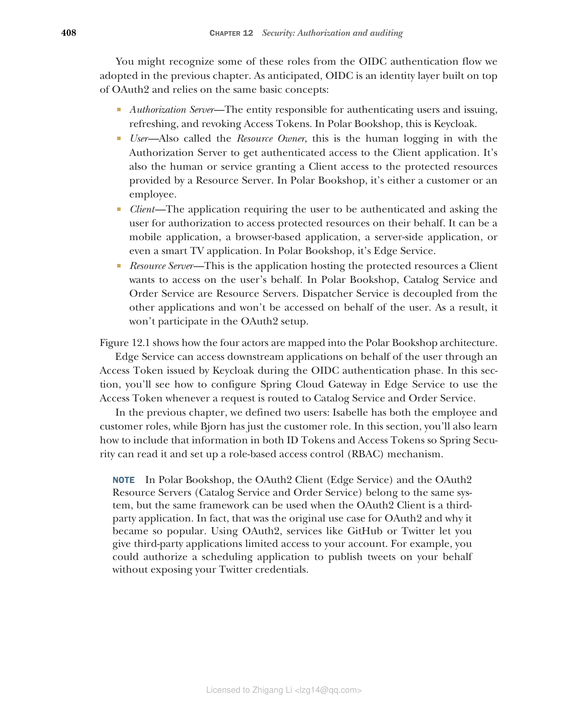
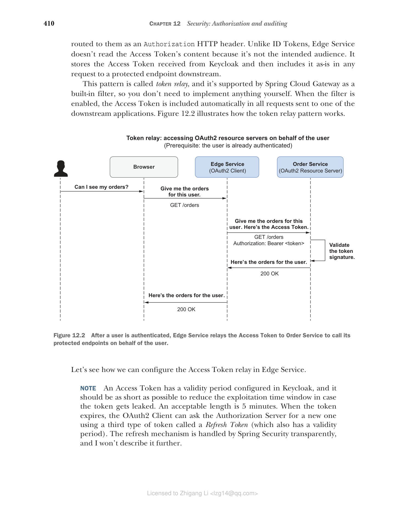
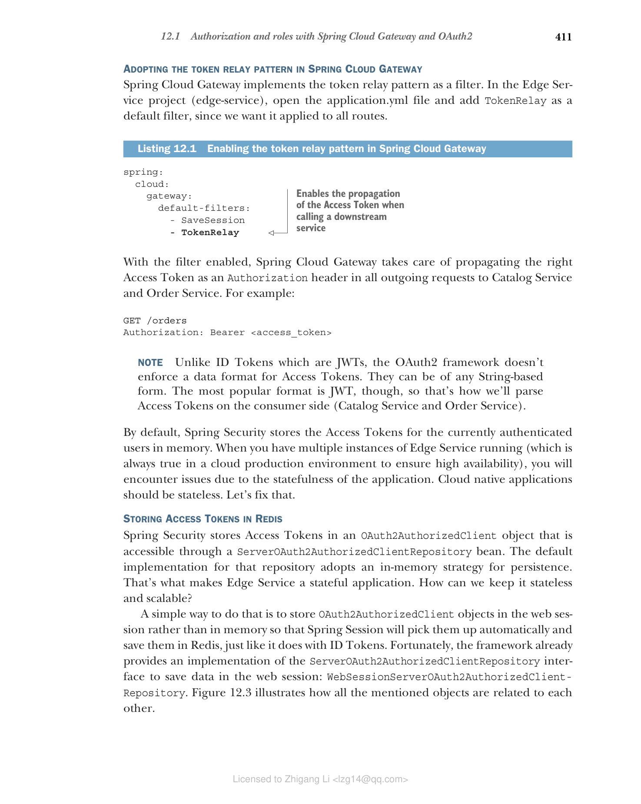
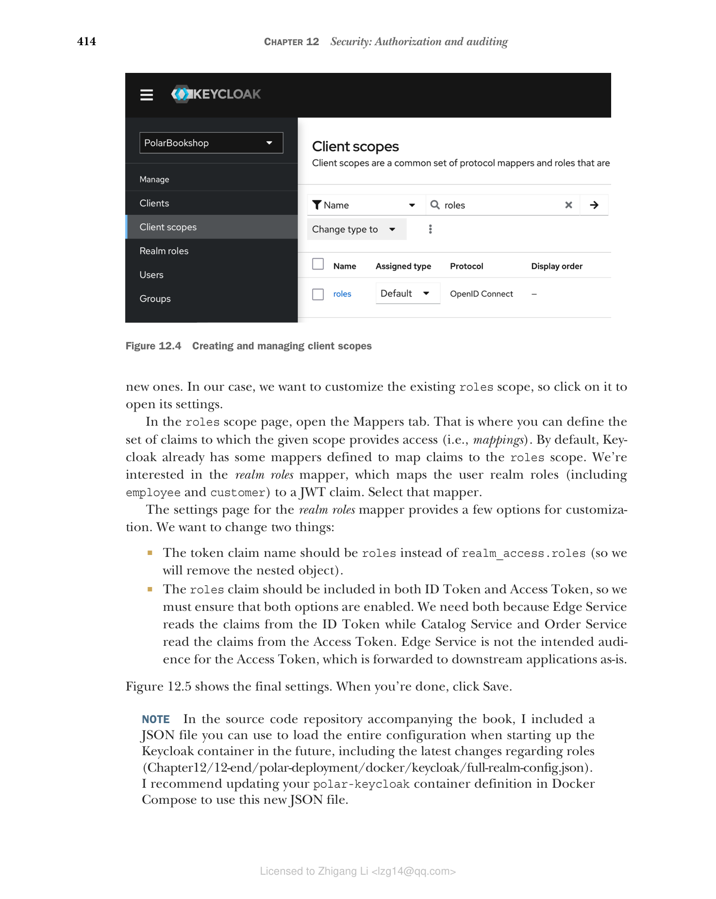

## 12.1 使用 Spring Cloud Gateway 和 OAuth2 进行授权和角色管理

在上一章中，我们向 Polar Bookshop 添加了用户身份验证功能。Edge Service 是系统的访问点，因此它是解决安全性等横切关注点的绝佳候选者。因此，我们让它负责对用户进行身份验证。Edge Service 启动身份验证流程，但使用 OpenID Connect 协议将实际的身份验证步骤委托给 Keycloak。

用户成功通过 Keycloak 身份验证后，Edge Service 从 Keycloak 接收一个 ID Token，其中包含有关身份验证事件的信息，并与用户的浏览器建立经过身份验证的会话。同时，Keycloak 还会颁发一个 Access Token，根据 OAuth2 用于授权 Edge Service 代表用户访问下游应用程序。

OAuth2 是一个授权框架，使应用程序（称为客户端）能够代表用户获得对另一个应用程序（称为资源服务器）提供的受保护资源的有限访问权限。当用户通过 Edge Service 进行身份验证并要求访问其书籍订单时，OAuth2 为 Edge Service 提供了一种代表该用户从 Order Service 检索订单的解决方案。该解决方案依赖于一个可信方（称为授权服务器），它向 Edge Service 颁发 Access Token，并授予从 Order Service 访问用户书籍订单的权限。

您可能从我们在上一章中采用的 OIDC 身份验证流程中认出了其中一些角色。正如预期的那样，OIDC 是建立在 OAuth2 之上的身份层，依赖于相同的基本概念：

* **授权服务器（Authorization Server）** — 负责对用户进行身份验证和颁发、刷新和撤销 Access Token 的实体。在 Polar Bookshop 中，这是 Keycloak。
* **用户（User）** — 也称为资源所有者，这是与授权服务器登录以获得对客户端应用程序的经过身份验证的访问权限的人。也是授予客户端访问资源服务器提供的受保护资源的人或服务。在 Polar Bookshop 中，它是客户或员工。
* **客户端（Client）** — 要求用户进行身份验证并请求用户授权代表其访问受保护资源的应用程序。它可以是移动应用程序、基于浏览器的应用程序、服务器端应用程序，甚至是智能电视应用程序。在 Polar Bookshop 中，它是 Edge Service。
* **资源服务器（Resource Server）** — 这是托管客户端想要代表用户访问的受保护资源的应用程序。在 Polar Bookshop 中，Catalog Service 和 Order Service 是资源服务器。Dispatcher Service 与其他应用程序解耦，不会代表用户访问。因此，它不会参与 OAuth2 设置。

图 12.1 显示了这四个参与者如何映射到 Polar Bookshop 架构中。


**图 12.1 OIDC/OAuth2 角色如何分配给 Polar Bookshop 架构中的实体**

Edge Service 可以通过 Keycloak 在 OIDC 身份验证阶段颁发的 Access Token 代表用户访问下游应用程序。在本节中，您将了解如何在 Edge Service 中配置 Spring Cloud Gateway，以便在请求路由到 Catalog Service 和 Order Service 时使用 Access Token。

在上一章中，我们定义了两个用户：Isabelle 同时具有员工和客户角色，而 Bjorn 只有客户角色。在本节中，您还将学习如何在 ID Token 和 Access Token 中包含该信息，以便 Spring Security 可以读取它并设置基于角色的访问控制（RBAC）机制。

> **注意** 在 Polar Bookshop 中，OAuth2 客户端（Edge Service）和 OAuth2 资源服务器（Catalog Service 和 Order Service）属于同一个系统，但当 OAuth2 客户端是第三方应用程序时，可以使用相同的框架。事实上，这是 OAuth2 的原始用例，也是它变得如此流行的原因。使用 OAuth2，GitHub 或 Twitter 等服务可以让您授予第三方应用程序对您帐户的有限访问权限。例如，您可以授权日程安排应用程序代表您发布推文，而无需公开您的 Twitter 凭据。

### 12.1.1 从 Spring Cloud Gateway 到其他服务的令牌中继

用户成功通过 Keycloak 身份验证后，Edge Service（OAuth2 客户端）接收一个 ID Token 和一个 Access Token：

* **ID Token** — 这代表一个成功的身份验证事件，包含有关经过身份验证的用户的信息。
* **Access Token** — 这代表授予 OAuth2 客户端的授权，以代表用户访问 OAuth2 资源服务器提供的受保护数据。

在 Edge Service 中，Spring Security 使用 ID Token 来提取有关经过身份验证的用户的信息，为当前用户会话设置上下文，并通过 `OidcUser` 对象使数据可用。这就是您在上一章中看到的内容。

Access Token 授予 Edge Service 代表用户对 Catalog Service 和 Order Service（OAuth2 资源服务器）的授权访问。在我们保护这两个应用程序之后，Edge Service 必须将 Access Token 包含在路由到它们的所有请求中作为 Authorization HTTP 头。与 ID Token 不同，Edge Service 不读取 Access Token 的内容，因为它不是预期的受众。它存储从 Keycloak 接收的 Access Token，然后将其原样包含在对下游受保护端点的任何请求中。

这种模式称为令牌中继（token relay），Spring Cloud Gateway 作为内置过滤器支持它，因此您无需自己实现任何内容。启用过滤器后，Access Token 会自动包含在发送到下游应用程序之一的所有请求中。图 12.2 说明了令牌中继模式的工作原理。


**图 12.2 用户通过身份验证后，Edge Service 将 Access Token 中继到 Order Service 以代表用户调用其受保护端点**

让我们看看如何在 Edge Service 中配置 Access Token 中继。

> **注意** Access Token 在 Keycloak 中配置了有效期，它应该尽可能短，以减少令牌泄露时的利用时间窗口。可接受的长度是 5 分钟。当令牌过期时，OAuth2 客户端可以使用第三种类型的令牌（称为刷新令牌，Refresh Token）（也具有有效期）向授权服务器请求新的令牌。刷新机制由 Spring Security 透明处理，我将不再描述。

#### 在 Spring Cloud Gateway 中采用令牌中继模式

Spring Cloud Gateway 将令牌中继模式实现为过滤器。在 Edge Service 项目（edge-service）中，打开 application.yml 文件并添加 `TokenRelay` 作为默认过滤器，因为我们希望它应用于所有路由。

**清单 12.1 在 Spring Cloud Gateway 中启用令牌中继模式**

```yaml
spring:
 cloud:
 gateway:
 default-filters:
 - SaveSession
 - TokenRelay
 # 启用调用下游服务时 Access Token 的传播
```

启用过滤器后，Spring Cloud Gateway 负责将正确的 Access Token 作为 Authorization 头传播到 Catalog Service 和 Order Service 的所有出站请求中。例如：

```
GET /orders
Authorization: Bearer <access_token>
```

> **注意** 与作为 JWT 的 ID Token 不同，OAuth2 框架不强制 Access Token 使用数据格式。它们可以是任何基于字符串的形式。不过，最流行的格式是 JWT，因此这就是我们将在消费者端（Catalog Service 和 Order Service）解析 Access Token 的方式。

默认情况下，Spring Security 将当前经过身份验证的用户的 Access Token 存储在内存中。当您运行 Edge Service 的多个实例时（在云生产环境中始终如此，以确保高可用性），您将由于应用程序的有状态性而遇到问题。云原生应用程序应该是无状态的。让我们修复这个问题。

#### 在 Redis 中存储 Access Token

Spring Security 将 Access Token 存储在 `OAuth2AuthorizedClient` 对象中，该对象可通过 `ServerOAuth2AuthorizedClientRepository` Bean 访问。该仓库的默认实现采用内存策略进行持久化。这就是使 Edge Service 成为有状态应用程序的原因。我们如何使其保持无状态和可扩展？

一种简单的方法是将 `OAuth2AuthorizedClient` 对象存储在 Web 会话中而不是内存中，这样 Spring Session 将自动获取它们并将其保存在 Redis 中，就像对 ID Token 所做的那样。幸运的是，该框架已经提供了 `ServerOAuth2AuthorizedClientRepository` 接口的实现来将数据保存在 Web 会话中：`WebSessionServerOAuth2AuthorizedClientRepository`。图 12.3 说明了所有提到的对象如何相互关联。


**图 12.3 Spring Security 中存储当前经过身份验证用户的 Access Token 涉及的主要类**

在 Edge Service 项目中，打开 `SecurityConfig` 类并使用将 Access Token 存储在 Web 会话中的实现定义一个 `ServerOAuth2AuthorizedClientRepository` 类型的 Bean。

**清单 12.2 将 OAuth2AuthorizedClient 对象保存在 Web 会话中**

```java
@EnableWebFluxSecurity
public class SecurityConfig {
 @Bean
 // 定义一个存储 Access Token 在 Web 会话中的仓库
 ServerOAuth2AuthorizedClientRepository authorizedClientRepository() {
 return new WebSessionServerOAuth2AuthorizedClientRepository();
 }
 // ...
}
```

> **警告** 定义为 JWT 的 Access Token 应小心处理。它们是不记名令牌，这意味着任何应用程序都可以在 HTTP 请求中使用它们并获得对 OAuth2 资源服务器的访问权限。在后端而不是 SPA 中处理 OIDC/OAuth2 流程提供了更好的安全性，因为我们不会向浏览器公开任何令牌。但是，可能存在其他需要管理的风险，因此请仔细考虑系统的信任边界。

在下一节中，您将看到如何增强 ID Token 和 Access Token 以传播有关用户角色的信息。

### 12.1.2 自定义令牌和传播用户角色

ID Token 和 Access Token 都可以包含有关用户的不同信息，这些信息在 JWT 中格式化为声明（claims）。声明是 JSON 格式的简单键/值对。例如，OpenID Connect 定义了几个标准声明来携带有关用户的信息，如 `given_name`、`family_name`、`preferred_username` 和 `email`。

对此类声明的访问通过范围（scopes）进行控制，范围是 OAuth2 提供的一种机制，用于限制 OAuth2 客户端可以访问的数据。您可以将范围视为分配给应用程序而非用户的角色。在上一章中，我们使用 Spring Security 将 Edge Service 设为 OAuth2 客户端，并使用 `openid` 范围对其进行配置。该范围授予 Edge Service 访问经过身份验证的用户身份（在 `sub` 声明中提供）的权限。

也许您已经使用 GitHub 或 Google 登录过第三方网站（基于 OAuth2 的社交登录）。如果您这样做了，您可能已经注意到，在身份验证步骤之后，该服务会提示您第二个请求，询问您同意允许第三方访问您的 GitHub 或 Google 帐户中的哪些信息。该同意功能基于范围，根据分配的范围授予第三方（OAuth2 客户端）特定权限。

关于 Edge Service，我们可以预先决定应该授予它哪些范围。本节将向您展示如何配置 `roles` 声明，其中包含分配给经过身份验证的用户的角色列表。然后您将使用 `roles` 范围授予 Edge Service 对该声明的访问权限，并指示 Keycloak 将其包含在 ID Token 和 Access Token 中。

在继续之前，您需要一个正在运行的 Keycloak 容器。打开终端窗口，导航到保存 Docker Compose 文件的文件夹，然后运行以下命令：

```bash
$ docker-compose up -d polar-keycloak
```

#### 在 Keycloak 中配置对用户角色的访问

Keycloak 预配置了一个 `roles` 范围，您可以使用它来授予应用程序对 `roles` 声明中包含的用户角色的访问权限。但是，角色列表的默认表示不太方便使用，因为它定义为嵌套对象。让我们更改它。

Keycloak 启动并运行后，打开浏览器窗口，转到 http://localhost:8080，使用 Docker Compose 文件中定义的相同凭据（user/password）登录管理控制台，并选择 PolarBookshop 领域。然后从左侧菜单中选择 Client Scopes。在新页面上（图 12.4），您将找到 Keycloak 中所有预配置范围的列表，并且可以选择创建新的范围。


**图 12.4 创建和管理客户端范围**

在我们的例子中，我们想要自定义现有的 `roles` 范围，因此单击它以打开其设置。

在 `roles` 范围页面中，打开 Mappers 选项卡。这是您可以定义给定范围提供访问权限的声明集（即映射）的地方。默认情况下，Keycloak 已经定义了一些映射器将声明映射到 `roles` 范围。我们对 `realm roles` 映射器感兴趣，它将用户领域角色（包括 `employee` 和 `customer`）映射到 JWT 声明。选择该映射器。

`realm roles` 映射器的设置页面提供了一些自定义选项。我们要更改两件事：

* 令牌声明名称应该是 `roles` 而不是 `realm_access.roles`（因此我们将删除嵌套对象）。
* `roles` 声明应包含在 ID Token 和 Access Token 中，因此我们必须确保启用了这两个选项。我们需要两者，因为 Edge Service 从 ID Token 中读取声明，而 Catalog Service 和 Order Service 从 Access Token 中读取声明。Edge Service 不是 Access Token 的预期受众，Access Token 被原样转发到下游应用程序。

图 12.5 显示了最终设置。完成后，单击 Save。


**图 12.5 配置映射器以将用户领域角色包含在 roles JWT 声明中**

> **注意** 在本书附带的源代码仓库中，我包含了一个 JSON 文件，您可以在将来启动 Keycloak 容器时使用它来加载整个配置，包括有关角色的最新更改（Chapter12/12-end/polar-deployment/docker/keycloak/full-realm-config.json）。我建议更新 Docker Compose 中的 polar-keycloak 容器定义以使用这个新的 JSON 文件。

在继续下一节之前，停止任何正在运行的容器（`docker-compose down`）。

#### 在 Spring Security 中配置对用户角色的访问

Keycloak 现在配置为在 ID Token 和 Access Token 中包含的 `roles` 声明中返回经过身份验证的用户角色。但是，只有当 OAuth2 客户端（Edge Service）请求 `roles` 范围时，才会返回 `roles` 声明。

在 Edge Service 项目中，打开 application.yml 文件，并更新客户端注册配置以包含 `roles` 范围。

**清单 12.3 将 roles 范围分配给 Edge Service**

```yaml
spring:
 security:
 oauth2:
 client:
 registration:
 keycloak:
 client-id: edge-service
 client-secret: polar-keycloak-secret
 scope: openid,roles
 # 将 "roles" 添加到范围列表中，以便 Edge Service 可以获得对用户角色的访问权限
 provider:
 keycloak:
 issuer-uri: http://localhost:8080/realms/PolarBookshop
```

接下来，您将看到如何从 ID Token 中提取当前经过身份验证的用户的角色。

#### 从 ID Token 中提取用户角色

在上一章中，我们在 Edge Service 项目的 `UserController` 类中硬编码了用户角色列表，因为我们在 ID Token 中还没有它们。现在我们有了，让我们重构实现以从 `OidcUser` 类中获取当前经过身份验证的用户的角色，该类使我们能够访问 ID Token 中的声明，包括全新的 `roles` 声明。

**清单 12.4 通过 OidcUser 从 ID Token 中提取用户角色列表**

```java
@RestController
public class UserController {

 @GetMapping("user")
 public Mono<User> getUser(@AuthenticationPrincipal OidcUser oidcUser) {
 var user = new User(
 oidcUser.getPreferredUsername(),
 oidcUser.getGivenName(),
 oidcUser.getFamilyName(),
 oidcUser.getClaimAsStringList("roles")
 // 获取 "roles" 声明并将其提取为字符串列表
 );
 return Mono.just(user);
 }
}
```

最后，记得更新 `UserControllerTests` 中的测试设置，以便模拟 ID Token 包含 `roles` 声明。

**清单 12.5 向模拟 ID Token 添加角色列表**

```java
@WebFluxTest(UserController.class)
@Import(SecurityConfig.class)
class UserControllerTests {
 // ...

 private SecurityMockServerConfigurers.OidcLoginMutator
 configureMockOidcLogin(User expectedUser) {
 return mockOidcLogin().idToken(builder -> {
 builder.claim(StandardClaimNames.PREFERRED_USERNAME,
 expectedUser.username());
 builder.claim(StandardClaimNames.GIVEN_NAME,
 expectedUser.firstName());
 builder.claim(StandardClaimNames.FAMILY_NAME,
 expectedUser.lastName());
 builder.claim("roles", expectedUser.roles());
 // 向模拟 ID Token 添加 "roles" 声明
 });
 }
}
```

您可以通过运行以下命令来验证更改是否正确：

```bash
$ ./gradlew test --tests UserControllerTests
```

> **注意** 在 Keycloak 中配置的 `roles` 声明将包含我们的自定义角色（`employee` 和 `customer`）以及 Keycloak 本身管理和分配的一些额外角色。

到目前为止，我们已经配置了 Keycloak 以在令牌中包含用户角色，并更新了 Edge Service 以将 Access Token 中继到下游应用程序。我们现在准备开始使用 Spring Security 和 OAuth2 保护 Catalog Service 和 Order Service。
