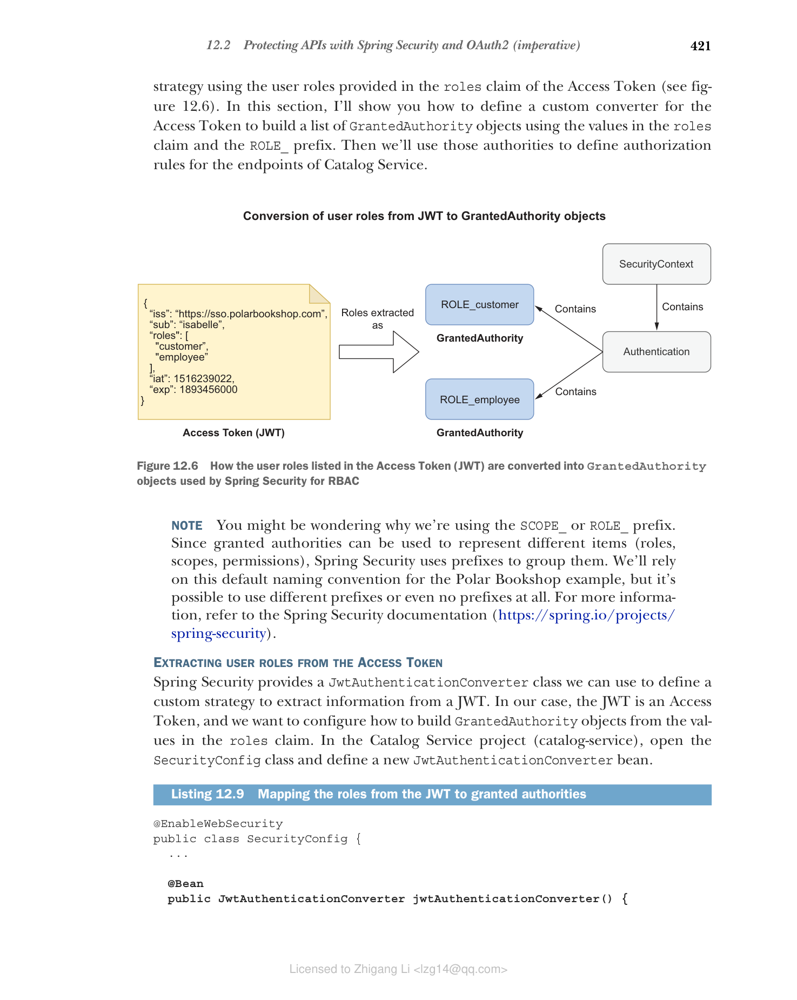

## 12.2 使用 Spring Security 和 OAuth2 保护 API（命令式）

当用户访问 Polar Bookshop 应用程序时，Edge Service 通过 Keycloak 启动 OpenID Connect 身份验证流程，并最终接收一个 Access Token，该令牌授予其代表该用户访问下游服务的权限。

在本节和下一节中，您将了解如何通过要求有效的 Access Token 来访问其受保护端点来保护 Catalog Service 和 Order Service。在 OAuth2 授权框架中，它们扮演 OAuth2 资源服务器的角色：托管受保护数据的应用程序，用户可以通过第三方（在我们的示例中为 Edge Service）访问这些数据。

OAuth2 资源服务器不处理用户身份验证。它们在每个 HTTP 请求的 Authorization 头中接收 Access Token。然后它们验证签名并根据令牌的内容授权请求。我们已经配置了 Edge Service 在将请求路由到下游时发送 Access Token。现在您将看到如何在接收端使用该令牌。本节将指导您保护基于命令式 Spring 技术栈构建的 Catalog Service。下一节将向您展示如何在基于响应式 Spring 技术栈构建的 Order Service 中实现相同的结果。

### 12.2.1 将 Spring Boot 保护为 OAuth2 资源服务器

利用 OAuth2 保护 Spring Boot 应用程序的第一步是添加对专用 Spring Boot starter 的依赖，该 starter 包含 Spring Security 和对资源服务器的 OAuth2 支持。

在 Catalog Service 项目（catalog-service）中，打开 build.gradle 文件并添加新依赖。添加新依赖后，请记住刷新或重新导入 Gradle 依赖。

**清单 12.6 添加 Spring Security OAuth2 资源服务器依赖**

```groovy
dependencies {
 ...
 implementation 'org.springframework.boot:spring-boot-starter-oauth2-resource-server'
}
```

接下来，让我们配置 Spring Security 和 Keycloak 之间的集成。

#### 配置 Spring Security 和 Keycloak 之间的集成

Spring Security 支持使用两种数据格式保护 Access Token 的端点：JWT 和不透明令牌（opaque tokens）。我们将使用定义为 JWT 的 Access Token，类似于我们对 ID Token 所做的。使用 Access Token，Keycloak 授予 Edge Service 代表用户访问下游应用程序的权限。当 Access Token 是 JWT 时，我们还可以将有关经过身份验证的用户的相关信息作为声明包含在内，并轻松地将此上下文传播到 Catalog Service 和 Order Service。相比之下，不透明令牌将要求下游应用程序每次联系 Keycloak 以获取与令牌关联的信息。

配置 Spring Security 与 Keycloak 集成作为 OAuth2 资源服务器比 OAuth2 客户端场景更简单。使用 JWT 时，应用程序将主要联系 Keycloak 以获取验证令牌签名所需的公钥。使用 `issuer-uri` 属性，类似于我们为 Edge Service 所做的，我们将让应用程序自动发现可以找到公钥的 Keycloak 端点。

默认行为是应用程序在收到的第一个 HTTP 请求时延迟获取公钥，而不是在启动时，出于性能和耦合原因（启动应用程序时不需要 Keycloak 运行）。OAuth2 授权服务器使用 JSON Web Key（JWK）格式提供其公钥。公钥集合称为 JWK Set。Keycloak 暴露其公钥的端点称为 JWK Set URI。当 Keycloak 提供新的公钥时，Spring Security 将自动轮换公钥。

对于每个在 Authorization 头中包含 Access Token 的传入请求，Spring Security 将自动使用 Keycloak 提供的公钥验证令牌的签名，并通过 `JwtDecoder` 对象解码其声明，该对象在幕后自动配置。

在 Catalog Service 项目（catalog-service）中，打开 application.yml 文件并添加以下配置。

**清单 12.7 将 Catalog Service 配置为 OAuth2 资源服务器**

```yaml
spring:
 security:
 oauth2:
 resourceserver:
 jwt:
 # OAuth2 不强制 Access Token 使用数据格式，因此我们必须明确说明我们的选择。在本例中，我们要使用 JWT
 issuer-uri: http://localhost:8080/realms/PolarBookshop
 # 提供有关特定领域的所有相关 OAuth2 端点信息的 Keycloak URL
```

> **注意** 解释用于对 Access Token 进行签名的加密算法超出了本书的范围。如果您想了解更多关于密码学的知识，您可能需要查阅 David Wong 的《Real-World Cryptography》（Manning，2021）。

Catalog Service 和 Keycloak 之间的集成现已建立。接下来，您将定义一些基本安全策略来保护应用程序端点。

#### 定义 JWT 身份验证的安全策略

对于 Catalog Service 应用程序，我们要强制执行以下安全策略：

* 应允许获取书籍的 GET 请求无需身份验证。
* 所有其他请求应要求身份验证。
* 应用程序应配置为 OAuth2 资源服务器并使用 JWT 身份验证。
* 处理 JWT 身份验证的流程应该是无状态的。

让我们详细说明最后一个策略。Edge Service 触发用户身份验证流程，并利用 Web 会话来存储 ID Token 和 Access Token 等数据，否则这些数据将在每个 HTTP 请求结束时丢失，迫使用户在每个请求时进行身份验证。为了使应用程序能够扩展，我们使用 Spring Session 将 Web 会话数据存储在 Redis 中，并保持应用程序无状态。

与 Edge Service 不同，Catalog Service 只需要 Access Token 来验证请求。由于在对受保护端点的每个 HTTP 请求中都提供了令牌，因此 Catalog Service 不需要在请求之间存储任何数据。我们将此策略称为无状态身份验证或基于令牌的身份验证。我们使用 JWT 作为 Access Token，因此我们也可以将其称为 JWT 身份验证。

现在开始编写代码。在 Catalog Service 项目中，在 `com.polarbookshop.catalogservice.config` 包中创建一个新的 `SecurityConfig` 类。类似于我们为 Edge Service 所做的，我们可以使用 `HttpSecurity` 提供的 DSL 来构建配置了所需安全策略的 `SecurityFilterChain`。

**清单 12.8 配置安全策略和 JWT 身份验证**

```java
@EnableWebSecurity
// 启用 Spring MVC 对 Spring Security 的支持
public class SecurityConfig {

 @Bean
 SecurityFilterChain filterChain(HttpSecurity http) throws Exception {
 return http
 .authorizeHttpRequests(authorize -> authorize
 .mvcMatchers(HttpMethod.GET, "/", "/books/**")
 .permitAll()
 // 允许用户在未经身份验证的情况下获取问候语和书籍
 .anyRequest().authenticated()
 // 任何其他请求都需要身份验证
 )
 .oauth2ResourceServer(
 OAuth2ResourceServerConfigurer::jwt)
 // 启用使用基于 JWT 的默认配置的 OAuth2 资源服务器支持（JWT 身份验证）
 .sessionManagement(sessionManagement ->
 sessionManagement
 .sessionCreationPolicy(SessionCreationPolicy.STATELESS))
 // 每个请求必须包含 Access Token，因此无需在请求之间保持用户会话活动。我们希望它是无状态的
 .csrf(AbstractHttpConfigurer::disable)
 // 由于身份验证策略是无状态的，不涉及基于浏览器的客户端，因此我们可以安全地禁用 CSRF 保护
 .build();
 }
}
```

让我们检查它是否正常工作。首先，应该启动 Polar UI、Keycloak、Redis 和 PostgreSQL 容器。打开终端窗口，导航到保存 Docker Compose 配置的文件夹（polar-deployment/docker）并运行以下命令：

```bash
$ docker-compose up -d polar-ui polar-keycloak polar-redis polar-postgres
```

然后运行 Edge Service 和 Catalog Service（从每个项目运行 `./gradlew bootRun`）。最后，打开浏览器窗口并访问 [http://localhost:9000](http://localhost:9000)。

确保您可以在未经身份验证的情况下查看目录中的书籍列表，但不能添加、更新或删除它们。然后以 Isabelle（isabelle/password）身份登录。她是书店的员工，因此应该允许她修改目录中的书籍。接下来，以 Bjorn（bjorn/password）身份登录。他是客户，因此不应该能够更改目录中的任何内容。

在底层，Angular 应用程序从 Edge Service 暴露的 `/user` 端点获取用户角色，并使用它们来阻止某些功能。这改善了用户体验，但不安全。Catalog Service 暴露的实际端点不考虑角色。我们需要强制执行基于角色的授权。这是下一节的主题。

### 12.2.2 使用 Spring Security 和 JWT 进行基于角色的访问控制

到目前为止，在讨论授权时，我们指的是授予 OAuth2 客户端（Edge Service）代表用户访问 OAuth2 资源服务器（如 Catalog Service）的权限。现在我们将从应用程序授权转向用户授权。经过身份验证的用户可以在系统中做什么？

Spring Security 将每个经过身份验证的用户与一个 `GrantedAuthority` 对象列表相关联，该列表建模了授予用户的权限。授予权限可以用于表示细粒度的权限、角色，甚至范围，并且根据身份验证策略来自不同的来源。权限通过代表经过身份验证的用户的 `Authentication` 对象提供，并存储在 `SecurityContext` 中。

由于 Catalog Service 配置为 OAuth2 资源服务器并使用 JWT 身份验证，Spring Security 从 Access Token 的 `scopes` 声明中提取范围列表，并自动将它们用作给定用户的授予权限。以这种方式构建的每个 `GrantedAuthority` 对象将使用 `SCOPE_` 前缀和范围值命名。

默认行为在许多使用范围建模权限的场景中是可以接受的，但它不适合我们依赖用户角色来了解每个用户具有哪些权限的情况。我们想要设置一个基于角色的访问控制（RBAC）策略，使用 Access Token 的 `roles` 声明中提供的用户角色（参见图 12.6）。在本节中，我将向您展示如何为 Access Token 定义一个自定义转换器，以使用 `roles` 声明中的值和 `ROLE_` 前缀构建 `GrantedAuthority` 对象列表。然后我们将使用这些权限来定义 Catalog Service 端点的授权规则。


**图 12.6 Access Token (JWT) 中列出的用户角色如何转换为 Spring Security 用于 RBAC 的 GrantedAuthority 对象**

> **注意** 您可能想知道为什么我们使用 `SCOPE_` 或 `ROLE_` 前缀。由于授予权限可以用于表示不同的项目（角色、范围、权限），Spring Security 使用前缀对它们进行分组。我们将在 Polar Bookshop 示例中依赖此默认命名约定，但可以使用不同的前缀，甚至不使用前缀。有关更多信息，请参阅 Spring Security 文档（[https://spring.io/projects/spring-security](https://spring.io/projects/spring-security)）。

#### 从 Access Token 中提取用户角色

Spring Security 提供了一个 `JwtAuthenticationConverter` 类，我们可以使用它来定义从 JWT 提取信息的自定义策略。在我们的例子中，JWT 是 Access Token，我们想要配置如何从 `roles` 声明中的值构建 `GrantedAuthority` 对象。在 Catalog Service 项目（catalog-service）中，打开 `SecurityConfig` 类并定义一个新的 `JwtAuthenticationConverter` Bean。

**清单 12.9 将 JWT 中的角色映射到授予权限**

```java
@EnableWebSecurity
public class SecurityConfig {
 // ...

 @Bean
 public JwtAuthenticationConverter jwtAuthenticationConverter() {
 var jwtGrantedAuthoritiesConverter = new JwtGrantedAuthoritiesConverter();
 // 定义一个将声明映射到 GrantedAuthority 对象的转换器
 jwtGrantedAuthoritiesConverter.setAuthorityPrefix("ROLE_");
 // 将 "ROLE_" 前缀应用于每个用户角色
 jwtGrantedAuthoritiesConverter.setAuthoritiesClaimName("roles");
 // 从 roles 声明中提取角色列表

 var jwtAuthenticationConverter = new JwtAuthenticationConverter();
 jwtAuthenticationConverter
 .setJwtGrantedAuthoritiesConverter(jwtGrantedAuthoritiesConverter);
 // 定义转换 JWT 的策略。我们只自定义如何从中构建授予权限
 return jwtAuthenticationConverter;
 }
}
```

有了这个 Bean，Spring Security 将为每个经过身份验证的用户关联一个 `GrantedAuthority` 对象列表，我们可以使用它们来定义授权策略。

#### 基于用户角色定义授权策略

Catalog Service 端点应根据以下策略进行保护：

* 发送到 `/`、`/books` 或 `/books/{isbn}` 端点的所有 GET 请求都应该被允许，即使没有身份验证。
* 任何其他请求应同时要求用户身份验证和员工角色。

Spring Security 提供了一个基于表达式的 DSL 来定义授权策略。最通用的是 `hasAuthority("ROLE_employee")`，您可以使用它来检查任何类型的权限。在我们的例子中，权限是角色，因此我们可以使用最具描述性的 `hasRole("employee")` 并删除前缀（Spring Security 在底层添加了该前缀）。

**清单 12.10 应用 RBAC 以限制具有员工角色的用户的写访问权限**

```java
@EnableWebSecurity
public class SecurityConfig {

 @Bean
 SecurityFilterChain filterChain(HttpSecurity http) throws Exception {
 return http
 .authorizeHttpRequests(authorize -> authorize
 .mvcMatchers(HttpMethod.GET, "/", "/books/**")
 .permitAll()
 // 允许用户在未经身份验证的情况下获取问候语和书籍
 .anyRequest().hasRole("employee")
 // 任何其他请求不仅需要身份验证，还需要员工角色（与 ROLE_employee 权限相同）
 )
 .oauth2ResourceServer(OAuth2ResourceServerConfigurer::jwt)
 .sessionManagement(sessionManagement ->
 sessionManagement
 .sessionCreationPolicy(SessionCreationPolicy.STATELESS))
 .csrf(AbstractHttpConfigurer::disable)
 .build();
 }
 // ...
}
```

现在您可以重新构建并运行 Catalog Service（`./gradlew bootRun`），并像以前一样进行相同的流程。这次 Catalog Service 将确保只有书店员工才能添加、更新和删除书籍。

最后，停止正在运行的应用程序（Ctrl-C）和容器（`docker-compose down`）。

> **注意** 要了解有关 Spring Security 中授权架构和可用于访问控制的不同策略的更多信息，您可以参考 Laurentiu Spilca 的《Spring Security in Action》（Manning，2020）的第 7 章和第 8 章，其中对此进行了详细说明。

接下来，我将指导您完成一些技术，用于测试配置为 OAuth2 资源服务器的命令式 Spring Boot 应用程序中的安全性。

### 12.2.3 使用 Spring Security 和 Testcontainers 测试 OAuth2

当涉及到安全性时，编写自动测试通常具有挑战性。幸运的是，Spring Security 为我们提供了方便的实用程序来在切片测试中验证安全设置。

本节将向您展示如何使用模拟 Access Token 为 Web 切片编写切片测试，以及如何使用通过 Testcontainers 运行的实际 Keycloak 容器编写完整的集成测试。

在开始之前，我们需要添加对 Spring Security Test 和 Testcontainers Keycloak 的新依赖。打开 Catalog Service 项目（catalog-service）的 build.gradle 文件，并按如下所示进行更新。添加新依赖后，请记住刷新或重新导入 Gradle 依赖。

**清单 12.11 添加依赖以测试 Spring Security 和 Keycloak**

```groovy
ext {
 ...
 set('testKeycloakVersion', "2.3.0")
 // Testcontainers Keycloak 的版本
}

dependencies {
 ...
 testImplementation 'org.springframework.security:spring-security-test'
 testImplementation 'org.testcontainers:junit-jupiter'
 testImplementation "com.github.dasniko:testcontainers-keycloak:${testKeycloakVersion}"
 // 在 Testcontainers 之上提供 Keycloak 测试实用程序
}
```

#### 使用 @WebMvcTest 和 Spring Security 测试受保护的 REST 控制器

首先，让我们更新 `BookControllerMvcTests` 类以涵盖新的场景，具体取决于用户身份验证和授权。例如，我们可以为 DELETE 操作在以下情况下编写测试用例：

* 用户已通过身份验证并具有员工角色。
* 用户已通过身份验证但没有员工角色。
* 用户未通过身份验证。

删除操作仅允许书店员工执行，因此只有第一个请求将返回成功答案。

作为 OAuth2 Access Token 验证的一部分，Spring Security 依赖 Keycloak 提供的公钥来验证 JWT 签名。在内部，该框架配置了一个 `JwtDecoder` Bean 来使用这些密钥解码和验证 JWT。在 Web 切片测试的上下文中，我们可以提供一个模拟的 `JwtDecoder` Bean，这样 Spring Security 就会跳过与 Keycloak 的交互（我们将在完整的集成测试中验证这一点）。

**清单 12.12 使用切片测试在 Web 层验证安全策略**

```java
@WebMvcTest(BookController.class)
@Import(SecurityConfig.class)
// 导入应用程序的安全配置
class BookControllerMvcTests {

 @Autowired
 MockMvc mockMvc;

 @MockBean
 // 模拟 JwtDecoder，这样应用程序就不会尝试调用 Keycloak 并获取公钥来解码 Access Token
 JwtDecoder jwtDecoder;
 // ...

 @Test
 void whenDeleteBookWithEmployeeRoleThenShouldReturn204() throws Exception {
 var isbn = "7373731394";
 mockMvc
 .perform(MockMvcRequestBuilders.delete("/books/" + isbn)
 .with(SecurityMockMvcRequestPostProcessors.jwt()
 // 使用具有 "employee" 角色的用户的模拟 JWT 格式 Access Token 修改 HTTP 请求
 .authorities(new SimpleGrantedAuthority("ROLE_employee"))))
 .andExpect(MockMvcResultMatchers.status().isNoContent());
 }

 @Test
 void whenDeleteBookWithCustomerRoleThenShouldReturn403() throws Exception {
 var isbn = "7373731394";
 mockMvc
 .perform(MockMvcRequestBuilders.delete("/books/" + isbn)
 .with(SecurityMockMvcRequestPostProcessors.jwt()
 // 使用具有 "customer" 角色的用户的模拟 JWT 格式 Access Token 修改 HTTP 请求
 .authorities(new SimpleGrantedAuthority("ROLE_customer"))))
 .andExpect(MockMvcResultMatchers.status().isForbidden());
 }

 @Test
 void whenDeleteBookNotAuthenticatedThenShouldReturn401() throws Exception {
 var isbn = "7373731394";
 mockMvc
 .perform(MockMvcRequestBuilders.delete("/books/" + isbn))
 .andExpect(MockMvcResultMatchers.status().isUnauthorized());
 }
}
```

打开终端窗口，导航到 Catalog Service 根文件夹，然后按如下方式运行新添加的测试：

```bash
$ ./gradlew test --tests BookControllerMvcTests
```

随意添加更多 Web 切片自动测试以涵盖 GET、POST 和 PUT 请求。有关灵感，您可以参考本书附带的源代码（Chapter12/12-end/catalog-service）。

#### 使用 @SpringBootTest、Spring Security 和 Testcontainers 进行集成测试

我们在前面章节中编写的集成测试将不再有效，原因有两个。首先，所有 POST、PUT 和 DELETE 请求都将失败，因为我们没有提供任何有效的 OAuth2 Access Token。即使我们提供了，也没有运行的 Keycloak，Spring Security 需要它来获取用于验证 Access Token 的公钥。

您可以通过从 Catalog Service 根文件夹运行以下命令来验证失败：

```bash
$ ./gradlew test --tests CatalogServiceApplicationTests
```

我们已经看到如何使用 Testcontainers 编写针对数据服务（如 PostgreSQL 数据库）的集成测试，使我们的测试更可靠并确保环境一致性。在本节中，我们将对 Keycloak 执行相同的操作。

让我们开始通过 Testcontainers 配置 Keycloak 容器。打开 `CatalogServiceApplicationTests` 类并添加以下设置。

**清单 12.13 Keycloak 测试容器的设置**

```java
@SpringBootTest(webEnvironment = SpringBootTest.WebEnvironment.RANDOM_PORT)
@ActiveProfiles("integration")
@Testcontainers
// 激活测试容器的自动启动和清理
class CatalogServiceApplicationTests {

 @Autowired
 private WebTestClient webTestClient;

 @Container
 // 定义用于测试的 Keycloak 容器
 private static final KeycloakContainer keycloakContainer =
 new KeycloakContainer("quay.io/keycloak/keycloak:19.0")
 .withRealmImportFile("test-realm-config.json");

 @DynamicPropertySource
 static void dynamicProperties(DynamicPropertyRegistry registry) {
 registry.add("spring.security.oauth2.resourceserver.jwt.issuer-uri",
 () -> keycloakContainer.getAuthServerUrl() + "realms/PolarBookshop");
 // 覆盖 Keycloak Issuer URI 配置以指向测试 Keycloak 实例
 }
 // ...
}
```

Keycloak 测试容器是通过我包含在本书附带源代码仓库中的配置文件初始化的（Chapter12/12-end/catalog-service/src/test/resources/test-realm-config.json）。继续将其复制到 Catalog Service 项目（catalog-service）的 `src/test/resources` 文件夹中。

在生产环境中，我们将通过 Edge Service 调用 Catalog Service，Edge Service 负责对用户进行身份验证并将 Access Token 中继到下游应用程序。我们现在想要隔离测试 Catalog Service 并验证不同的授权场景。因此，我们需要首先生成一些 Access Token，以便我们可以使用它们来调用正在测试的 Catalog Service 端点。

我在 JSON 文件中提供的 Keycloak 配置包括一个测试客户端（`polar-test`）的定义，我们可以使用它通过用户名和密码直接对用户进行身份验证，而不是通过我们在 Edge Service 中实现的基于浏览器的流程。在 OAuth2 中，这样的流程称为密码授权（Password Grant），不建议在生产环境中使用。在下一节中，我们将仅出于测试目的使用它。

让我们设置 `CatalogServiceApplicationTests` 以使用 Isabelle 和 Bjorn 的身份通过 Keycloak 进行身份验证，以便我们可以获得调用 Catalog Service 受保护端点所需的 Access Token。请记住，Isabelle 既是客户也是员工，而 Bjorn 只是客户。

**清单 12.14 获取测试 Access Token 的设置**

```java
@SpringBootTest(webEnvironment = SpringBootTest.WebEnvironment.RANDOM_PORT)
@ActiveProfiles("integration")
@Testcontainers
class CatalogServiceApplicationTests {
 private static KeycloakToken bjornTokens;
 private static KeycloakToken isabelleTokens;
 // ...

 @BeforeAll
 static void generateAccessTokens() {
 WebClient webClient = WebClient.builder()
 // 用于调用 Keycloak 的 WebClient
 .baseUrl(keycloakContainer.getAuthServerUrl()
 + "realms/PolarBookshop/protocol/openid-connect/token")
 .defaultHeader(HttpHeaders.CONTENT_TYPE,
 MediaType.APPLICATION_FORM_URLENCODED_VALUE)
 .build();
 isabelleTokens = authenticateWith(
 // 以 Isabelle 身份进行身份验证并获取 Access Token
 "isabelle", "password", webClient);
 bjornTokens = authenticateWith(
 // 以 Bjorn 身份进行身份验证并获取 Access Token
 "bjorn", "password", webClient);
 }

 private static KeycloakToken authenticateWith(
 String username, String password, WebClient webClient) {
 return webClient
 .post()
 .body(
 // 使用密码授权流程直接与 Keycloak 进行身份验证
 BodyInserters.fromFormData("grant_type", "password")
 .with("client_id", "polar-test")
 .with("username", username)
 .with("password", password))
 .retrieve()
 .bodyToMono(KeycloakToken.class)
 .block();
 // 阻塞直到结果可用。这是我们以命令式而非响应式方式使用 WebClient 的方式
 }

 private record KeycloakToken(String accessToken) {
 @JsonCreator
 private KeycloakToken(
 // 指示 Jackson 在将 JSON 反序列化为 KeycloakToken 对象时使用此构造函数
 @JsonProperty("access_token") final String accessToken) {
 this.accessToken = accessToken;
 }
 }
}
```

最后，我们可以更新 `CatalogServiceApplicationTests` 中的测试用例以涵盖多种身份验证和授权场景。例如，我们可以为 POST 操作在以下情况下编写测试用例：

* 用户已通过身份验证并具有员工角色（扩展现有测试用例）。
* 用户已通过身份验证但没有员工角色（新测试用例）。
* 用户未通过身份验证（新测试用例）。

> **注意** 在 OAuth2 资源服务器的上下文中，身份验证意味着令牌身份验证。在这种情况下，它通过在每个 HTTP 请求的 Authorization 头中提供 Access Token 来实现。

创建操作仅允许书店员工执行，因此只有第一个请求将返回成功答案。

**清单 12.15 在集成测试中验证安全场景**

```java
@Test
void whenPostRequestThenBookCreated() {
 var expectedBook = Book.of("1231231231", "Title", "Author", 9.90, "Polarsophia");

 webTestClient.post().uri("/books")
 .headers(headers ->
 // 作为经过身份验证的员工用户 (Isabelle) 发送请求将书籍添加到目录
 headers.setBearerAuth(isabelleTokens.accessToken()))
 .bodyValue(expectedBook)
 .exchange()
 .expectStatus().isCreated()
 // 书籍已成功创建 (201)
 .expectBody(Book.class).value(actualBook -> {
 assertThat(actualBook).isNotNull();
 assertThat(actualBook.isbn()).isEqualTo(expectedBook.isbn());
 });
}

@Test
void whenPostRequestUnauthorizedThen403() {
 var expectedBook = Book.of("1231231231", "Title", "Author", 9.90, "Polarsophia");

 webTestClient.post().uri("/books")
 .headers(headers ->
 // 作为经过身份验证的客户用户 (Bjorn) 发送请求将书籍添加到目录
 headers.setBearerAuth(bjornTokens.accessToken()))
 .bodyValue(expectedBook)
 .exchange()
 .expectStatus().isForbidden();
 // 书籍未被创建，因为用户没有正确的授权，没有 "employee" 角色 (403)
}

@Test
void whenPostRequestUnauthenticatedThen401() {
 var expectedBook = Book.of("1231231231", "Title", "Author", 9.90, "Polarsophia");

 webTestClient.post().uri("/books")
 .bodyValue(expectedBook)
 .exchange()
 .expectStatus().isUnauthorized();
 // 书籍未被创建，因为用户未通过身份验证 (401)
}
```

打开终端窗口，导航到 Catalog Service 根文件夹，然后按如下方式运行新添加的测试：

```bash
$ ./gradlew test --tests CatalogServiceApplicationTests
```

仍然有测试失败。继续通过在任何 POST、PUT 或 DELETE 请求中包含正确的 Access Token（Isabelle 的或 Bjorn 的）来更新它们，正如您在前面的示例中所学到的那样。完成后，重新运行测试并验证它们是否都成功。有关灵感，您可以参考本书附带的源代码（Chapter12/12-end/catalog-service）。
