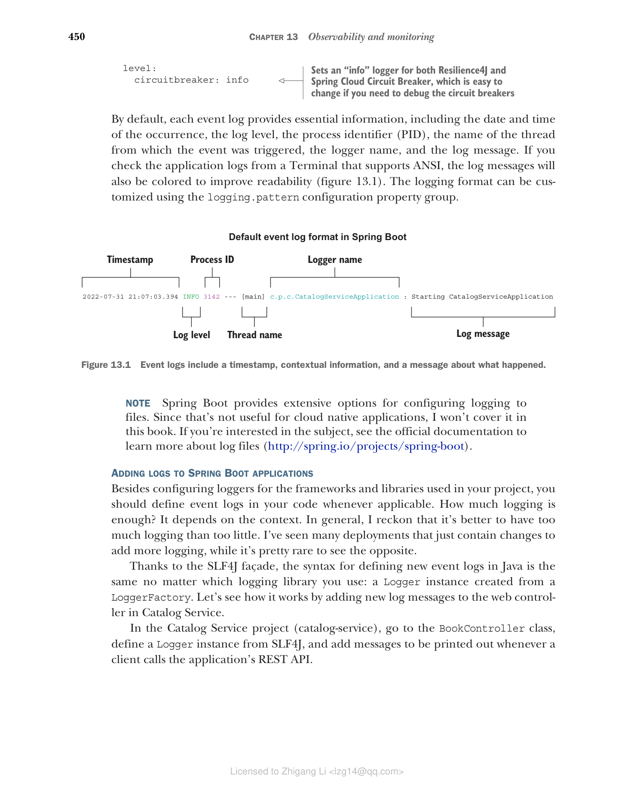
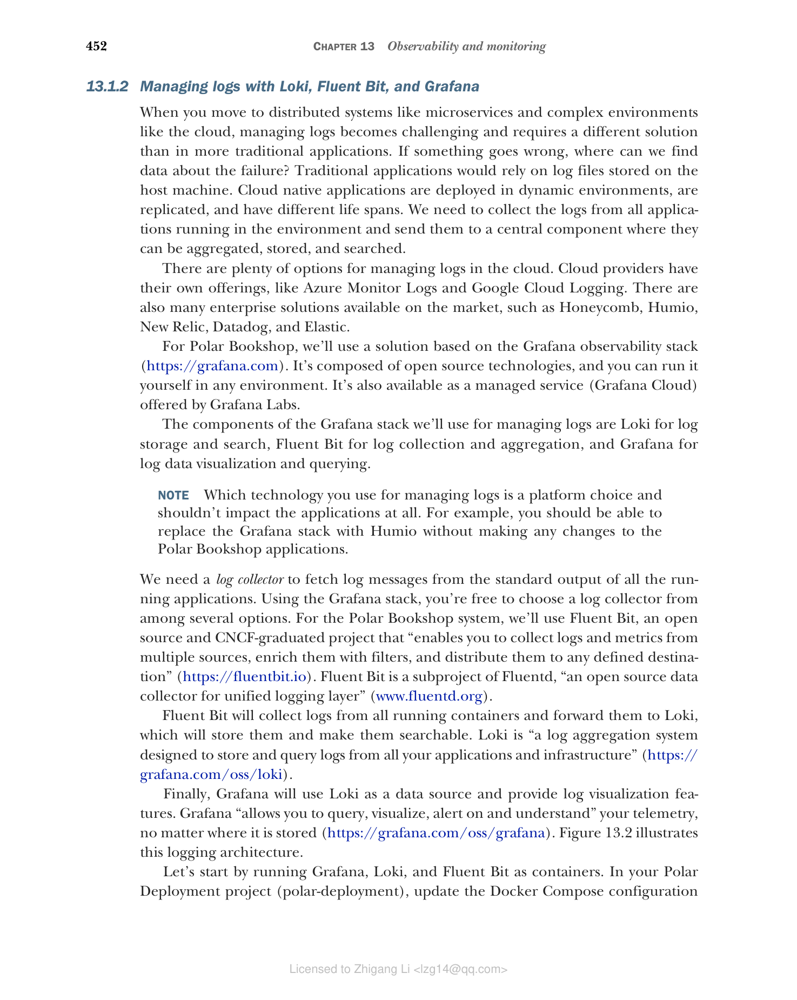
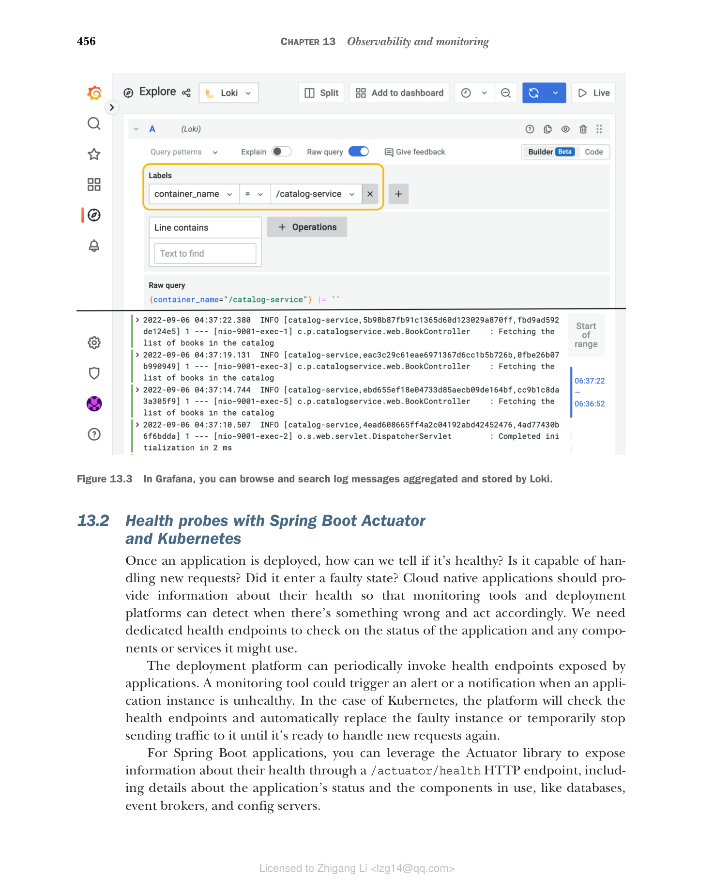

## 13.1 使用 Spring Boot、Loki 和 Fluent Bit 管理日志

日志（或事件日志）是软件应用中随时间发生的某件事的离散记录。它们由一个时间戳（用于回答"事件在什么时候发生？"这个问题）和一些提供事件及其上下文细节的信息（让我们能够回答诸如"这个时刻发生了什么""哪个线程在处理该事件"或"哪个用户/租户在上下文中"之类的问题）组成。

在故障排查和调试任务中，日志是我们可以用来重建单个应用实例在某个特定时间点所发生事件的核心工具之一。日志通常根据事件的类型或严重程度进行分类，例如 trace、debug、info、warn、error。它是一种灵活的机制，让我们可以在生产环境中只记录最严重的事件，同时在调试期间仍有机会临时改日志级别。

日志记录的格式各不相同，从简单的纯文本，到结构化的键/值对集合，再到以 JSON 格式生成的完全结构化记录。

传统上，我们把日志配置为输出到主机上的文件中，这导致应用需要处理文件名约定、文件轮转和文件大小等问题。在云环境中，我们遵循 15-Factor 方法论，它建议把日志当作事件流输出到标准输出。云原生应用持续流式输出日志，并且不关心日志如何被处理或存储。

本节将教你在 Spring Boot 应用中添加和配置日志。然后我会解释在云原生基础设施中日志是如何被收集和聚合的。最后，你将运行 Fluent Bit 进行日志收集、运行 Loki 进行日志聚合，并使用 Grafana 查询你的 Spring Boot 应用产生的日志。

### 13.1.1 使用 Spring Boot 记录日志

Spring Boot 内置支持自动配置最常见的日志框架，包括 Logback、Log4J2、Commons Logging 和 Java Util Logging。默认情况使用 Logback（https://logback.qos.ch），但你可以借助 SLF4J（Java 的简单日志门面）提供的抽象轻松把它替换为另一个库。

使用 SLF4J 的接口（www.slf4j.org），你可以不必修改 Java 代码就能更换日志库。此外，云原生应用应该把日志当作事件流输出到标准输出，这正是 Spring Boot 开箱即用的行为。

配置 Spring Boot 日志，事件日志按级别分类，信息量递减、重要性递增：trace、debug、info、warn、error。默认情况下，Spring Boot 记录 info 级别及以上的所有日志。

logger 是产生日志事件的类。你可以通过相关配置属性设置 logger 级别，既支持全局配置，也支持针对特定包或类。例如，在第 9 章中，我们设置了一个 debug logger 来获得 Resilience4J 实现的熔断器的更多细节（Edge Service 项目中的 application.yml 文件）：

```yaml
logging:
  level:
    io.github.resilience4j: debug  # 为 Resilience4J 库设置 debug logger
```

你可能需要同时配置多个 logger。这种情况下，可以把它们收集到一个日志组（log group）中，然后直接对组应用配置。Spring Boot 提供了两个预定义的日志组：`web` 和 `sql`，你也可以定义自己的组。例如，为了更方便地分析 Edge Service 应用中定义的熔断器的行为，你可以定义一个日志组，并为 Resilience4J 和 Spring Cloud Circuit Breaker 都配置日志级别。

在 Edge Service 项目（edge-service）中，你可以在 application.yml 文件中配置新的日志组，如下所示：

**清单 13.1 配置一个组来控制熔断器日志**

```yaml
logging:
  group:
    circuitbreaker: io.github.resilience4j,
      org.springframework.cloud.circuitbreaker  # 把多个 logger 收集到一个组中，以便应用相同的配置
  level:
    circuitbreaker: info  # 为 Resilience4J 和 Spring Cloud Circuit Breaker 都设置"info"级别的 logger，如果你需要调试熔断器，把它改成 debug 即可
```

默认情况下，每条事件日志都提供一些基本信息，包括事件发生的日期和时间、日志级别、进程标识符（PID）、触发事件的线程名、logger 名和日志消息。如果你在支持 ANSI 的 Terminal 中查看应用日志，日志消息还会被着色以提高可读性（图 13.1）。日志格式可以通过 `logging.pattern` 配置属性组进行定制。



**图 13.1** 事件日志包含一个时间戳、上下文信息和一条关于发生了什么的日志消息。

> 注意：Spring Boot 提供了许多把日志写入文件的配置选项。由于那对云原生应用没有帮助，我不会在本书中涵盖。如果你对这个主题感兴趣，可以查阅官方文档了解有关日志文件的更多信息（http://spring.io/projects/spring-boot）。

为 Spring Boot 应用添加日志

除了为项目中使用的框架和库配置 logger 之外，你还应该在适当的时候在代码中定义事件日志。日志要多少才够？这取决于上下文。总体而言，我认为日志多些比少好。我见过许多部署仅仅是添加更多日志，而相反的情况很少见。

借助 SLF4J 门面，无论你使用哪个日志库，在 Java 中定义新事件日志的语法都是相同的：一个从 LoggerFactory 创建的 Logger 实例。让我们通过给 Catalog Service 的 web controller 添加新日志消息来看看它是如何工作的。

在 Catalog Service 项目（catalog-service）中，转到 BookController 类，从 SLF4J 定义一个 Logger 实例，并在客户端每次调用应用的 REST API 时打印日志消息。

**清单 13.2 使用 SLF4J 定义日志事件**

```java
package com.polarbookshop.catalogservice.web;

import org.slf4j.Logger;
import org.slf4j.LoggerFactory;
...

@RestController                        // 为 BookController 类定义一个 logger
@RequestMapping("books")
public class BookController {

  private static final Logger log =
      LoggerFactory.getLogger(BookController.class);

  private final BookService bookService;

  @GetMapping
  public Iterable<Book> get() {
    log.info("Fetching the list of books in the catalog");  // 以 "info" 级别记录给定消息
    return bookService.viewBookList();
  }

  ...
}
```

> 注意：继续在适用之处为 Polar Bookshop 系统中的所有应用定义新的 logger 和日志事件。作为参考，你可以查看随书提供的源代码仓库（Chapter13/13-end）。

映射诊断上下文（MDC）

你可能需要在日志消息中添加一些通用信息，例如当前已认证用户的标识符、当前上下文的租户，或请求的 URI。你可以像上一个清单那样直接把这些信息添加到日志消息中，这也可以工作，但数据将不是结构化的。因此，我更倾向于使用结构化数据。

SLF4J 和常见的日志库（如 Logback、Log4J2）都支持通过一个名为 Mapped Diagnostic Context（MDC，映射诊断上下文）的工具，根据请求上下文（身份认证、租户、线程）添加结构化的信息。如果你希望了解 MDC 的更多信息，我建议查阅你所使用的那个日志库的官方文档。

现在应用已经把日志作为事件流输出，我们就需要收集它们，并把它们存储到一个可查询的集中位置。下面一节将提供实现这一目的的解决方案。

### 13.1.2 使用 Loki、Fluent Bit 和 Grafana 管理日志

当你迈向诸如微服务这样的分布式系统，以及云这样的复杂性环境时，日志管理变得具有挑战，指数级加传统应用不同的解决方案。如果出了问题，我们在哪里找到失败数据？传统应用依赖于存储在主机上的日志文件。云原生应用部署在动态环境中，会被复制，且生命周期不同。我们需要从环境中运行的所有应用中收集日志，并把它们发送到一个集中组件，在那里对日志进行聚合、存储、查询。

云中日志管理的方案很多。云服务商有自己的产品，例如 Azure Monitor Logs 和 Google Cloud Logging。市场上也有很多企业级方案，例如 Honeycomb、Humio、New Relic、Datadog 和 Elastic。

对于 Polar Bookshop，我们使用基于 Grafana 可观测性技术栈（https://grafana.com）的方案。它由开源技术构成，你可以在任何环境中运行它。它也可以作为 Grafana Labs 提供的托管服务（Grafana Cloud）使用。

我们将在此次日志管理中用到 Grafana 技术栈的组件：Loki 负责日志存储和查询，Fluent Bit 负责日志收集和聚合，Grafana 负责日志数据的可视化和查询。

> 注意：使用哪种技术管理日志是平台的选择，不应该影响应用。例如，你应当能够把 Grafana 技术栈替换为 Humio，同时对 Polar Bookshop 应用不做任何更改。

我们需要一个日志收集器，从所有运行中的应用的标准输出中获取日志消息。使用 Grafana 技术栈，你可以从几种方案中自由选择一个日志收集器。对于 Polar Bookshop 系统，我们使用 Fluent Bit，一个开源、由 CNCF 毕业的项目，它"能够从多个来源收集日志和指标、用过滤器丰富它们，并把它们分发到任何定义的目标"（https://fluentbit.io）。它是 Fluentd 的子项目，而 Fluentd 号称"用于统一日志层的开源数据收集器"（www.fluentd.org）。

Fluent Bit 会从所有运行的容器中收集日志并转发到 Loki，后者存储日志并使其可搜索。Loki 是"一个日志聚合系统，用于存储和查询你的所有应用和基础设施产生的日志"（https://grafana.com/oss/loki）。

最后，Grafana 把 Loki 作为数据源，并提供日志可视化功能。Grafana"允许你查询、可视化、警报和理解你的遥测数据，无论它存储在哪里"（https://grafana.com/oss/grafana）。图 13.2 说明此日志架构。



**图 13.2 基于 Grafana 技术栈的云原生应用日志架构**（应用容器把日志输出到标准输出；Fluent Bit 容器收集、处理并转发日志；Loki 容器作为日志聚合系统存储日志；Grafana 容器提供平台，用于查询、可视化并对指标、日志和 traces 设置警报）

首先，我们在 Docker 中运行 Grafana、Loki 和 Fluent Bit。在 Polar Deployment 项目（polar-deployment）中，更新 Docker Compose 配置（docker-compose.yml）来包含新服务。这些服务通过随图书项目提供的源代码仓库中的配置（Chapter13/13-end/polar-deployment/docker/observability）配置。将 observability 文件夹复制到你自己项目的相同路径下。

**清单 13.3 用于 Grafana、Loki 和 Fluent Bit 的容器定义**

```yaml
version: "3.8"
services:

  ...

  grafana:
    image: grafana/grafana:9.1.2
    container_name: grafana
    depends_on:
      - loki
    ports:
      - "3000:3000"
    environment:                    # 用于访问 Grafana 的用户名和密码
      - GF_SECURITY_ADMIN_USER=user
      - GF_SECURITY_ADMIN_PASSWORD=password
    volumes:                        # 使用卷加载数据源和仪表盘配置
      - ./observability/grafana/datasource.yml:/etc/grafana/provisioning/datasources/datasource.yml
      - ./observability/grafana/dashboards:/etc/grafana/provisioning/dashboards
      - ./observability/grafana/grafana.ini:/etc/grafana/grafana.ini

  loki:
    image: grafana/loki:2.6.1
    container_name: loki
    depends_on:
      - fluent-bit
    ports:
      - "3100:3100"

  fluent-bit:                            # 定义用于转发日志消息的 Loki URL
    image: grafana/fluent-bit-plugin-loki:2.6.1-amd64
    container_name: fluent-bit
    ports:
      - "24224:24224"
    environment:                         # 使用卷加载收集和投递日志的配置
      - LOKI_URL=http://loki:3100/loki/api/v1/push
    volumes:
      - ./observability/fluent-bit/fluent-bit.conf:/fluent-bit/etc/fluent-bit.conf
```

接下来，用下面的命令启动所有三个容器：

```bash
$ docker-compose up -d grafana
```

得益于容器之间定义的依赖关系，启动 Grafana 会让 Loki 和 Fluent Bit 同时运行。

Fluent Bit 可以配置为从不同的来源收集日志。对于 Polar Bookshop，我们用 Docker 提供的 Fluentd 驱动来自动收集运行中容器的日志。Docker 平台自己会监听每个容器的日志事件，并把它们路由到指定的服务。可以在容器上直接配置日志驱动。例如，更新 Docker Compose 中 Catalog Service 配置，使用 Fluentd 日志驱动，它将把日志发送到 Fluent Bit 容器。

**清单 13.4 使用 Fluentd 驱动把容器日志路由到 Fluent Bit**

```yaml
version: "3.8"
services:

  ...

  catalog-service:
    depends_on:                 # 确保 Fluent Bit 容器在 Catalog Service 之前启动
      - fluent-bit
      - polar-keycloak
      - polar-postgres
    image: "catalog-service"
    container_name: "catalog-service"
    ports:
      - 9001:9001
      - 8001:8001
    environment:
      - BPL_JVM_THREAD_COUNT=50
      - BPL_DEBUG_ENABLED=true
      - BPL_DEBUG_PORT=8001
      - SPRING_CLOUD_CONFIG_URI=http://config-service:8888
      - SPRING_DATASOURCE_URL=jdbc:postgresql://polar-postgres:5432/polardb_catalog
      - SPRING_PROFILES_ACTIVE=testdata
      - SPRING_SECURITY_OAUTH2_RESOURCESERVER_JWT_ISSUER_URI=http://host.docker.internal:8080/realms/PolarBookshop
    logging:               # 配置容器日志驱动的部分
      driver: fluentd      # 要使用的日志驱动
      options:
        fluentd-address: 127.0.0.1:24224  # Fluent Bit 实例的地址，日志将路由到该地址
```

接下来，打包 Catalog Service 容器镜像（./gradlew bootBuildImage），并运行它。运行方式如下：

```bash
$ docker-compose up -d catalog-service
```

得益于容器间定义的依赖关系，Keycloak 和 PostgreSQL 会自动启动。

现在我们可以测试一下日志配置。先把几个请求发送到 Catalog Service，触发一些日志消息：

```bash
$ http :9001/books
```

接下来打开浏览器访问 Grafana（http://localhost:3000），用 Docker Compose 中配置的凭据登录（user/password）。然后从左侧菜单中选择 Explore 页面，选 Loki 作为数据源，在时间下拉框选择 Last 1 Hour，运行下面的查询，查找 /catalog-service 容器产生的所有日志：

```
{container_name="/catalog-service"}
```

结果与你在图 13.3 中看到类似，显示了启动时的日志，以及你添加到 BookController 类的自定义消息。



**图 13.3 在 Grafana 中，可以浏览和搜索 Loki 聚合存储的日志消息。**

测试完日志设置后，用 docker-compose down 停止所有容器。

> 注意：按照同样的方案，为 Polar Bookshop 系统中所有其他 Spring Boot 应用的 Docker Compose 配置更新以使用 Fluentd 日志驱动，并依靠 Fluent Bit 收集日志。你可以参考随本书提供的源代码仓库（Chapter13/13-end/polar-deployment/docker）。

日志提供了应用行为的一些信息，但它们不足以推断应用的内部状态。下一节将介绍如何让应用暴露更多关于健康状态的数据。