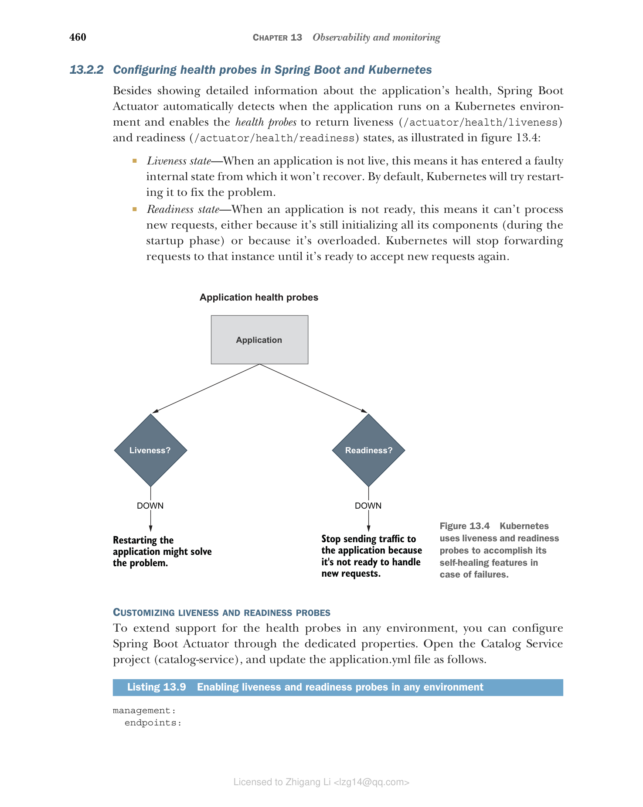

## 13.2 使用 Spring Boot Actuator 和 Kubernetes 实现健康探针

应用部署之后，我们如何判断它是否健康？它能否处理新请求？它是否进入了故障状态？云原生应用应该提供自身的健康信息，以便监控工具和部署平台能够检测到异常并采取相应行动。我们需要专门的健康端点来检查应用的状态，以及它可能用到的任何组件或服务的状态。

部署平台可以周期性调用应用暴露的健康端点。监控工具可以在应用实例不健康时触发告警或通知。在 Kubernetes 的情况下，平台会检查健康端点并自动替换故障实例，或者当应用尚未准备好处理新请求时，暂时停止向它发送流量。

对于 Spring Boot 应用，你可以利用 Actuator 库通过 `/actuator/health` HTTP 端点暴露健康信息，包括应用的状态以及正在使用的组件（如数据库、事件代理和配置服务器）的详细信息。

Spring Boot Actuator 是一个有用的库，它提供了许多监控和管理 Spring Boot 应用的端点。这些端点可以通过 HTTP 或 JMX 暴露，但无论哪种方式，我们都必须保护它们免受未授权访问。我们把自己限制在使用 HTTP 端点，这样我们可以用 Spring Security 定义访问策略，就像我们到目前为止处理过的其他任何端点一样。

本节将介绍在 Spring Boot 应用中使用 Actuator 配置依赖健康端点。然后，你会看到如何定义存活（liveness）和就绪（readiness）探针，以便 Kubernetes 能够利用它的自愈功能。

### 13.2.1 使用 Actuator 为 Spring Boot 应用定义健康探针

首先，打开 Catalog Service 项目（catalog-service）中的 build.gradle 文件，确认它包含了对 Spring Boot Actuator 的依赖（我们在第 4 章中曾用在运行时刷新配置）。

**清单 13.5 在 Catalog Service 中添加 Spring Boot Actuator 的依赖**

```groovy
dependencies {
 ...
 implementation 'org.springframework.boot:spring-boot-starter-actuator'
}
```

保护 Spring Boot Actuator 端点有几种可行的方案。例如，你可以只为 Actuator 端点启用 HTTP Basic 认证，而其他所有端点继续使用 OpenID Connect 和 OAuth2。为简单起见，在 Polar Bookshop 系统中，我们将让 Actuator 端点在 Kubernetes 集群内部保持不认证，并屏蔽来自集群外部的任何访问（你将在第 15 章看到）。

> 警告：在真实的生产场景中，即使是从集群内部，我也会建议保护对 Actuator 端点的访问。

进入 Catalog Service 项目的 SecurityConfig 类，更新 Spring Security 配置以允许对 Spring Boot Actuator 端点进行不认证的访问。

**清单 13.6 允许对 Actuator 端点进行不认证访问**

```java
@EnableWebSecurity
public class SecurityConfig {

 @Bean
 SecurityFilterChain filterChain(HttpSecurity http) throws Exception {
 return http
 .authorizeHttpRequests((authorize) -> authorize
 .mvcMatchers("/actuator/**").permitAll() // 允许对任何 Spring Boot Actuator 端点的未认证访问
 .mvcMatchers(HttpMethod.GET, "/", "/books/**").permitAll()
 .anyRequest().hasRole("employee")
 )
 .oauth2ResourceServer(OAuth2ResourceServerConfigurer::jwt)
 .sessionManagement(sessionManagement -> sessionManagement
 .sessionCreationPolicy(SessionCreationPolicy.STATELESS))
 .csrf(AbstractHttpConfigurer::disable)
 .build();
 }
}
```

最后，打开 Catalog Service 项目（catalog-service）的 application.yml 文件，并配置 Actuator 来暴露 health 这个 HTTP 端点。如果你按照第 4 章的示例操作，你可能已有一个用于 refresh 端点的现有配置。在这种情况下，把它替换为 health 端点即可。

**清单 13.7 暴露 health Actuator 端点**

```yaml
management:
 endpoints:
 web:
 exposure:
 include: health # 通过 HTTP 暴露 /actuator/health 端点
```

让我们验证一下结果。首先需要运行 Catalog Service 用到的所有支撑服务：Config Service、Keycloak 和 PostgreSQL。我们把它们作为容器运行。先把 Config Service 打包成容器镜像（./gradlew bootBuildImage）。然后打开终端窗口，进入你存放 Docker Compose 文件的目录（polar-deployment/docker），运行下面的命令：

```bash
$ docker-compose up -d config-service polar-postgres polar-keycloak
```

确认所有容器就绪后，用 JVM 运行 Catalog Service（./gradlew bootRun），打开另一个终端窗口，向健康端点发送 HTTP GET 请求：

```bash
$ http :9001/actuator/health
```

该端点将返回 Catalog Service 应用的整体健康状态，取值可以是 UP、OUT_OF_SERVICE、DOWN 或 UNKNOWN 之一。当健康状态为 UP 时，该端点返回 200 OK 响应。如果不是，则会产生 503 Service Unavailable 响应。

```json
{
 "status": "UP"
}
```

默认情况下，Spring Boot Actuator 只返回整体健康状态。然而通过学习配置属性，你可以让它提供关于应用用到的若干组件的更具体信息。为了更好地保护对此类信息的访问，你可以让健康详情和组件始终在 show-details 时显示（`always`），或者仅在请求被授权时显示（`when_authorized`）。既然我们没有在应用层面保护 Actuator 端点，那么就让这些额外信息始终可用。

**清单 13.8 配置 health 端点以暴露更多信息**

```yaml
management:
 endpoints:
 web:
 exposure:
 include: health # 始终显示应用的健康详细信息
 endpoint:
 health:
 show-details: always # 始终显示应用所用组件的信息
 show-components: always
```

再一次，重新运行 Catalog Service（./gradlew bootRun），然后向 [http://localhost:9001/actuator/health](http://localhost:9001/actuator/health) 发送 GET 请求。这一次，返回的 JSON 对象包含了应用健康的更详细信息。这里是一个部分结果示例。

```json
{
 "components": { # 关于应用所用组件与功能的详细健康信息
 "clientConfigServer": {
 "details": {
 "propertySources": [
 "configserver:https://github.com/PolarBookshop/config-repo/catalog-service.yml",
 "configClient"
 ]
 },
 "status": "UP"
 },
 "db": {
 "details": {
 "database": "PostgreSQL",
 "validationQuery": "isValid()"
 },
 "status": "UP"
 },
 ...
 },
 "status": "UP" # 应用整体健康状态
}
```

Spring Boot Actuator 提供的通用健康端点对于监控和配置告警或通知很有用，因为它包含应用本身及其与其他支撑服务集成的相关信息。在下一节中，你将看到如何暴露更具体的信息，供部署平台（如 Kubernetes）用于管理容器。

在继续之前，停止应用进程（Ctrl-C），但要保留当前正在运行的所有容器。你很快还会用到它们！

### 13.2.2 在 Spring Boot 和 Kubernetes 中配置健康探针

除了展示有关应用健康的详细信息外，Spring Boot Actuator 还检测运行在 Kubernetes 环境中的应用，并启用健康探针来返回存活（/actuator/health/liveness）和就绪状态（/actuator/health/readiness），如图 13.4 所示：

- **存活状态（liveness）**—— 当应用不可用时，意味着它已进入不会恢复的故障内部状态。默认情况下，Kubernetes 会尝试重启它来修复问题。
- **就绪状态（readiness）**—— 当应用未就绪时，意味着它无法处理新请求，可能是因为它仍在初始化所有组件（在启动阶段），也可能是因为它过载。Kubernetes 将停止向该实例发送流量，直到它准备好接受新请求。



**图 13.4** Kubernetes 使用存活和就绪探针来实现在故障情况下的自愈功能：当存活探针 DOWN 时，重启应用也许能解决问题；当就绪探针 DOWN 时，停止向应用发送流量，因为它还没准备好处理新请求。

定制存活和就绪探针

为了在任何环境中扩展对健康探针的支持，你可以通过专门的配置属性来配置 Spring Boot Actuator。打开 Catalog Service 项目（catalog-service），按如下方式更新 application.yml 文件。

**清单 13.9 在任何环境中启用存活和就绪探针**

```yaml
management:
 endpoints:
 web:
 exposure:
 include: health # 启用对健康探针的支持
 endpoint:
 health:
 show-details: always
 show-components: always
 probes:
 enabled: true
```

看看效果。上一节中 Catalog Service 用到的所有支撑服务应该已在 Docker 里启动并运行。如果没有，回头看说明把它们启动（docker-compose up -d config-service polar-postgres polar-keycloak）。然后用 JVM 运行 Catalog Service（./gradlew bootRun），并调用存活探针的端点：

```bash
$ http :9001/actuator/health/liveness
{
 "status": "UP"
}
```

Spring Boot 应用的存活状态表明它处于正确还是异常的内部状态。如果 Spring 应用上下文已成功启动，则内部状态有效。它不依赖任何外部组件。否则，由于 Kubernetes 会尝试重启异常实例，可能会引起级联故障。

最后，检查就绪探针端点的结果：

```bash
$ curl http://localhost:9001/actuator/health/readiness
{
 "status": "UP"
}
```

Spring Boot 应用的就绪状态表明它是否准备好接受流量并处理新请求。在启动阶段或优雅停机期间，应用未就绪，将拒绝任何请求。如果某个时刻过载，它也可能暂时变为未就绪。当它未就绪时，Kubernetes 不会向应用实例发送任何流量。

当你测试完健康端点后，停止应用（Ctrl-C）和容器（docker-compose down）。

> 注意：继续把 Spring Boot Actuator 添加到 Polar Bookshop 系统组成的所有应用中。在 Order Service 和 Edge Service 中，记得在 SecurityConfig 类中配置允许未认证访问 Actuator 端点，正如我们在 Catalog Service 中那样。在 Dispatcher Service 中，你还需要添加对 Spring WebFlux 的依赖（org.springframework.boot:spring-boot-starter-webflux），因为 Actuator 需要已配置的 Web 服务器来通过 HTTP 提供端点。然后，如本节能学会那样为所有应用配置健康端点。参考，可以参考随书提供的源代码仓库（Chapter13/13-end）。

默认情况下，Spring Boot 的就绪探针不依赖任何外部组件。你可以自行决定是否将任何外部系统纳入就绪探针。

例如，Catalog Service 对于 Order Service 而言是一个外部系统。它应该被包含在就绪探针中吗？由于 Order Service 采用了韧性模式来处理 Catalog Service 不可用的场景，因此应该将 Catalog Service 排除在就绪探针之外。当它不可用时，Order Service 将继续正常工作，只是功能会优雅地降级。

再考虑另一个例子。Edge Service 依赖 Redis 来存储和检索会话数据。你应该把它放在就绪探针吗？由于 Edge Service 无法在访问不到 Redis 时处理任何新请求，因此把 Redis 纳入就绪探针可能是个好主意。Spring Boot Actuator 会将应用内部状态、以及与 Redis 的集成情况结合起来，判断应用是否准备好接受新请求。

在 Edge Service 项目（edge-service）中，打开 application.yml 文件，定义就绪探针中使用哪些指示器（indicator）：应用标准就绪状态和 Redis 健康状态。我假设你已经为 Edge Service 添加了 Spring Boot Actuator，并按先前所述配置了健康端点。

**清单 13.10 将 Redis 纳入就绪状态的计算**

```yaml
management:
 endpoints:
 web:
 exposure:
 include: health
 endpoint:
 health:
 show-details: always
 show-components: always
 probes:
 enabled: true
 group:
 readiness:
 include: readinessState,redis # 就绪探针将结合应用的就绪状态和 Redis 的可用性
```

在 Kubernetes 中配置存活和就绪探针

Kubernetes 依靠健康探针（存活和就绪）来完成其作为容器编排器的任务。例如，当一个应用的目标状态是有三个副本时，Kubernetes 确保始终有三个应用实例在运行。如果其中任何一个实例的存活探针未返回 200 响应，Kubernetes 就会重启它。在启动或升级应用实例时，我们希望这个过程对用户来说不产生停机。因此，Kubernetes 在实例就绪之前不会把它启用到负载均衡器中——也就是说，直到就绪探针返回 200 响应、实例准备好接受新请求时。

由于存活和就绪信息与应用相关，Kubernetes 需要应用自身声明如何获取该信息。依托 Actuator，Spring Boot 应用把存活和就绪探针作为 HTTP 端点提供。现在来看看如何配置 Kubernetes 使用这些端点作为健康探针。

在你的 Catalog Service 项目（catalog-service）中，打开 Deployment 清单（k8s/deployment.yml），并按如下方式为存活和就绪探针添加配置。

**清单 13.11 为 Catalog Service 配置存活和就绪探针**

```yaml
apiVersion: apps/v1
kind: Deployment
metadata:
 name: catalog-service
...
spec:
 ...
 template:
 ...
 spec:
 containers:
 - name: catalog-service
 image: catalog-service
 ...
 livenessProbe: # 存活探针的配置
 httpGet: # 使用 HTTP GET 请求获取存活状态
 path: /actuator/health/liveness # 要调用来获取存活状态的端点
 port: 9001 # 获取存活状态使用的端口
 initialDelaySeconds: 10 # 开始检查存活状态前的初始延迟
 periodSeconds: 5 # 检查存活状态的频率
 readinessProbe: # 就绪探针的配置
 httpGet:
 path: /actuator/health/readiness
 port: 9001
 initialDelaySeconds: 5
 periodSeconds: 15
```

这两个探针都可以进行配置，使 Kubernetes 在初始延迟（initialDelaySeconds）后才开始使用它们，你还可以定义调用它们的频率（periodSeconds）。初始延迟应考虑到应用需要几秒钟才能启动，并且取决于可用的计算资源。轮询周期不应太长，以减少应用实例进入故障状态与平台自愈动作之间的时间间隔。

> 警告：如果你在资源受限的环境中运行这些示例，可能需要调整初始延迟和轮询频率，以便给应用更多时间启动并就绪以接受请求。如果你的 Apple Silicon 计算机上运行则可能也需要这样做。当你在 Apple Silicon 电脑上运行这些示例时，直到 ARM64 支持成为 Paketo Buildpacks 的一部分（你可以关注此处的更新：[https://github.com/paketo-buildpacks/stacks/issues/51](https://github.com/paketo-buildpacks/stacks/issues/51)）。这是因为 AMD64 容器镜像在 Apple Silicon（ARM64）上通过基于 Rosetta 的兼容层运行，这会影响应用启动时间。

继续为 Polar Bookshop 系统的所有应用在 Deployment 清单中配置存活和就绪探针。作为参考，你可以查看随书提供的源代码仓库（Chapter13/13-end）。

在事件日志之外，健康信息提高了我们推断应用内部状态的能力，但还不足以实现完整的可见性。下一节将介绍指标（metrics）的概念，以及如何在 Spring Boot 中应用配置指标。