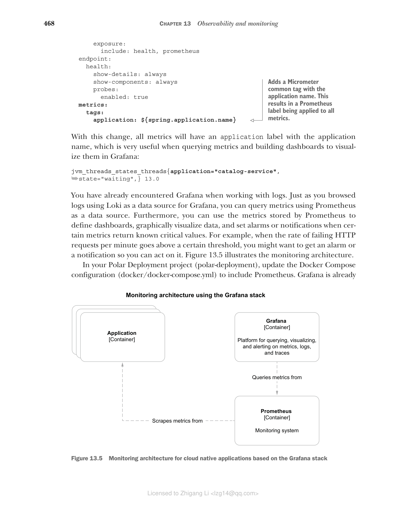
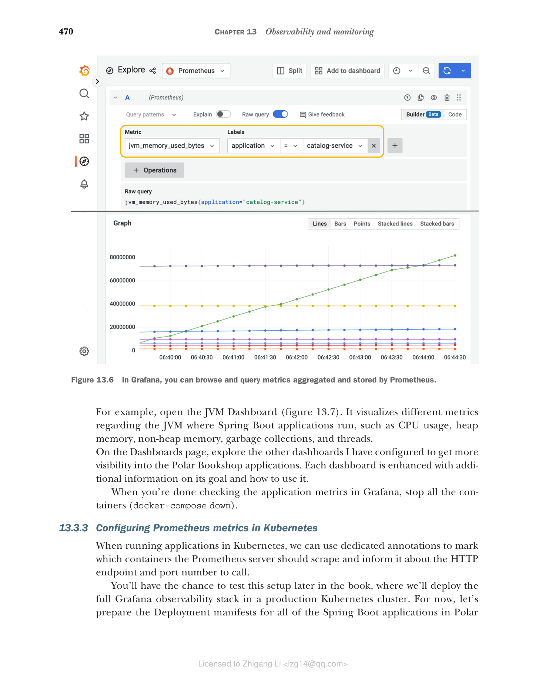
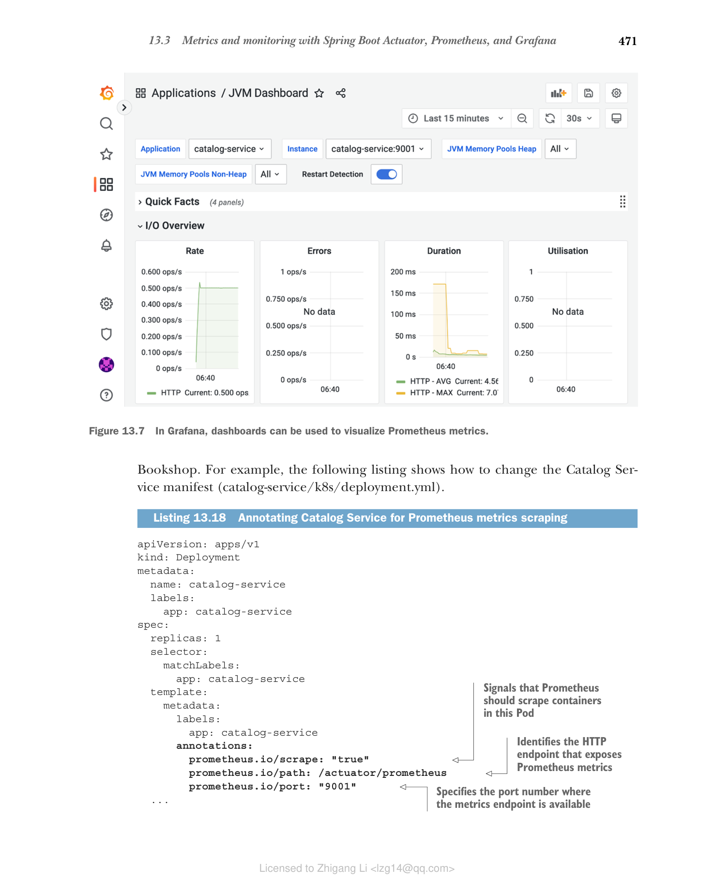

## 13.3 使用 Spring Boot Actuator、Prometheus 和 Grafana 进行指标监控

要正确监控、管理和排查生产环境中运行的应用问题，我们需要能回答诸如"应用消耗了多少 CPU 和 RAM？""随着时间推移使用了多少线程？"以及"失败请求的比率是多少？"的问题。事件日志和健康探针无法帮助我们回答这些问题。我们需要更多数据。

指标是有关应用的数值数据，在固定的时间间隔内测量和聚合。我们使用指标来跟踪某个事件的发生（例如收到一个 HTTP 请求）、统计项目数量（例如分配的 JVM 线程数）、测量执行任务所花费的时间（例如数据库查询的延迟），或者获取资源的当前值（例如当前的 CPU 和 RAM 消耗）。这些都是理解应用为何表现异常的重要信息。你可以监视指标，并为其设置告警或通知。

Spring Boot Actuator 开箱即用地利用 Micrometer 库（https://micrometer.io）收集应用指标。Micrometer 包含插桩代码，用于从基于 JVM 的应用的常见组件中收集有价值的指标。它提供了一个厂商无关的门面（façade），因此你可以用不同格式导出 Micrometer 收集的指标，例如 Prometheus/OpenMetrics、Humio、Datadog 和 VMware Tanzu Observability。正如 SLF4J 为日志库提供厂商无关的门面一样，Micrometer 对指标导出器也是如此。

除了 Spring Boot 配置的默认 Micrometer 插桩库之外，你还可以导入额外的插桩，从特定库（如 Resilience4J）收集指标，甚至定义自己的插桩，且无供应商锁定。

最常见的指标导出格式是由 Prometheus 使用的，"一个开源系统监控和告警工具包"（https://prometheus.io）。就像 Loki 聚合和存储事件日志一样，Prometheus 对指标做同样的事情。

### 13.3.1 使用 Spring Boot Actuator 和 Micrometer 配置指标

Spring Boot Actuator 开箱即用地自动配置 Micrometer 来收集 Java 应用的指标。暴露这类指标的一种方法是通过启用 Actuator 实现的 /actuator/metrics HTTP 端点。让我们看看怎么做。

在 Catalog Service 项目（catalog-service）中，更新 application.yml 文件，通过 HTTP 暴露 metrics 端点。

**清单 13.12 暴露 metrics Actuator 端点**

```yaml
management:
 endpoints:
 web:
 exposure:
 include: health, metrics # 同时暴露 health 和 metrics 端点
```

用下面的命令确保 Catalog Service 所需的支撑服务已启动并运行：

```bash
$ docker-compose up -d polar-keycloak polar-postgres
```

然后运行应用（./gradlew bootRun），并调用 /actuator/metrics 端点：

```bash
$ http :9001/actuator/metrics
```

结果是你在应用里探查到的指标集合。你可以把某个指标的名称附加到端点上做进一步调查（例如，/actuator/metrics/jvm.memory.used）。

Micrometer 提供生成这些指标所需的插桩，但你可能希望以不同格式导出它们。在决定采用哪种监控方案收集并存储指标之后，你需要为该工具添加特定的依赖。在 Grafana 技术栈中，该工具就是 Prometheus。

在 Catalog Service 项目（catalog-service）中，编辑 build.gradle 文件，添加对 Micrometer Prometheus 集成库的依赖。记住在新增之后刷新或重新导入 Gradle 依赖。

**清单 13.13 添加对 Micrometer Prometheus 的依赖**

```groovy
dependencies {
 ...
 runtimeOnly 'io.micrometer:micrometer-registry-prometheus'
}
```

然后更新 application.yml 文件以暴露 prometheus Actuator 端点。我们不再需要更通用的 metrics 端点，因为不会再使用它了，所以你也可以移除它。

**清单 13.14 暴露 prometheus Actuator 端点**

```yaml
management:
 endpoints:
 web:
 exposure:
 include: health, prometheus # 同时暴露 health 和 prometheus 端点
```

Prometheus 默认采用拉取式（pull-based）策略，即 Prometheus 实例以固定时间间隔从应用专用的端点（在 Spring Boot 场景为 /actuator/prometheus）抓取（拉取）指标。重新运行应用（./gradlew bootRun），调用 Prometheus 端点查看结果：

```bash
$ http :9001/actuator/prometheus
```

结果是与 metrics 端点相同的指标集合，但这次是以 Prometheus 理解的格式导出的。下面是我们从完整响应中截取的一段，突出显示了与当前线程数相关的指标：

```text
# HELP jvm_threads_states_threads The current number of threads
# TYPE jvm_threads_states_threads gauge
jvm_threads_states_threads{state="terminated",} 0.0
jvm_threads_states_threads{state="blocked",} 0.0
jvm_threads_states_threads{state="waiting",} 13.0
jvm_threads_states_threads{state="timed-waiting",} 7.0
jvm_threads_states_threads{state="new",} 0.0
jvm_threads_states_threads{state="runnable",} 11.0
```

这种格式基于纯文本，称为 Prometheus exposition format。由于 Prometheus 被广泛用于生成和导出指标，这种格式已在 OpenMetrics（https://openmetrics.io，一个 CNCF 孵化项目）中得以整合和标准化。根据 HTTP 请求的 Accept 头，Spring Boot 同时支持原始的 Prometheus 格式（默认行为）和 OpenMetrics。如果你想取得 OpenMetrics 格式的指标，需要专门指定这个请求参数：

```bash
$ http :9001/actuator/prometheus \
 'Accept:application/openmetrics-text; version=1.0.0; charset=utf-8'
```

当你完成 Prometheus 指标分析后，停止应用（Ctrl-C）和所有容器（docker-compose down）。

> 注意：你可能遇到这样的场景：需要从瞬时应用或不足以被拉取的批处理作业中采集指标。在这种情况下，Spring Boot 会让你采取一种推送式（push-based）策略，使应用自己把指标发到 Prometheus 服务器。官方文档说明了如何配置这一行为（http://spring.io/projects/spring-boot）。

Spring Boot Actuator 依赖 Micrometer 插桩，并自动配置为你的应用中用到的不同技术生成指标：JVM、日志器、Spring MVC、Spring WebFlux、RestTemplate、WebClient、数据源、Hibernate、Spring Data、RabbitMQ 等。

当 Spring Cloud Gateway 在 classpath 中时，就像 Edge Service 的情况，会导出关于网关路由的额外指标。像 Resilience4J 这样的库，会通过专门的依赖对 Micrometer 插桩发出额外的指标注册。

打开 Edge Service 项目（edge-service）的 build.gradle 文件，添加下面的依赖，为 Resilience4J 提供 Micrometer 插桩。记得在添加新依赖后刷新或重新导入 Gradle 依赖。

**清单 13.15 添加对 Micrometer Resilience4J 的依赖**

```groovy
dependencies {
 ...
 runtimeOnly 'io.github.resilience4j:resilience4j-micrometer'
}
```

现在我们已经配置了 Spring Boot 暴露指标，再来看如何配置 Prometheus 抓取指标并使用 Grafana 进行可视化。

### 13.3.2 使用 Prometheus 和 Grafana 监控指标

与 Loki 一样，Prometheus 负责收集和存储指标。它还提供了可视化工具 GUI 来可视化指标和定义告警，但我们将使用 Grafana 来做，因为 Grafana 是一种更全面的工具。

指标以时间序列数据的形式存储，包含注册时的时间戳和定义的标签（如果有）。在 Prometheus 中，标签（labels）是键值对，为所记录的指标增加更多信息。例如，记录应用使用线程数的指标，可以添加描述线程状态（例如阻塞、等待或空闲）的标签。标签有助于聚合和查询指标。

Micrometer 提供了 tags 的概念，与 Prometheus 的 labels 等价。在 Spring Boot 中，你可以利用配置属性为应用生成的所有指标定义通用标签。例如，添加一个 application 标签，把生成某指标的应用名称标记到该指标上是有用的。

打开 Catalog Service 项目（catalog-service），进入 application.yml 文件，用一个应用名定义 Micrometer 标签，这个标签会应用到所有指标上。由于应用名称已在 spring.application.name 属性中定义，让我们重用它而不是复制值。

**清单 13.16 用应用名称标记所有指标**

```yaml
management:
 endpoints:
 web:
 exposure:
 include: health, prometheus
 endpoint:
 health:
 show-details: always
 show-components: always
 probes:
 enabled: true
 metrics:
 tags:
 application: ${spring.application.name} # 添加一个包含应用名称的 Micrometer 公共标签。它形成一个应用于所有指标的 Prometheus 标签。
```

如此更改后，所有指标都会带一个应用名为 application 的标签，这在查询指标和构建 Grafana 仪表盘可视化时非常有用：

```text
jvm_threads_states_threads{application="catalog-service",state="waiting",} 13.0
```

此前你已经在前面的日志场景中遇到过 Grafana。就像用 Loki 作为数据源浏览日志一样，你可以用 Prometheus 作为数据源查询指标。此外，你可以使用 Prometheus 存储的指标来定义仪表盘、图形化地展示数据，并在某些指标返回已知的关键值时设置告警或通知。例如，当每分钟失败 HTTP 请求的比率超过某一阈值，你可能希望收到告警或通知来采取行动。图 13.5 展示了监控架构。



**图 13.5 基于 Grafana 技术栈的云原生应用指标监控架构**（应用通过 /actuator/prometheus 端点暴露指标；Prometheus 容器使用抓取（pull）策略收集和存储指标；Grafana 容器提供平台，用于查询、可视化并对指标、日志和追踪设置警报）

在 Polar Deployment 项目（polar-deployment）中，更新 Docker Compose 配置（docker-compose.yml）来包含 Prometheus。Grafana 已经配置了 Prometheus 作为数据源，配置来自你之前导入到项目中的文件（Chapter13/13-end/polar-deployment/docker/observability）。

**清单 13.17 定义 Prometheus 容器收集指标**

```yaml
version: "3.8"
services:

 ...

 grafana:
 image: grafana/grafana:9.1.2
 container_name: grafana
 depends_on:
 - loki # 确保 loki 和 prometheus 在 Grafana 之前启动
 - prometheus
 ...

 prometheus:
 image: prom/prometheus:v2.38.0
 container_name: prometheus
 ports:
 - "9090:9090"
 volumes: # 用于加载 Prometheus 抓取配置的卷
 - ./observability/prometheus/prometheus.yml:/etc/prometheus/prometheus.yml
```

与 Loki 不同，我们不需要一个专门收集应用指标的组件。Prometheus Server 容器既能收集又能存储指标。

接下来打开一个终端窗口，导航到 Docker Compose 所在文件夹（polar-deployment/docker），用以下命令运行完整的监控技术栈：

```bash
$ docker-compose up -d grafana
```

Prometheus 容器被配置为每 2 秒从 Polar Bookshop 系统中所有以容器运行的 Spring Boot 应用轮询一次指标。打包 Catalog Service 镜像（./gradlew bootBuildImage），并通过 Docker Compose 运行它：

```bash
$ docker-compose up -d catalog-service
```

向 Catalog Service 发送几个请求（http :9001/books），然后打开浏览器访问 http://localhost:3000 的 Grafana（user/password）。在 Explore 部分，您也可以和浏览日志一样查询指标。选择 Prometheus 作为数据源，从时间下拉菜单中选择 Last 5 Minutes，然后查询应用相关的 JVM 内存指标如下（图 13.6）：

```
jvm_memory_used_bytes{application="catalog-service"}
```



**图 13.6 在 Grafana 中，你可以浏览和查询 Prometheus 聚合和存储的指标。**

指标数据可用于绘制仪表盘，来监控不同的应用方面。从左侧菜单选择 Dashboards > Manage，浏览我在 Grafana 中提供的、归在 Application 文件夹下的仪表盘。

例如，打开 JVM 仪表盘（图 13.7）。它可视化与运行 Spring Boot 的 JVM 的不同方面相关的指标，如 CPU 使用率、堆内存、非堆内存、垃圾回收和线程。



**图 13.7 在 Grafana 中，JVM 仪表盘可视化与 Spring Boot 应用运行的 JVM 相关的指标。**

在 Dashboards 页面上，探索我配置的其他仪表盘，获得对 Polar Bookshop 应用更多的可见性。每个仪表盘都配有关于其目标和如何使用它的附加信息。

在 Grafana 中查看应用指标完成后，停止所有容器（docker-compose down）。

### 13.3.3 在 Kubernetes 中配置 Prometheus 指标

在 Kubernetes 中运行应用时，我们可以使用专用注解来标记 Prometheus 服务器应该抓取哪些容器，并告知抓取 HTTP 端点和端口号。

稍后你会有机会在本章稍后测试该设置，届时我们会把完整的 Grafana 可观测性技术栈部署到生产 Kubernetes 集群。目前，先为 Polar Bookshop 中所有 Spring Boot 应用的 Deployment 清单做准备。比如下面的清单展示了如何修改 Catalog Service 清单（catalog-service/k8s/deployment.yml）。

**清单 13.18 注释 Catalog Service 以进行 Prometheus 指标抓取**

```yaml
apiVersion: apps/v1
kind: Deployment
metadata:
 name: catalog-service
 labels:
 app: catalog-service
spec:
 replicas: 1
 selector:
 matchLabels:
 app: catalog-service
 template:
 metadata:
 labels:
 app: catalog-service
 annotations: # 指示此 Pod 中的容器应被 Prometheus 抓取
 prometheus.io/scrape: "true"
 prometheus.io/path: /actuator/prometheus # 识别暴露 Prometheus 指标的 HTTP 端点
 prometheus.io/port: "9001" # 指标端点所在的端口
 ...
```

Kubernetes 清单中的注解应该是字符串类型，因此对于可能被误解析为整数或布尔值的值，需要使用引号。

接下来，为 Polar Bookshop 系统中其余的应用配置指标和 Prometheus，包括 Kubernetes 清单的配置。作为参考，你可以查看随本书提供的源代码仓库（Chapter13/13-end）。

下一节将介绍另一种监控应用并使其可观测所需的遥测数据：追踪（traces）。