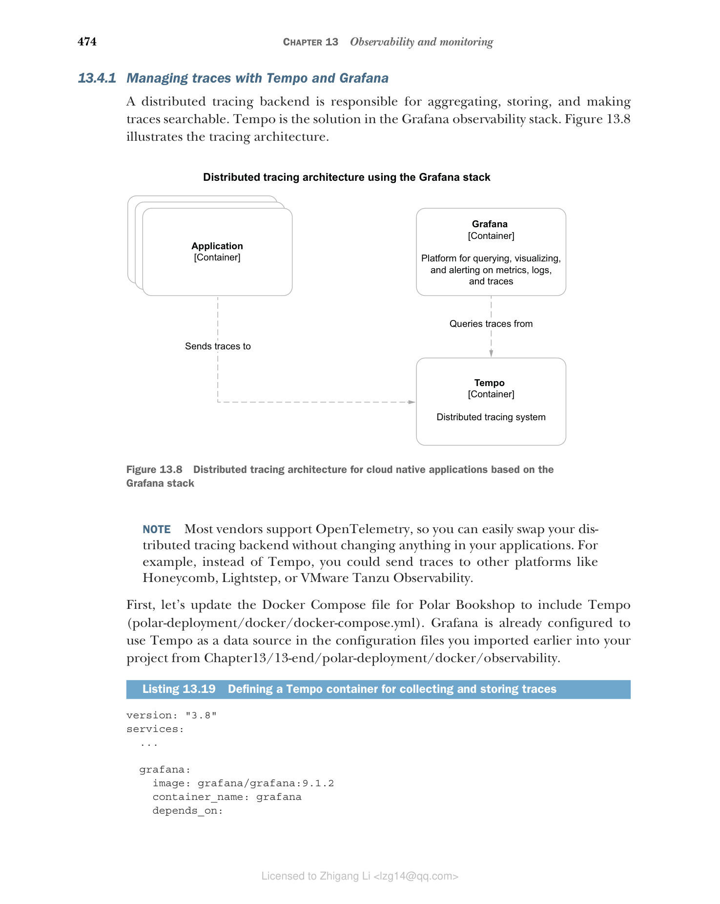
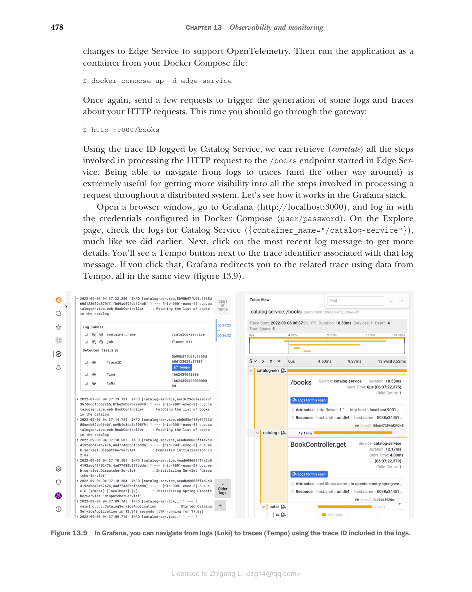

## 13.4 使用 OpenTelemetry 和 Tempo 实现分布式追踪

事件日志、健康探针和指标提供了大量有价值的数据来推断应用的内部状态。然而，它们都没有考虑到云原生应用是分布式系统这一事实。一个用户请求很可能由多个应用处理，但到目前为止，我们没有办法跨应用边界关联数据。

解决该问题的一个简单方法是在系统的边缘为每个请求生成标识符（关联 ID，correlation ID），在事件日志中使用它，并将其传递给涉及的其它服务。利用该关联 ID，我们可以从多个应用中获取与某个特定事务相关的所有日志消息。

如果我们沿着这个思路继续延伸，就会得到分布式追踪（distributed tracing）——一种跟踪请求在分布式系统中传播过程的技术，它让我们能够定位错误发生的位置并排查性能问题。分布式追踪有三个核心概念：

- **追踪（trace）**—— 代表与某个请求或事务相关的一组活动，通过唯一标识的 trace ID 进行标识。它由一个或多个服务中的多个 span（跨度）组成。
- **span（跨度）**—— 请求处理的每个步骤被称为一个 span，其特征是开始和结束时间戳，并由 trace ID 和 span ID 组成的元组唯一标识。
- **标签（tags）**—— 标签是元数据，用于提供与 span 上下文相关的附加信息，例如请求 URI、当前已登录用户的用户名或租户标识符。

让我们看一个例子。在 Polar Bookshop 中，你可以通过网关（Edge Service）获取书籍，然后请求被转发到 Catalog Service。与处理这样一个请求相关的 trace 会涉及这两个应用，至少需要三个 span：

- 第一个 span 是 Edge Service 接受初始 HTTP 请求所执行的步骤。
- 第二个 span 是 Edge Service 将请求路由到 Catalog Service 所执行的步骤。
- 第三个 span 是 Catalog Service 处理被路由过来的请求所执行的步骤。

分布式追踪技术有多种选择。首先，我们必须选择生成和传播 trace 时使用的格式和协议。为此，我们将使用 OpenTelemetry（也简称为 OTel），它是一个 CNCF 正在孵化的项目，正迅速成为分布式追踪的事实标准，目标是把遥测数据的收集统一起来（https://opentelemetry.io）。

然后，我们需要决定是直接使用 OpenTelemetry（使用 OpenTelemetry Java 插桩），还是依赖一个用于避免厂商锁定、兼容不同分布式追踪系统的门面（例如 Spring Cloud Sleuth）。我们将采用第一个方案。

一旦应用完成分布式追踪的插桩，我们就需要一个工具来收集和存储 trace。在 Grafana 可观测性技术栈中，分布式追踪后端是 Tempo，一个"让你以最小的运维成本和比以往更低的复杂度来尽可能扩展追踪"的项目（https://grafana.com/oss/tempo）。与我们使用 Prometheus 的方式不同，Tempo 采用推送式（push-based）策略，由应用本身把数据推送到分布式追踪后端。

本节将演示如何用 Tempo 完成 Grafana 可观测性技术栈的配置，并使用它收集和存储 trace。然后我将向你展示如何在 Spring Boot 应用中使用 OpenTelemetry Java 插桩来生成并发送 trace 到 Tempo。最后，你将学习如何从 Grafana 查询 trace。

> 更多信息：OpenTelemetry、Spring Cloud Sleuth 和 Micrometer Tracing
>
> 实现分布式追踪以及定义生成和传播 trace 与 span 的准则方面已涌现出多个标准。OpenZipkin 是其中更成熟的项目（https://zipkin.io）。OpenTracing 和 OpenCensus 是较新的项目，尝试标准化应用代码的插桩方式以支持分布式追踪。两者现在都已废弃，因为它们联合起来共同推动了 OpenTelemetry——这个最终目标是"对遥测数据（指标、日志和追踪）进行插桩、生成、收集和导出"的框架。Tempo 支持所有这些方案。
>
> Spring Cloud Sleuth（https://spring.io/projects/spring-cloud-sleuth）是一个为 Spring Boot 应用提供分布式追踪自动配置的项目。它负责对 Spring 应用中常用的库进行插桩，并在特定的分布式追踪库之上封装提供一层抽象。它的默认选择是 OpenZipkin。
>
> 在本书中，我决定向你展示如何直接使用 OpenTelemetry Java 插桩，有两个主要原因。第一，截至写作本书时，Spring Cloud Sleuth 对 OpenTelemetry 的支持仍处于实验性阶段，尚不适合生产环境（https://github.com/spring-projects-experimental/spring-cloud-sleuth-otel）。
>
> 第二，一旦 Spring Framework 6 和 Spring Boot 3 发布，Spring Cloud Sleuth 将不再进一步开发。Spring 项目将 Sleuth 的核心框架捐献给了 Micrometer，并创建了新的 Micrometer Tracing 子项目，旨在为 trace 提供厂商无关的门面，就像 Micrometer 对指标已经做到的那样。Micrometer Tracing 将支持 OpenZipkin 和 OpenTelemetry。借助 Micrometer Tracing，代码插桩将成为所有 Spring 库的核心特性，这都是 Spring Observability 计划的一部分。

### 13.4.1 使用 Tempo 和 Grafana 管理 trace

分布式追踪后端负责聚合、存储 trace 并使之可搜索。Tempo 就是 Grafana 可观测性技术栈中的解决方案。图 13.8 展示了追踪架构。



**图 13.8 基于 Grafana 技术栈的云原生应用分布式追踪架构**（应用通过 OpenTelemetry 协议把 trace 发到 Tempo；Grafana 作为平台，用于查询、可视化追踪）

> 注意：大多数厂商支持 OpenTelemetry 协议，因此你可以轻松更换你的分布式追踪后端，无需在应用中做任何更改。例如，除了 Tempo，你还可以把 trace 发送到 Honeycomb、Lightstep 或 VMware Tanzu Observability 等其他平台。

先更新 Polar Bookshop 的 Docker Compose 文件以包含 Tempo（polar-deployment/docker/docker-compose.yml）。Grafana 已经在配置文件中配置了使用 Tempo 作为数据源，这些配置文件是你早些时候从 Chapter13/13-end/polar-deployment/docker/observability 导入到项目中的。

**清单 13.19 定义用于收集和存储 trace 的容器**

```yaml
version: "3.8"
services:

  ...

  grafana:
    image: grafana/grafana:9.1.2
    container_name: grafana
    depends_on:
      - loki            # 确保 Tempo 在 Grafana 之前启动
      - prometheus
      - tempo

  tempo:
    image: grafana/tempo:1.5.0
    container_name: tempo
    command: -config.file /etc/tempo-config.yml   # 在启动阶段加载自定义配置
    ports:
      - "4317:4317"     # 用于通过 gRPC 上的 OpenTelemetry 协议接收 trace 的端口
    volumes:
      - ./observability/tempo/tempo.yml:/etc/tempo-config.yml  # 使用卷加载 Tempo 的配置
```

接下来，在 Docker 上运行完整的 Grafana 可观测性技术栈。打开终端窗口，进入你存放 Docker Compose 文件的目录，运行以下命令：

```bash
$ docker-compose up -d grafana
```

Tempo 现在已准备好通过 4317 端口的 gRPC 接收 OpenTelemetry 协议下发送的 trace。在下一节中，你将看到如何更新 Spring Boot 应用来生成 trace 并把它们发送给 Tempo。

### 13.4.2 使用 OpenTelemetry 在 Spring Boot 中配置追踪

OpenTelemetry 项目包含插桩，可为最常见的 Java 库生成 trace 和 span，包括 Spring、Tomcat、Netty、Reactor、JDBC、Hibernate 和 Logback。OpenTelemetry Java Agent 是该项目提供的一个 JAR 构件，可以附加到任何 Java 应用上。它会在运行时动态注入字节码，从所有这些库中捕获 trace 和 span，并以不同的格式导出它们，无需更改你的 Java 源代码。

Java agent 通常被从外部在运行时提供给应用。为了更好的依赖管理能力，在这种情况下，我更喜欢用 Gradle（或 Maven）把 agent JAR 文件包含到最终的应用产物中。让我们看看怎么做。

打开你的 Catalog Service 项目（catalog-service），在 build.gradle 文件中添加对 OpenTelemetry Java Agent 的依赖。添加完新依赖后记得刷新或重新导入 Gradle 依赖。

**清单 13.20 在 Catalog Service 中添加对 OpenTelemetry Java Agent 的依赖**

```groovy
ext {                                // OpenTelemetry 的版本
  ...
  set('otelVersion', "1.17.0")
}

dependencies {                       // 通过字节码对 Java 代码进行 OpenTelemetry 插桩的 agent
  ...
  runtimeOnly "io.opentelemetry.javaagent:opentelemetry-javaagent:${otelVersion}"
}
```

除了对 Java 代码进行插桩以捕获 trace，OpenTelemetry Java Agent 还集成了 SLF4J（及其实现）。它通过 SLF4J 提供的 MDC 抽象，将 trace 和 span 标识符作为上下文信息注入到日志消息中。这就使得从日志消息导航到 trace（以及反向导航）极其简单，相比孤立地查询遥测，能让人们更真切地提高对应用的可见性。

让我们扩展 Spring Boot 使用的默认日志格式，添加以下上下文：

- **应用名称**（来自我们为所有应用配置的 `spring.application.name` 属性）
- **Trace 标识符**（来自启用时由 OpenTelemetry agent 填充的 `trace_id` 字段）
- **Span 标识符**（来自启用时由 OpenTelemetry agent 填充的 `span_id` 字段）

在 Catalog Service 项目中，打开 application.yml 文件，按照 Logback 语法，在日志级别（由 `%5p` 表示）旁边添加这三项新信息。这与 Spring Cloud Sleuth 使用的格式相同。

**清单 13.21 在日志中、级别字段旁边添加上下文信息**

```yaml
logging:
  pattern:
    level: "%5p [${spring.application.name},%X{trace_id},%X{span_id}]"  # 在日志级别（%5p）旁边加入应用名称、trace ID 和 span ID
```

接下来，打开终端窗口，进入 Catalog Service 根目录，运行 `./gradlew bootBuildImage` 将应用打包为容器镜像。

最后一步是配置并启用 OpenTelemetry Java Agent。为简单起见，我们只在容器中运行应用时启用 OpenTelemetry，并依赖环境变量对其进行配置。

要成功启用追踪，我们需要三部分配置：

- **指示 JVM 加载 OpenTelemetry Java agent**。我们可以通过 JAVA_TOOL_OPTIONS 这个 OpenJDK 支持的标准环境变量向 JVM 提供这部分配置。
- **使用应用名称来标记和分类 trace**。我们将使用 OpenTelemetry Java Agent 支持的 OTEL_SERVICE_NAME 环境变量。
- **定义分布式追踪后端的 URL**。在我们的场景中是 4317 端口上的 Tempo，可通过 OpenTelemetry Java Agent 支持的 OTEL_EXPORTER_OTLP_ENDPOINT 环境变量配置。默认情况下，trace 通过 gRPC 发送。

转到你的 Polar Deployment 项目（polar-deployment），打开 Docker Compose 文件（docker/docker-compose.yml），然后为 Catalog Service 添加支持追踪所需的相关配置。

**清单 13.22 为 Catalog Service 容器定义 OpenTelemetry**

```yaml
version: "3.8"
services:

  ...

  catalog-service:
    depends_on:           # 确保 Tempo 在 Catalog Service 之前启动
      - fluent-bit
      - polar-keycloak
      - polar-postgres
      - tempo
    image: "catalog-service"
    container_name: "catalog-service"
    ports:
      - 9001:9001
      - 8001:8001
    environment:          # 指示 JVM 从 Cloud Native Buildpacks 放置应用依赖的路径运行 OpenTelemetry Java Agent
      - JAVA_TOOL_OPTIONS=-javaagent:/workspace/BOOT-INF/lib/opentelemetry-javaagent-1.17.0.jar
      - OTEL_SERVICE_NAME=catalog-service       # 应用名称，用于标记 Catalog Service 生成的 trace
      - OTEL_EXPORTER_OTLP_ENDPOINT=http://tempo:4317  # 支持 OTLP（OpenTelemetry 协议）的分布式追踪后端的 URL
      - OTEL_METRICS_EXPORTER=none
```

最后，在同一个目录下以容器方式运行 Catalog Service：

```bash
$ docker-compose up -d catalog-service
```

应用启动运行之后，发送几个请求以触发生成一些有关 HTTP 请求的日志和 trace：

```bash
$ http :9001/books
```

然后检查该容器的日志（docker logs catalog-service）。你会看到每个日志消息现在都包含一段新的说明，包含应用名称以及（当可用时）trace 和 span 的标识符，例如：

```text
[catalog-service,d9e61c8cf853fe7fdf953422c5ff567a,eef9e08caea9e32a]
```

分布式追踪能够帮助我们跨多个服务追踪一个请求，因此我们需要另一个应用来测试它是否能正常工作。

现在，继续为 Edge Service 做同样的更改以支持 OpenTelemetry。然后从你的 Docker Compose 文件运行应用：

```bash
$ docker-compose up -d edge-service
```

再一次，你可以发送几个请求以触发有关 HTTP 请求的日志和 trace 的生成。这次你应该走〔Edge Service〕网关：

```bash
$ http :9000/books
```

利用 Catalog Service 记录的 trace ID，我们可以检索（关联）从 Edge Service 开始的 /books 端点 HTTP 请求处理所涉及的所有步骤。能够从日志导航到 trace（以及反过来），对于深入了解请求在分布式系统中被处理的整个过程极有价值。让我们看看它在 Grafana 技术栈中是如何工作的。

打开浏览器进入 Grafana（http://localhost:3000），使用 Docker Compose 中配置的凭据登录（user/password）。在 Explore 页面，与我们之前类似的操作，检查 Catalog Service 的日志（{container_name="/catalog-service"}）。接着，点击最新的日志消息，获取更多详细信息。你会看到一个 Tempo 按钮出现在与该日志消息关联的 trace 标识符旁边。点击它，Grafana 就会利用 Tempo 的数据在同一视图中把界面跳转到相关联的 trace（图 13.9）。



**图 13.9 在 Grafana 中，你可以利用日志中引入的 trace ID 从日志（Loki）导航到追踪（Tempo）。**

检查完日志和 trace 之后，停止所有容器（docker-compose down）。在进入下一步之前，为 Polar Bookshop 系统中剩余的所有应用配置 OpenTelemetry。作为参考，你可以查看随书提供的源代码仓库（Chapter13/13-end）。

到目前为止，我们已经掌握了三种主要的遥测数据：日志、指标和 trace。我们也启用了健康端点来提供与应用状态相关的附加信息。下一节将介绍如何从应用获取更多信息，从而实现对应用运行的更强的可见性。