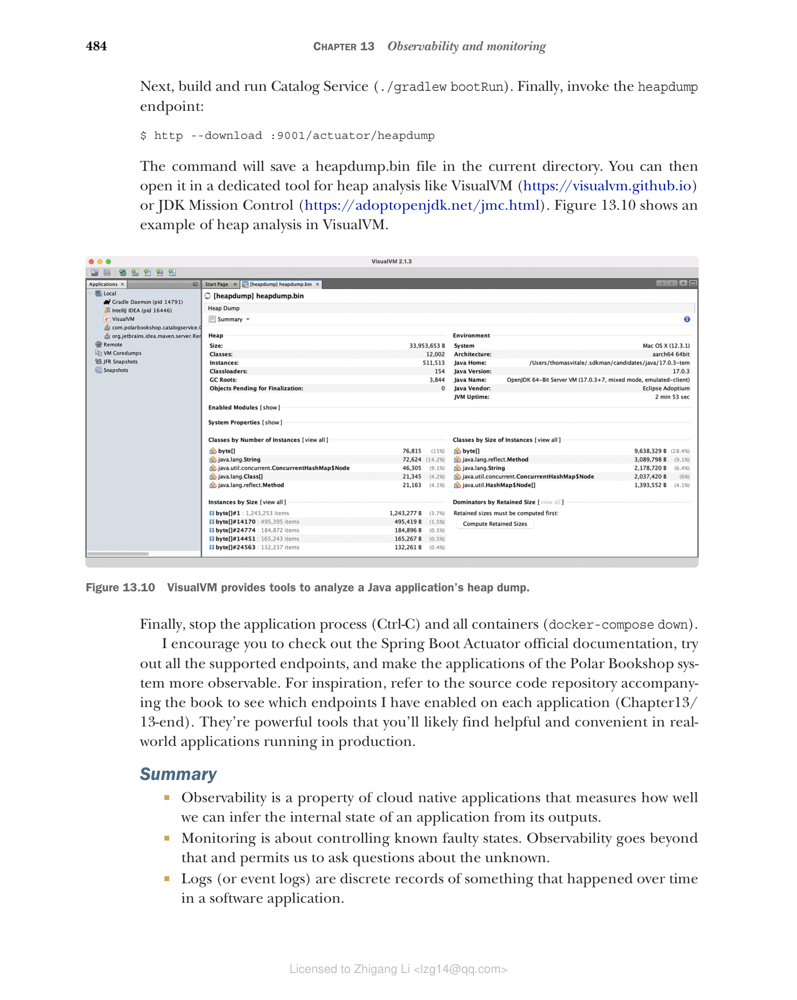

## 13.5 使用 Spring Boot Actuator 进行应用管理和监控

在前面几节中，我向你展示了所有云原生应用都应提供的主要遥测数据，以实现更好的可观测性。这最后一节将专门介绍如何从应用检索一些特定的信息，进一步增强你对其运行的判断能力。

Spring Boot Actuator 提供了许多功能，使你的应用具备生产就绪（production-ready）能力。你已经了解了健康端点和指标端点，但还有很多其它的端点。表 13.1 列出了 Actuator 实现的几个最有用的管理和监控端点。本节将演示其中一些端点的用法。

**表 13.1 Spring Boot Actuator 暴露的其中一些最有用的管理和监控端点**

| 端点 | 描述 |
|------|------|
| /beans | 显示应用管理的所有 Spring bean 的列表 |
| /configprops | 显示所有带有 `@ConfigurationProperties` 注解的 bean 的列表 |
| /env | 显示 Spring Environment 可用的所有属性的列表 |
| /flyway | 列出 Flyway 运行的所有迁移及其状态 |
| /health | 显示应用健康状态的信息 |
| /heapdump | 返回一个堆转储（heap dump）文件 |
| /info | 显示任意应用信息 |
| /loggers | 显示应用中所有日志器（logger）的配置，并允许修改它们 |
| /metrics | 返回应用相关的指标 |
| /mappings | 列出 web 控制器中定义的所有路径 |
| /prometheus | 以 Prometheus 或 OpenMetrics 格式返回应用相关的指标 |
| /sessions | 列出 Spring Session 管理的所有活跃会话，并允许删除它们 |
| /threaddump | 以 JSON 格式返回线程转储（thread dump） |

### 13.5.1 在 Spring Boot 中监控 Flyway 迁移

在第 5 章和第 8 章中，你看到了如何使用 Flyway 迁移对数据库 schema 进行版本控制，并把它集成到 Spring Boot 应用中——无论命令式（imperative）还是响应式（reactive）技术栈都是如此。Flyway 在数据库的专用表中维护在应用上运行的所有迁移的历史记录。能提取并监控这样的信息会很方便，这样如果任何迁移失败，你就能收到告警。

Spring Boot Actuator 提供了专用端点（/actuator/flyway）来展示 Flyway 执行过的所有迁移的信息，包括其状态状态、日期、类型和版本。正如你在前面几节学到的，你可以通过 `management.endpoints.web.exposure.include` 属性启用 Actuator 实现的新的 HTTP 端点。让我们实际看看它的用法。

> 注意：如果你使用 Liquibase 而不是 Flyway，Spring Boot Actuator 会提供一个 /actuator/liquibase 端点。

打开 Catalog Service 项目（catalog-service），进入 application.yml 文件，配置让 Spring Boot Actuator 通过 HTTP 暴露 Flyway 端点。

**清单 13.23 暴露 flyway Actuator 端点**

```yaml
management:
  endpoints:
    web:
      exposure:
        include: flyway, health, prometheus   # 把 flyway 添加到通过 HTTP 暴露的 Actuator 端点列表中
```

然后以容器方式运行 Catalog Service 所需的支撑服务。从你的 Docker Compose 文件中执行以下命令：

```bash
$ docker-compose up -d polar-keycloak polar-postgres
```

接着，运行 Catalog Service（./gradlew bootRun），并调用 Flyway 端点：

```bash
$ http :9001/actuator/flyway
```

结果是一个 JSON 文件，包含 Flyway 执行的所有迁移的列表及其详细信息。下面的代码片段展示了完整响应的一部分：

```json
{
  "contexts": {
    "catalog-service": {
      "flywayBeans": {
        "flyway": {
          "migrations": [
            {
              "checksum": -567578088,        // 迁移脚本的校验和，用于确保文件未被更改
              "description": "Initial schema",  // 迁移的描述
              "executionTime": 66,
              "installedBy": "user",
              "installedOn": "2022-03-19T17:06:54Z",  // 执行迁移的时间
              "installedRank": 1,
              "script": "V1__Initial_schema.sql",       // 包含迁移代码的脚本名称
              "state": "SUCCESS",                         // 迁移执行的状态
              "type": "SQL",                              // 迁移的类型（SQL 或 Java）
              "version": "1"                              // 迁移的版本（在脚本文件名中定义）
            },
            ...
          ]
        }
      }
    }
  }
}
```

### 13.5.2 暴露应用信息

在 Spring Boot Actuator 实现的所有端点中，/actuator/info 是最特别的一个，因为它不返回任何数据。相反，返回哪些数据由你来定义。

为这个端点提供数据的一种方式是通过配置属性。例如，到你的 Catalog Service 项目（catalog-service），打开 application.yml 文件，添加下面的属性，把 Catalog Service 所属系统的名称包含进来。你还需要启用 info 端点通过 HTTP 暴露（与我们处理其它端点的方法类似），并启用负责解析所有带 `info.` 前缀的属性的 env 贡献器（contributor）。

**清单 13.24 暴露并配置 info Actuator 端点**

```yaml
info:
  system: Polar Bookshop          # 任何以 "info." 前缀开头的属性都会被 info 端点返回
management:
  endpoints:
    web:
      exposure:
        include: flyway, health, info, prometheus   # 将 info 添加到要按 HTTP 公开的 Actuator 端点列表中
  info:
    env:                         # 启用从 "info." 属性获取的环境信息
      enabled: true
```

你还可以纳入由 Gradle 或 Maven 自动生成的、与应用的构建或最后一次 Git 提交相关的信息。让我们看看如何添加基于应用构建配置的详细信息。在 Catalog Service 项目，进入 build.gradle 文件，配置 springBoot 任务以生成构建信息，这些信息将被解析为一个 BuildProperties 对象，并包含在 info 端点的结果中。

**清单 13.25 配置 Spring Boot 以包含构建信息**

```groovy
springBoot {             // 将构建信息存储在一个 META-INF/build-info.properties 文件中，由 BuildProperties 对象解析
  buildInfo()
}
```

让我们来测试一下。重新运行 Catalog Service（./gradlew bootRun）。然后调用 info 端点：

```bash
$ http :9001/actuator/info
```

结果是一个 JSON 对象，包含构建信息和我们显式定义的 info.system 自定义属性：

```json
{
  "build": {
    "artifact": "catalog-service",
    "group": "com.polarbookshop",
    "name": "catalog-service",
    "time": "2021-08-06T12:56:25.035Z",
    "version": "0.0.1-SNAPSHOT"
  },
  "system": "Polar Bookshop"
}
```

你还可以暴露有关操作系统和所用 Java 版本的附加信息。两者都可以通过配置属性启用。让我们按如下方式更新 Catalog Service 项目的 application.yml 文件。

**清单 13.26 将 Java 和 OS 详细信息添加到 info Actuator 端点**

```yaml
management:
  ...
  info:
    env:                 # 在 info 端点中启用 Java 信息
      enabled: true
    java:                # 在 info 端点中启用 OS 信息
      enabled: true
    os:
      enabled: true
```

让我们测试一下。重新运行 Catalog Service（./gradlew bootRun）。然后调用 info 端点：

```bash
$ http :9001/actuator/info
```

结果现在会包含所使用的 Java 版本和操作系统的附加信息，这些信息将因应用的运行环境而异：

```json
{
  ...
  "java": {
    "version": "17.0.3",
    "vendor": {
      "name": "Eclipse Adoptium",
      "version": "Temurin-17.0.3+7"
    },
    "runtime": {
      "name": "OpenJDK Runtime Environment",
      "version": "17.0.3+7"
    },
    "jvm": {
      "name": "OpenJDK 64-Bit Server VM",
      "vendor": "Eclipse Adoptium",
      "version": "17.0.3+7"
    }
  },
  "os": {
    "name": "Mac OS X",
    "version": "12.3.1",
    "arch": "aarch64"
  }
}
```

### 13.5.3 生成和分析堆转储

在 Java 应用最难排查的错误中，内存泄漏（memory leak）可能是第一个浮现在脑海中的。监控工具应该在检测到内存泄漏的模式时向你发出告警——通常是通过推断 JVM 堆使用量指标是否持续上升。如果你没有提前发现内存泄漏，应用将抛出可怕的 OutOfMemoryError 并崩溃。

一旦你怀疑应用可能遭受内存泄漏，就必须找出哪些对象保留在内存中并阻止垃圾回收。排查问题对象有多种处理方法。举例来说，你可以启用 Java Flight Recorder，或者将诊断工具（如 jProfiler 等）附加到正在运行的应用上。另一种方法是获取 JVM 堆内存中所有 Java 对象的快照（即堆转储 heap dump），并用专用工具进行分析，从而找到内存泄漏的根因。

Spring Boot Actuator 提供了一个方便的端点（/actuator/heapdump），你可以调用它来生成堆转储。让我们看看实际用法。到你的 Catalog Service 项目（catalog-service），打开 application.yml 文件，配置 Actuator 以暴露 heapdump 端点。

**清单 13.27 暴露 heapdump Actuator 端点**

```yaml
management:
  endpoints:
    web:
      exposure:
        include: flyway, health, heapdump, info, prometheus   # 将 heapdump 添加到要通过 HTTP 公开的 Actuator 端点列表中
```

接着，构建并运行 Catalog Service（./gradlew bootRun）。最后，调用 heapdump 端点：

```bash
$ http --download :9001/actuator/heapdump
```

该命令会在当前目录保存一个 heapdump.bin 文件。然后你可以用专用工具打开它进行堆分析，比如 VisualVM（https://visualvm.github.io）或 JDK Mission Control（https://adoptopenjdk.net/jmc.html）。图 13.10 展示了如何在 VisualVM 中分析演示堆。



**图 13.10 VisualVM 提供了分析 Java 应用堆转储的工具。**

> 注意：别忘了参考 Spring Boot Actuator 官方文档（http://spring.io/projects/spring-boot），尝试所有受支持的端点，让 Polar Bookshop 系统的应用更具可观测性。如需要灵感，请参阅随书提供的源代码仓库，查看我在每个应用上启用了哪些端点（Chapter13/13-end）。这些工具功能强大，在生产运行的真实应用里你会发现它们非常有用和便利。

最后，停止应用进程（Ctrl-C）和所有容器（docker-compose down）。

### 小结

- 可观测性是云原生应用的一项属性，衡量我们从应用的输出推断其内部状态的能力。
- 监控是控制已知的故障状态。可观测性更进一步，允许我们提出关于未知问题的疑问。
- 日志（或事件日志）是软件应用中某事在时间上发生的离散记录。
- Spring Boot 通过 SLF4J 支持日志记录，SLF4J 为最常见的日志库提供了一个门面。
- 默认情况下，按照 15-Factor 方法论的推荐，日志通过标准输出打印。
- 利用 Grafana 可观测性技术栈，Fluent Bit 收集所有应用生成的日志并转发给 Loki，Loki 存储日志并使之可搜索。然后你可以用 Grafana 浏览日志。
- 应用应该暴露健康端点来检查其状态。
- Spring Boot Actuator 暴露一个整体健康端点，显示应用及其可能使用的所有组件或服务的状态。它还提供了专门的端点，供 Kubernetes 用作存活（liveness）和就绪（readiness）探针。
- 当存活探针关闭时，说明应用已进入不可恢复的故障状态，Kubernetes 将尝试重启它。
- 当就绪探针关闭时，说明应用还没准备好处理请求，Kubernetes 将停止任何发往该实例的流量。
- 指标是应用相关的数值型数据，按固定时间间隔测量。
- Spring Boot Actuator 利用 Micrometer 门面对 Java 代码进行插桩，生成指标，并通过专用端点暴露它们。
- 当 Prometheus 客户端在 classpath 上时，Spring Boot 可以使用 Prometheus 或 OpenMetrics 格式暴露指标。
- 利用 Grafana 可观测性技术栈，Prometheus 从所有应用中聚合和存储指标。然后你可以用 Grafana 查询指标、设计仪表盘并设置告警。
- 分布式追踪是一种跟踪请求在分布式系统中传播过程的技术，让我们能够在分布式系统中定位错误发生的位置并排查性能问题。
- trace 以 trace ID 为特征，由多个 span 组成，span 代表事务中的各个步骤。
- OpenTelemetry 项目包含 API 和插桩，可为最常见的 Java 库生成 trace 和 span。
- OpenTelemetry Java Agent 是该项目提供的 JAR 构件，可以附加到任何 Java 应用上。它会在运行时动态注入字节码，从所有这些库中捕获 trace 和 span，并以不同格式导出它们，而无需显式修改 Java 源码。
- 利用 Grafana 可观测性技术栈，Tempo 从所有应用中聚合并存储 trace。然后你可以用 Grafana 查询 trace 并将它们与日志关联起来。
- Spring Boot Actuator 提供了管理和监控端点，以满足你让应用具备生产就绪特性的任何需求。