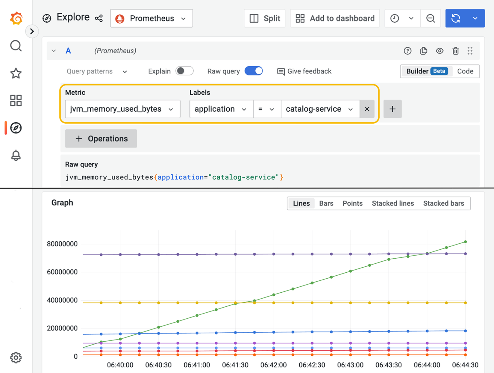

## 14.2 在 Kubernetes 中使用 ConfigMaps 和 Secrets

15-Factor 方法论建议始终把代码、配置和凭据分开。Kubernetes 完全认同这一原则，并通过两个 API 来分别处理配置和凭据：ConfigMaps 和 Secrets。本节将介绍这种新的配置策略，它由 Kubernetes 原生提供。

Spring Boot 对 ConfigMaps 和 Secrets 都提供了原生而灵活的支持。我将向你展示如何使用 ConfigMaps，以及它们与环境变量的关系——环境变量在 Kubernetes 中仍然是有效的配置选项。你会看到 Secrets 其实并不是秘密，并学到如何让它们真正保密。最后，我会介绍几个处理配置变更并将其传播到应用的方案。

在继续之前，让我们先营造好环境，启动一个本地 Kubernetes 集群。进入你的 Polar Deployment 项目（polar-deployment），导航到 `kubernetes/platform/development` 文件夹，运行以下命令来启动一个 minikube 集群，并部署 Polar Bookshop 使用的支撑服务：

```bash
$ ./create-cluster.sh
```

> 注意：如果你没有跟着前面章节的示例一步步操作，可以参考本书配套仓库（[https://github.com/ThomasVitale/cloud-native-spring-in-action](https://github.com/ThomasVitale/cloud-native-spring-in-action)），把 `Chapter14/14-begin` 中的项目作为起点。

该命令需要几分钟才能完成。完成后，你可以用下面的命令确认所有支撑服务都已就绪：

```bash
$ kubectl get deploy
NAME READY UP-TO-DATE AVAILABLE AGE
polar-keycloak 1/1 1 1 3m94s
polar-postgres 1/1 1 1 3m94s
polar-rabbitmq 1/1 1 1 3m94s
polar-redis 1/1 1 1 3m94s
polar-ui 1/1 1 1 3m94s
```

让我们从介绍 ConfigMaps 开始。

### 14.2.1 使用 ConfigMaps 配置 Spring Boot

在第 7 章中，我们使用环境变量向 Kubernetes 中运行的容器传递硬编码的配置，但它们缺少可维护性和结构。ConfigMap 让你以结构化和可维护的方式存储配置数据。它们可以与 Kubernetes 其余部署清单一起纳入版本控制，并具有专用配置仓库的那些优良特性，包括数据持久化、审计和问责。

ConfigMap 是"用于以键值对的形式存储非机密数据的 API 对象。Pod 可以将 ConfigMap 用作环境变量、命令行参数，或用作 volume 中的配置文件"（[https://kubernetes.io/docs/concepts/configuration/configmap](https://kubernetes.io/docs/concepts/configuration/configmap)）。

可以从字面键值对字符串、文件（例如 `.properties` 或 `.yml`），甚至二进制对象来构建 ConfigMap。在处理 Spring Boot 应用时，构建 ConfigMap 最直接的方式是从属性文件开始。

让我们看一个例子。在前几章中，我们通过环境变量配置 Catalog Service。为了更好的可维护性和结构，让我们把其中一些值存储在 ConfigMap 中。

打开 Catalog Service 项目（`catalog-service`），在 `k8s` 文件夹中新建一个 `configmap.yml` 文件。我们将用它来应用下面的配置，这些配置会覆盖随应用打包的 `application.yml` 文件中的默认值：

- 配置自定义问候语。
- 配置 PostgreSQL 数据源的 URL。
- 配置 Keycloak 的 URL。

**清单 14.2 定义一个 ConfigMap 来配置 Catalog Service**

```yaml
apiVersion: v1
kind: ConfigMap
metadata:
 name: catalog-config
 labels:
 app: catalog-service
data:
 application.yml: |
 polar:
 greeting: Welcome to the book catalog from Kubernetes!
 spring:
 datasource:
 url: jdbc:postgresql://polar-postgres/polardb_catalog
 security:
 oauth2:
 resourceserver:
 jwt:
 issuer-uri: http://polar-keycloak/realms/PolarBookshop
```

`apiVersion`：ConfigMap 对象的 API 版本；`kind: ConfigMap`：要创建的对象类型；`metadata.name`：ConfigMap 的名称；`metadata.labels`：附加在 ConfigMap 上的标签组；`data`：包含配置数据的部分；其中键是 YAML 配置文件的名称，值是其内容。

与我们已经处理过的其他 Kubernetes 对象一样，ConfigMap 的清单可以通过 Kubernetes CLI 应用到集群。打开终端窗口，导航到 Catalog Service 项目（`catalog-service`），运行下面的命令：

```bash
$ kubectl apply -f k8s/configmap.yml
```

你可以用这个命令验证 ConfigMap 是否已正确创建：

```bash
$ kubectl get cm -l app=catalog-service
NAME DATA AGE
catalog-config 1 7s
```

存储在 ConfigMap 中的值可以通过几种不同的方式用于配置容器：

- 将 ConfigMap 用作配置数据源，向容器传递命令行参数。
- 将 ConfigMap 用作配置数据源，为容器填充环境变量。
- 将 ConfigMap 挂载为容器中的卷。

正如你在第 4 章中学到并一直练习的那样，Spring Boot 支持多种外部化配置方式，包括命令行参数和环境变量。即使配置数据存储在 ConfigMap 中，通过命令行参数或环境变量把它传给容器也有它的缺点。例如，每当向 ConfigMap 添加一个属性，都必须更新 Deployment 清单。当一个 ConfigMap 被修改时，Pod 并不会感知到这一变化，必须重新创建才能读取新的配置。把 ConfigMaps 挂载为卷则能同时解决这两个问题。

当 ConfigMap 被挂载为容器中的卷时，可能会产生两种结果（图 14.2）：

- 如果 ConfigMap 包含内嵌的属性文件，将其挂载为卷会在这个挂载路径下创建属性文件。Spring Boot 会自动发现并包含位于与应用程序所在目录相同的目录下的 `/config` 文件夹中的属性文件，因此这是挂载 ConfigMap 的完美路径。你也可以通过 `spring.config.additional-location=<path>` 配置属性指定其他位置来搜索属性文件。
- 如果 ConfigMap 包含键值对，将其挂载为卷会在挂载路径生成一个配置树（config tree）。每个键值对都会生成一个文件，文件名为 key，内容为 value。Spring Boot 支持从配置树读取配置属性。你可以通过 `spring.config.import=configtree:<path>` 属性指定配置树应从哪里加载。


**图 14.2** ConfigMaps 挂载为卷后，Spring Boot 可以将其作为属性文件或配置树来消费。

- 内嵌数据（application.yml）→ ConfigMap → 卷 → 挂载为属性文件 → config/application.yml
- 键值对（key1: value1、key2: value2）→ ConfigMap → 卷 → 挂载为配置树 → config/key1、config/key2

配置 Spring Boot 应用时，第一种方案最为方便，因为它与应用程序内默认配置使用的属性文件格式相同。让我们看看如何把之前创建的 ConfigMap 挂载到 Catalog Service 容器中。

打开 Catalog Service 项目（`catalog-service`），进入 `k8s` 文件夹中的 `deployment.yml` 文件。我们需要做三处修改：

1. 移除我们在 ConfigMap 中声明的那些值的环境变量。
2. 声明一个由 catalog-config ConfigMap 生成的卷。
3. 为 catalog-service 容器指定卷挂载，把 ConfigMap 作为 `application.yml` 文件从 `/workspace/config` 加载。`/workspace` 文件夹由 Cloud Native Buildpacks 创建并用于存放应用程序可执行文件，因此 Spring Boot 会自动在相同路径下寻找 `/config` 文件夹并加载其中的属性文件。无需再配置额外位置。

**清单 14.3 将 ConfigMap 作为卷挂载到应用程序容器**

```yaml
apiVersion: apps/v1
kind: Deployment
metadata:
 name: catalog-service
 labels:
 app: catalog-service
spec:
 ...
 template:
 ...
 spec:
 containers:
 - name: catalog-service
 image: catalog-service
 imagePullPolicy: IfNotPresent
 ...
 env:
 - name: BPL_JVM_THREAD_COUNT
 value: "50"
 - name: SPRING_PROFILES_ACTIVE
 value: testdata
 volumeMounts:
 - name: catalog-config-volume
 mountPath: /workspace/config
 volumes:
 - name: catalog-config-volume
 configMap:
 name: catalog-config
```

JVM 线程数和 Spring profile 仍然通过环境变量配置；把 ConfigMap 挂载到容器作为卷；Spring Boot 会自动发现并包含此文件夹中的属性文件；卷的名称；用于生成卷的 ConfigMap。

我们之前已经把 ConfigMap 应用到了集群。让同样处理 Deployment 和 Service 清单，以便验证 Catalog Service 是否正确地从 ConfigMap 读取配置数据。

首先，我们必须把应用打包为容器镜像，并加载到集群中。打开终端窗口，导航到 Catalog Service 项目的根目录（`catalog-service`），运行下面这些命令：

```
$ ./gradlew bootBuildImage
$ minikube image load catalog-service --profile polar
```

现在我们可以通过应用 Deployment 和 Service 清单，把应用部署到本地集群：

```bash
$ kubectl apply -f k8s/deployment.yml -f k8s/service.yml
```

你可以用下面的命令验证 Catalog Service 何时可用并准备好接受请求：

```bash
$ kubectl get deploy -l app=catalog-service
NAME READY UP-TO-DATE AVAILABLE AGE
catalog-service 1/1 1 1 21s
```

在内部，Kubernetes 会使用我们在前几章配置的存活（liveness）和就绪（readiness）探针来判断应用的健康状况。

接下来，通过运行下面的命令，把流量从本地机器转发到 Kubernetes 集群：

```bash
$ kubectl port-forward service/catalog-service 9001:80
```

> 注意：`kubectl port-forward` 命令启动的进程会一直运行，直到你显式地摁 Ctrl-C 停止它。

现在，你可以从本地机器在 9001 端口调用 Catalog Service，请求会被转发到 Kubernetes 集群内的 Service 对象。打开一个新的终端窗口，调用应用暴露的根端点，验证 ConfigMap 中指定的 `polar.greeting` 值被使用，而不是默认值：

```bash
$ http :9001/
Welcome to the book catalog from Kubernetes!
```

也请尝试从目录中检索书籍，验证 ConfigMap 中指定的 PostgreSQL URL 是否被正确使用：

```bash
$ http :9001/books
```

测试完应用后，停止端口转发进程（Ctrl-C），删除到目前为止创建的 Kubernetes 对象。打开终端窗口，导航到你的 Catalog Service 项目（`catalog-service`），运行下面的命令，但让集群保持运行，因为我们很快还会用到它：

```bash
$ kubectl delete -f k8s
```

ConfigMaps 适合为 Kubernetes 上运行的应用提供配置数据。但如果我们必须传递敏感数据呢？在下一节中，你将看到如何在 Kubernetes 中使用 Secrets。

### 14.2.2 使用 Secrets 存储敏感信息（或并不存储）

配置应用最关键的部分是管理密码、证书、令牌和密钥等敏感信息。Kubernetes 提供了 Secret 对象来保存这些数据并传递给容器。

Secret 是用于存储和管理敏感信息（如密码、OAuth 令牌和 SSH 密钥）的 API 对象。Pod 可以将 Secret 用作环境变量或卷中的配置文件（[https://kubernetes.io/docs/concepts/configuration/secret](https://kubernetes.io/docs/concepts/configuration/secret)）。

让这个对象保密的是用以管理它的流程。Secret 本身与 ConfigMap 并无二致。唯一的区别在于 Secret 中的数据通常经过 Base64 编码，这是一个为支持二进制文件而做出的技术选择。任何 Base64 编码的对象都可以非常直接地被解码。把 Base64 当作一种加密手段是常见的误区。如果关于 Secrets 只能记住一件事，那就是：**Secrets 并不保密！**

我们用来在本地 Kubernetes 集群上运行 Polar Bookshop 的配置，依赖开发环境中使用的同一套默认凭据，所以目前还不需要 Secrets。我们将在下一章部署应用到生产环境时开始使用它们。现在，我想向你展示如何创建 Secret。然后我会介绍一些你可以采取的措施，以确保它们受到充分保护。

创建 Secret 的一种方式是使用 Kubernetes CLI 的命令式操作。打开终端窗口，为一些虚构的测试凭据（user/password）生成一个 `test-credentials` Secret 对象：

```bash
$ kubectl create secret generic \
 test-credentials \
 --from-literal=test.username=user \
 --from-literal=test.password=password
```

`test-credentials`：Secret 的名称；`kubectl create secret generate`：创建带 Base64 编码值的通用 Secret；`--from-literal=test.username=user`：添加一个测试用户名的 secret 值；`--from-literal=test.password=password`：添加一个测试密码的 secret 值。

我们可以用下面的命令验证 Secret 是否创建成功：

```bash
$ kubectl get secret test-credentials
NAME TYPE DATA AGE
test-credentials Opaque 2 73s
```

我们还可以用熟悉的 YAML 格式获取 Secret 的内部表示：

```bash
$ kubectl get secret test-credentials -o yaml
apiVersion: v1
kind: Secret
metadata:
 name: test-credentials
type: Opaque
data:
 test.username: dXNlcg==
 test.password: cGFzc3dvcmQ=
```

`apiVersion`：Secret 对象的 API 版本；`kind: Secret`：要创建的对象类型；`metadata.name`：Secret 的名称；`data`：包含用 Base64 编码的 secret 数据的部分。

需要说明的是，为便于阅读，我对上面的 YAML 做了重新排版，并省略了与讨论无关的其他字段。

我想再强调一次：**Secrets 并不保密！** 我可以用一条简单的命令解码存储在 test-credentials Secret 中的值。`cGFzc3dvcmQ=` 对应的明文是 `password`：

```bash
$ echo 'cGFzc3dvcmQ=' | base64 --decode
password
```

与 ConfigMaps 类似，Secrets 可以通过环境变量或卷挂载的方式传给容器。在后一种情况下，你可以将它们挂载为属性文件或配置树。例如，test-credentials Secret 会被挂载为配置树，因为它由键值对而非文件构成。

由于 Secrets 并没有加密，我们不能把它们纳入版本控制系统。保护 Secrets 的重任落在平台工程师肩上。例如，Kubernetes 可以配置为将 Secrets 加密存储在内部的 etcd 存储中。这样有助于确保静态数据的安全，但并没有解决在版本控制系统中管理它们的问题。

Bitnami 推出了一个名为 Sealed Secrets（[https://github.com/bitnami-labs/sealed-secrets](https://github.com/bitnami-labs/sealed-secrets)）的项目，旨在加密 Secrets 并将其纳入版本管理。首先，你可以像创建普通 Secret 一样，从字面值生成一个加密的 SealedSecret 对象。然后把它纳入仓库，安全地放在版本控制之下。当 SealedSecret 清单被应用到 Kubernetes 集群时，Sealed Secrets 控制器会解密其内容，并生成一个可在 Pod 中使用的标准 Secret 对象。

如果你的 secret 存储在 HashiCorp Vault 或 Azure Key Vault 这样的专用后端中呢？在这种情况下，你可以使用 External Secrets 之类的项目（[https://github.com/external-secrets/kubernetes-external-secrets](https://github.com/external-secrets/kubernetes-external-secrets)）。正如名字所示，这个项目让你从外部来源生成一个 Secret。ExternalSecret 对象可以安全地存放于仓库中并纳入版本控制。当 ExternalSecret 清单被应用到 Kubernetes 集群时，External Secrets 控制器会从配置的外部源获取值，并生成一个可在 Pod 中使用的标准 Secret 对象。

> 注意：如果想了解更多关于如何保护 Kubernetes Secrets 的信息，可以看看 Billy Yuen、Alexander Matyushentsev、Todd Ekenstam 和 Jesse Suen 合著的《GitOps and Kubernetes》（Manning，2021）的第 7 章，以及 Alex Soto Bueno 和 Andrew Block 合著的《Kubernetes Secrets Management》（Manning，2022）。这里就不再提供更多内容了，因为这通常是平台团队的任务，而不是开发者的。

当我们开始使用 ConfigMaps 和 Secrets 时，必须决定采用哪种策略来更新配置数据，以及如何让应用使用新值。这就是下一节的主题。

### 14.2.3 使用 Spring Cloud Kubernetes 在运行时刷新配置

在使用外部配置服务时，你可能需要一个在配置变更时重新加载应用的机制。例如，使用 Spring Cloud Config 时，我们可以借助 Spring Cloud Bus 实现这样的机制。

在 Kubernetes 中，我们需要不同的方案。当你更新 ConfigMap 或 Secret 时，只要它们是作为卷挂载的，Kubernetes 就会负责向容器提供新版本。如果你使用环境变量，它们不会被新值替换。这就是我们通常更喜欢卷方案的原因。

更新后的 ConfigMaps 或者 Secrets 在挂载为卷时提供给 Pod，但应用刷新配置取决于应用本身。默认情况下，Spring Boot 应用只在启动时读取一次配置。当配置通过 ConfigMaps 和 Secrets 提供时，有三种主要方式可以刷新配置：

- **滚动重启**——修改 ConfigMap 或 Secret 后，可以滚动重启所有受影响的 Pod，使应用重新加载全部配置数据。使用此选项时，Kubernetes Pod 会保持不可变。
- **Spring Cloud Kubernetes Configuration Watcher**——Spring Cloud Kubernetes 提供一个名为 Configuration Watcher 的 Kubernetes 控制器，它监控挂载在 Spring Boot 应用上的 ConfigMaps 和 Secrets 卷。借助 Spring Boot Actuator 的 `/actuator/refresh` 端点或 Spring Cloud Bus，当任何 ConfigMaps 或 Secrets 被更新时，Configuration Watcher 都会为受影响的应用触发配置刷新。
- **Spring Cloud Kubernetes Config Server**——Spring Cloud Kubernetes 提供一个配置服务器，支持把 ConfigMaps 和 Secrets 作为 Spring Cloud Config 的一个配置数据源。你可以用这样的服务器同时从 Git 仓库、从 Kubernetes 对象加载配置，并有可能为两者使用相同的配置刷新机制。

对于 Polar Bookshop，我们将使用第一种方案，依赖 Kustomize 在 ConfigMap 或 Secret 有变更时触发应用重启。我将在本章下一节详细说明该策略。这里我们只关注 Spring Cloud Kubernetes 及其子项目提供的功能。

Spring Cloud Kubernetes（[https://spring.io/projects/spring-cloud-kubernetes](https://spring.io/projects/spring-cloud-kubernetes)）是一个令人兴奋的项目，它提供 Spring Boot 与 Kubernetes API 的集成。它最初的目标是简化从基于 Spring Cloud 的微服务架构向 Kubernetes 的过渡。它为用于服务发现和负载均衡的标准 Spring Cloud 接口提供与 Kubernetes 集成的实现，并增加了从 ConfigMaps 和 Secrets 加载配置的支持。

如果你从事 greenfield 项目，你不需要 Spring Cloud Kubernetes。Kubernetes 原生提供服务发现和负载均衡，正如你在第 7 章所体验的。此外，Spring Boot 原生支持通过 ConfigMaps 和 Secrets 进行配置，即使在这种情况下也不需要 Spring Cloud Kubernetes。

当把 brownfield 项目迁移到 Kubernetes，且它使用了像 Spring Cloud Netflix Eureka 用于服务发现，Spring Cloud Netflix Ribbon 或 Spring Cloud Load Balancer 用于负载均衡这样的库时，你可以使用 Spring Cloud Kubernetes 实现更平滑的过渡。然而，我建议重构你的代码，采用 Kubernetes 原生的服务发现和负载均衡能力，而不是把 Spring Cloud Kubernetes 加入你的项目。

我不推荐在标准应用中使用 Spring Cloud Kubernetes 的主要原因是，它需要访问 Kubernetes API Server 来管理 Pods、Services、ConfigMaps 和 Secrets。除了把对 Kubernetes 内部对象的访问权限授予应用所引发安全和关注之外，它还会让应用与 Kubernetes 产生不必要的耦合，影响解决方案的可维护性。

什么时候使用 Spring Cloud Kubernetes 有意义？例如，Spring Cloud Gateway 可以借助 Spring Cloud Kubernetes 增强，以获得对服务发现和负载均衡的更多控制，包括基于 Services 元数据自动注册新路由，以及选择负载均衡策略。在这种情况下，你可以依赖 Spring Cloud Kubernetes Discovery Server 组件，把对 Kubernetes API 的访问需求限制在发现服务器上。

Spring Cloud Kubernetes 在实现 Kubernetes 控制器应用、完成集群内的管理任务时真正大放异彩。例如，你可以实现一个控制器，监控 ConfigMaps 或 Secrets 的变化，然后在使用它们的应用上触发配置刷新。事实上，Spring 团队正是用 Spring Cloud Kubernetes 构建了一个正做这件事的控制器：Configuration Watcher。

> 注意：Spring Cloud Kubernetes Configuration Watcher 以容器镜像形式发布在 Docker Hub 上。如果你想知道它如何工作以及如何部署，请参阅官方文档（[https://spring.io/projects/spring-cloud-kubernetes](https://spring.io/projects/spring-cloud-kubernetes)）。

除了 Configuration Watcher 之外，Spring Cloud Kubernetes 还提供了其他现成组件，用于解决 Kubernetes 中分布式系统的常见问题。其中之一是构建在 Spring Cloud Config 之上的配置服务器，扩展了其功能，支持从 ConfigMaps 和 Secrets 读取配置数据，即 Spring Cloud Kubernetes Config Server。

你可以直接使用这个组件（容器镜像已发布在 Docker Hub 上），并按照官方文档（[https://spring.io/projects/spring-cloud-kubernetes](https://spring.io/projects/spring-cloud-kubernetes)）中的说明将其部署到 Kubernetes。

或者，你也可以以它的 GitHub 源码为基础，构建你自己感知 Kubernetes 的配置服务器。例如，正如我在本章前面解释的那样，你可能希望通过 HTTP Basic 认证来保护它。这种情况下，你可以运用处理 Spring Cloud Config 的经验，在 Spring Cloud Kubernetes Config Server 之上，为 Polar Bookshop 构建一个增强版的 Config Service。

在下一节中，我将引入 Kustomize 来管理 Kubernetes 中的部署配置。