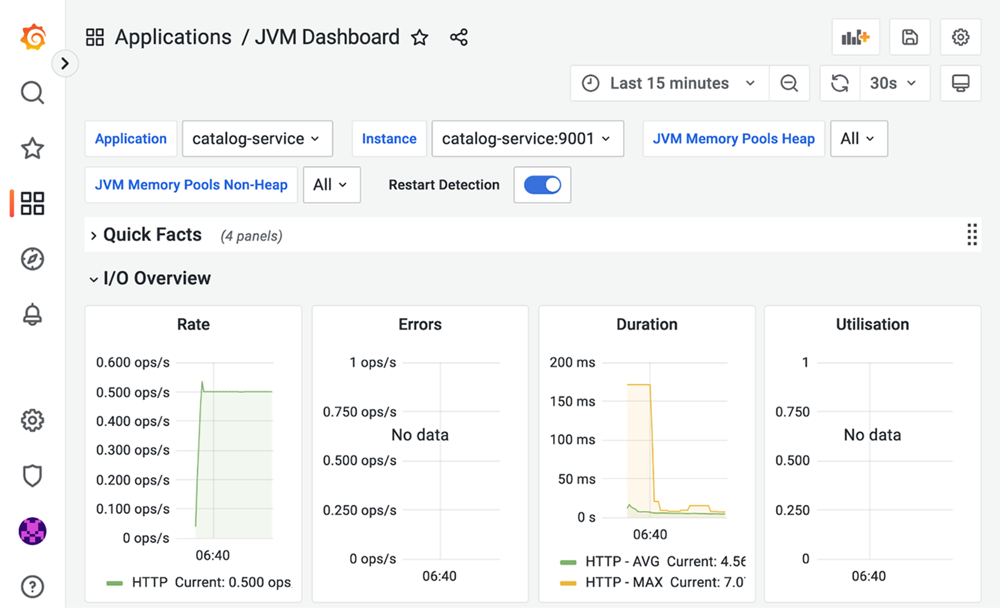
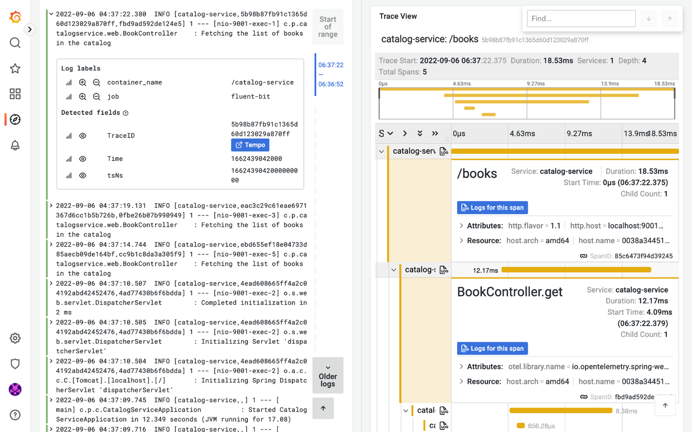

## 14.3 使用 Kustomize 管理配置

Kubernetes 提供了许多用于运行云原生应用的强大特性。不过，它要求编写多个 YAML 清单，这些清单在实际场景中有时显得冗余且难以管理。在收集了部署应用所需的多个清单之后，我们还面临额外的挑战：如何根据环境修改 ConfigMap 中的值？如何修改容器镜像版本？Secrets 和卷又该怎么办？能否更新健康检查探针的配置？

近年来，人们引入了许多工具来改进我们在 Kubernetes 中配置和部署工作负载的方式。对于 Polar Bookshop 系统，我们希望有一个能让我们把多个 Kubernetes 清单作为一个整体来处理、并根据应用部署环境定制部分配置的工具。

Kustomize（[https://kustomize.io](https://kustomize.io)）是一个声明式工具，它通过分层（layering）方法来帮助为不同环境的部署配置进行定制。它输出标准的 Kubernetes 清单，并且内置于 Kubernetes CLI（kubectl）中，因此你无需额外安装任何东西。

> 注意：其他流行的 Kubernetes 部署配置管理选项还有 Carvel 套件中的 ytt（[https://carvel.dev/ytt](https://carvel.dev/ytt)）和 Helm（[https://helm.sh](https://helm.sh)）。

本节将展示 Kustomize 提供的核心功能。首先你会看到如何组合相关的 Kubernetes 清单并作为一个整体来处理它们。然后我将展示 Kustomize 如何从属性文件中为你生成一个 ConfigMap。最后，我会引导你完成一系列定制操作，我们将把这些定制应用到 base（基础）清单上，以用于 staging 环境。下一章将进一步扩展这些内容，并覆盖生产场景。

在继续之前，请确保你的本地 minikube 集群仍在运行，并且 Polar Bookshop 的支撑服务都已正确部署。如果没有，请在 polar-deployment/kubernetes/platform/development 下运行 `./create-cluster.sh`。

> 注意：平台服务只在集群内部暴露。如果你想从本地机器访问其中任何一个，可以使用第 7 章中学到的端口转发功能。你既可以借助 Octant 的 GUI，也可以使用 CLI（例如 `kubectl port-forward service/polar-postgres 5432:5432`）。

既然所有支撑服务都可用，让我们看看如何用 Kustomize 管理和配置一个 Spring Boot 应用。

### 14.3.1 使用 Kustomize 管理和配置 Spring Boot 应用

到目前为止，我们都是通过应用多个 Kubernetes 清单来把应用部署到 Kubernetes 的。例如，部署 Catalog Service 需要把 ConfigMap、Deployment 和 Service 清单都应用到集群。使用 Kustomize 时，第一步是把相关的清单组合在一起，这样我们就可以把它们作为一个整体来处理。Kustomize 通过一个 Kustomization 资源做到这一点。最终，我们希望让 Kustomize 帮我们管理、处理和生成 Kubernetes 清单。

让我们看看它是如何工作的。打开你的 Catalog Service 项目（`catalog-service`），在 `k8s` 文件夹中创建一个 `kustomization.yml` 文件。它将作为 Kustomize 的入口点。

我们首先要告知 Kustomize，它应该把哪些 Kubernetes 清单作为未来定制的基础。目前，我们将包含现有的 Deployment 和 Service 清单。

**清单 14.4 为 Kustomize 定义基础 Kubernetes 清单**

```yaml
apiVersion: kustomize.config.k8s.io/v1beta1
kind: Kustomization
resources:
 - deployment.yml
 - service.yml
```

- `apiVersion`：Kustomize 的 API 版本。
- `kind: Kustomization`：清单所定义的资源类型。
- `resources`：Kustomize 应管理和处理的 Kubernetes 清单。

你可能想知道为什么我们没有包含 ConfigMap。这个想法很好。我们本可以把本章前面创建的 `configmap.yml` 文件包含进来，但 Kustomize 提供了一种更优雅的方式。与其直接引用一个 ConfigMap，我们可以提供一个属性文件，让 Kustomize 用它来生成 ConfigMap。让我们看看如何实现。

首先，把我们之前创建的 ConfigMap（`configmap.yml`）的正文移动到一个新的 `application.yml` 文件（位于 `k8s` 文件夹内）。

**清单 14.5 通过 ConfigMap 提供的配置属性**

```yaml
polar:
 greeting: Welcome to the book catalog from Kubernetes!
spring:
 datasource:
 url: jdbc:postgresql://polar-postgres/polardb_catalog
 security:
 oauth2:
 resourceserver:
 jwt:
 issuer-uri: http://polar-keycloak/realms/PolarBookshop
```

然后删除 `configmap.yml` 文件，我们不再需要它了。最后，更新 `kustomization.yml`，让它在 `application.yml` 文件的基础上生成一个 `catalog-config` ConfigMap。

**清单 14.6 让 Kustomize 从属性文件生成一个 ConfigMap**

```yaml
apiVersion: kustomize.config.k8s.io/v1beta1
kind: Kustomization
resources:
 - deployment.yml
 - service.yml
configMapGenerator:
 - name: catalog-config
 files:
 - application.yml
 options:
 labels:
 app: catalog-service
```

- `configMapGenerator`：用于生成 ConfigMap 的段落。
- `files`：使用属性文件作为 ConfigMap 的数据源。
- `options.labels`：定义要分配给生成的 ConfigMap 的标签。

> 注意：以类似的方式，Kustomize 也可以基于字面值或文件生成 Secrets。

让我们暂停片刻来验证到目前为止的工作。你的本地集群应该已经拥有 Catalog Service 的容器镜像。如果没有，请先构建容器镜像（`./gradlew bootBuildImage`），再把它加载到 minikube（`minikube image load catalog-service --profile polar`）。

接下来，打开终端窗口，导航到你的 Catalog Service 项目（`catalog-service`），使用熟悉的 Kubernetes CLI 进行部署。应用标准 Kubernetes 清单时，我们使用 `-f` 标志；应用 Kustomization 时，使用 `-k` 标志：

```bash
$ kubectl apply -k k8s
```

最终结果与我们之前直接应用 Kubernetes 清单时相同，只是这一次 Kustomize 通过一个 Kustomization 资源处理了一切。

为完成验证，使用端口转发把 Catalog Service 暴露到本地（`kubectl port-forward service/catalog-service 9001:80`）。然后打开一个新的终端窗口，确认根端点返回的消息来自 Kustomize 生成的 ConfigMap：

```bash
$ http :9001/
Welcome to the book catalog from Kubernetes!
```

Kustomize 生成的 ConfigMaps 和 Secrets 在部署时会带有一个唯一的后缀（哈希值）。你可以用下面的命令验证分配给 catalog-config ConfigMap 的实际名称：

```bash
$ kubectl get cm -l app=catalog-service
NAME DATA AGE
catalog-config-btcmff5d78 1 7m58s
```

每次你更新生成器（generator）的输入，Kustomize 都会创建一个新的、带不同哈希的清单，这将触发使用这些 ConfigMaps 或 Secrets 卷的容器进行滚动重启。这是一种非常方便的方式，让我们无需实现或配置任何附加组件即可实现自动化的配置刷新。

让我们验证一下。首先，更新用于生成 ConfigMap 的 `application.yml` 文件中 `polar.greeting` 属性的值。

**清单 14.7 更新 ConfigMap 生成器的配置输入**

```yaml
polar:
 greeting: Welcome to the book catalog from a development Kubernetes environment!
```

然后再次应用 Kustomization（`kubectl apply -k k8s`）。Kustomize 将生成一个具有不同后缀哈希的新 ConfigMap，并触发所有 Catalog Service 实例的滚动重启。在本例中只有一个实例在运行。在生产环境中，实例会更多。事实上，实例逐一重启能确保零停机（zero downtime），这正是我们希望在云环境中实现的目标。不过，至少从部署来看应达到的效果是：Catalog Service 的根端点现在应该返回新的消息：

```bash
$ http :9001/
Welcome to the book catalog from a development Kubernetes environment!
```

如果你好奇，可以把这和不使用 Kustomize 时更新 ConfigMap 的情况做个对比。Kubernetes 会更新挂载到 Catalog Service 容器中的卷，但应用不会被重启，依然会返回旧值。

> 注意：根据你的需求，可能需要避免滚动重启并让应用在运行时重新加载配置。针对这种需求，你可以关闭哈希后缀（设置生成器配置 `disableNameSuffixHash: true`），也许借助 Spring Cloud Kubernetes Configuration Watcher 或其他机制在 ConfigMap 或 Secret 变更时通知应用。

当你完成 Kustomize 测试后，可以停止端口转发进程（Ctrl-C），然后卸载此应用（`kubectl delete -k k8s`）。

既然我们已经用上了 Kustomize，仍需更新几样东西。第 7 章中，我们用 Tilt 在本地 Kubernetes 中获得更好的开发工作流。Tilt 支持 Kustomize，因此可以以 Kustomization 资源部署应用，而不是直接使用 Kubernetes 清单。请按如下方式更新 Catalog Service 项目中的 Tiltfile。

**清单 14.8 配置 Tilt 使用 Kustomize 部署 Catalog Service**

```python
custom_build(
 ref = 'catalog-service',
 command = './gradlew bootBuildImage --imageName $EXPECTED_REF',
 deps = ['build.gradle', 'src']
)
k8s_yaml(kustomize('k8s'))

k8s_resource('catalog-service', port_forwards=['9001'])
```

关键行 `k8s_yaml(kustomize('k8s'))` 表示从 `k8s` 文件夹中的 Kustomization 资源运行应用。

最后，我们需要更新 Catalog Service 提交阶段（commit stage）工作流中的清单校验步骤，否则下次向 GitHub 推送代码时会失败。在你的 Catalog Service 项目中打开 `commit-stage.yml`（`.github/workflows`），并按如下更新。

**清单 14.9 使用 Kubeval 校验 Kustomize 生成的清单**

```yaml
name: Commit Stage
on: push
...
jobs:
 build:
 name: Build and Test
 ...
 steps:
 ...
 - name: Validate Kubernetes manifests
 uses: stefanprodan/kube-tools@v1
 with:
 kubectl: 1.24.3
 kubeval: 0.16.1
 command: |
 kustomize build k8s | kubeval --strict -
```

用 Kustomize 生成清单，然后用 Kubeval 对它们进行校验。

到目前为止，我们从 Kustomize 获得的最大好处，是当 ConfigMap 或 Secret 更新时自动进行滚动重启。在下一节中，你会了解更多关于 Kustomize 的知识，并探索它根据不同部署环境管理不同 Kubernetes 配置的能力。

### 14.3.2 使用 Kustomize 管理多环境的 Kubernetes 配置

在开发过程中，我们遵循 15-Factor 方法论，把应用的每个可能在部署时变化的配置外部化。你已经看到如何使用属性文件、环境变量、配置服务，以及（前面章节介绍的）ConfigMaps。尤其是，你还看到如何使用 Spring profiles，根据部署环境定制应用的配置。现在，我们需要更进一步，定义一种根据应用部署环境定制整个部署配置的策略。

在上一节中，你了解了如何通过一个 Kustomization 资源把多个 Kubernetes 清单组合并进行处理。针对每种环境，我们可以指定 patches（补丁）来应用改动，或在基础清单基础上添加附加配置。你在这一节里看到的所有定制都无需修改应用源代码，而是基于之前产出的相同发布工件完成的。这是一个非常强大的概念，也是云原生应用最主要的特性之一。

Kustomize 的配置定制概念基于 base 和 overlay 方法。我们在 Catalog Service 项目中创建的 `k8s` 文件夹可以看作一个 base：即一个有 `kustomization.yml` 的目录，它组合了多个 Kubernetes 清单和自定义改动。overlay 是另一个目录，其中也含一个 `kustomization.yml`。它的特别之处在于，它所定义的定制是相对于一个或多个 base 的，并把它们组合起来。以同一个 base 为起点，你可以为每个部署环境（例如开发、测试、staging、生产）定义 overlay。

如图 14.3 所示，每个 Kustomization 都包含一个 `kustomization.yml` 文件。base 会把多个 Kubernetes 资源（如 Deployment、Service、ConfigMaps）整合起来。此外，base 并不知道这些 overlay，因此它是完全独立的。overlay 使用一个或多个 base 作为基础，通过 patches 提供附加配置。


**图 14.3** Kustomize base 可以支撑根据不同部署环境进行的进一步定制（overlays），每个 overlay 都基于 base 定制。

你可以在同一个仓库中定义 base 和 overlays，也可以分别放在不同仓库。对于 Polar Bookshop 系统，我们会在各应用项目中将 `k8s` 文件夹作为 base，在 polar-deployment 仓库中定义 overlays。和你在第 3 章了解的应用代码仓库类似，你可以决定是否把部署配置保存在应用仓库中。我决定用单独的仓库，原因如下：

- 它可以让你从一个地方控制整个系统中所有组件的部署。
- 它使得在发布到生产环境前，可以进行有重点的版本控制、审计和合规检查。
- 它适合 GitOps 的方式，交付和部署任务被解耦。

如图 14.4 所示，这个例子很好地说明了在 Catalog Service 的场景中，base 和 overlays 分布在两个独立仓库时 Kustomize 清单的组织方式。其中 `catalog-service/k8s` 是 base，`polar-deployment/applications/catalog-service` 中是 staging、production 的 overlay。


**图 14.4** Kustomize base 和 overlays 可存放在同一仓库中，也可分别放在两个仓库。overlays 可用来针对不同环境定制部署。

另一个决策是，把 base Kubernetes 清单与应用源代码放在一起，还是把它们移动到单独的部署仓库。对于 Polar Bookshop 的例子，我选择了第一种方案，这与我们处理默认配置属性的方案一致。其中一个优点是，开发时运行每个应用都比较方便，无论是直接使用还是结合 Tilt。同样，根据自己的需求也可以选择另一种方案。两种方案都有效，在现实场景中均有应用。

#### Patches 与模板

Kustomize 的配置定制方法基于应用补丁（patches）。这与 Helm（[https://helm.sh](https://helm.sh)）的工作方式形成对比。Helm 要求你将要更改的 manifest 的每个部分进行模板化（结果是非有效的 YAML）。之后，你可以根据具体环境为这些模板提供不同的值。如果某个字段没有模板化，则无法自定义其值。所以，将两者按顺序使用以弥补彼此不足并不少见。这两种方法各有利弊。

在本书中，我选用 Kustomize，因为它原生内置于 Kubernetes CLI，与有效 YAML 文件配合工作，并且是纯粹的声明式。Helm 更强大，也能处理一些 Kubernetes 本身不支持的应用发布和升级。另一方面，它学习曲线陡峭，模板方案有一些缺点，并且不是声明式的。

另一个可选项是 Carvel 套件中的 ytt（[https://carvel.dev/ytt](https://carvel.dev/ytt)）。它提供卓越的体验，同时支持 patches 和模板，与有效的 YAML 文件兼容，模板策略也更健壮。学习 ytt 要比 Kustomize 花费更多时间，但很值得，因为它把 YAML 视为一等公民（first-class citizen），因此可以用于任何 YAML 文件的配置和定制，甚至在 Kubernetes 之外也适用。你使用 GitHub Actions 工作流吗？Ansible playbooks？Jenkins pipelines？在这些应用场景中，ytt 都可使用。

让我们考虑 Catalog Service。目前我们已经构建了 base 部署配置，它位于项目仓库的 `k8s` 文件夹中。现在让我们为 staging 环境定义一个 overlay 来定制部署。

### 14.3.3 定义 staging 环境的配置 overlay

在之前的章节中，我们使用 Kustomize 管理 Catalog Service 的配置并部署到本地开发环境。那些清单将构成后续以 overlays 形式针对不同环境进行多种定制的基础。由于我们要在 polar-deployment 仓库中定义 overlays，而 base 清单在 catalog-service 仓库中，因此 Catalog Service 的所有清单都必须发布到远程仓库的 main 分支上。如果你还没有，请把对 Catalog Service 项目的所有改动推送到 GitHub 上的远程仓库。

> 注意：如第 2 章所述，我期望你已为系统的每个项目创建了一个 GitHub 仓库，在本章我们需要的是 polar-deployment 和 catalog-service 仓库，但你还需要为 edge-service、order-service 和 dispatcher-service 等创建仓库。

如预期一样，我们会把配置 overlay 放在 polar-deployment 仓库中。在本节及后续几节，我们将为 staging 环境定义一个 overlay。下一章将覆盖生产环境。

继续，在 polar-deployment 仓库中创建 `kubernetes/applications` 文件夹。我们用它来保存系统中所有应用的定制。在新路径下，添加一个 `catalog-service` 文件夹，里面存放针对不同环境部署 Catalog Service 的 overlays。特别是我们要准备部署到 staging 环境，所以为 Catalog Service 创建一个 "staging" 文件夹。

任何定制（base 或 overlay）都需要一个 `kustomization.yml` 文件。现在来为 Catalog Service 的 staging overlay 创建它（`polar-deployment/kubernetes/applications/catalog-service/staging`）。第一件要做的事，是引用 base 清单。

如果你跟随一步步操作，你的 Catalog Service 源代码应该已经由 GitHub 上的 catalog-service 仓库跟踪。远程 base 的引用需要指向包含 `kustomization.yml` 的文件夹，这里是 `k8s`。此外还可以指定 hash/tag 来标明要部署的版本，我们将在下一章讲解发布策略和版本控制，现在就直接用 `main` 分支。最终的 URL 形如 `github.com/<your_github_username>/catalog-service/k8s?ref=main`。

**清单 14.10 在远程 base 之上定义一个用于 staging 的 overlay**

```yaml
apiVersion: kustomize.config.k8s.io/v1beta1
kind: Kustomization
resources:
 - github.com/<your_github_username>/catalog-service/k8s?ref=main
```

使用 GitHub 上的 Catalog Service 仓库中的清单作为进一步定制的 base。

> 注意：这里假设了你为 Polar Bookshop 创建的 GitHub 仓库都是公开的。如果不是，可以在对应仓库的 Settings 中，滚动到底部，通过点击 Change Visibility 按钮将包设为公开。

我们此时可以把它部署到集群，但结果和使用 base 直接部署没有区别。接下来就开始应用真正针对 staging 的定制。

### 14.3.4 定制环境变量

我们的第一个定制是添加一个环境变量，激活 Catalog Service 的 staging profile。多数定制都可以依据 merge 策略，通过补丁应用。和 Git 会把不同分支的改动合并一样，Kustomize 也会把来自不同 Kustomization 文件（一个或多个 base、overlays）的改动合并生成最终的 Kubernetes 清单。

定义 Kustomize 补丁的一个重要实践是保持补丁小而聚焦。为定制环境变量，在 staging overlay 目录（`kubernetes/applications/catalog-service/staging`）创建一个 `patch-env.yml` 文件。我们需提供一些上下文信息，以便 Kustomize 知道向哪里应用补丁，以及如何合并修改。当补丁是针对一个容器时，Kustomize 要求我们指定 Kubernetes 对象的 kind 和 name（即 Deployment），以及容器的 name。这种补丁称为 "strategic merge patch"（战略合并补丁）。

**清单 14.11 用于定制环境变量的补丁**

```yaml
apiVersion: apps/v1
kind: Deployment
metadata:
 name: catalog-service
spec:
 template:
 spec:
 containers:
 - name: catalog-service
 env:
 - name: SPRING_PROFILES_ACTIVE
 value: staging
```

定义要激活的 Spring profile。

接下来，让 Kustomize 应用这个补丁。为此，在 staging overlay 的 `kustomization.yml` 中，添加 `patch-env.yml`。

**清单 14.12 让 Kustomize 应用环境变量的补丁**

```yaml
apiVersion: kustomize.config.k8s.io/v1beta1
kind: Kustomization
resources:
 - github.com/<your_github_username>/catalog-service/k8s?ref=main
patchesStrategicMerge:
 - patch-env.yml
```

`patchesStrategicMerge` 部分列出要按照战略合并策略应用到 base 清单的补丁。这里用于定制传给 Catalog Service 容器的环境变量。

你可以用同样的方式定制一个 Deployment 的诸多方面，包括副本数量、存活探针、就绪探针、优雅停机超时、环境变量、卷等。下一小节将展示如何定制 ConfigMaps。

### 14.3.5 定制 ConfigMaps

Catalog Service 的 base Kustomization 指示 Kustomize 根据 application.yml 生成了一个 catalog-config ConfigMap。为定制该 ConfigMap 中的字段值，有两种方案：替换整个 ConfigMap，或者只覆盖 staging 环境中不同的值。在后一种情况下，我们可以依靠 Kustomize 的补丁策略来覆盖 ConfigMap 中的部分值。

在使用 Spring Boot 时，我们可以利用 Spring profiles 功能实现更优雅的方案。不用去修改已有 ConfigMap 中的值，我们可以添加一个 `application-staging.yml` ——前面已知，当 staging profile 激活时，它优先于 application.yml。最终输出的 ConfigMap 将同时包含这两个文件。

首先，在 staging overlay 中创建 `application-staging.yml`，然后在文件中定义一个不同的 polar.greeting 值。由于我们打算在同一个 minikube 集群上模拟 staging 环境，支撑服务的 URL 和凭据与开发环境一致。在真实场景中，staging 环境还会有更多定制项。

**清单 14.13 对 Catalog Service 的 staging 专属配置**

```yaml
polar:
 greeting: Welcome to the book catalog from a staging Kubernetes environment!
```

然后，我们可以依靠 Kustomize 提供的 ConfigMap 生成器，把新建的 `application-staging.yml` 与 base Kustomization 中生成的 `application.yml` 合并到同一个 catalog-config ConfigMap 中。现在，更新 staging overlay 的 `kustomization.yml`。

**清单 14.14 合并同一 ConfigMap 中的多个属性文件**

```yaml
apiVersion: kustomize.config.k8s.io/v1beta1
kind: Kustomization
resources:
 - github.com/<your_github_username>/catalog-service/k8s?ref=main
patchesStrategicMerge:
 - patch-env.yml
configMapGenerator:
 - behavior: merge
 files:
 - application-staging.yml
 name: catalog-config
```

- `behavior: merge`：把此 ConfigMap 与在 base Kustomization 中定义的相同名称 ConfigMap 合并。
- `files`：添加到 ConfigMap 中的额外属性文件。
- `name`：与 base 中定义的 ConfigMap 相同的名称。

这就是 ConfigMap 的定制。下一节将介绍的是，如何配置要部署的镜像和版本。

### 14.3.6 定制镜像名称和版本

Catalog Service 仓库 `catalog-service/k8s/deployment.yml` 中的 base Deployment 清单的镜像被配置为本地容器镜像，没有任何版本号（意味着使用 latest 标签）。这在开发环境中是方便的，但对其他部署环境就不适用了。

如果你一路跟随本书，Catalog Service 的源码应该已经在 GitHub 的 catalog-service 仓库中，容器镜像 `ghcr.io/<your_github_username>/catalog-service:latest` 也已由推送镜像的工作流发布到 GitHub Container Registry。下一章会介绍版本发布与版本控制。现在还是用 latest 标签，但镜像名称是指从容器镜像仓库拉取，而不是指向本地的。

> 注意：发布到 GitHub Container Registry 的镜像与该软件包的源代码仓库可见性相同。我假定你构建的所有 Polar Bookshop 镜像都可以从 GitHub Container Registry 公开访问，否则需要进入对应仓库并访问 Packages 区域，修改包的可见性。

我们可以通过补丁修改 Catalog Service Deployment 资源的镜像。但这是一种非常常见的定制，且每次交付应用新版本都需要更新。Kustomize 提供了一种更方便的方式，让我们为每个容器指定镜像名称和版本。我们可以手动更新 kustomization.yml，也可以使用 kustomize CLI（它是 Kubernetes CLI 的一部分）下载它。我们试试后者。

在终端中，转到 Catalog Service 的 staging overlay 目录（`kubernetes/applications/catalog-service/staging`），执行以下命令来为容器设置它要使用的镜像和版本。注意把 `<your_github_username>` 替换为你的 GitHub 用户名（小写）:

```bash
$ kustomize edit set image \
 catalog-service=ghcr.io/<your_github_username>/catalog-service:latest
```

这条命令将自动更新 kustomization.yml，添加我们需要的值，如下所示：

**清单 14.15 为容器配置镜像名称和版本**

```yaml
apiVersion: kustomize.config.k8s.io/v1beta1
kind: Kustomization
resources:
 - github.com/<your_github_username>/catalog-service/k8s?ref=main
patchesStrategicMerge:
 - patch-env.yml
configMapGenerator:
 - behavior: merge
 files:
 - application-staging.yml
 name: catalog-config
images:
 - name: catalog-service
 newName: ghcr.io/<your_github_username>/catalog-service
 newTag: latest
```

- `name`：Deployment 清单中定义的容器名（catalog-service）。
- `newName`：容器的新镜像名称（包含你的小写 GitHub 用户名）。
- `newTag`：新生成的镜像版本（latest）。

### 14.3.7 定制副本数量

云原生应用应有 SLA 保障。Catalog Service 目前还没有。我们现在只部署了一个副本。如果它因高负载而崩溃或暂时不可用，应用就不可用，不够稳健。所以，至少要为 staging 环境多部署几个副本，这是一个例外。Kustomize 提供了一种方便的方法来更新一个给定 Deployment 的副本数量。

打开 staging overlay 的 `kustomization.yml`（`kubernetes/applications/catalog-service/staging`），为应用配置副本数量为两个。

**清单 14.16 为 Catalog Service 容器配置副本数量**

```yaml
apiVersion: kustomize.config.k8s.io/v1beta1
kind: Kustomization
resources:
 - github.com/<your_github_username>/catalog-service/k8s?ref=main
patchesStrategicMerge:
 - patch-env.yml
configMapGenerator:
 - behavior: merge
 files:
 - application-staging.yml
 name: catalog-config
images:
 - name: catalog-service
 newName: ghcr.io/<your_github_username>/catalog-service
 newTag: latest
replicas:
 - name: catalog-service
 count: 2
```

简单说明一下：`replicas` 用于定义副本数量的 Deployment 名称；`count` 是要部署的副本数。

现在，是时候部署 Catalog Service 并验证 staging overlay 提供的配置了。为简便起见，我们继续使用同一个 minikube 本地集群作为 staging 环境。如果你之前还没有运行创建它的命令，可以重新运行上一节中的脚本（或重建它）。现在，我们基于实际效果进行验证。

打开一个终端，进入 staging overlay 文件夹（`applications/catalog-service/staging`），按下面所示应用该 Kustomization 部署应用：

```bash
$ kubectl apply -k .
```

您可通过 Kubernetes CLI（`kubectl get pod -l app=catalog-service`）或 Octant GUI（请参考第 7 章获取更多详情）监控运维结果。一旦应用就绪，你可以通过 CLI 检查日志：

```bash
$ kubectl logs deployment/catalog-service
```

Spring Boot 启动后的日志事件之一会告诉你 staging profile 被启用了，这正是我们在 staging overlay 中通过补丁配置的。

此应用并没有对集群外部暴露，但我们依然可以借助端口转发把流量从本机 9001 端口转发到运行中的 Service 容器内的 80 端口：

```bash
$ kubectl port-forward service/catalog-service 9001:80
```

接下来打开另一个终端，调用应用的根端点：

```bash
$ http :9001
Welcome to the book catalog from a staging Kubernetes environment!
```

获得的结果正是 application-staging.yml 中定义的针对 staging 环境的定制消息，符合预期。

> 注意：向 :9001/books 发送 GET 请求会返回空列表。staging 环境未启用 testdata profile（它负责在启动时填充测试书籍数据），因此最好只在开发或测试环境启用。

我们应用到 staging overlay 的最后一个定制是副本数量。除了资源配置外的其他改动我们稍后会讲到。用以下命令查看两个 pod 同时运行，它们各自具有不同的身份：

```bash
$ kubectl get pod -l app=catalog-service
```

Kubernetes 保证每个应用的可用性。如果有足够资源，它会把 pod 分散到不同节点，这样即使一个节点故障，应用仍然有副本可用。同时，Kubernetes 会在别处重新部署副本，保证始终至少两个副本运行。你还可以查看每个 pod 位于哪个节点（`kubectl get pod -o wide`）。在我们的例子中，本地集群只有一个节点，因此两个实例都落在同一节点。

如果愿意，你可以试着修改 `application-staging.yml` 文件，再次应用（`kubectl apply -k .`），观察 Catalog Service 的 pod 如何逐个重启（滚动重启）并加载新 ConfigMap，全过程零停机。你可以用 Octant 观察这一序列事件，或先运行 `kubectl get pods -l app=catalog-service --watch` 来监测。

测试完成后，Ctrl-C 停止端口转发，并用 polar-deployment 仓库中的 `./destroy-cluster.sh` 删除集群。

现在你已经了解了在 Kustomize 中配置和部署 Spring Boot 应用的核心写法，接下来就可以进入生产环境的准备阶段。这正是下一章会覆盖的内容。

### Polar Labs 实验室

把学到的知识应用到当前系统所有其他应用中。你还需要在下一章中用到修改后的应用，以便能在生产环境中完整部署。

1. 禁用 Spring Cloud Config 客户端。
2. 定义一个 base Kustomization 清单，用于 k8s，并更新 Tiltfile 和提交阶段工作流。
3. 用 Kustomize 生成一个 ConfigMap。
4. 配置一个 staging overlay。

你可以对照 GitHub 配套仓库 `Chapter14/14-end` 里的最终结果来检查（[https://github.com/ThomasVitale/cloud-native-spring-in-action](https://github.com/ThomasVitale/cloud-native-spring-in-action)）。

### 小结

- 一个由 Spring Cloud Config Server 构建的配置服务器，可以通过 Spring Security 提供的任何功能来保护。例如，可以要求客户端通过 HTTP Basic 认证访问该服务器暴露的配置端点。
- Spring Boot 应用的配置数据可以通过调用 Spring Boot Actuator 暴露的 `/actuator/refresh` 端点来重新加载。
- 要把对配置服务器上配置的更改广播到其他应用，可以使用 Spring Cloud Bus。
- Spring Cloud Config Server 还包含一个 Monitor 模块，它暴露 `/monitor` 端点，代码仓库提供商可以在每次推送配置仓库时通过 webhook 调用它。结果是所有相关的应用都会被通知并通过 Spring Cloud Bus 重新加载配置。
- 管理凭据是重要且危险的。
- Spring Cloud Config 提供加解密功能，可以安全地在配置仓库中处理密钥，利用对称密钥或非对称密钥。
- 你也可以采用 Azure、AWS、GCP 提供的密钥管理解决方案，并集成到 Spring Boot，即通过 Spring Cloud Azure、Spring Cloud AWS 和 Spring Cloud GCP。
- HashiCorp Vault 是另一种选择。你可以使用 Spring Vault 项目，也可以将其作为 Config Server 的后端。
- 当应用部署在 Kubernetes 时，可以使用 ConfigMaps（存储非敏感配置数据）和 Secrets（存储机密）。
- 你可以将 ConfigMaps 和 Secrets 用作环境变量数据源，也可以作为卷挂载到容器。后者是更推荐的，并且是 Spring Boot 的原生支持。
- Secrets 并不是真正安全的。内部只是 Base64 编码，并不安全，因此你不应该把它们放到 VCS。
- 平台团队负责保护 secrets，例如使用 Sealed Secrets 项目对数据进行加密，使其可以进入版本控制。
- 使用多个 Kubernetes 清单很繁琐。Kustomize 提供了一种方便的方法来管理、部署、配置和升级 Kubernetes 应用程序。
- Kustomize 内创建器，可创建 ConfigMaps 和 Secrets，并能在两者更新时方便地触发滚动重启。
- Kustomize 的配置定制方法基于 base 和 overlay 两个概念。overlay 建立在 base 清单之上，任何定制都是通过补丁实施的。你看到了如何为环境变量、ConfigMaps、镜像和副本定义补丁。