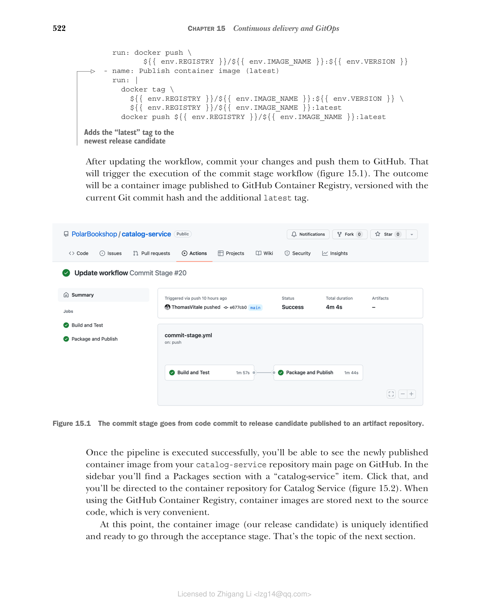
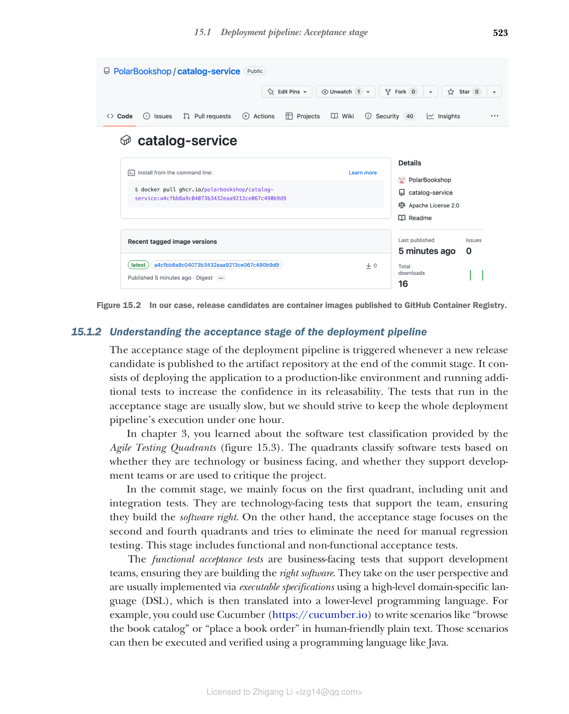
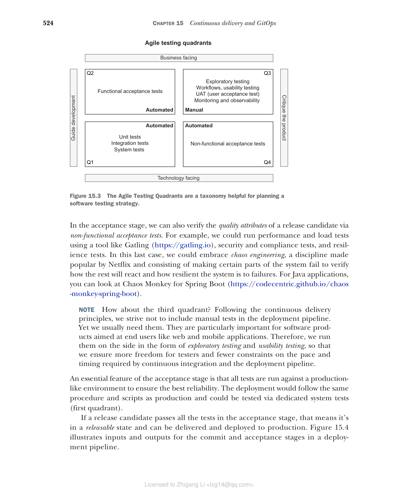
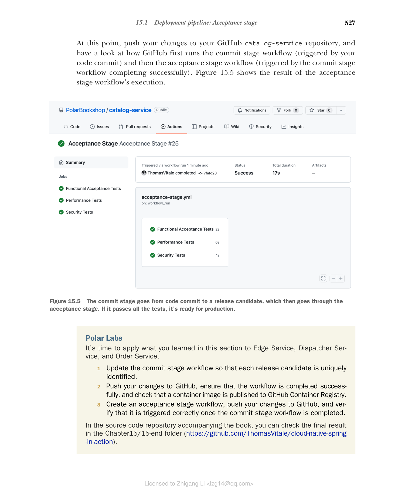

## 15.1 部署流水线：验收阶段

回顾第 3 章，我们使用的提交阶段工作流会把版本号 `latest` 应用到每个新发布的容器镜像上。这样在本地开发时很方便，但一旦我们尝试把应用部署到生产环境，这种方式就难以为继，因为发布候选（release candidate）无法被唯一标识。在持续交付中，我们的目标是让应用任何时候都处于可发布状态，因此我们需要一种策略来唯一标识每一个发布候选。接下来的篇幅将讨论如何达成这个目标，并介绍部署流水线的验收阶段。

### 15.1.1 使用 Git commit hash 标识发布候选

一种流行的策略是语义化版本号（https://semver.org）。它由 `<主版本>.<次版本>.<补丁>` 形式的标识符组成。你也可以选择在末尾添加一个连字符（`-`），后跟一个字符串，用来标记预发布版本。默认情况下，从 Spring Initializr（https://start.spring.io）生成的 Spring Boot 项目以 `0.0.1-SNAPSHOT` 版本初始化，它标识一个快照发布。这种策略的一个变体叫做日历版本（https://calver.org），它把语义化版本的概念与日期时间结合在一起。

这两种策略都被广泛用于开源项目和作为产品交付给客户的软件，因为它们隐式提供了关于新版本包含什么内容的信息。例如，我们会预期新的主版本（major）包含新功能和与前一个主版本不兼容的 API 变更；另一方面，我们会预期一个 patch 版本范围小，并保证向后兼容。

> 注意：如果你正在做一个适合语义化版本的项目，我推荐看看 JReleaser，这是一个发布自动化工具。"它的目标是简化创建发布并把产物发布到多个包管理器的过程，同时提供可定制的选项"（https://jreleaser.org）。

语义化版本需要某种形式的手动操作来根据发布产物的内容分配版本号：它包含破坏性变化吗？只包含 bug 修复吗？即使得到了一个数字，我们仍然不清楚新发布产物中具体包含什么，所以还需要使用 Git 标签，并在 Git commit 标识和版本号之间建立映射。

而对于快照产物来说情况更加棘手。以 Spring Boot 项目为例，默认版本是 `0.0.1-SNAPSHOT`。在我们准备好发布 `0.0.1` 版本之前，每次我们向 main 分支推送新改动，都会触发提交阶段，并发布一个新版本号同样是 `0.0.1-SNAPSHOT` 的发布候选。在 `0.0.1` 正式发布之前，所有发布候选的版本号都相同。这种方式无法保证变更的可追溯性。发布候选 `0.0.1-SNAPSHOT` 中包含哪些 commit？无从得知。而且它还受和使用 `latest` 标签同样不可靠的问题影响：每次我们重新拉取一个产物，它都可能与上一次不同。

在持续交付的语境下，用语义化版本这种方式来唯一标识发布候选并不理想。遵循持续集成原则，我们每天会构建很多发布候选，而每一个发布候选都可能被提升（promotion）到生产环境。我们难道要为每次新提交都更新语义化版本吗——根据其内容采用不同策略（主版本、次版本、补丁）？从代码提交到生产的路径应该尽可能自动化，尽量减少人为干预。如果我们直接进行持续部署，那么连提升到生产都会自动发生。那我们该怎么办？

一个解决方案是使用 Git commit hash 来对发布候选进行版本化——这自动化、可追溯、可靠，而且不需要 Git 标签。你可以直接使用 commit hash（例如 `486105e261cb346b87920aaa4ea6dce6eebd6223`），或者以其为基础生成一个更便于人识别的数字。例如，你可以给它加上时间戳前缀或递增序号，目的是让人能够判断哪个发布候选最新（例如 `20220731210356-48612e261cb346b87920aaa4ea6dce6eebd6223`）。

不过，语义化版本之类策略在持续交付中仍然有他们的位置。它们可以作为显示名，与唯一标识配合使用，正如 Dave Farley 在《Continuous Delivery Pipelines》（2021）中所建议的那样。这样既能让用户了解发布候选的信息，同时仍可受益于持续交付。

对于 Polar Bookshop，我们将采用一个简单方案：直接使用 Git commit hash 来标识发布候选。因此，我们会忽略 Gradle 项目中配置的版本号（它可以作为显示版本名使用）。例如，Catalog Service 的一个发布候选将是 `ghcr.io/<your_github_username>/catalog-service:<commit-hash>`。

既然有了策略，让我们看看如何为 Catalog Service 实现它。前往 Catalog Service 项目（`catalog-service`），打开 `.github/workflows` 文件夹中的 `commit-stage.yml` 文件。我们之前定义了一个 `VERSION` 环境变量用来保存发布候选的唯一标识。目前它被静态设置为 `latest`。我们把它替换为 `${{ github.sha }}`，它会被 GitHub Actions 动态解析为当前 Git commit hash。为方便起见，我们还给更新生成的发布候选加上 `latest` 标签，它对本地开发场景很有用。

```yaml
name: Commit Stage
on: push
env:
  REGISTRY: ghcr.io
  IMAGE_NAME: polarbookshop/catalog-service
  VERSION: ${{ github.sha }}

build:
  name: Build and Test
  ...

package:
  name: Package and Publish
  ...

  steps:
    ...
    - name: Publish container image
      run: docker push \
             ${{ env.REGISTRY }}/${{ env.IMAGE_NAME }}:${{ env.VERSION }}
    - name: Publish container image (latest)
      run: |
        docker tag \
          ${{ env.REGISTRY }}/${{ env.IMAGE_NAME }}:${{ env.VERSION }} \
          ${{ env.REGISTRY }}/${{ env.IMAGE_NAME }}:latest
        docker push ${{ env.REGISTRY }}/${{ env.IMAGE_NAME }}:latest
```

**清单 15.1 使用 Git commit hash 对发布候选进行版本化**（用等于 Git commit hash 的版本发布发布候选；为最新的发布候选添加 `latest` 标签）

更新工作流后，提交你的改动并推送到 GitHub，这会触发提交阶段工作流的执行（图 15.1）。其结果是一个发布到 GitHub Container Registry 的容器镜像，它以当前的 Git commit hash 作为版本号，并带有额外的 `latest` 标签。一旦流水线成功执行完毕，你就能在 GitHub 的 catalog-service 仓库主页看到新发布的容器镜像。侧边栏会有一个包含 "catalog-service" 的 Packages 区域。点击它，你将进入 Catalog Service 的容器仓库（图 15.2）。使用 GitHub Container Registry 时，容器镜像和源代码存储在一起，非常方便。


**图 15.1** 提交阶段从代码提交推进到发布候选发布到工件仓库。


**图 15.2** 对 Polar Bookshop 而言，发布候选是发布到 GitHub Container Registry 的容器镜像。

到这一步，容器镜像（我们的发布候选）已经被唯一标识，可以进入验收阶段了。这就是下一节的主题。

### 15.1.2 理解部署流水线的验收阶段

部署流水线的验收阶段在提交阶段结束时、一个新的发布候选发布到工件仓库时触发。它由把应用部署到一个形同生产环境的环境、并运行额外测试组成，目的是提高对可发布性的信心。验收阶段的测试通常很慢，但我们应该努力让整条部署流水线的执行时间控制在一小时以内。

在第 3 章中，你了解了敏捷测试象限（Agile Testing Quadrants）提供的软件测试分类（图 15.3）。该象限根据测试是基于技术还是面向业务/使用，以及测试是支持开发团队还是用于评价项目，来对软件测试进行分类。

在提交阶段，我们主要关注第一象限。这些测试面向技术，支持团队，确保他们用正确的方法构建软件（building the software right）。而验收阶段关注第二和第四象限，并试图消除对手动回归测试的需求。这一阶段包含功能性验收测试和非功能性验收测试。

功能验收测试是面向业务的、支持开发团队的测试，确保团队构建了正确功能的软件（building the right software）。它们从用户的角度出发，通常通过可执行规格说明来实现，使用一个高级别的领域特定语言（DSL）、然后翻译成更低级别的编程语言。例如，你可以用 Cucumber（https://cucumber.io）以人类可读的明文编写场景，比如"浏览图书目录"或"下图书订单"。这些场景随后可以通过 Java 之类的编程语言执行和验证。

在验收阶段，我们还可以通过非功能性验收测试验证发布候选的质量属性。例如，可以用 Gatling（https://gatling.io）之类的工具运行性能测试和负载测试，还有安全和合规测试，以及韧性测试。最后一种情况，我们可以拥抱混沌工程，一门 Netflix 让它流行起来的学科：刻意让系统的某一部分失效，以验证系统其余部分将如何反应、以及整个系统对故障的韧性。对于 Java 应用，可以了解 Chaos Monkey for Spring Boot（https://codecentric.github.io/chaos-monkey-spring-boot 的实现）。

> 注意：那第三个象限呢？遵循持续交付的，我们的目标是让流水线不包含手工测试。但我们通常还是需要它们，尤其对于面向终端用户的软件产品（如 Web 和移动应用）。因此，我们以探索性测试和可用性测试的形式在侧面开展它们，以确保给测试人员更多的自由度、更少的持续集成和部署流水线节奏进度上的约束。

验收阶段的一个重要特征是所有测试都针对生产环境运行，以确保最佳可靠性。部署会遵循与生产环境相同的流程和脚本，可以通过专门的系统测试（第一象限）进行验证。

如果一个发布候选通过了验收阶段的全部测试，那意味着它处于可发布状态，可以被交付并部署到生产环境。图 15.4 展示了部署流水线中提交阶段和验收阶段的输入与输出。


**图 15.3** 敏捷测试象限有助于规划软件测试策略的分类法（列出了：功能性验收测试、敏捷测试象限、探索性测试、工作流/可用性测试、UAT 用户验收测试、监控与可观测性、单元测试、集成测试、系统测试、非功能性验收测试；分为自动化/手动、指导开发/评价产品、技术导向/业务导向四象限 Q1-Q4）。


**图 15.4** 提交阶段从代码提交发布候选，随后进入验收阶段。如果它通过所有测试，就绪可交付生产。

### 15.1.3 使用 GitHub Actions 实现验收阶段

在本节中，您将看到如何使用 GitHub Actions 实现一个验收阶段的骨架工作流。全书我们一直关注单元测试和集成测试，它们在提交阶段运行。对于验收阶段，我们需要编写功能性和非功能性验收测试。这超出了本书的范围，但我仍然想以 Catalog Service 为例，展示设计工作流的一些原则。

打开你的书籍副本中 Catalog Service 项目（`catalog-service`），在 `.github/workflows` 文件夹内创建一个新的 `acceptance-stage.yml` 文件。每当有新的发布候选发布到工件仓库时，验收阶段就会被触发。定义触发方式的一种做法是订阅 GitHub 在提交阶段工作流完成运行时发布的事件。

```yaml
name: Acceptance Stage
on:
  workflow_run:
    workflows: ['Commit Stage']
    types: [completed]
    branches: main
```

**清单 15.2** 在提交阶段完成后触发验收阶段（工作流的名称；当 Commit Stage 工作流完成一次运行时触发；仅在 main 分支上运行）

但这还不够。遵循持续交付原则，开发人员在一天内经常提交，反复触发提交阶段。由于提交阶段远快于验收阶段，我们有可能制造瓶颈。当一次验收阶段运行完成时，我们并不关心验证在期间排队的所有发布候选，只关心最新的那一个，其余都可以丢弃。GitHub Actions 通过并发控制提供了一套处理这种场景的机制。

```yaml
name: Acceptance Stage
on:
  workflow_run:
    workflows: ['Commit Stage']
    types: [completed]
    branches: main
concurrency: acceptance
```

**清单 15.3 为工作流执行配置并发控制**（确保同一时间只有一个工作流在运行）

接下来，你会定义几个并行 job，在一个类似生产的环境中对发布候选运行功能性和非功能性验收测试。对于我们的例子，由于我们还没有为这个阶段实现自动测试，只需要打印一条消息即可。

```yaml
name: Acceptance Stage
on:
  workflow_run:
    workflows: ['Commit Stage']
    types: [completed]
    branches: main
concurrency: acceptance

jobs:
  functional:
    name: Functional Acceptance Tests
    if: ${{ github.event.workflow_run.conclusion == 'success' }}
    runs-on: ubuntu-22.04
    steps:
      - run: echo "Running functional acceptance tests"
  performance:
    name: Performance Tests
    if: ${{ github.event.workflow_run.conclusion == 'success' }}
    runs-on: ubuntu-22.04
    steps:
      - run: echo "Running performance tests"
  security:
    name: Security Tests
    if: ${{ github.event.workflow_run.conclusion == 'success' }}
    runs-on: ubuntu-22.04
    steps:
      - run: echo "Running security tests"
```

**清单 15.4 运行功能性与非功能性验收测试**（只有在提交阶段成功完成后才运行该 job）

通过 YAML 可以发现，验收测试可以在与生产环境极其相似的验收测试环境（beta）中运行。应用可以使用我们在前一章配置的 staging overlay 部署。

> 注意：验收测试可能在一个与生产环境高度相似的验收环境上运行。因此，我们可以使用前一个章节配置的 staging overlay 来部署应用。

此时，把你的改动推到 GitHub 的 catalog-service 仓库中，然后观察 GitHub 如何先运行提交阶段工作流（由你的代码提交触发），再运行验收阶段工作流（由提交阶段工作流运行成功触发）。图 15.5 显示验收阶段运行的工作流结果。


**图 15.5** 提交阶段从代码提交到发布候选，然后经过验收阶段。如果它通过，就绪可交付生产。

### Polar Labs 实验室

是时候把你在本节学到的东西应用到 Edge Service、Dispatcher Service 和 Order Service 上，检查是否正确执行：

1. 更新提交阶段工作流，使每个发布候选被唯一标识。
2. 把你的改动推送到 GitHub，确保工作流成功完成，并检查一个容器镜像已发布到 GitHub Container Registry。
3. 创建一个验收阶段工作流，推送到 GitHub，并验证它在提交阶段工作流完成后被正确触发。

在本书的源代码仓库中，你可以在 `Chapter15/15-end` 文件夹（https://github.com/ThomasVitale/cloud-native-spring-in-action）里查看最终结果。