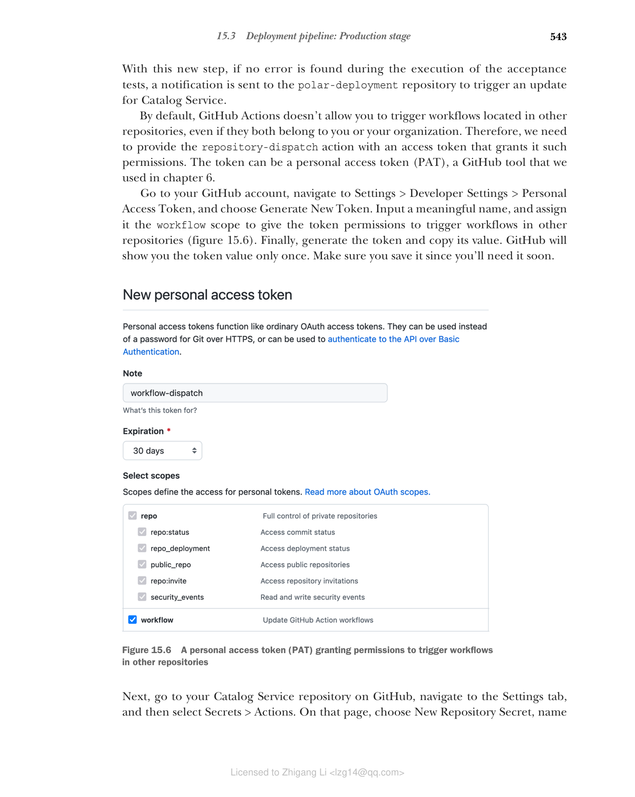
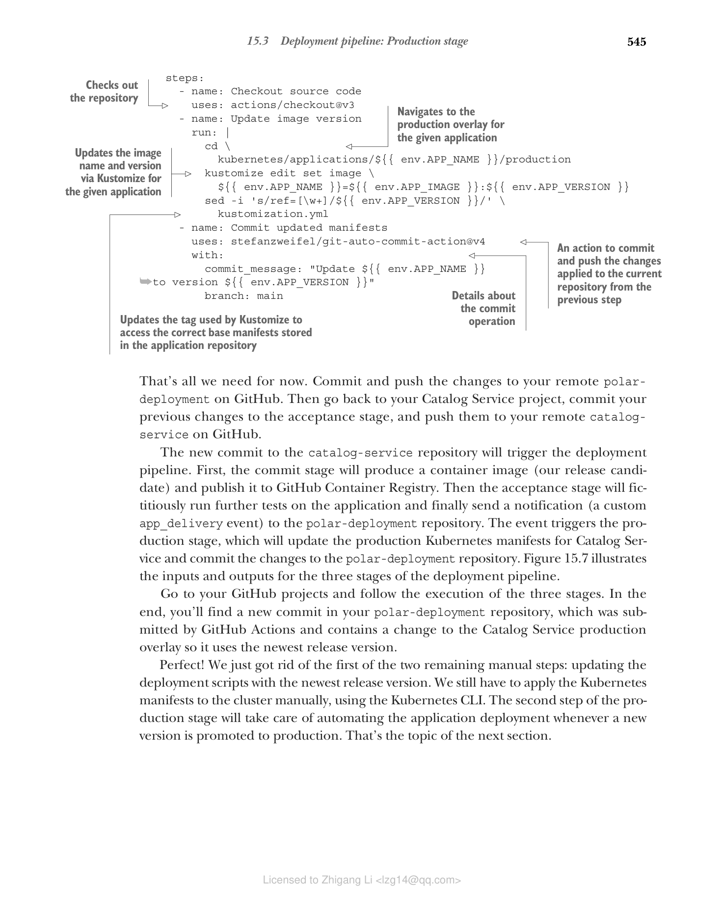

## 15.3 部署流水线：生产阶段

我们从第 3 章开始实现部署流水线，一路走来已经积累了丰富的经验。我们已经自动化了从代码提交到发布候选准备就绪的全过程。但到目前为止仍有两项操作为手动执行：更新生产脚本中的新应用版本，以及将它部署到 Kubernetes。

在本节中，我们将开始讨论部署流水线的最后一部分——生产阶段，并给你展示如何用 GitHub Actions 工作流实现它。

Kubernetes 为基础实施不同类型的部署策略提供了基础设施。当我们用新版本发布更新应用清单，并应用到集群时，Kubernetes 会执行滚动更新。这个策略包括用新 pod 实例增量式更新现有 Pod，并保证用户零停机。你在上一章已经看到它在实际中运行了。

默认情况下 Kubernetes 采用滚动更新策略，但也可以基于标准 Kubernetes 资源使用其他技术，或依赖 Knative 之类的工具。例如，你可能会用到金丝雀部署或蓝绿部署。这些策略各有取舍，超出本书范围。总之，部署策略选择是生产部署的重要决策点。

目前，你每次提交变更，最终都会产生新的发布候选，通过提交和验收阶段，如果成功就会被批准用于生产。然后你需要复制新发布候选的版本号并将其粘贴到 Kubernetes 清单中，才能手动更新应用。下一节你将看到如何通过实现部署流水线的最后一部分（生产阶段）来自动化该流程。

### 15.3.1 理解部署流水线的生产阶段

在发布候选通过提交和验收阶段之后，我们有足够的信心将其部署到生产环境。生产阶段可以手动或自动触发，具体取决于您是否希望实现持续部署。

持续交付是"一种软件开发纪律，即把软件构建到可以随时发布到生产环境的状态"（Martin Fowler）。关键在于理解软件可以发布到生产环境，但并非必须立刻发布。这是持续交付与持续部署的一个常见混淆点。如果你希望当最新发布候选自动部署到生产环境，那么你拥有的就是持续部署了。

生产阶段主要包括两个步骤：

1. 用新版本更新部署脚本（在我们场景中即 Kubernetes 清单）。
2. 将应用部署到生产环境。

> 注意：可选第三步是运行一些最终自动测试以验证部署成功。或许你可以复用验收阶段中包含的系统测试，在 staging 环境验证部署。

下一节将展示如何使用 GitHub Actions 实现生产阶段的第一个步骤，并讨论第二个步骤如何落地。我们的目标是自动化从代码提交到生产环境的完整路径，实现持续部署。

### 15.3.2 使用 GitHub Actions 实现生产阶段

相比于前面的阶段，根据多个因素，实现部署流水线的生产阶段差别很大。我们先关注生产阶段的第一步。

验收阶段结束时，我们拥有一个被证明可以用于生产的发布候选。之后，需要用新的发布版本更新生产 overlay 中的 Kubernetes 清单。当我们把应用源代码和部署脚本放在同一仓库时，生产阶段可以订阅 GitHub 在验收阶段成功完成时发布的一个特定事件，与我们配置提交与验收之间的流程相同。

但对我们来说，部署脚本存放在独立的仓库中，这也就意味着在应用仓库中环境完成后，需要通知部署仓库中的生产阶段工作流。GitHub Actions 可以通过自定义事件实现这种通知，具体方式见下。

打开 Catalog Service 项目（`catalog-service`），进入 `.github/workflows` 文件夹的 `acceptance-stage.yml`。在全部验收测试运行成功后，我们要定义最后一步，向 polar-deployment 仓库发出通知，请它用新的发布版本来更新 Catalog Service 的生产清单。这会作为生产阶段的触发器，我们马上实现它。

```yaml
name: Acceptance Stage
on:
  workflow_run:
    workflows: ['Commit Stage']
    types: [completed]
    branches: main
concurrency: acceptance

env:
  OWNER: <your_github_username>
  REGISTRY: ghcr.io
  APP_REPO: catalog-service
  DEPLOY_REPO: polar-deployment
  VERSION: ${{ github.sha }}

jobs:
  functional:
    ...
  performance:
    ...
  security:
    ...

  deliver:
    name: Deliver release candidate to production
    needs: [ functional, performance, security ]
    runs-on: ubuntu-22.04
    steps:
      - name: Deliver application to production
        uses: peter-evans/repository-dispatch@v2
        with:
          token: ${{ secrets.DISPATCH_TOKEN }}
          repository: ${{ env.OWNER }}/${{ env.DEPLOY_REPO }}
          event-type: app_delivery
          client-payload: '{
            "app_image": "${{ env.REGISTRY }}/${{ env.OWNER }}/${{ env.APP_REPO }}",
            "app_name": "${{ env.APP_REPO }}",
            "app_version": "${{ env.VERSION }}"
          }'
```

**清单 15.17 在部署仓库中触发生产阶段**（将相关数据定义为环境变量；仅当所有功能性和非功能性验收测试均成功完成时才运行；一个向另一个仓库发送事件并触发其工作流的 action；授权该 action 向另一个仓库发送事件所需的令牌；需要通知的仓库名；用于标识事件的自定义名称（由你决定）；发送给另一端仓库的消息负载。添加任何其他仓库完成操作所需的信息）

有了这一步，只要在验收测试执行过程中没有发现错误，就会向 polar-deployment 仓库发送一个通知来触发 Catalog Service 更新。

默认情况下，GitHub Actions 不允许触发其他仓库中的工作流，即使它们属于你或你的组织。因此，我们需要为 repository-dispatch action 提供一个具有该权限的 access token。这个 token 可以是一个 personal access token（PAT），也就是我们在第 6 章用过的 GitHub 工具。

前往你的 GitHub 账户，进入 Settings > Developer Settings > Personal Access Token，选择 Generate New Token。输入一个有意义的名称，分配 workflow 作用域，使 token 拥有访问其他仓库中触发工作流的权限（图 15.6）。生成 token 并复制其值。GitHub 只会展示一次 token 值，请务必保存好，因为你马上会用到。


**图 15.6** 个人访问令牌（PAT）授予在其他仓库中触发工作流的权限

接下来，前往 GitHub 上的 catalog-service 仓库，进入 Settings 标签页，然后选择 Secrets > Actions。在该页选择 New Repository Secret，命名为 DISPATCH_TOKEN（与清单 15.17 中使用的名称一致），填入刚才生成的 PAT 值。利用 GitHub 提供的 Secrets 功能，我们可以安全地让验收阶段工作流拿到这个 PAT。

> 警告：如第 3 章所提到的，使用 GitHub 官方市场中的 actions 时，应当像对待任何第三方应用一样处理，并适当管理相关安全风险。在验收阶段，我们向第三方 action 提供访问 token，并授予操纵仓库和工作流的权限。你不应该轻率地这样做。这里，我信任该 action 的作者，并决定将 token 交给该 action 使用。

此时先不要提交你对 catalog-service 仓库的改动，我们稍后再执行。到目前为止，我们已经实现了生产阶段的触发器，但还没有初始化生产阶段本身。下一步，进入 Polar Deployment 仓库并完成它。

打开你的 Polar Deployment 项目（`polar-deployment`），在一个新增的 `.github/workflows` 文件夹中创建 `production-stage.yml` 文件。生产阶段在应用仓库的验收阶段派发一个 app_delivery 事件时被触发。事件本身包含关于应用名称、镜像和最新发布候选版本等上下文信息。由于这些应用特定的信息参数化了，你可以将该工作流用于 Polar Bookshop 系统的所有应用程序，不仅仅是 Catalog Service。

生产阶段的工作流程由三个步骤组成：

1. 检出 polar-deployment 源代码。
2. 使用给定应用的新版本更新生产 Kustomization。
3. 将变更提交到 polar-deployment 仓库。

下面是具体实现。

```yaml
name: Production Stage
on:
  repository_dispatch:
    types: [app_delivery]

jobs:
  update:
    name: Update application version
    runs-on: ubuntu-22.04
    permissions:
      contents: write
    env:
      APP_IMAGE: ${{ github.event.client_payload.app_image }}
      APP_NAME: ${{ github.event.client_payload.app_name }}
      APP_VERSION: ${{ github.event.client_payload.app_version }}
    steps:
      - name: Checkout source code
        uses: actions/checkout@v3
      - name: Update image version
        run: |
          cd kubernetes/applications/${{ env.APP_NAME }}/production
          kustomize edit set image \
            ${{ env.APP_NAME }}=${{ env.APP_IMAGE }}:${{ env.APP_VERSION }}
          sed -i 's/ref=[\w+]/ref=${{ env.APP_VERSION }}/' kustomization.yml
      - name: Commit updated manifests
        uses: stefanzweifel/git-auto-commit-action@v4
        with:
          commit_message: "Update ${{ env.APP_NAME }} to version ${{ env.APP_VERSION }}"
          branch: main
```

**清单 15.18 新应用交付时更新镜像版本**（仅当从另一个仓库收到新的 app_delivery 事件时执行本工作流；把事件负载数据作为环境变量保存，方便使用；检出仓库；进入给定应用的生产 overlay 路径；通过 Kustomize 更新应用的镜像名；线上 App Repository 的 tag 引用更新给定的应用版本 tag；一个提交并推送前一步骤改动到当前仓库的；提交操作细节）

这就够了。提交并把这些改动推送到远程 polar-deployment 仓库。然后回到 catalog-service 项目，提交对验收阶段的改动，并推送到远程。

新的提交到 catalog-service 仓库会触发部署流水线。首先提交阶段会产生容器镜像（即我们的发布候选）并发布到 GitHub Container Registry。然后验收阶段会对该应用运行虚构的测试，最后 *向 polar-deployment* 发送通知（一个自定义 app_delivery 事件）。该事件触发生产阶段，生产阶段会更新 Catalog Service 的 Kubernetes 清单并把改动提交到 polar-deployment 仓库。图 15.7 展示了该流水线三个阶段输入和输出的图形。

去 GitHub 查看三个阶段的执行。最后，你会在 polar-deployment 仓库中看到一个由 GitHub Actions 提交的新 commit，其中包含对 Catalog Service 生产 overlay 的改动，使用最新的发布版本。

很好！我们刚刚去掉了两个剩余手动步骤中的第一个：用最新版本更新部署脚本。我们仍然需要使用 Kubernetes CLI 手动将 Kubernetes 清单应用到集群。生产阶段的第二个步骤将负责自动化应用部署，每当新版本发布到生产环境时自动部署。这正是下一节的主题。


**图 15.7** 提交阶段从代码提交到发布候选，验收阶段运行测试；生产阶段更新部署清单。

### Polar Labs 实验室

现在把你学到的东西应用到 Edge Service、Dispatcher Service 和 Order Service：

1. 为每个应用生成一个带 workflow 作用域的 PAT 令牌。出于安全最佳实践，不建议复用 token 用于多个用途。
2. 从 GitHub 仓库页面向每个应用保存该 PAT 作为 Secret。
3. 更新验收阶段工作流，新增最后一步，向生产阶段发送包含最新发布候选信息的通知。
4. 推送您的改动到 GitHub，确保工作流成功完成，并检查 polar-deployment 仓库中的生产阶段工作流已被正确触发。

Edge Service 是目前唯一通过公网可访问的应用，它还需要额外的 patch 来配置 Ingress 以阻止从集群外部访问 Actuator 端点。你可以在 Chapter15/15-end/polar-deployment 的 `applications/edge-service/production` 文件夹中找到这个额外的 patch。

为简单起见，我们接受这样的做法：Actuator 端点来自集群内部不经过认证访问。而在生产能力上，请看下面的说明。

关于部署相关测试/releases 信息，可参考《Continuous Delivery for Kubernetes》第 6 章，Mauricio Salatino 著（Manning，2021）等。