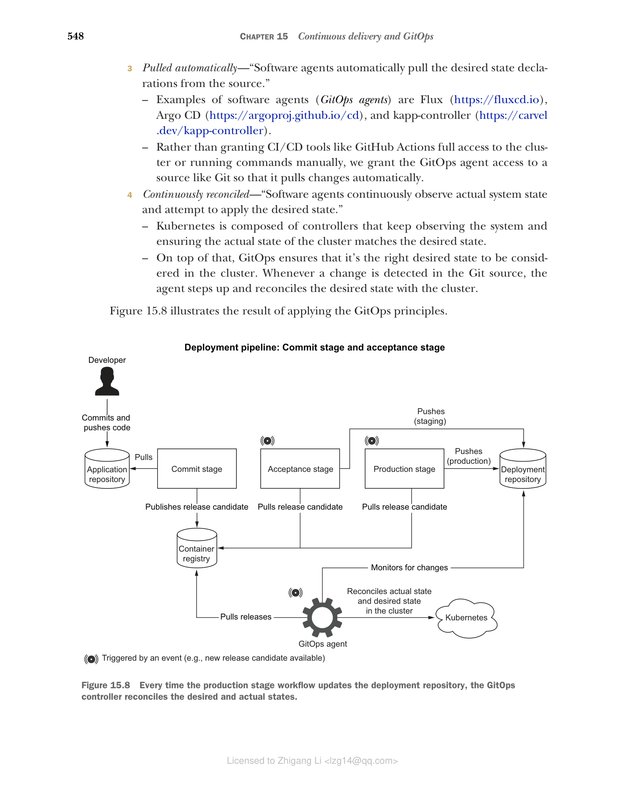
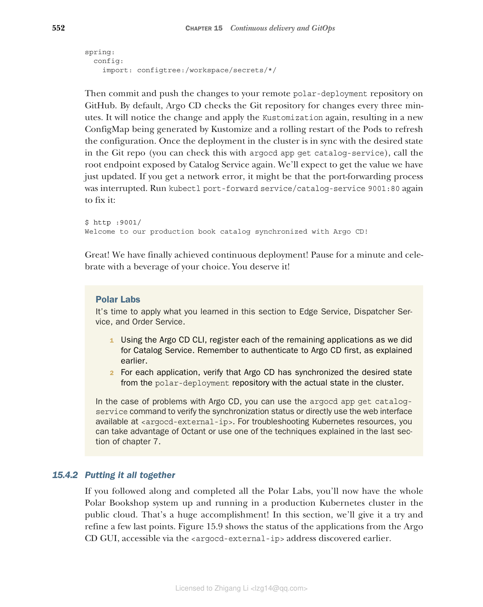

## 15.4 使用 GitOps 实现持续部署

传统上，持续部署是通过在部署流水线的生产阶段添加一个额外步骤来实现的。这个额外步骤会向目标平台（例如虚拟机或 Kubernetes 集群）进行认证，然后部署新版本的应用。近年来，一种不同的方法变得越来越流行：GitOps。这个词由 Weaveworks 的 CEO 兼创始人 Alexis Richardson 提出（www.weave.works）。

GitOps 是一套用于运维和管理软件系统的实践，能够在保证可维护性的同时实现持续交付和部署。相比传统方法，GitOps 更倾向于在交付和部署之间解耦。与其让流水线把部署推送到平台上，不如让平台自己从源仓库拉取期望状态并执行部署。第一种情况的部署是在生产阶段工作流中实现的；第二种情况（也就是我们的重点）中，部署理论上仍被视为生产阶段的一部分，但实现方式不同。

GitOps 不强制使用特定技术，但最好用 Git 和 Kubernetes 来实现，这也是我们关注的焦点。

GitOps 工作组（CNCF 的一部分）用四个原则来定义 GitOps（https://opengitops.dev）：

1. **声明式（Declarative）**："由 GitOps 管理的系统必须将其期望状态以声明形式表达。"与 Kubernetes 配合时，我们可以通过 YAML 文件（清单）来表达期望状态。Kubernetes manifests 声明我们想要实现什么，而不是如何实现。平台是负责寻找达到期望状态的方法。

2. **版本化且不可变（Versioned and immutable）**："期望状态以一种强制不可变性、版本化的方式存储，并保留完整的版本历史。"Git 是确保期望状态被版本化、历史被完整保留的首选。这使得例如轻松回滚到先前状态成为可能。存储在 Git 中的期望状态是不可变的，并代表单一事实来源。

3. **自动拉取（Pulled automatically）**："软件代理自动从源中拉取期望状态声明。这些软件代理（GitOps 运算符）的例子包括 Flux（https://fluxcd.io）、Argo CD（https://argoproj.github.io/cd）和 kapp-controller（https://carvel.dev/kapp-controller）。与其把 GitHub Actions 之类的 CI/CD 工具对集群的全部访问权交出，或手动运行命令，我们把访问 Git 源代码的权限仅交给 GitOps 代理，让它自动拉取变更。

4. **持续协调（Continuously reconciled）**："软件代理持续观察实际系统状态，并努力应用期望状态。"Kubernetes 由多个 controller 组成，这些 controller 持续观察系统，确保集群的实际状态与期望状态匹配。在此之上，GitOps 确保集群中考虑到的是正确的期望状态。只要检测到 Git 源中的变化，代理就会介入并协调期望状态与集群的状态。

图 15.8 展示了应用 GitOps 原则后的结果。


**图 15.8** 每当生产阶段工作流更新部署仓库时，GitOps 控制器会协调期望状态与实际状态。

如果你细想这四个原则，会发现我们已经应用了前两个原则：使用 Kubernetes manifests 和 Kustomize 声明式地表达应用的期望状态；并把期望状态存储在 GitHub 的 Git 仓库（polar-deployment）中，使其版本化且不可变。我们缺少的，是一个自动从 Git 源码中拉取期望状态声明、并在 Kubernetes 集群中持续协调它们的软件代理。我们接下来要做的，就是安装一个 GitOps 软件代理 Argo CD（https://argo-cd.readthedocs.io），配置它完成部署流水线的最后一步，让它监控 polar-deployment 仓库，当应用清单有任何变更时，自动将变更应用到我们的生产 Kubernetes 集群。

### 15.4.1 使用 Argo CD 实现 GitOps

首先安装 Argo CD CLI。安装说明见其项目网站（https://argo-cd.readthedocs.io）。如果你在 macOS 或 Linux 上，可以用 Homebrew：

```bash
$ brew install argocd
```

我们使用 CLI 来告诉 Argo CD 要监控哪个 Git 仓库，并将其配置为自动向集群应用变更，以实现持续部署。不过首先需要把 Argo CD 部署到生产 Kubernetes 集群中。

> 注意：我假设你的 Kubernetes CLI 仍然配置为访问 DigitalOcean 上的生产集群。你可以用 `kubectl config current-context` 检查。如果需要更改 context，可以运行 `kubectl config use-context <context-name>`。可用 context 清单通过 `kubectl config get-contexts` 获取。

打开终端，进入 Polar Deployment 项目（`polar-deployment`），导航到 `kubernetes/platform/production/argocd` 文件夹。你在搭建生产集群时应该已经把该文件夹复制到你的仓库中。如果没有，现在就从这个文件夹在配套的源代码仓库中补上（Chapter15/15-end/polar-deployment/platform/production/argocd）。

然后运行下面的脚本在生产集群中安装 Argo CD。运行前建议先打开文件看看里面的指令：

```bash
./deploy.sh
```

> 提示：你也许需要先执行 `chmod +x deploy.sh` 让该脚本可执行。

Argo CD 的部署包含多个组件，包括一个便于可视化和控制 Argo CD 管理的所有部署的 Web 界面。目前我们用 CLI。在安装过程中，Argo CD 会为 admin 账户（用户名为 admin）自动生成一个密码。执行下列命令来取回密码值（值在几秒后才能用到）：

```bash
kubectl -n argocd get secret argocd-initial-admin-secret \
 -o jsonpath="{.data.password}" | base64 -d; echo
```

接下来，找到分配给 Argo CD 服务器的外部 IP 地址：

```bash
kubectl -n argocd get service argocd-server
NAME TYPE CLUSTER-IP EXTERNAL-IP
argocd-server LoadBalancer 10.245.16.74 <external-ip>
```

平台可能需要几分钟来为 Argo CD 提供 load balancer。在提供过程中，EXTERNAL-IP 列会显示 `<pending>` 状态。稍等片刻再重试，直到出现 IP 地址。记住该 IP，因为我们马上要用它。

由于 Argo CD 服务器现在通过公网负载均衡器对外暴露，我们可以使用外部 IP 访问它的服务。这个例子我们使用 CLI 操作，但其实你也可以在浏览器打开 `<argocd-external-ip>`（分配给 Argo CD 服务器的 IP 地址）完成相同的结果。无论哪种方式，你都需要使用自动生成的 admin 账户登录。用户名是 admin，密码是你之前获取的那个。注意可能会收到一个警告，因为没用 HTTPS：

```bash
argocd login <argocd-external-ip>
```

现在是见证 GitOps 持续部署付诸行动的时刻。我假设你已经认真读过本章各小节，此刻你的 GitHub 仓库（catalog-service）的提交阶段应该已经构建出了发布候选容器镜像，验收阶段已经触发 polar-deployment 仓库的更新，而生产阶段已经用最新的发布版本更新了 Catalog Service 的生产 overlay。下面我们配置 Argo CD 来实现持续部署：

```bash
argocd app create catalog-service \
 --repo https://github.com/<your_github_username>/polar-deployment \
 --path kubernetes/applications/catalog-service/production \
 --dest-server https://kubernetes.default.svc \
 --dest-namespace default \
 --sync-policy automated \
 --auto-prune
```

这条命令会：

- **创建一个 catalog-service 应用**：在 Argo CD 中注册一个应用（`app create` 创建 catalog-service 应用）。
- **监控 Git 仓库**（`--repo`）：要监控的仓库，插入你的 GitHub 用户名。
- **要监控的目录**（`--path`）：给定仓库内要监控变更的文件夹。
- **--dest-server**：应用应部署到的 Kubernetes 集群（使用 kubectl context 中配置的集群）。
- **--dest-namespace**：应用应部署到的 namespace，使用 "default" namespace。
- **--sync-policy / 自动同步**（`--sync-policy automated`）：配置 Argo CD 自动协调 Git 仓库中的目标状态与集群实际状态之间的差异。
- **--auto-prune**：配置 Argo CD，在同步后自动删除旧资源。

你可以用下面的命令检查持续部署的状态（为了可读性我对部分结果做了筛选）：

```bash
argocd app get catalog-service
```

输出类似：

```
GROUP KIND NAMESPACE NAME STATUS HEALTH
 ConfigMap default catalog-config-6d5dkt7577 Synced
 Service default catalog-service Synced Healthy
apps Deployment default catalog-service Synced Healthy
```

Argo CD 已自动将 Catalog Service 的生产 overlay（`catalog-service/production`）应用到集群。

当上一条命令列出的资源都进入 Synced 状态后，我们就可以验证应用是否正确运行。目前该应用还没有暴露到集群之外，但我们可以使用端口转发功能将本机的 9001 端口流量转发到集群内运行在 80 端口上的 Service：

```bash
kubectl port-forward service/catalog-service 9001:80
```

接着，调用应用暴露的根端点。我们预期会得到为 Catalog Service 配置的 `polar.greeting` 属性的值。

```bash
http :9001/
Welcome to our book catalog from a production Kubernetes environment!
```

很好！通过 Argo CD 我们在一个步骤中不仅自动化了首次部署，也自动化了未来所有的更新。Argo CD 会检测到 Catalog Service 生产 overlay 的任何变化，并将新清单立即应用到集群。可能有新版本要部署，也可能是生产 overlay 配置的修改。例如，我们可以试试修改 `polar.greeting` 属性的值。

打开 Polar Deployment 项目，进入 Catalog Service 的生产 overlay（`catalog-service/production`），在 `application-prod.yml` 文件中修改 `polar.greeting` 属性：

```yaml
polar:
 greeting: Welcome to our production book catalog synchronized with Argo CD!
spring:
 config:
 import: configtree:/workspace/secrets/*/
```

提交并推送变更到 GitHub 上的远程 polar-deployment 仓库。默认情况下 Argo CD 每三分钟检查一次 Git 仓库是否发生变化。它会注意到该变化并再次应用 Kustomization，重新生成/更新一个由 Kustomize 生成的 ConfigMap，Pod 会滚动重启以刷新配置。一旦集群中的部署与 Git 仓库中的目标状态同步（可通过 `argocd app get catalog-service` 检查），再调用 Catalog Service 暴露的根端点，我们会得到刚更新的值。如果你收到网络错误，可能是 port-forwarding 进程中断了，重试运行 `kubectl port-forward service/catalog-service 9001:80` 即可修复：

```
$ http :9001/
Welcome to our production book catalog synchronized with Argo CD!
```

很好！我们终于实现了持续部署！暂停一下，为你选择的饮料庆祝一下吧。这是你应得的！

### 15.4.2 汇总整合

如果你一直跟着做并完成了所有 Polar Labs，现在整个 Polar Bookshop 系统应该已经在公有云的生产 Kubernetes 集群中运行起来了。这确实是一项巨大的成就！在本节中，我们将亲自试一试，并提炼出最后几个待完善点。图 15.9 展示了应用在 Argo CD GUI 中的部署状态，可通过之前在 `<argocd-external-ip>` 地址登录查看。


**图 15.9** Argo CD GUI 展示了通过 GitOps 流程管理的所有应用的概览。

### Polar Labs 实验室

1. 使用 Argo CD CLI，把我们之前为 Catalog Service 注册的方式注册每个剩余的应用。请记住先按照前面说明的操作对 Argo CD 进行认证。
2. 对每个应用，验证 Argo CD 已经将期望状态从 polar-deployment 仓库同步到集群的实际状态。

如果 Argo CD 出现问题，可使用 `argocd app get catalog-service` 验证同步状态，或使用 `<argocd-external-ip>` 提供的 Web 界面。排查 Kubernetes 资源问题，可以使用 Octant，或之前第 7 章详解的其他技巧。

到目前为止，我们一直在使用 Catalog Service——一个不对外暴露的集群内部应用。因此我们依赖 port-forwarding 功能来测试。现在整个系统都部署完毕，我们可以按照预期方式通过 Edge Service 访问应用了。平台在部署 Ingress 资源时会自动配置一个带外部 IP 的负载均衡器。我们来找出 Edge Service 前面那个 Ingress 的外部 IP 地址：

```bash
kubectl get ingress
NAME CLASS HOSTS ADDRESS PORTS AGE
polar-ingress nginx * <ip-address> 80 31m
```

现在我们可以通过公网使用 Polar Bookshop 了。打开浏览器，导航到 `<ip-address>`，尝试以 Isabelle 登录，添加一些书籍并浏览目录。然后退出，再次登录，这次以 Bjorn 的身份。验证你不能创建或编辑书籍，但可以下单。

用两个账号测试完应用后，退出登录，并访问 `<ip-address>/actuator/health` 验证无法访问 Actuator 端点。支撑 Ingress Controller 的 NGINX 会以 403 状态码响应。

> 注意：如果想配置 Grafana 可观测性服务栈，可参考配套源码仓库中的说明。

做得好！当您用完生产集群后，参考附录 B 最后小节，从 DigitalOcean 删除所有云资源。这对避免意想不到的费用至关重要。

### 小结

这一章的内容比较长，但收获巨大。下面总结一下你学到的关键点：

- 持续交付的核心思路是应用始终处于可发布状态。
- 交付流水线执行完毕后，你会获得一个可以用来部署应用的产物（容器镜像）。
- 在持续交付场景中，每个发布候选都应被唯一标识。
- 使用 Git commit hash 可以确保唯一性、可追踪性和自动化，同时语义化版本可以作为向用户和客户展示的显示名称。
- 在提交阶段结束时，发布候选被交付到工件仓库。接下来验收阶段将应用部署到一个类似生产环境的环境中，并运行功能性和非功能性测试。如果全部通过，发布候选就随时可发布到生产环境。
- 用于自定义资源配置的 Kustomize 方法基于 base 和 overlay 的概念。overlay 构建在 base manifests 之上，通过 patches 进行定制。它们可以定义环境变量、ConfigMaps、Secrets（作为 volume 挂载）或者用于容器资源的 requests 和 limits，还能为在此构建的部署配置与生命周期相关的设置。
- 你看到了如何定义 patches 来定制环境变量、作为卷挂载的 Secrets、CPU 和内存资源、ConfigMaps 和 Ingress 等。
- 部署流水线的最后一部分是生产阶段，其中使用最新发布版本更新部署清单，并将应用部署。
- 部署可以是 push 式的，也可以是 pull 式的。
- GitOps 是一套用于管理软件系统的云原生实践的集合。
- GitOps 基于四个原则，据此，系统的期望状态应该是声明式的、版本化的和不可变的、被自动拉取，并不断被协调。
- Argo CD 是在集群中运行的软件代理，自动从源 GitHub 仓库拉取期望状态，并在集群实际状态与期望状态不一致时将配置应用到集群。这就是我们实现持续部署的方式。