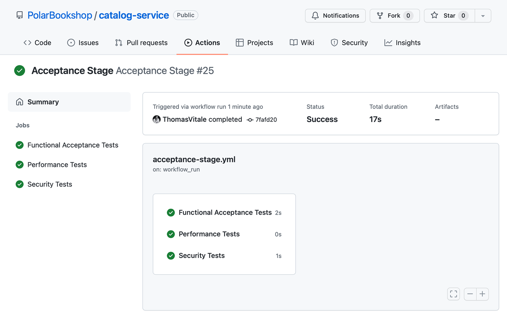

## 16.3 使用 Knative 部署 Serverless 应用

在前几节中，你学会了使用 Spring Native，以及如何把它与 Spring Cloud Function 结合构建 Serverless 应用。本节将指导你使用 Knative 项目，把 Quote Function 部署到基于 Kubernetes 的 Serverless 平台上。

Knative 是一个"基于 Kubernetes 的平台，用于部署和管理现代 Serverless 工作负载"（[https://knative.dev](https://knative.dev)）。它是一个 CNCF 项目，可以用来部署标准的容器化工作负载和事件驱动应用。该项目为开发人员提供了优秀的用户体验，和更高级的抽象，让 Kubernetes 上的应用部署变得更简单。

你可以决定在 Kubernetes 集群之上运行自己的 Knative 平台，或者选择云服务商提供的托管服务，例如 VMware Tanzu Application Platform、Google Cloud Run 或 Red Hat OpenShift Serverless。由于它们都基于开源软件和标准，你可以在不修改应用代码、且部署流水线改动最少的情况下，从 Google Cloud Run 迁移到 VMware Tanzu Application Platform。

Knative 项目由两个主要组件构成：Serving 和 Eventing。

- **Knative Serving** 用于在 Kubernetes 上运行 Serverless 工作负载。它负责自动伸缩、网络、版本（revision）和部署策略，让工程师专注于应用业务逻辑。
- **Knative Eventing** 提供基于 CloudEvents 规范的应用与事件源、事件汇（sink）集成的管理，对 RabbitMQ 或 Kafka 等后端做了抽象。

我们的重点是使用 Knative Serving 运行 Serverless 工作负载，同时避免供应商锁定。

> 注意：最初 Knative 包含第三个组件"Build"（构建），后来它独立成一个产品，改名为 Tekton（[https://tekton.dev](https://tekton.dev)），并捐赠给持续交付基金会（[https://cd.foundation](https://cd.foundation)）。Tekton 是一个 Kubernetes 原生的、用于构建支持持续交付的部署流水线的框架。例如，你可以用 Tekton 来代替 GitHub Actions。

本节将展示如何搭建包含 Kubernetes 和 Knative 的本地开发环境。然后我将介绍 Knative manifests（清单），你可以用它声明 Serverless 应用程序的期望状态，并展示如何把它们应用到 Kubernetes 集群。

### 16.3.1 搭建本地 Knative 平台

由于 Knative 运行在 Kubernetes 之上，我们首先需要一个集群。我们用 minikube 创建集群，方法与全书一直使用的一致。打开终端窗口，运行以下命令：

```bash
$ minikube start --profile knative
```

接下来，我们可以安装 Knative。为简单起见，我已把必要命令收集到一个脚本中，可以在本书的源代码仓库中查找到。从 Chapter16/16-end/polar-deployment/kubernetes/development 文件夹，把 `install-knative.sh` 文件复制到你的 Polar Deployment 仓库（`polar-deployment`）中的相同路径。

然后打开终端窗口，找到刚才复制脚本的文件夹，运行下面的命令来在本地 Kubernetes 集群上安装 Knative：

```bash
$ ./install-knative.sh
```

在运行之前，请打开文件查看其中的说明。更多安装 Knative 的信息可以在项目网站（[https://knative.dev/docs/install](https://knative.dev/docs/install)）查阅。

> 注意：在 macOS 和 Linux 上，你可能需要通过 `chmod +x install-knative.sh` 命令让该脚本可执行。

Knative 项目提供了一个便捷的 CLI 工具，可以用来与 Kubernetes 集群中的 Knative 资源进行交互。安装说明可以在附录 A 的 A.4 节找到。下一节我将展示如何使用 Knative CLI 部署 Quote Function。

### 16.3.2 使用 Knative CLI 部署应用

Knative 提供了几种部署应用的选项。在生产环境，我们会像标准 Kubernetes 部署一样，坚持使用声明式配置，并依赖 GitOps 流程来协调期望状态（在 Git 仓库中）与实际状态（在 Kubernetes 集群中）之间的差异。

当我们在做实验或本地工作时，也可以借助 Knative CLI 以命令式方式部署应用。在一个终端窗口运行下面的命令来部署 Quote Function。容器镜像就是前面定义的提交阶段工作流发布的那个。记得将 `<your_github_username>` 替换为你的（小写）GitHub 用户名：

```bash
$ kn service create quote-function \
 --image ghcr.io/<your_github_username>/quote-function \
 --port 9102
```

你可以参考图 16.3 来了解这个命令。该命令将在 Kubernetes 的 default 命名空间里初始化一个新的 quote-function service，并返回公网 URL，格式如下：

```
Creating service 'quote-function' in namespace 'default':
 0.045s The Route is still working to reflect the latest desired specification.
 0.096s Configuration "quote-function" is waiting for a Revision to become ready.
 3.337s ...
 3.377s Ingress has not yet been reconciled.
 3.480s Waiting for load balancer to be ready
 3.660s Ready to serve.
Service 'quote-function' created to latest revision 'quote-function-00001'
is available at URL:
http://quote-function.default.127.0.0.1.sslip.io
```

我们来测试一下！首先需要用 minikube 打开通往集群的隧道。第一次运行这条命令时，系统可能会要求输入你的机器密码以授权建立到集群的隧道：

```bash
$ minikube tunnel --profile knative
```

然后在新的终端窗口，调用应用的根端点，获取完整的语录列表。要调用的 URL 就是前一条命令返回的那个（`http://quote-function.default.127.0.0.1.sslip.io`），格式是 `<service-name>.<namespace>.<domain>`：

```bash
$ http http://quote-function.default.127.0.0.1.sslip.io
```


**图 16.3** 从容器镜像创建 Knative Service 的命令。Knative 会负责创建在 Kubernetes 上部署应用所需的全部资源。

因为我们是在本地工作，我把 Knative 配置成使用 sslip.io，这是一个 DNS 服务，"当以包含内嵌 IP 地址的主机名进行查询时会返回该 IP 地址"。例如，`127.0.0.1.sslip.io` 主机名会被解析到 `127.0.0.1` IP 地址。由于我们已经打开了通往集群的隧道，对 127.0.0.1 的请求会由集群处理，再由 Knative 路由到正确的服务。

Knative 无需任何额外配置就能处理应用伸缩。对每个请求，它会判断是否需要更多实例。当一个实例空闲超过特定时间段（默认 30 秒）后，Knative 会将其关闭。如果超过 30 秒没有收到任何请求，Knative 会把应用缩到零，意味着没有任何 Quote Function 实例在运行。

当最终收到新请求时，Knative 会启动一个新实例来处理请求。得益于 Spring Native，Quote Function 的启动时间几乎是瞬时的，因此用户和客户端不会像标准 JVM 应用那样经历长时间等待。这个强大的功能让你能优化成本，按需付费。

使用像 Knative 这样的开源平台的好处在于，你可以不动任何代码就把应用迁移到另一个云服务商。但还没完！你甚至可以直接沿用同样的部署流水线，或几乎不做修改。下一节将展示如何通过 YAML manifests 以声明式方式定义 Knative Service，这是生产场景推荐的方法。

**图 16.3 命令说明**：`kn service create quote-function --image ghcr.io/<your_github_username>/quote-function --port 9102`——创建一个 Knative Service（`kn service create`）；`quote-function` 是 Knative Service 的名称；`--image` 指定要运行的容器镜像（使用你的 GitHub 镜像仓库路径）；`--port` 指定应用监听的端口（9102）。

继续之前，请确保删除了之前创建的 Quote Function 实例：

```bash
$ kn service delete quote-function
```

### 16.3.3 使用 Knative manifests 部署应用

Kubernetes 是一个可扩展的系统。除了 Deployment 和 Pod 等内置对象，我们可以通过自定义资源定义（CRDs）定义自己的对象。这是包括 Knative 在内许多构建在 Kubernetes 之上的工具所采用的策略。

使用 Knative 的好处之一，是更出色的开发体验，以及能以更直接、更简洁的方式声明应用的期望状态。不必再处理 Deployment、Service 和 Ingress，我们可以使用单一类型的资源：Knative Service。

> 注意：全书都在把应用称为 service。Knative 提供了一种在单个资源声明中建模应用的方式：Knative Service。起初，这个命名可能不太清楚，因为已经有 Kubernetes 内置的 Service 类型。实际上，Knative 的选择非常直观，因为它把架构概念与部署概念一一映射起来了。

让我们看看 Knative Service 长什么样。打开 Quote Function 项目（`quote-function`），新建一个 "knative" 文件夹。然后在该文件夹内定义新的 `kservice.yml` 文件，声明 Quote Function 的 Knative Service 的期望状态。记得将 `<your_github_username>` 替换为你的小写 GitHub 用户名。

```yaml
apiVersion: serving.knative.dev/v1
kind: Service
metadata:
 name: quote-function
spec:
 template:
 spec:
 containers:
 - name: quote-function
 image: ghcr.io/<your_github_username>/quote-function
 ports:
 - containerPort: 9102
 resources:
 requests:
 cpu: '0.1'
 memory: '128Mi'
 limits:
 cpu: '2'
 memory: '512Mi'
```

**清单 16.13 用于 Quote Function 的 Knative Service 清单**（`apiVersion` 是 Knative Serving 对象的 API 版本；`kind` 是要创建的对象类型；`metadata.name` 是 Service 的名称；`spec.template.spec.containers[].name` 是容器名称；`image` 是用来运行容器的镜像，记得插入你自己的 GitHub 用户名；`containerPort` 是容器暴露的端口；`resources` 是容器的 CPU 与内存配置）

像处理其他任何 Kubernetes 资源一样，你可以用 `kubectl apply -f <manifest-file>` 应用 Knative Service 清单，或者像上一章我们使用 Argo CD 那样通过自动化流程应用。这个例子我们使用 Kubernetes CLI。

打开终端窗口，进入 Quote Function 项目（`quote-function`），运行以下命令，用 Knative Service 清单部署 Quote Function：

```bash
$ kubectl apply -f knative/kservice.yml
```

使用 Kubernetes CLI，你可以通过运行下面的命令获取所有已创建的 Knative Service 及其 URL 的信息（为了排版这里只显示了部分输出）：

```bash
$ kubectl get ksvc
NAME URL READY
quote-function http://quote-function.default.127.0.0.1.sslip.io True
```

让我们向 Quote Function 的根端点发送请求，验证应用是否正确部署。如果你之前打开的隧道已经不活动了，在调用它之前运行 `minikube tunnel --profile knative`：

```bash
$ http http://quote-function.default.127.0.0.1.sslip.io
```

Knative 在 Kubernetes 之上提供了抽象。不过它在底层仍然运行 Deployment、ReplicaSet、Pod、Service 和 Ingress（Kubernetes 内置资源）。这意味着你可以使用在之前章节学到的各种技巧。例如，你可以通过 ConfigMaps 和 Secrets 为 Quote Function 提供配置：

```bash
$ kubectl get pod
NAME READY STATUS
pod/quote-function-00001-deployment-c6978b588-llf9w 2/2 Running
```

如果你等 30 秒，再检查本地 Kubernetes 集群中有没有正在运行的 Pod，会发现没有了，因为 Knative 因空闲把应用缩放到零了：

```bash
$ kubectl get pod
No resources found in default namespace.
```

现在试着向 `http://quote-function.default.127.0.0.1.sslip.io` 发一个新请求。Knative 会立即为 Quote Function 启动一个新的 Pod 来应答请求：

```bash
$ kubectl get pod
NAME READY STATUS
quote-function-00001-deployment-c3b7b588-f49f1 2/2 Running
```

测试完应用后，可以用 `kubectl delete -f knative/kservice.yml` 删除它。最后，用下面命令停止并删除本地集群：

```bash
$ minikube stop --profile knative
$ minikube delete --profile knative
```

Knative Service 资源完整地表示一个应用服务。借助这个抽象，我们不再需要直接处理 Deployment、Service 和 Ingress。Knative 会处理所有这些：它在底层创建并管理它们，把我们从 Kubernetes 那些低层资源中解放出来。默认情况下，Knative 甚至可以在不需要配置 Ingress 资源的情况下把应用暴露到集群之外，直接为你提供可调用应用的 URL。

得益于这些专注于开发者体验和效率的特性，Knative 可用于在 Kubernetes 上运行和管理任何类型的工作负载，并且仅对支持该功能的应用（比如用 Spring Native）启用其缩放到零。我们可以方便地在 Knative 上运行整个 Polar Bookshop 系统。我们可以使用 `autoscaling.knative.dev/minScale` 注解来标记我们不想被缩放到零的应用：

```yaml
apiVersion: serving.knative.dev/v1
kind: Service
metadata:
 name: catalog-service
 annotations:
 autoscaling.knative.dev/minScale: "1"
...
```

上述 `autoscaling.knative.dev/minScale: "1"` 注解确保该 Service 永远不会被缩放到零。

Knative 提供了如此出色的开发者体验，以至于它是部署工作负载到 Kubernetes 时的事实抽象，不仅用于 Serverless，也包括更标准的容器化应用。每当我配置一个新 Kubernetes 集群，Knative 是我最先安装的东西。它也是 Tanzu Community Edition、Tanzu Application Platform、Red Hat OpenShift 和 Google Cloud Run 等平台的基础组成部分。

> 注意：Tanzu Community Edition（[https://tanzucommunityedition.io](https://tanzucommunityedition.io)）是一个基于 Knative 提供出色开发者体验的 Kubernetes 平台。它是开源的，可以自由使用。

**Knative 的另一个出色特点是：**它让蓝绿部署（blue/green）、金丝雀（canary）部署或 A/B 测试等部署策略的采用变得直观且对开发者友好，全部由同一个 Knative Service 资源实现。在纯 Kubernetes 中实现这些策略需要大量的手工工作，而 Knative 开箱即用地支持它们。

> 注意：关于 Serverless 应用和 Knative 的更多信息，可参考官方文档（[https://knative.dev](https://knative.dev)）。另外，我推荐在 Manning 出版社目录中查阅两本相关书籍：*Knative in Action*（Jacques Chester 著，Manning, 2021；[https://www.manning.com/books/knative-in-action](https://www.manning.com/books/knative-in-action)）和 *Continuous Delivery for Kubernetes*（Mauricio Salatino 著，[www.manning.com/books/continuous-delivery-for-kubernetes](http://www.manning.com/books/continuous-delivery-for-kubernetes)）。

## Polar Labs 练习

请把最后几节学到的东西应用到 Quote Service 上。

1. 定义一个提交阶段工作流，其中包含将应用编译并测试为原生可执行文件的步骤。
2. 把你的改动推送到 GitHub，确保工作流成功完成，并为你的应用发布容器镜像。
3. 通过 Knative CLI 在 Kubernetes 上部署 Quote Service。
4. 通过 Kubernetes CLI 从 Knative Service 清单在 Kubernetes 上部署 Quote Service。

你可以在与本书配套的代码仓库的 Chapter16/16-end 文件夹（[https://github.com/ThomasVitale/cloud-native-spring-in-action](https://github.com/ThomasVitale/cloud-native-spring-in-action)）查看最终结果。

## 小结

让我们回顾一下你从这一章学到的新知识：

- 把 Java 应用的运行时从标准 OpenJDK 发行版替换为 GraalVM，就能凭借一种执行即时编译（JIT）的全新优化技术（GraalVM 编译器）提升其性能和效率。
- 让 GraalVM 在 Serverless 场景上极具创新性和人气的，正是原生镜像模式。
- GraalVM 不会把 Java 代码编译成字节码、再由 JVM 在运行时解释并转换为机器码，而是提供一种新技术（Native Image builder），直接把 Java 应用编译成机器码，得到原生可执行文件或原生镜像。
- 编译为原生镜像的 Java 应用拥有更快的启动时间、经过优化的内存占用以及瞬时达到峰值性能，这与 JVM 方案不同。
- Spring Native 的主要目标是：用 GraalVM 把任意 Spring 应用编译成原生可执行文件，且无须改一行代码。
- Spring Native 提供了一套 AOT 基础设施（从专门的 Gradle/Maven 插件调用），用于为 GraalVM 提供 AOT 编译 Spring 类所需的全部配置。
- 有两种方式把 Spring Boot 应用编译成原生可执行文件。第一种方式产出 OS 特定的可执行文件并直接在机器上运行应用；第二种方式依赖 Buildpacks 把原生可执行文件容器化，并运行在 Docker 之类的容器运行时上。
- Serverless 是构建在虚拟机和容器之上的抽象层，它把更多职责从产品团队转移到平台，实现按需伸缩到零、按实际用量付费。
- 遵循 Serverless 计算模型，开发人员专注于实现应用的业务逻辑。
- Serverless 应用由传入的请求或特定事件触发，我们称之为请求驱动或事件驱动的应用。
- Spring Cloud Function 应用可以用几种不同的方式部署。
- 包含 Spring Native 时，你还可以把应用编译为原生镜像，直接运行在服务器或容器运行时上。得益于瞬时启动时间和更低的内存占用，你可以无缝地把这类应用部署到 Knative。
- Knative 是"基于 Kubernetes 的、用于部署和管理现代 Serverless 工作负载的平台"（[https://knative.dev](https://knative.dev)）。你可以用它部署标准容器化工作负载和事件驱动的应用。
- Knative 为开发者提供了更出色的用户体验和更高的抽象，使得在 Kubernetes 上部署应用更简单。
- Knative 提供了优秀的开发者体验，它正成为在 Kubernetes 上部署工作负载（不只是 Serverless，也包括更标准的容器化应用）的事实抽象。