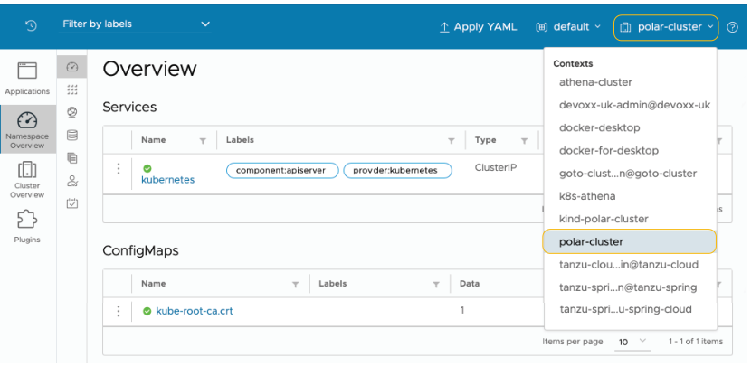

# 附录 B 在 DigitalOcean 上生产环境的 Kubernetes

**本附录内容**

* 在 DigitalOcean 上运行 Kubernetes 集群
* 在 DigitalOcean 上运行 PostgreSQL 数据库
* 在 DigitalOcean 上运行 Redis
* 使用 Kubernetes Operator 运行 RabbitMQ
* 使用 Helm chart 运行 Keycloak

Kubernetes 是部署和管理容器化工作负载的事实标准。在整本书中，我们一直依赖本地 Kubernetes 集群来部署 Polar Bookshop 系统中的应用程序和服务。对于生产环境，我们需要其他东西。

所有主要的云提供商都提供托管 Kubernetes 服务。在本附录中，您将了解如何使用 DigitalOcean 启动 Kubernetes 集群。我们还将依赖平台提供的其他托管服务，包括 PostgreSQL 和 Redis。最后，本附录将指导您直接在 Kubernetes 中部署 RabbitMQ 和 Keycloak。

在继续之前，您需要确保拥有 DigitalOcean 帐户。注册时，DigitalOcean 提供 60 天免费试用，赠送 100 美元积分，这足以完成第 15 章中的示例。请按照官方网站上的说明创建帐户并开始免费试用（https://try.digitalocean.com/freetrialoffer）。

> **注意** 本书附带的源代码仓库包含在几个不同云平台上设置 Kubernetes 集群的其他说明，以防您想使用 DigitalOcean 以外的平台。

与 DigitalOcean 平台交互有两种主要选项。第一种是通过 Web 门户（https://cloud.digitalocean.com），这对于探索可用服务及其功能非常方便。第二个选项是通过 doctl，即 DigitalOcean CLI。这就是我们将在以下部分中使用的工具。

您可以在官方网站上找到安装 doctl 的说明（https://docs.digitalocean.com/reference/doctl/how-to/install）。如果您使用的是 macOS 或 Linux，可以使用 Homebrew 轻松安装：

```bash
$ brew install doctl
```

您可以按照同一 doctl 页面上的后续说明生成 API 令牌并授予 doctl 访问您的 DigitalOcean 帐户的权限。

> **注意** 在真实的生产场景中，您将使用 Terraform 或 Crossplane 等工具自动化平台管理任务。这通常是平台团队的责任，而不是应用程序开发人员的责任，因此我不会通过引入另一个工具来增加额外的复杂性。相反，我们将直接使用 DigitalOcean CLI。如果您对 Terraform 感兴趣，Manning 的目录中有一本关于该主题的书：Scott Winkler 的《Terraform in Action》（Manning，2021；https://www.manning.com/books/terraform-in-action）。对于 Crossplane，我建议阅读 Mauricio Salatino 的《Continuous Delivery for Kubernetes》第 4 章（https://livebook.manning.com/book/continuous-delivery-for-kubernetes/chapter-4）。

## B.1 在 DigitalOcean 上运行 Kubernetes 集群

我们需要在 DigitalOcean 上创建的第一个资源是 Kubernetes 集群。您可以依赖平台提供的 IaaS 功能，并在虚拟机上手动安装 Kubernetes 集群。相反，我们将向上移动抽象阶梯，选择由平台管理的解决方案。当我们使用 DigitalOcean Kubernetes（https://docs.digitalocean.com/products/kubernetes）时，平台将处理许多基础设施问题，以便我们开发人员可以更专注于应用程序开发。

您可以使用 doctl 轻松创建新的 Kubernetes 集群。我承诺我们将在真实的生产环境中部署 Polar Bookshop，这就是我们将要做的，尽管我不会要求您像在真实场景中那样调整和配置集群。

首先，设置 Kubernetes 集群不是开发人员的责任——这是平台团队的工作。其次，它需要比本书提供的更深入的 Kubernetes 知识才能完全理解配置。第三，我不希望您在 DigitalOcean 上使用大量计算资源和服务而产生额外费用。成本优化是适用于真实应用程序的云属性。但是，如果您正在尝试或运行演示应用程序，它可能会变得昂贵。请密切关注您的 DigitalOcean 帐户，以监控您的免费试用和 100 美元积分何时到期。

每个云资源都可以在托管于特定地理区域的数据中心中创建。为了获得更好的性能，我建议您选择靠近您的区域。我将使用"Amsterdam 3"（ams3），但您可以通过以下命令获取完整区域列表：

```bash
$ doctl k8s options regions
```

让我们继续使用 DigitalOcean Kubernetes（DOKS）初始化 Kubernetes 集群。它将由三个工作节点组成，您可以决定其技术规格。您可以在 CPU、内存和架构方面选择不同的选项。我将使用具有 2 个 vCPU 和 4 GB 内存的节点：

```bash
$ doctl k8s cluster create polar-cluster \
  # 定义要创建的集群的名称
  --node-pool "name=basicnp;size=s-2vcpu-4gb;count=3;label=type=basic;" \
  # 提供工作节点的请求规格
  --region <your_region>
  # 您选择的数据中心区域，例如 "ams3"
```

> **注意** 如果您想了解更多关于不同计算选项及其价格的信息，可以使用 `doctl compute size list` 命令。

集群配置将需要几分钟。最后，它将打印出分配给集群的唯一 ID。请记下它，因为您稍后会需要它。您可以通过运行以下命令随时获取集群 ID（为清晰起见，我已过滤结果）：

```bash
$ doctl k8s cluster list
ID           Name           Region   Status    Node Pools
<cluster-id> polar-cluster  ams3     running   basicnp
```

在集群配置结束时，doctl 还将配置 Kubernetes CLI 的上下文，以便您可以从计算机与在 DigitalOcean 上运行的集群进行交互，类似于您到目前为止使用本地集群所做的操作。您可以通过运行以下命令验证 kubectl 的当前上下文：

```bash
$ kubectl config current-context
```

> **注意** 如果要更改上下文，可以运行 `kubectl config use-context <context-name>`。

集群配置完成后，您可以按如下方式获取有关工作节点的信息：

```bash
$ kubectl get nodes
NAME       STATUS   ROLES   AGE     VERSION
<node-1>   Ready    <none>  2m34s   v1.24.3
<node-2>   Ready    <none>  2m36s   v1.24.3
<node-3>   Ready    <none>  2m26s   v1.24.3
```

您还记得用于可视化本地 Kubernetes 集群上的工作负载的 Octant 仪表板吗？您现在可以使用它来获取有关 DigitalOcean 上集群的信息。打开终端窗口并使用以下命令启动 Octant：

```bash
$ octant
```

Octant 将在您的浏览器中打开并显示来自当前 Kubernetes 上下文的数据，该上下文应该是 DigitalOcean 上的集群。从右上角菜单中，您可以从下拉框中切换上下文，如图 B.1 所示。


**图 B.1 Octant 允许您通过切换上下文来可视化不同 Kubernetes 集群的工作负载**

正如我在第 9 章中提到的，Kubernetes 不附带 Ingress Controller；需要您安装一个。由于我们将依赖 Ingress 资源来允许来自公共互联网的流量进入集群，因此我们需要安装 Ingress Controller。让我们安装与本地使用的相同的：ingress-nginx。

在您的 polar-deployment 仓库中，创建一个新的 `kubernetes/platform/production` 文件夹，并从本书附带源代码仓库中的 `Chapter15/15-end/polar-deployment/kubernetes/platform/production` 文件夹复制内容。

然后打开终端窗口，导航到 polar-deployment 项目中的 `kubernetes/platform/production/ingress-nginx` 文件夹，运行以下命令将 ingress-nginx 部署到您的生产 Kubernetes 集群：

```bash
$ ./deploy.sh
```

您可以打开文件查看说明，然后再运行它。

> **注意** 您可能需要先使用命令 `chmod +x deploy.sh` 使脚本可执行。

在下一节中，您将了解如何在 DigitalOcean 上初始化 PostgreSQL 数据库。

## B.2 在 DigitalOcean 上运行 PostgreSQL 数据库

在本书的大部分内容中，您一直以容器形式运行 PostgreSQL 数据库实例，无论是在 Docker 中还是在本地 Kubernetes 集群中。在生产环境中，我们希望利用平台并使用 DigitalOcean 提供的托管 PostgreSQL 服务（https://docs.digitalocean.com/products/databases/postgresql）。

我们在整本书中开发的应用程序是云原生的，遵循 15-Factor 方法论。因此，它们将备份服务视为附加资源，可以在不更改应用程序代码的情况下进行交换。此外，我们遵循环境一致性原则，在开发和测试中使用真实的 PostgreSQL 数据库，这也是我们想要在生产中使用的相同数据库。

从在本地环境中运行的 PostgreSQL 容器迁移到具有高可用性、可扩展性和弹性的托管服务，只需要更改 Spring Boot 的一些配置属性的值。这有多棒？

首先，创建一个新的名为 polar-postgres 的 PostgreSQL 服务器，如以下代码片段所示。我们将使用 PostgreSQL 14，这与我们用于开发和测试的版本相同。请记住将 `<your_region>` 替换为您要使用的地理区域。它应该与您用于 Kubernetes 集群的区域相同。在我的例子中，它是 ams3：

```bash
$ doctl databases create polar-db \
  --engine pg \
  --region <your_region> \
  --version 14
```

数据库服务器配置将需要几分钟。您可以通过以下命令验证安装状态（为清晰起见，我已过滤结果）：

```bash
$ doctl databases list
ID             Name      Engine   Version   Region   Status
<polar-db-id>  polar-db  pg       14        ams3     online
```

当数据库联机时，您的数据库服务器已准备就绪。记下数据库服务器 ID。您稍后会需要它。

为了减少不必要的攻击向量，您可以配置防火墙，以便只能从之前创建的 Kubernetes 集群访问 PostgreSQL 服务器。还记得我要求您记下 PostgreSQL 和 Kubernetes 的资源 ID 吗？在以下命令中使用它们来配置防火墙并保护对数据库服务器的访问：

```bash
$ doctl databases firewalls append <postgres_id> --rule k8s:<cluster_id>
```

接下来，让我们创建两个数据库，供 Catalog Service（`polardb_catalog`）和 Order Service（`polardb_order`）使用。请记住将 `<postgres_id>` 替换为您的 PostgreSQL 资源 ID：

```bash
$ doctl databases db create <postgres_id> polardb_catalog
$ doctl databases db create <postgres_id> polardb_order
```

最后，让我们检索连接到 PostgreSQL 的详细信息。请记住将 `<postgres_id>` 替换为您的 PostgreSQL 资源 ID：

```bash
$ doctl databases connection <postgres_id> --format Host,Port,User,Password
Host     <db-host>
Port     <db-port>
User     <db-user>
Password <db-password>
```

在结束本节之前，让我们在 Kubernetes 集群中创建一些 Secret，其中包含两个应用程序所需的 PostgreSQL 凭据。在真实场景中，我们应该为两个应用程序创建专用用户并授予权限。为简单起见，我们将对两者都使用管理员帐户。

首先，使用上一个 doctl 命令返回的信息为 Catalog Service 创建 Secret：

```bash
$ kubectl create secret generic polar-postgres-catalog-credentials \
  --from-literal=spring.datasource.url=jdbc:postgresql://<postgres_host>:<postgres_port>/polardb_catalog \
  --from-literal=spring.datasource.username=<postgres_username> \
  --from-literal=spring.datasource.password=<postgres_password>
```

同样，为 Order Service 创建 Secret。注意 Spring Data R2DBC 对 URL 要求的语法略有不同：

```bash
$ kubectl create secret generic polar-postgres-order-credentials \
  --from-literal="spring.flyway.url=jdbc:postgresql://<postgres_host>:<postgres_port>/polardb_order" \
  --from-literal="spring.r2dbc.url=r2dbc:postgresql://<postgres_host>:<postgres_port>/polardb_order?ssl=true&sslMode=require" \
  --from-literal=spring.r2dbc.username=<postgres_username> \
  --from-literal=spring.r2dbc.password=<postgres_password>
```

PostgreSQL 就到这里。在下一节中，您将了解如何使用 DigitalOcean 初始化 Redis。

## B.3 在 DigitalOcean 上运行 Redis

在本书的大部分内容中，您一直以容器形式运行 Redis 实例，无论是在 Docker 中还是在本地 Kubernetes 集群中。在生产环境中，我们希望利用平台并使用 DigitalOcean 提供的托管 Redis 服务（https://docs.digitalocean.com/products/databases/redis/）。

同样，由于我们遵循 15-Factor 方法论，我们可以在不更改应用程序代码的情况下更换 Edge Service 使用的 Redis 备份服务。我们只需要更改 Spring Boot 的一些配置属性。

首先，创建一个新的名为 polar-redis 的 Redis 服务器，如以下代码片段所示。我们将使用 Redis 7，这与我们用于开发和测试的版本相同。请记住将 `<your_region>` 替换为您要使用的地理区域。它应该与您用于 Kubernetes 集群的区域相同。在我的例子中，它是 ams3：

```bash
$ doctl databases create polar-redis \
  --engine redis \
  --region <your_region> \
  --version 7
```

Redis 服务器配置将需要几分钟。您可以通过以下命令验证安装状态（为清晰起见，我已过滤结果）：

```bash
$ doctl databases list
ID              Name       Engine   Version   Region   Status
<redis-db-id>   polar-redis redis    7         ams3     creating
```

当服务器联机时，您的 Redis 服务器已准备就绪。记下 Redis 资源 ID。您稍后会需要它。

为了减少不必要的攻击向量，我们可以配置防火墙，以便只能从之前创建的 Kubernetes 集群访问 Redis 服务器。还记得我要求您记下 Redis 和 Kubernetes 的资源 ID 吗？在以下命令中使用它们来配置防火墙并保护对 Redis 服务器的访问：

```bash
$ doctl databases firewalls append <redis_id> --rule k8s:<cluster_id>
```

最后，让我们检索连接到 Redis 的详细信息。请记住将 `<redis_id>` 替换为您的 Redis 资源 ID：

```bash
$ doctl databases connection <redis_id> --format Host,Port,User,Password
Host      <redis-host>
Port      <redis-port>
User      <redis-user>
Password  <redis-password>
```

在结束本节之前，让我们在 Kubernetes 集群中创建一个 Secret，其中包含 Edge Service 所需的 Redis 凭据。在真实场景中，我们应该为应用程序创建一个专用用户并授予权限。为简单起见，我们将使用默认帐户。使用上一个 doctl 命令返回的信息填充 Secret：

```bash
$ kubectl create secret generic polar-redis-credentials \
  --from-literal=spring.redis.host=<redis_host> \
  --from-literal=spring.redis.port=<redis_port> \
  --from-literal=spring.redis.username=<redis_username> \
  --from-literal=spring.redis.password=<redis_password> \
  --from-literal=spring.redis.ssl=true
```

Redis 就到这里。下一节将介绍如何使用 Kubernetes Operator 部署 RabbitMQ。

## B.4 使用 Kubernetes Operator 运行 RabbitMQ

在前面的部分中，我们初始化并配置了平台提供和管理的 PostgreSQL 和 Redis 服务器。我们无法对 RabbitMQ 执行相同的操作，因为 DigitalOcean 没有 RabbitMQ 产品，类似于 Azure 或 GCP 等其他云提供商。

在 Kubernetes 集群中部署和管理 RabbitMQ 等服务的一种流行且方便的方法是使用 Operator 模式。Operator 是"Kubernetes 的软件扩展，利用自定义资源来管理应用程序及其组件"（https://kubernetes.io/docs/concepts/extend-kubernetes/operator）。

考虑一下 RabbitMQ。要在生产中使用它，您需要将其配置为高可用性和弹性。根据工作负载，您可能希望动态扩展它。当软件的新版本可用时，您需要一种可靠的方法来升级服务并迁移现有构建和数据。您可以手动执行所有这些任务。或者，您可以使用 Operator 来捕获所有这些操作需求，并指示 Kubernetes 自动处理它们。实际上，Operator 是一个在 Kubernetes 上运行并与之交互以完成其功能的应用程序。

RabbitMQ 项目提供了一个官方 Operator 来在 Kubernetes 集群上运行事件代理（www.rabbitmq.com）。我已经配置了使用 RabbitMQ Kubernetes Operator 所需的所有必要资源，并准备了一个脚本来部署它。

打开终端窗口，转到您的 Polar Deployment 项目（polar-deployment），导航到 `kubernetes/platform/production/rabbitmq` 文件夹。在配置 Kubernetes 集群时，您应该已将该文件夹复制到您的仓库中。如果没有，请现在从本书附带的源代码仓库中复制（Chapter15/15-end/polar-deployment/platform/production/rabbitmq）。

然后运行以下命令将 RabbitMQ 部署到您的生产 Kubernetes 集群：

```bash
$ ./deploy.sh
```

您可以打开文件查看说明，然后再运行它。

> **注意** 您可能需要先使用命令 `chmod +x deploy.sh` 使脚本可执行。

该脚本将输出有关为部署 RabbitMQ 执行的所有操作的详细信息。最后，它将创建一个 `polar-rabbitmq-credentials` Secret，其中包含 Order Service 和 Dispatcher Service 访问 RabbitMQ 所需的凭据。您可以按如下方式验证 Secret 是否已成功创建：

```bash
$ kubectl get secrets polar-rabbitmq-credentials
```

RabbitMQ 代理部署在专用的 `rabbitmq-system` 命名空间中。应用程序可以在 `polar-rabbitmq.rabbitmq-system.svc.cluster.local` 端口 5672 上与其交互。

RabbitMQ 就到这里。在下一节中，您将了解如何将 Keycloak 服务器部署到生产 Kubernetes 集群。

## B.5 使用 Helm chart 运行 Keycloak

与 RabbitMQ 一样，DigitalOcean 不提供托管的 Keycloak 服务。Keycloak 项目正在开发一个 Operator，但在撰写本文时仍处于 beta 阶段，因此我们将使用不同的方法部署它：Helm chart。

将 Helm 视为包管理器。要在计算机上安装软件，您将使用操作系统包管理器之一，例如 apt（Ubuntu）、Homebrew（macOS）或 Chocolatey（Windows）。在 Kubernetes 中，您可以类似地使用 Helm，但它们被称为 chart 而不是包。

继续在您的计算机上安装 Helm。您可以在官方网站上找到说明（https://helm.sh）。如果您使用的是 macOS 或 Linux，可以使用 Homebrew 安装 Helm：

```bash
$ brew install helm
```

我已经配置了使用 Bitnami（https://bitnami.com）提供的 Keycloak Helm chart 所需的所有必要资源，并准备了一个脚本来部署它。

打开终端窗口，转到您的 Polar Deployment 项目（polar-deployment），导航到 `kubernetes/platform/production/keycloak` 文件夹。在配置 Kubernetes 集群时，您应该已将该文件夹复制到您的仓库中。如果没有，请现在从本书附带的源代码仓库中复制（Chapter15/15-end/polar-deployment/platform/production/keycloak）。

然后运行以下命令将 Keycloak 部署到您的生产 Kubernetes 集群：

```bash
$ ./deploy.sh
```

您可以打开文件查看说明，然后再运行它。

> **注意** 您可能需要先使用命令 `chmod +x deploy.sh` 使脚本可执行。

该脚本将输出有关为部署 Keycloak 执行的所有操作的详细信息，并打印出您可以用来访问 Keycloak 管理控制台的管理员用户名和密码。首次登录后，请随意更改密码。记下凭据，因为您稍后可能需要它们。部署可能需要几分钟才能完成，因此现在是休息一下并喝杯饮料作为对您迄今为止所完成的一切的奖励的好时机。干得好！

最后，该脚本将创建一个 `polar-keycloak-client-credentials` Secret，其中包含 Edge Service 需要向 Keycloak 进行身份验证的客户端密钥。您可以按如下方式验证 Secret 是否已成功创建。该值由脚本随机生成：

```bash
$ kubectl get secrets polar-keycloak-client-credentials
```

> **注意** Keycloak Helm chart 在集群内启动一个 PostgreSQL 实例，并使用它来持久化 Keycloak 使用的数据。我们可以将其与 DigitalOcean 管理的 PostgreSQL 服务集成，但 Keycloak 端的配置会相当复杂。如果您想使用外部 PostgreSQL 数据库，可以参考 Keycloak Helm chart 文档（https://bitnami.com/stack/keycloak/helm）。

Keycloak 服务器部署在专用的 `keycloak-system` 命名空间中。应用程序可以在集群内通过 `polar-keycloak.keycloak-system.svc.cluster.local` 端口 8080 与其交互。它还通过公共 IP 地址暴露在集群外部。您可以通过以下命令找到外部 IP 地址：

```bash
$ kubectl get service polar-keycloak -n keycloak-system
NAME           TYPE           CLUSTER-IP     EXTERNAL-IP
polar-keycloak LoadBalancer   10.245.191.181 <external-ip>
```

平台可能需要几分钟来配置负载均衡器。在配置期间，EXTERNAL-IP 列将显示 `<pending>` 状态。等待并重试，直到显示 IP 地址。记下它，因为我们将在多个场景中使用它。

由于 Keycloak 通过公共负载均衡器暴露，您可以使用外部 IP 地址访问管理控制台。打开浏览器窗口，导航到 `http://<external-ip>/admin`，并使用上一个部署脚本返回的凭据登录。

现在您有了 Keycloak 的公共 DNS 名称，您可以定义几个 Secret 来配置 Edge Service（OAuth2 客户端）、Catalog Service 和 Order Service（OAuth2 资源服务器）中的 Keycloak 集成。打开终端窗口，导航到 polar-deployment 项目中的 `kubernetes/platform/production/keycloak` 文件夹，运行以下命令创建应用程序将用于与 Keycloak 集成的 Secret。您可以打开文件查看说明，然后再运行它。请记住将 `<external-ip>` 替换为分配给您的 Keycloak 服务器的外部 IP 地址：

```bash
$ ./create-secrets.sh http://<external-ip>/realms/PolarBookshop
```

Keycloak 就到这里。下一节将向您展示如何将 Polar UI 部署到生产集群。

## B.6 运行 Polar UI

Polar UI 是一个使用 Angular 构建并由 NGINX 提供服务的单页应用程序。正如您在第 11 章中看到的，我已经准备了一个容器镜像，您可以使用它来部署此应用程序，因为前端开发不在本书的范围内。

打开终端窗口，转到您的 Polar Deployment 项目（polar-deployment），导航到 `kubernetes/platform/production/polar-ui` 文件夹。在配置 Kubernetes 集群时，您应该已将该文件夹复制到您的仓库中。如果没有，请现在从本书附带的源代码仓库中复制（Chapter15/15-end/polar-deployment/platform/production/polar-ui）。

然后运行以下命令将 Polar UI 部署到您的生产 Kubernetes 集群。您可以打开文件查看说明，然后再运行它：

```bash
$ ./deploy.sh
```

> **注意** 您可能需要先使用命令 `chmod +x deploy.sh` 使脚本可执行。

现在您有了 Polar UI 和所有主要的平台服务正在运行，您可以继续阅读第 15 章，并完成 Polar Bookshop 中所有 Spring Boot 应用程序的生产部署配置。

## B.7 删除所有云资源

完成 Polar Bookshop 项目的实验后，请按照本节中的说明删除在 DigitalOcean 上创建的所有云资源。这对于避免产生意外费用至关重要。

首先，删除 Kubernetes 集群：

```bash
$ doctl k8s cluster delete polar-cluster
```

接下来，删除 PostgreSQL 和 Redis 数据库。您需要先知道它们的 ID，因此运行此命令提取该信息：

```bash
$ doctl databases list
ID             Name       Engine   Version   Region   Status
<polar-db-id>  polar-db   pg       14        ams3     online
<redis-db-id>  polar-redis redis    7         ams3     creating
```

然后继续使用上一个命令返回的资源标识符删除它们：

```bash
$ doctl databases delete <polar-db-id>
$ doctl databases delete <redis-db-id>
```

最后，打开浏览器窗口，导航到 DigitalOcean Web 界面（https://cloud.digitalocean.com），并浏览帐户中的不同云资源类别，以验证没有未完成的服务。如果有，请删除它们。可能是作为创建集群或数据库的副作用而创建的负载均衡器或持久卷，这些可能未被前面的命令删除。
